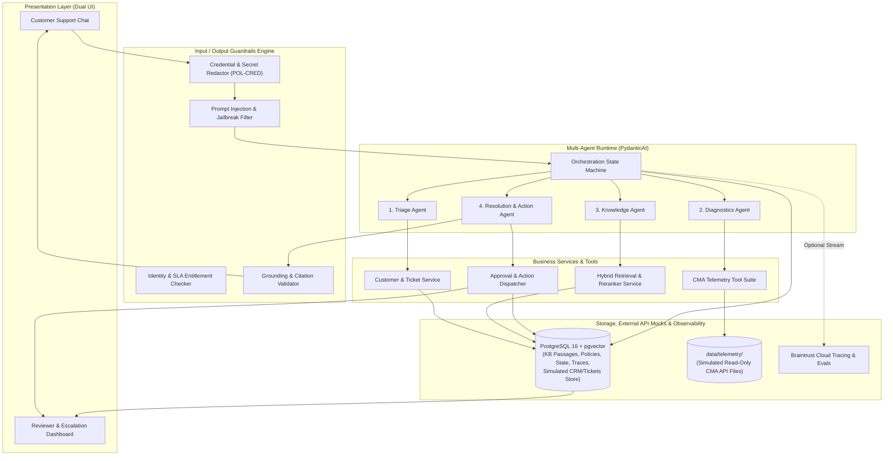
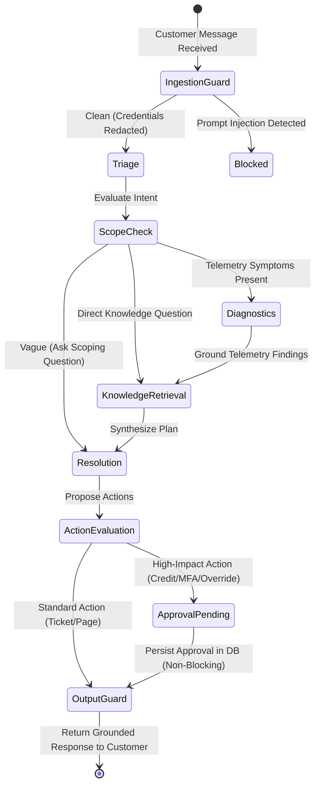
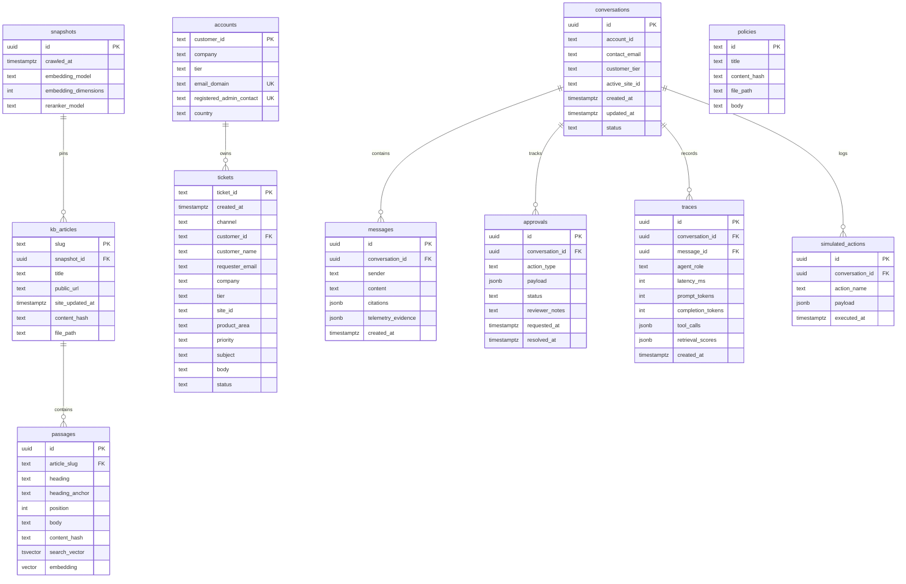
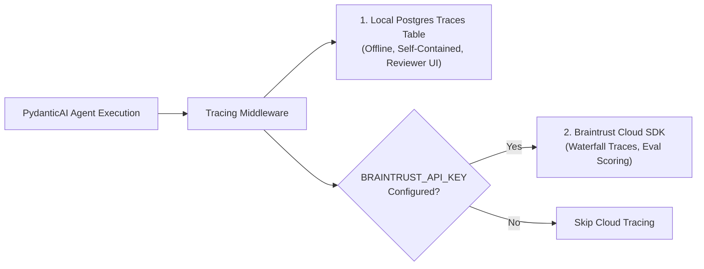
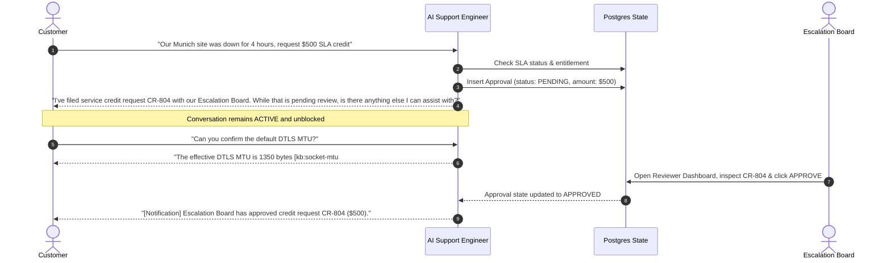

# System Architecture & Technical Design Specification
**Topic**: Cato AI Support Engineer — Multi-Agent System  
**Date**: 2026-09-29  
**Status**: Approved (Phase 0 / Ticket 0.1)  
**Target Path**: `docs/system-architecture-design.md`  

---

## 1. Executive Summary & Purpose

The objective of this system is to build an autonomous, believable, grounded, and safe AI Support Engineer for Cato Networks that acts like a Tier-3 TAC engineer during an incident (e.g., a customer opening a support chat at 2:00 a.m. because a remote site went offline).

The system:
1. Identifies customer accounts and authenticates caller identity against ground-truth account records, computing strict SLA targets.
2. Interrogates synthetic Cato Management Application (CMA) telemetry through typed tools before asking the customer.
3. Grounds every technical statement in Cato's public Knowledge Base using hybrid lexical and vector retrieval with cross-encoder reranking.
4. Executes support actions (ticket updates, Sev-1 escalations, service credits, MFA resets) while pausing high-impact operations for human reviewer approval in a non-blocking workflow.
5. Defends against prompt injections, social engineering, and unauthorized authority claims, while redacting sensitive credentials before persistence.
6. Employs dual-layer observability: local Postgres traces for fully offline self-contained operation, and Braintrust for cloud waterfall tracing and evaluation scoring.

---

## 2. Core Architectural Invariants & Rules

The architecture strictly adheres to the following system-wide invariants:

1. **Simulation Clock (`2026-08-28T17:00:00Z`)**:
   All synthetic telemetry files, ticket histories, and eval scenarios are frozen around this timestamp. The agent runtime, SLA deadline calculations, link quality lookback windows, and ticket recency checks must read from a centralized `SimulationClock` anchored to this instant, never `datetime.now(timezone.utc)`.
2. **Knowledge & Authority Precedence**:
   Where internal synthetic policies and public documentation differ:
   - The **Public Knowledge Base** is the authoritative source for Cato product behavior, limits, CLI syntax, and troubleshooting order.
   - **Internal Policy Documents** (`POL-CRED`, `POL-CREDIT`, `POL-IDV`, `POL-SEC`, `POL-SEV1`, `POL-SLA`) are the authoritative source for what support engineers are allowed to do.
3. **Hard Security Gates**:
   - **Zero Unapproved Credits/Refunds**: Any financial adjustment requires Human-in-the-Loop (HITL) approval (`POL-CREDIT`).
   - **Zero Unverified MFA Resets**: Identity verification protocol (`POL-IDV`) must be fully satisfied before an MFA reset can be queued for approval.
   - **Zero Malware/C2 Verdict Overrides**: Support engineers are strictly forbidden from overriding or whitelisting security verdicts (`POL-SEC`); requests must be rejected or escalated to Security Ops.
   - **Sev-1 Incident Criteria**: Escalation to Sev-1 with on-call paging is restricted to production-down scenarios without redundancy (`POL-SEV1`).
   - **Pre-Storage Credential Redaction**: All API keys, passwords, bearer tokens, and private keys must be scrubbed (`POL-CRED`) before messages or traces are stored in Postgres.
4. **Non-Blocking HITL Approval**:
   When an action requires human approval, the approval request is persisted in Postgres, but the customer conversation remains active. The customer can continue asking unrelated questions while awaiting escalation board action.
5. **Grounded Evidence & Refusal Contract**:
   - Telemetry findings must be quoted verbatim with the tool named (e.g. `routes_count 1024/1024 [telemetry]`).
   - Technical answers must cite specific article slugs and section heading anchors (`[kb:<slug>#<anchor>]`).
   - If retrieval confidence falls below `RERANK_MIN_SCORE` or the topic has no KB coverage (e.g., unreleased roadmap features like IPv6-only sites), the system must refuse to speculate and offer human routing.

---

## 3. High-Level Logical Architecture



---

## 4. Multi-Agent Role Decomposition & Contracts

The agent layer uses **PydanticAI** to provide compile-time type validation, dependency injection, and deterministic outputs.

### 4.1 Dependency Container (`SupportDeps`)
Every agent receives a typed context container via PydanticAI dependency injection:
- `clock: SimulationClock` — Provides frozen time `2026-08-28T17:00:00Z` and elapsed time calculations.
- `db_pool: AsyncConnectionPool` — Connection pool to Postgres.
- `telemetry: TelemetryService` — Interface to read synthetic CMA telemetry files directly from `data/telemetry/` with `(resolved_path, mtime_ns)` caching, returning typed `TelemetryToolResult[T]` envelopes with pre-extracted `TelemetryEvidence`.
- `retrieval: RetrievalService` — Unified interface in `retrieval/service.py` for hybrid KB search (`search_kb` returning `KBSearchResult`) and authoritative internal policy lookup (`get_policy` / `list_policies` returning `PolicyLookupResult`).
- `customer_store: CustomerService` — Account tier and ticket history query engine.

---

### 4.2 Agent Specifications

#### 1. Triage Agent
- **Purpose**: Authenticates caller, establishes account tier and SLA target clock, checks for repeat contact churn, detects prompt injection/social engineering, and extracts technical scope.
- **Allowed Tools**: `lookup_account(email_or_account_id)`, `authenticate_caller(caller_email, claimed_account_id, claimed_tier)`, `calculate_sla_deadlines(...)`, `get_ticket_history(account_id, site_id)`, `detect_repeat_contact(...)`.
- **Typed Input**: Raw customer message, active session metadata.
- **Typed Output (`TriageDecision`)**:
  - `account_id: str | None`
  - `customer_tier: Literal["Premium", "Standard", "Unknown"]`
  - `sla_first_response_due: datetime`
  - `is_repeat_contact: bool` (true when unbounded ticket history shows `>= 1` prior closed ticket on the same site/symptom or `>= 2` tickets sharing site and product area/symptom stem)
  - `intent: Literal["telemetry_diagnosis", "kb_inquiry", "policy_request", "adversarial"]`
  - `scoping_question: str | None` (populated if customer request is vague or account country is missing/unrecognized)
- **Failure Mode**: Unrecognized caller defaults to unverified tier; requests caller provide registered account email; refuses private telemetry display without verification.

#### 2. Diagnostics Agent
- **Purpose**: Acts as TAC engineer opening CMA. Formulates an inspection plan based on reported symptoms, executes telemetry tools, and extracts verbatim evidence.
- **Allowed Tools** (all returning `TelemetryToolResult[T]` from `tools/models.py` with `status: TelemetryStatus` (`"OK"`, `"NOT_FOUND"`, `"UNAVAILABLE"`, `"INVALID_ARGUMENT"`), typed `data: T | None`, and deterministic `evidence: list[TelemetryEvidence]`):
  - `list_sites(account_id: str) -> TelemetryToolResult[SiteListPayload]`
  - `get_site_status(site_id: str) -> TelemetryToolResult[SiteRecord]`
  - `get_link_quality(site_id: str, window: str = "24h") -> TelemetryToolResult[LinkQualityPayload]`
  - `get_events(site_id: str, event_type: str | None = None, window: str = "24h") -> TelemetryToolResult[EventsPayload]`
  - `get_bgp_status(site_id: str) -> TelemetryToolResult[BgpStatusPayload]`
  - `get_ipsec_status(site_id: str) -> TelemetryToolResult[IpsecStatusPayload]`
  - `get_client_diagnostics(user_email: str) -> TelemetryToolResult[ClientDiagnosticsPayload]`
- **Typed Input**: Customer account, target site ID, symptom description.
- **Typed Output (`DiagnosticEvidence`)**:
  - `inspected_tools: list[str]`
  - `evidence_items: list[TelemetryEvidence]` (each item includes `tool_name`, `metric_key`, `raw_value`, `timestamp`, and `is_anomaly`)
  - `root_cause_hypothesis: str`
- **Failure Mode**: If a telemetry file is missing or corrupt, the tool returns `status=TelemetryStatus.NOT_FOUND` or `status=TelemetryStatus.UNAVAILABLE` with an explicit `error` description, allowing the agent to continue without inventing numbers.

#### 3. Knowledge Agent
- **Purpose**: Formulates search queries against Cato documentation, queries Postgres hybrid index via `RetrievalService`, executes cross-encoder reranking, and checks policy rules.
- **Allowed Tools**: `search_knowledge_base(query: str) -> KBSearchResult`, `get_policy_by_id(policy_id: str) -> PolicyLookupResult`.
- **Typed Input**: Diagnosis findings or customer technical question.
- **Typed Output (`KnowledgeBundle`)**:
  - `retrieved_passages: list[RetrievedPassage]` (`passage_id`, `slug`, `title`, `heading`, `heading_anchor`, `public_url`, `body`, `site_updated_at`, `lex_rank`, `vec_rank`, `rrf_score`, `rerank_score`, `citation_tag`)
  - `referenced_policies: list[PolicyDocument]` (`policy_id`, `title`, `file_path`, `body`, `citation_tag`)
  - `confidence_status: Literal["confident", "low_confidence_refusal", "unavailable"]`
- **Failure Mode**: If top rerank score < `RERANK_MIN_SCORE`, `KBSearchResult` returns `status="low_confidence_refusal"` with `passages=[]` and unfiltered `candidates` preserved for eval/trace logging. If database is down, `KBSearchResult` / `PolicyLookupResult` catches `psycopg.Error` and returns `status="unavailable"`.

#### 4. Resolution & Action Agent
- **Purpose**: Synthesizes customer context, telemetry evidence, and KB passages into a conversational, empathetic, and grounded response. Proposes support actions and marks high-impact operations for approval.
- **Allowed Tools**: `propose_action(name, payload)`.
- **Typed Input**: Aggregated state (`TriageDecision`, `DiagnosticEvidence`, `KnowledgeBundle`, conversation history).
- **Typed Output (`ResolutionPlan`)**:
  - `customer_message: str` (contains inline citations `[kb:<slug>#<anchor>]` and quoted evidence `[telemetry]`)
  - `actions_to_execute: list[SupportAction]` (`create_ticket`, `update_ticket`, `page_on_call`)
  - `pending_approval: ApprovalRequest | None` (for credits, MFA resets, security overrides)
- **Failure Mode**: If output validator detects missing citations on technical statements, triggers prompt refinement or routes to human TAC engineer.

---

## 5. Orchestration State Machine & Partial Failure Handling



### Partial Failure Recovery Matrix

| Failure Event | System Behavior | Customer Experience |
|---|---|---|
| **Telemetry source unreachable / file missing** | `Diagnostics Agent` catches error, logs warning, returns partial evidence. | Agent states: *"CMA telemetry for site [X] is temporarily unavailable. Based on your description..."* Guides manual verification without guessing. |
| **Postgres RAG service down** | `Knowledge Agent` catches DB connection error, sets status to `RetrievalUnavailable`. | Agent states: *"Our documentation service is currently unavailable. To ensure you receive accurate technical guidance, I am escalating this to our engineering team."* Refuses to answer from ungrounded LLM memory. |
| **Rerank score < `RERANK_MIN_SCORE`** | Top score below threshold indicates no KB coverage (e.g. roadmap query). | Agent states: *"Cato's knowledge base does not currently document support for [feature]. Let me connect you with product support."* Hallucination prevented. |
| **Model API rate limit or error** | State machine retries with exponential backoff (up to 2 retries), then falls back to secondary model. | System remains resilient; if unrecoverable, preserves conversation state and returns a courteous system pause message. |

---

## 6. Database Schema Design (PostgreSQL + pgvector)

The database schema is managed via sequential SQL migrations under `db/migrations/`:
- `db/migrations/20260929_1500_kb-schema.sql`: Vector extension, `snapshots`, `kb_articles`, `passages`, `policies`, `accounts`, and `tickets`.
- `db/migrations/20260930_1000_agent-runtime.sql`: Operational tables for persistent conversation state, messages, non-blocking approvals, execution traces, and simulated side effects.

The unified database connects the ingested Knowledge Base and seeded customer/ticket records with live operational state:



### Key Table Responsibilities
- **`passages`**: Lexical index (`GIN` on `search_vector`, `simple` configuration) + Vector column (`vector(384)`, exact cosine distance scan).
- **`policies`**: Read-only store for the 6 internal governance policies.
- **`accounts`**: Ground-truth customer account records (`ACC-1001`..`ACC-1012`) enriched with primary `-01` site `country` codes for SLA timezone resolution.
- **`tickets`**: Historical and live support tickets (`TCK-*`), indexed on `(customer_id, created_at)` and `(customer_id, site_id)` for repeat-contact detection and live status updates.
- **`conversations`**: Maintains persistent session lifecycle across process restarts.
- **`approvals`**: Decoupled HITL table. Enables non-blocking workflow: status values are `pending`, `approved`, `edited`, `rejected`.
- **`traces`**: Complete execution traces ensuring reproducible end-to-end replay.

---

## 7. Hybrid RAG & Knowledge Grounding Architecture

The retrieval pipeline (`RetrievalService` in `retrieval/service.py`) implements the hybrid retrieval and reranking contract:

1. **Query Construction**:
   - Vector search prefixes questions with: `Represent this sentence for searching relevant passages: ` (required by `BAAI/bge-small-en-v1.5` via `kbindex.embed.embed_query`).
   - Lexical search passes the query through PostgreSQL's built-in `'english'` Snowball stemmer (`tsvector_to_array(to_tsvector('english', :query))`), strips English stopwords, appends `:*` prefix wildcards joined with `|` (`OR`), and matches against `passages.search_vector` (`'simple'` GIN index).
2. **Single-Roundtrip First-Stage Hybrid Retrieval & RRF**:
   - **Lexical CTE**: Top 20 passages via `search_vector @@ tsq` ordered by `ts_rank_cd(search_vector, tsq) DESC`.
   - **Vector CTE**: Top 20 passages via `<=>` cosine distance against passage embedding.
   - **Reciprocal Rank Fusion (RRF CTE)**: `FULL OUTER JOIN` across both top-20 lists computing:
     $$\text{RRF Score} = \sum_{m \in \{\text{lexical}, \text{vector}\}} \frac{1}{60 + \text{rank}_m}$$
     joined with `kb_articles` and `snapshots` in a single SQL query.
3. **Second-Stage Cross-Encoder Reranking**:
   - Fused candidates are scored locally using `cross-encoder/ms-marco-MiniLM-L-12-v2` (`retrieval.rerank.rerank_pairs`).
4. **Confidence Filter & `KBSearchResult` Envelope**:
   - Candidates with $\text{Rerank Score} \ge \text{RERANK\_MIN\_SCORE}$ populate `KBSearchResult.passages` (top $k$, `status="confident"`).
   - If no candidate meets threshold, `status="low_confidence_refusal"` is returned with `passages=[]` while `candidates` preserves the top $k$ unfiltered chunks and `snapshot_date` for `answers.md` and `traces`.

---

## 8. Dual-Layer Observability & Tracing Architecture



1. **Local Postgres Trace Layer (Offline Guarantee)**:
   Every agent invocation records its role, prompt tokens, completion tokens, latency, tool calls, and RRF/rerank scores directly to the Postgres `traces` table. This satisfies the requirement that a reviewer running `docker compose` without external API credentials can inspect traces in the UI.
2. **Braintrust Cloud Layer (Visual Live Demo & Evals)**:
   When `BRAINTRUST_API_KEY` is present in `.env`, the system automatically logs spans to Braintrust via `@traced` and `braintrust.auto_instrument()`. This provides interactive waterfall visualizations for the interview presentation and powers the evaluation scorers.

---

## 9. Non-Blocking Human-in-the-Loop & Governance

High-impact actions trigger an approval gate:
- **Service credits & refunds** of any amount (`POL-CREDIT`).
- **MFA resets** (`POL-IDV`).
- **Malware/C2 verdict overrides** (`POL-SEC` - support must reject or escalate).



---

## 10. Deliverables Mapping

| Home Task Deliverable | Architectural Component / File | Verification Criteria |
|---|---|---|
| **A. Git Repository & Docker** | `Dockerfile`, `docker-compose.yml`, `db/seed.dump` | Reviewer runs `docker compose up` and accesses chat in < 10 min without external downloads. |
| **B. Working Chat UI** | `ui/customer_app.py` & `ui/reviewer_app.py` | Customer view with citations & evidence; Reviewer view with context, traces, and Approve/Edit/Reject. |
| **C. `answers.md`** | `eval/run_questions.py`, `eval/retrieval_metrics.py` | 35 questions answered with citations, top chunks, scores, latency, token costs, Recall@k, and MRR. |
| **D. Architecture Diagrams** | Logical & Deployment views in `docs/architecture/` | Diagrams match implemented PydanticAI agents, Postgres schema, and Docker topology. |
| **E. Documentation** | `README.md`, `docs/technical_overview.md`, `docs/runbook.md`, `docs/eval_report.md` | Clear setup guide, retrieval analysis, operations runbook, and honest evaluation results. |
| **F. Recorded Traces** | `eval/recorded_traces/*.json` | 3 complete traces: (1) Telemetry diagnosis, (2) Approval-gated action, (3) Adversarial scenario. |
| **G. Daily Operations Report** | `services/reporting_service.py` | Aggregates queue, SLA status, Sev-1s, and pending approvals across Markdown export and Webhook/UI. |

---

## 11. Testing & Verification Strategy

Following the **Functional over Unit Testing** standard:
1. **Deterministic CI Tests (Zero LLM Costs)**:
   - Pre-storage credential redaction (`tests/guardrails/test_redactor.py`).
   - Prompt injection patterns and system jailbreak guards (`tests/guardrails/test_injection.py`).
   - Account entitlement matching and false claim detection (`tests/services/test_customer_service.py`).
   - Telemetry tool parsing and anomaly detection against all demo datasets (`tests/tools/test_telemetry.py`).
   - Clock advancement and SLA target matrix calculation (`tests/core/test_clock.py`).
2. **Integration Tests (Postgres & Models)**:
   - Hybrid retrieval RRF fusion and cross-encoder score thresholding (`tests/services/test_retrieval.py`).
   - Persistent state rehydration across simulated process restart (`tests/storage/test_state_store.py`).
   - Non-blocking approval lifecycle (`tests/services/test_approvals.py`).
3. **Scenario Replay & Benchmarking**:
   - Automated evaluation of all 12 scripted scenarios (`eval/run_scenarios.py`).
   - Benchmark evaluation of all 35 questions generating `answers.md` (`eval/run_questions.py`).

---

## 12. Directory Structure & Module Layout

The codebase is organized into clean, single-responsibility packages separating offline ingestion from database initialization, online retrieval, business tools, and multi-agent logic:

```
├── db/                                # Unified database management
│   ├── seed.dump                      # Seed database dump (KB articles, passages, policies, accounts, tickets)
│   ├── connection.py                  # Database connection pooling
│   ├── init/                          # Cross-domain DB seeding, startup checks, and dump build
│   │   ├── seed.py                    # Schema runner + stdlib loaders & batch upserts for policies, accounts, tickets
│   │   ├── startup.py                 # Container startup entrypoint (seeds, verifies hashes & embedding width)
│   │   └── build.py                   # Offline operator build entrypoint (loads KB + seed tables, writes db/seed.dump)
│   └── migrations/
│       ├── 20260929_1500_kb-schema.sql        # Vector extension + snapshots, kb_articles, passages, policies, accounts, tickets
│       └── 20260930_1000_agent-runtime.sql    # conversations, messages, approvals, traces, simulated_actions
│
├── docs/                              # Project documentation, plans & evaluation reports
│   ├── overview/                      # Deliverable D diagrams (logical & deployment views)
│       ├── technical_overview.md      # Ingestion & retrieval design & quality analysis
│       ├── runbook.md                 # Operational runbook
│       ├── eval_report.md             # Evaluation report & metric analysis
│       ├── demo_playbook.md           # Live interview demo rehearsal guide
│       ├── decisions.md               # Decisions I took with reasoning
│   ├── architecture/                  # Deliverable D diagrams (logical & deployment views)
│       ├── system-architecture-design.md      # Master architecture & technical design specification
│   └── plans/                         # Implementation plans and execution task guides
│
├── kbindex/                           # Offline KB ingestion ONLY
│   ├── crawl.py                       # Respects robots.txt and 1s rate limit
│   ├── discover.py                    # llms.txt discovery parser
│   ├── chunk.py                       # Markdown slicing (max 400 tokens)
│   ├── embed.py                       # BAAI/bge-small-en-v1.5 embeddings
│   ├── hashing.py                     # SHA-256 integrity verifier
│   └── store.py                       # Loads KB articles & passages into Postgres
│
├── retrieval/                         # Online RAG & policy lookup pipeline
│   ├── service.py                     # RetrievalService: single-roundtrip hybrid SQL + RRF + threshold gate + policy lookup
│   └── rerank.py                      # Cross-encoder MiniLM reranker (query-time)
│
├── core/                              # Central primitives & shared domain models
│   ├── clock.py                       # SimulationClock frozen at 2026-08-28T17:00:00Z
│   ├── config.py                      # Centralized Pydantic settings
│   └── models.py                      # Shared Pydantic schemas (Accounts, Tickets, Citations)
│
├── tools/                             # Typed CMA Telemetry inspection tools
│   ├── models.py                      # TelemetryStatus, TelemetryEvidence, TelemetryToolResult[T], payload schemas
│   └── telemetry.py                   # TelemetryService and verbatim [telemetry] evidence extraction
│
├── services/                          # Business domain logic
│   ├── models.py                      # Service-domain Pydantic schemas (CallerIdentity, SLADeadlines, RepeatContactResult, ApprovalRecord, CountryCodeOutput)
│   ├── customer_service.py            # Account identification & SLA calculations
│   ├── ticket_service.py              # Historical tickets & repeat contact analysis
│   ├── approval_service.py            # Non-blocking HITL approvals lifecycle
│   └── reporting_service.py           # Daily operations report generator
│
├── guardrails/                        # Pre-persistence and post-generation safety
│   ├── redactor.py                    # Pre-storage credential scrubber (POL-CRED)
│   ├── injection.py                   # Prompt injection & jailbreak filter
│   └── validator.py                   # Citation verification & entitlement checks
│
├── agents/                            # PydanticAI specialized role agents
│   ├── models.py                      # Agent-domain Pydantic schemas (AgentTrace, role outputs)
│   ├── base.py                        # Common agent contracts & SupportDeps
│   ├── triage.py                      # Caller identification, SLA binding, scoping
│   ├── diagnostics.py                 # Telemetry inspection & evidence extraction
│   ├── knowledge.py                   # Query generation, RAG execution, policy checks
│   └── resolution.py                  # Synthesis, grounded response, action proposals
│
├── prompts/                           # Dedicated editable prompt templates
│   ├── triage.md
│   ├── diagnostics.md
│   ├── knowledge.md
│   └── resolution.md
│
├── orchestration/                     # State machine & workflow graph
│   └── workflow.py                    # Multi-turn coordinator with partial-failure fallbacks
│
├── ui/                                # Presentation layer (Deliverable B)
│   ├── customer_app.py                # Customer support chat with citation badges
│   └── reviewer_app.py                # Reviewer workspace: context, evidence, traces, approvals
│
└── eval/                              # Evaluation harness & benchmarks (Deliverables C, F, G)
    ├── run_questions.py               # Replays 35 questions to generate answers.md
    ├── run_scenarios.py               # 12-scenario multi-turn replay harness
    ├── retrieval_metrics.py           # Recall@k and MRR computation
    ├── scenario_scorer.py             # Scores groundedness, citations, tool calls, guardrails
    ├── braintrust_tracer.py           # Braintrust waterfall spans & eval logging
    ├── test_prompt.py                 # CLI playground to test & iterate on isolated prompts
    └── recorded_traces/               # Committed traces for the 3 representative conversations
```

---

## 13. Cleanup & Deprecation

- All code files are structured strictly under the packages defined above.
- Offline indexing code (`kbindex/`) contains zero online query-time logic and zero non-KB seed logic.
- Cross-domain database initialization, seed loading (`policies`, `accounts`, `tickets`), startup checks, and dump generation live under `db/init/`.
- Online RAG search and cross-encoder reranking live cleanly under `retrieval/`.
- Database schema definitions are organized into versioned migrations under `db/migrations/`, and the unified seed dump lives in `db/seed.dump`.
- Implementation plans are located directly under `docs/plans/`.
- No scratch scripts or temporary test files will remain in production trees.
- Pinned revisions and hashes ensure 100% reproducible execution.
