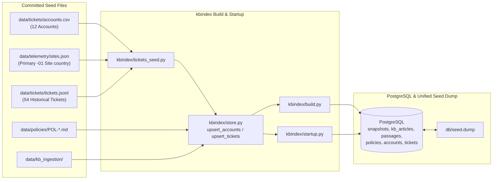

# Seed Data & Database Dump (`db/seed.dump`) — Implementation Plan

## Goal Description

Extend the database schema and offline/startup ingestion pipeline (`kbindex/`) to load [accounts.csv](file:///home/yaara/Documents/Assignments/cato%20networks/data/tickets/accounts.csv) (enriched with each account's `country` code from [sites.json](file:///home/yaara/Documents/Assignments/cato%20networks/data/telemetry/sites.json)) and [tickets.jsonl](file:///home/yaara/Documents/Assignments/cato%20networks/data/tickets/tickets.jsonl) into PostgreSQL (`accounts` and `tickets` tables), and rename [db/kb.dump](file:///home/yaara/Documents/Assignments/cato%20networks/db/kb.dump) to `db/seed.dump` across the build scripts, container entrypoint, and documentation.

---

## Architecture & Data Flow

---

## Global Constraints

- **No Inline Imports**: All imports must sit at the top of each module.
- **Strict Type Annotations**: Every function and method must explicitly annotate all parameter types and return types (including `-> None`), adhering to Pyright standard mode.
- **Preserve Live Ticket Updates on Restart**: Startup seeding (`kbindex/startup.py`) must insert seed tickets with `on conflict (ticket_id) do nothing` (`preserve_existing=True`) so ticket status changes made during live conversations are not overwritten when the container restarts.

---

## Proposed Changes

### 1. Schema Migration & Seed Loaders

#### [MODIFY] [20260929_1500_kb-schema.sql](file:///home/yaara/Documents/Assignments/cato%20networks/db/migrations/20260929_1500_kb-schema.sql)
- **One-liner**: Add `accounts` and `tickets` tables and lookup indexes to the schema migration so `apply_schema` creates them alongside `snapshots`, `kb_articles`, `passages`, and `policies`.
- **Schema Details**:
  - `accounts`: Columns `customer_id text primary key`, `company text not null`, `tier text not null`, `email_domain text not null unique`, `registered_admin_contact text not null unique`, `country text null`.
  - `tickets`: Columns `ticket_id text primary key`, `created_at timestamptz not null`, `channel text not null`, `customer_id text not null references accounts(customer_id)`, `customer_name text not null`, `requester_email text not null`, `company text not null`, `tier text not null`, `site_id text null`, `product_area text not null`, `priority text not null`, `subject text not null`, `body text not null`, `status text not null`.
  - Indexes: `tickets_customer_created_idx` on `tickets (customer_id, created_at)` and `tickets_customer_site_idx` on `tickets (customer_id, site_id)`.

#### [NEW] `kbindex/tickets_seed.py`
- **One-liner**: Parse `data/tickets/accounts.csv` (joined with the primary `-01` site's `country` field from `data/telemetry/sites.json`) and `data/tickets/tickets.jsonl` (or `.csv`) into normalized dictionary records for PostgreSQL seeding.
- **Functions & Signatures**:
  - `load_accounts_seed(accounts_path: Path | str, sites_path: Path | str | None = None) -> list[dict[str, str | None]]`: Reads `accounts.csv` via `csv.DictReader` and attaches the two-letter `country` code from each account's `-01` primary site in `sites.json`.
  - `load_tickets_seed(tickets_path: Path | str) -> list[dict[str, Any]]`: Reads `tickets.jsonl` (or `tickets.csv` when given a `.csv` path) and returns normalized ticket records with empty `site_id` normalized to `None`.

#### [MODIFY] [store.py](file:///home/yaara/Documents/Assignments/cato%20networks/kbindex/store.py)
- **One-liner**: Add `upsert_accounts` and `upsert_tickets` and call them inside `load_index`.
- **Functions & Signatures**:
  - `upsert_accounts(connection: psycopg.Connection, accounts: list[dict[str, str | None]]) -> None`: Inserts or updates rows in `accounts` on conflict over `customer_id`.
  - `upsert_tickets(connection: psycopg.Connection, tickets: list[dict[str, Any]], preserve_existing: bool = False) -> None`: Inserts rows into `tickets`, using `on conflict (ticket_id) do nothing` when `preserve_existing=True` and `on conflict (ticket_id) do update` when `preserve_existing=False`.
  - Update `load_index` to accept optional `tickets_dir: Path | str | None = None` (defaulting to `REPO_ROOT / "data" / "tickets"`) and invoke `upsert_accounts` and `upsert_tickets`.

#### [MODIFY] [startup.py](file:///home/yaara/Documents/Assignments/cato%20networks/kbindex/startup.py)
- **One-liner**: Ensure `_execute_startup` runs `apply_schema`, loads and upserts `accounts` and `tickets` (`preserve_existing=True`) alongside `policies`, and verifies integrity on startup.

---

### 2. Rename `db/kb.dump` to `db/seed.dump` & Update Documentation

#### [MODIFY] [build.py](file:///home/yaara/Documents/Assignments/cato%20networks/kbindex/build.py) & [Dockerfile](file:///home/yaara/Documents/Assignments/cato%20networks/Dockerfile)
- **One-liner**: Change the default dump path in `write_dump` and `Dockerfile`'s `DUMP_FILE` environment variable from `db/kb.dump` to `db/seed.dump`.

#### [NEW] `db/seed.dump` & [DELETE] [db/kb.dump](file:///home/yaara/Documents/Assignments/cato%20networks/db/kb.dump)
- **One-liner**: Apply the updated schema and seed loaders to PostgreSQL, generate `db/seed.dump` containing `snapshots`, `kb_articles`, `passages`, `policies`, `accounts`, and `tickets`, and delete `db/kb.dump`.

#### [MODIFY] [README.md](file:///home/yaara/Documents/Assignments/cato%20networks/README.md), [system-architecture-design.md](file:///home/yaara/Documents/Assignments/cato%20networks/docs/architecture/system-architecture-design.md), & [decisions.md](file:///home/yaara/Documents/Assignments/cato%20networks/docs/overview/decisions.md)
- **One-liner**: Update all documentation references from `db/kb.dump` to `db/seed.dump`, add `accounts` and `tickets` to the §6 ER diagram in `system-architecture-design.md`, and record ADR-002 (PostgreSQL Ingestion of `accounts` and `tickets` & Unified `db/seed.dump`) in `docs/overview/decisions.md`.

---

## Execution Plan

### Task 1: Schema Migration, Seed Loaders & `db/seed.dump` Generation
- **Files**:
  - Modify: [20260929_1500_kb-schema.sql](file:///home/yaara/Documents/Assignments/cato%20networks/db/migrations/20260929_1500_kb-schema.sql), [store.py](file:///home/yaara/Documents/Assignments/cato%20networks/kbindex/store.py), [startup.py](file:///home/yaara/Documents/Assignments/cato%20networks/kbindex/startup.py), [build.py](file:///home/yaara/Documents/Assignments/cato%20networks/kbindex/build.py), [Dockerfile](file:///home/yaara/Documents/Assignments/cato%20networks/Dockerfile)
  - Create: `kbindex/tickets_seed.py`, `db/seed.dump`
  - Delete: `db/kb.dump`
- **Steps**:
  - [ ] **Step 1 (Implement)**: Add `accounts` and `tickets` to `20260929_1500_kb-schema.sql`, implement `kbindex/tickets_seed.py`, wire `upsert_accounts` and `upsert_tickets` into `kbindex/store.py` and `kbindex/startup.py`, and update `db/seed.dump` references in `kbindex/build.py`, `Dockerfile`, and any affected `tests/kbindex/` references.
  - [ ] **Step 2 (Regenerate Dump & Verify)**: Run `kbindex` startup/seed against PostgreSQL, write `db/seed.dump`, remove `db/kb.dump`, and run `uv run pytest tests/kbindex -v` to confirm all existing ingestion/startup checks pass.
  - [ ] **Step 3 (Commit)**: Commit the schema, seed loaders, and `db/seed.dump`.

### Task 2: Documentation & Cleanup
- **Files**:
  - Modify: [README.md](file:///home/yaara/Documents/Assignments/cato%20networks/README.md), [system-architecture-design.md](file:///home/yaara/Documents/Assignments/cato%20networks/docs/architecture/system-architecture-design.md), [decisions.md](file:///home/yaara/Documents/Assignments/cato%20networks/docs/overview/decisions.md)
- **Steps**:
  - [ ] **Step 1**: Update `db/kb.dump` references to `db/seed.dump` in `README.md` and `system-architecture-design.md`, add `accounts` and `tickets` to the §6 ER diagram, and document the seed ingestion decision in `docs/overview/decisions.md`.
  - [ ] **Step 2 (Cleanup)**: Verify `db/kb.dump` is deleted and no remaining references to `kb.dump`, unused imports, or untyped functions exist across the repo.
  - [ ] **Step 3 (Commit)**: Commit documentation and cleanup updates.
