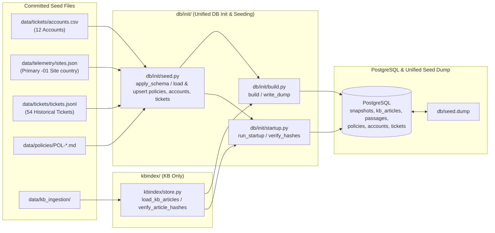

# Seed Data, `db/init/` Restructuring & Database Dump (`db/seed.dump`) — Implementation Plan

> **For agentic workers:** REQUIRED SUB-SKILL: Use superpowers:subagent-driven-development to implement this plan task-by-task. Steps use checkbox (`- [ ]`) syntax for tracking.

**Goal:** Restructure database build, startup, and seed loading out of `kbindex/` into a dedicated `db/init/` package, extend the PostgreSQL schema to seed `accounts` (enriched with primary `-01` site `country` codes) and `tickets`, and replace `db/kb.dump` with a unified `db/seed.dump`.

**Architecture:** `kbindex/` is reduced strictly to KB-specific crawling, chunking, embedding, hashing, and article/passage storage (`kbindex/store.py`). All cross-domain database initialization, non-KB seed loading (policies, accounts, tickets), startup verification, and custom-format Postgres dump orchestration move to `db/init/` (`db/init/seed.py`, `db/init/startup.py`, `db/init/build.py`).

**Architecture Diagram:**

**Tech Stack:** Python 3.12, `psycopg` 3, `pgvector`, PostgreSQL 18 (`pg_dump` / `pg_restore`), `pytest`.

**Spec:** [plan.md](file:///home/yaara/Documents/Assignments/cato%20networks/docs/plans/12-account_and_sla_matrix/00-update_seed_data/plan.md)

## Global Constraints

- **No Inline Imports**: All imports must sit at the top of each module.
- **Strict Type Annotations**: Every function and method must explicitly annotate all parameter types and return types (including `-> None`), adhering to Pyright standard mode (`TypedDict` contracts instead of `dict[str, Any]`).
- **Preserve Live Ticket Updates on Restart**: Startup seeding (`db/init/startup.py`) must insert seed tickets with `on conflict (ticket_id) do nothing` (`preserve_existing=True`) so ticket status changes made during live conversations are not overwritten when the container restarts.
- **Zero Code Lines in Plan**: Per planning rules, this plan specifies file paths, function signatures, input-outputs, and exact responsibilities without raw code blocks.

---

## Target Folder Structure

- `db/`
  - `seed.dump` — Custom-format PostgreSQL dump containing `snapshots`, `kb_articles`, `passages`, `policies`, `accounts`, and `tickets` (replaces `db/kb.dump`).
  - `migrations/20260929_1500_kb-schema.sql` — Base schema defining `snapshots`, `kb_articles`, `passages`, `policies`, `accounts`, and `tickets`.
  - `init/`
    - `__init__.py` — Exports `apply_schema`, `build`, `run_startup`, `seed_all`, `write_dump`, `HashMismatch`, `StartupError`.
    - `seed.py` — Schema application (`apply_schema`) plus stdlib-only loaders and batch `executemany` upserts for `policies`, `accounts`, and `tickets`.
    - `startup.py` — Container startup entrypoint (`python -m db.init.startup`): applies schema, seeds policies/accounts/tickets (with `preserve_existing=True`), verifies SHA-256 hashes of KB articles and policies, and checks embedding dimensions (384).
    - `build.py` — Offline operator build entrypoint (`python -m db.init.build`): applies schema, loads KB articles/passages via `kbindex.store`, runs `seed_all`, and writes `db/seed.dump` atomically.
- `kbindex/` (Strictly KB-only)
  - `crawl.py`, `discover.py`, `chunk.py`, `embed.py`, `hashing.py` — Unchanged KB ingestion modules.
  - `store.py` — Stripped of `apply_schema`, `upsert_policies`, and `StartupError`; retains only KB snapshot, `kb_articles`, and `passages` ingestion (`upsert_article`, `load_kb_index`) and KB hash querying.
  - *(Deleted)*: `kbindex/policies.py`, `kbindex/startup.py`, `kbindex/build.py`.

---

## Proposed Changes

### Task 1: Schema Update & `db/init/` Package Implementation

**Files:**
- Modify: [20260929_1500_kb-schema.sql](file:///home/yaara/Documents/Assignments/cato%20networks/db/migrations/20260929_1500_kb-schema.sql)
- Create: `db/init/__init__.py`
- Create: `db/init/seed.py`
- Create: `db/init/startup.py`
- Create: `db/init/build.py`
- Modify: [kbindex/store.py](file:///home/yaara/Documents/Assignments/cato%20networks/kbindex/store.py)
- Modify: [Dockerfile](file:///home/yaara/Documents/Assignments/cato%20networks/Dockerfile)
- Modify: [pyproject.toml](file:///home/yaara/Documents/Assignments/cato%20networks/pyproject.toml)
- Delete: [kbindex/policies.py](file:///home/yaara/Documents/Assignments/cato%20networks/kbindex/policies.py), [kbindex/startup.py](file:///home/yaara/Documents/Assignments/cato%20networks/kbindex/startup.py), [kbindex/build.py](file:///home/yaara/Documents/Assignments/cato%20networks/kbindex/build.py)

**Interfaces & Specifications:**

1. **[20260929_1500_kb-schema.sql](file:///home/yaara/Documents/Assignments/cato%20networks/db/migrations/20260929_1500_kb-schema.sql)**:
   - Add `accounts` table with columns: `customer_id text primary key`, `company text not null`, `tier text not null`, `email_domain text not null unique`, `registered_admin_contact text not null unique`, `country text null`.
   - Add `tickets` table with columns: `ticket_id text primary key`, `created_at timestamptz not null`, `channel text not null`, `customer_id text not null references accounts(customer_id)`, `customer_name text not null`, `requester_email text not null`, `company text not null`, `tier text not null`, `site_id text null`, `product_area text not null`, `priority text not null`, `subject text not null`, `body text not null`, `status text not null`.
   - Add composite indexes: `tickets_customer_created_idx` on `tickets (customer_id, created_at)` and `tickets_customer_site_idx` on `tickets (customer_id, site_id)`.

2. **`db/init/seed.py`**:
   - TypedDict definitions:
     - `PolicySeed`: `id: str`, `title: str`, `content_hash: str`, `file_path: str`, `body: str`.
     - `AccountSeed`: `customer_id: str`, `company: str`, `tier: str`, `email_domain: str`, `registered_admin_contact: str`, `country: str | None`.
     - `TicketSeed`: `ticket_id: str`, `created_at: str`, `channel: str`, `customer_id: str`, `customer_name: str`, `requester_email: str`, `company: str`, `tier: str`, `site_id: str | None`, `product_area: str`, `priority: str`, `subject: str`, `body: str`, `status: str`.
   - `apply_schema(connection: psycopg.Connection) -> None`: Reads `db/migrations/20260929_1500_kb-schema.sql` and executes it on `connection`.
   - `load_policies(policies_dir: Path | str = REPO_ROOT / "data" / "policies") -> list[PolicySeed]`: Reads `POL-*.md` files, extracts title from first `#` heading, computes `sha256_file`, and returns `list[PolicySeed]`.
   - `load_accounts_seed(accounts_path: Path | str = REPO_ROOT / "data" / "tickets" / "accounts.csv", sites_path: Path | str | None = REPO_ROOT / "data" / "telemetry" / "sites.json") -> list[AccountSeed]`: Builds a `dict[str, str]` mapping `customer_id -> country` in one pass over `sites.json` for sites whose `site_id` ends with `"-01"`, then streams `accounts.csv` via `csv.DictReader` and attaches each account's `country`.
   - `load_tickets_seed(tickets_path: Path | str = REPO_ROOT / "data" / "tickets" / "tickets.jsonl") -> list[TicketSeed]`: Parses `.jsonl` (or `.csv` if suffix is `.csv`) and normalizes empty string `site_id` values to `None`.
   - `upsert_policies(connection: psycopg.Connection, policies: list[PolicySeed]) -> None`: Batch upserts into `policies` via `cursor.executemany` with `on conflict (id) do update`.
   - `upsert_accounts(connection: psycopg.Connection, accounts: list[AccountSeed]) -> None`: Batch upserts into `accounts` via `cursor.executemany` with `on conflict (customer_id) do update`.
   - `upsert_tickets(connection: psycopg.Connection, tickets: list[TicketSeed], preserve_existing: bool = False) -> None`: Batch inserts into `tickets` via `cursor.executemany`, using `on conflict (ticket_id) do nothing` when `preserve_existing=True` and `on conflict (ticket_id) do update` when `preserve_existing=False`.
   - `seed_all(connection: psycopg.Connection, policies_dir: Path | str = REPO_ROOT / "data" / "policies", tickets_dir: Path | str = REPO_ROOT / "data" / "tickets", sites_path: Path | str | None = REPO_ROOT / "data" / "telemetry" / "sites.json", preserve_existing_tickets: bool = False) -> None`: Runs `apply_schema` and upserts policies, accounts, and tickets in one transaction.

3. **[kbindex/store.py](file:///home/yaara/Documents/Assignments/cato%20networks/kbindex/store.py)**:
   - Remove `upsert_policies` (moved to `db/init/seed.py`) and delegate `apply_schema` and `seed_all` calls inside `load_index(connection: psycopg.Connection, crawl_dir: Path | str, policies_dir: Path | str = REPO_ROOT / "data" / "policies", tickets_dir: Path | str = REPO_ROOT / "data" / "tickets") -> None` to `db.init.seed` so existing callers of `load_index` remain clean while KB-specific passage/article logic stays in `kbindex/store.py`.

4. **`db/init/startup.py`**:
   - Moves `run_startup`, `_execute_startup`, and `main` from `kbindex/startup.py` to `db/init/startup.py`.
   - `_execute_startup` calls `seed_all(connection, policies_dir=policies_dir, preserve_existing_tickets=True)` (ensuring `apply_schema`, policies, accounts, and non-destructive ticket seeding run on startup), then runs `verify_hashes` and `probe_width`.

5. **`db/init/build.py`**:
   - Moves `newest_crawl_dir`, `write_dump(destination: Path | str = Path("db/seed.dump")) -> Path`, and `build() -> None` from `kbindex/build.py` to `db/init/build.py`.
   - `build()` connects to `DATABASE_URL`, calls `load_index` (which loads KB articles/passages and calls `seed_all` with `preserve_existing_tickets=False`), and calls `write_dump()` to produce `db/seed.dump`.

6. **[Dockerfile](file:///home/yaara/Documents/Assignments/cato%20networks/Dockerfile) & [pyproject.toml](file:///home/yaara/Documents/Assignments/cato%20networks/pyproject.toml)**:
   - In `Dockerfile`, update `DUMP_FILE="${DUMP_FILE:-db/seed.dump}"`, update the error message to reference `python -m db.init.build`, and update the startup command to `python -m db.init.startup`.
   - In `pyproject.toml`, rename project `name` from `"kbindex"` to `"cato-support-agent"`.

**Steps:**
- [ ] **Step 1**: Update [20260929_1500_kb-schema.sql](file:///home/yaara/Documents/Assignments/cato%20networks/db/migrations/20260929_1500_kb-schema.sql) with `accounts`, `tickets`, and the two composite indexes on `tickets`.
- [ ] **Step 2**: Create `db/init/__init__.py`, `db/init/seed.py`, `db/init/startup.py`, and `db/init/build.py`, and slim down [kbindex/store.py](file:///home/yaara/Documents/Assignments/cato%20networks/kbindex/store.py).
- [ ] **Step 3**: Delete [kbindex/policies.py](file:///home/yaara/Documents/Assignments/cato%20networks/kbindex/policies.py), [kbindex/startup.py](file:///home/yaara/Documents/Assignments/cato%20networks/kbindex/startup.py), and [kbindex/build.py](file:///home/yaara/Documents/Assignments/cato%20networks/kbindex/build.py), and update [Dockerfile](file:///home/yaara/Documents/Assignments/cato%20networks/Dockerfile) and [pyproject.toml](file:///home/yaara/Documents/Assignments/cato%20networks/pyproject.toml).

---

### Task 2: Database Seed Dump Generation (`db/seed.dump`) & Functional Tests

**Files:**
- Create: `db/seed.dump`
- Delete: [db/kb.dump](file:///home/yaara/Documents/Assignments/cato%20networks/db/kb.dump)
- Modify / Create: `tests/db/test_init.py` and update any affected imports in `tests/kbindex/`

**Interfaces & Specifications:**
- Functional test in `tests/db/test_init.py`:
  - `test_seed_accounts_and_tickets_and_startup_preserves_live_status`: Verifies that `seed_all` populates all 12 accounts (with `ACC-1001` having `country == "NL"` from `S-1001-01` in `sites.json` and non-null countries across all 12 accounts) and all 54 tickets from `tickets.jsonl`; mutates one ticket's `status` to `"closed"` in Postgres, runs `run_startup`, and asserts that the mutated ticket status is preserved (`preserve_existing=True`) while all 12 accounts, 54 tickets, and 6 policies remain intact.
  - `test_seed_dump_contains_all_six_tables_and_restores_cleanly`: Verifies that `db/seed.dump` exists, is non-empty, and when restored via `pg_restore --clean --if-exists` (or inspected via `pg_restore --list`), generates all 6 tables (`snapshots`, `kb_articles`, `passages`, `policies`, `accounts`, `tickets`) with populated rows (`12` accounts, `54` tickets, `6` policies, and all KB articles/passages).
- Update any existing test imports in `tests/kbindex/` that referenced `kbindex.policies`, `kbindex.startup`, `kbindex.build`, or `db/kb.dump` to point to `db.init` and `db/seed.dump`.

**Steps:**
- [ ] **Step 1**: Write functional tests in `tests/db/test_init.py` and update existing test imports in `tests/kbindex/`.
- [ ] **Step 2 (Build & Verify Init Dump)**: Run the `db.init` build/seed flow against the running PostgreSQL instance, execute `write_dump()` from `db.init.build` to generate `db/seed.dump`, delete `db/kb.dump`, and test restoring `db/seed.dump` with `pg_restore --clean --if-exists` to confirm all 6 tables (`snapshots`, `kb_articles`, `passages`, `policies`, `accounts`, `tickets`) and their indexes (`tickets_customer_created_idx`, `tickets_customer_site_idx`) are generated and populated from the dump alone.
- [ ] **Step 3**: Run `uv run pytest -v` across the test suite and verify all tests pass.
- [ ] **Step 4**: Commit the schema, `db/init/` package, `db/seed.dump`, removal of `db/kb.dump`, and tests.

---

### Task 3: Documentation & Cleanup

**Files:**
- Modify: [README.md](file:///home/yaara/Documents/Assignments/cato%20networks/README.md)
- Modify: [system-architecture-design.md](file:///home/yaara/Documents/Assignments/cato%20networks/docs/architecture/system-architecture-design.md)
- Modify: [decisions.md](file:///home/yaara/Documents/Assignments/cato%20networks/docs/overview/decisions.md)
- Modify: [plan.md](file:///home/yaara/Documents/Assignments/cato%20networks/docs/plans/12-account_and_sla_matrix/00-update_seed_data/plan.md)

**Steps:**
- [ ] **Step 1**: Update [README.md](file:///home/yaara/Documents/Assignments/cato%20networks/README.md) to reference `db/seed.dump`, `python -m db.init.startup`, and `python -m db.init.build`.
- [ ] **Step 2**: Update [system-architecture-design.md](file:///home/yaara/Documents/Assignments/cato%20networks/docs/architecture/system-architecture-design.md) (§6 ER diagram with `accounts` and `tickets`, §10 & §12 directory layout showing `db/seed.dump` and `db/init/`, and §13 cleanup notes).
- [ ] **Step 3**: Record ADR-002 (PostgreSQL Ingestion of `accounts` and `tickets`, Unified `db/seed.dump`, and `db/init/` Package Separation) in [decisions.md](file:///home/yaara/Documents/Assignments/cato%20networks/docs/overview/decisions.md).
- [ ] **Step 4 (Cleanup)**: Verify `db/kb.dump`, `kbindex/policies.py`, `kbindex/startup.py`, and `kbindex/build.py` are deleted, and check across the repository that no stale references to `kb.dump`, `kbindex.startup`, `kbindex.build`, `kbindex.policies`, inline imports, or untyped functions remain.
- [ ] **Step 5**: Commit all documentation and cleanup changes.
