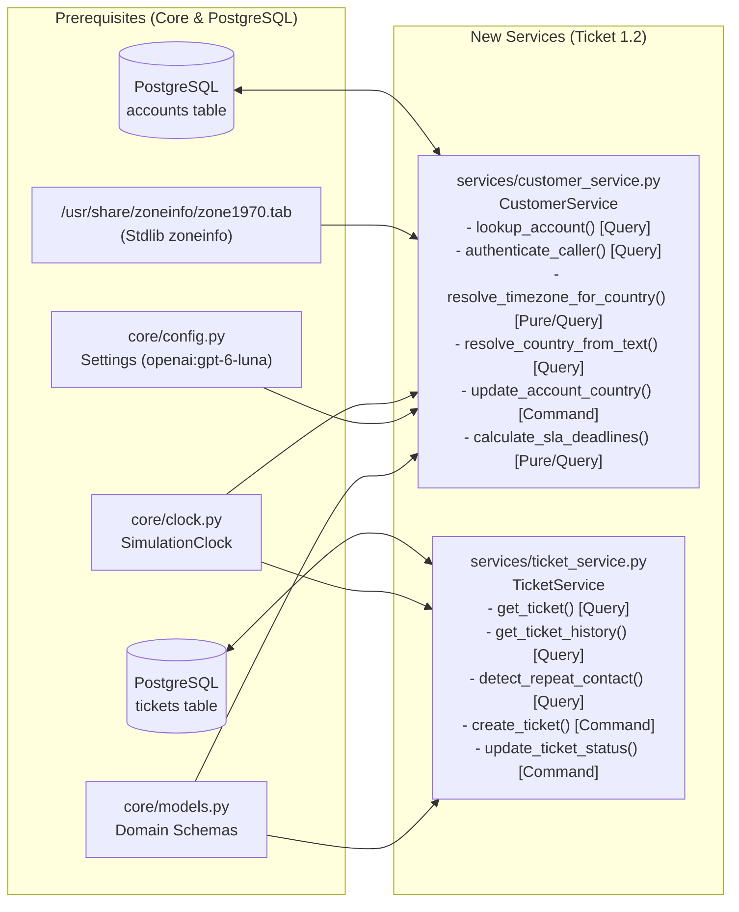

# [Phase 1] 1.2: Customer, SLA Matrix & Ticket History Services — Implementation Plan

> **For agentic workers:** REQUIRED SUB-SKILL: Use superpowers:subagent-driven-development to implement this plan task-by-task. Steps use checkbox (`- [ ]`) syntax for tracking.

**Goal:** Implement `services/customer_service.py` and `services/ticket_service.py` as minimal, strictly-typed PostgreSQL domain services anchored to `SimulationClock`, adhering to SOLID and Command-Query Separation (CQS) principles, featuring stdlib IANA `zone1970.tab` timezone resolution, a PydanticAI Gemini (`openai:gpt-6-luna`) country-code fallback agent, regional business-hours SLA math, and unbounded repeat-contact detection.

**Architecture:** `CustomerService` queries the PostgreSQL `accounts` table to authenticate callers (enforcing the security invariant against spoofed tiers or unverified domains), maps ISO 3166-1 alpha-2 country codes directly to `zoneinfo.ZoneInfo` via a cached stdlib parser over `/usr/share/zoneinfo/zone1970.tab`, resolves free-text country names via a PydanticAI `Agent` configured with `settings.llm_model` (`"openai:gpt-6-luna"`), and computes [POL-SLA.md](file:///home/yaara/Documents/Assignments/cato%20networks/data/policies/POL-SLA.md) deadlines via pure date-math functions against `SimulationClock`. `TicketService` queries and mutates the PostgreSQL `tickets` table with atomic SQL ticket ID generation and an unbounded lookback window for repeat-contact detection.

**Architecture Diagram:**

**Tech Stack:** Python 3.12, `psycopg` v3, `pydantic` v2, `pydantic-ai` (`Agent` with `openai:gpt-6-luna` via `GEMINI_API_KEY`), stdlib `zoneinfo` & `functools.lru_cache`, `pytest`.

**Spec:** [01-services_design.md](file:///home/yaara/Documents/Assignments/cato%20networks/docs/plans/12-account_and_sla_matrix/01-services_design.md)

## Global Constraints

- **No Inline Imports**: All imports (`zoneinfo`, `functools`, `logging`, `psycopg`, `pydantic`, `pydantic_ai`, `core.*`) must sit at the top of each module.
- **Strict Type Annotations**: Every function, method, and helper must explicitly annotate all parameter types and return types (including `-> None`), passing Pyright `standard` mode with zero bare generics or implicit `Any`.
- **Database-Only Runtime Access**: `CustomerService` and `TicketService` query PostgreSQL (`accounts` and `tickets` tables) exclusively; never read `data/tickets/` files at runtime.
- **Code Design & Craftsmanship Principles (SOLID, CQS, Pure Functions, Guard Clauses, Ponytail)**:
  - **Single Responsibility & Pure Functions**: Extract business-hours advancement into a pure module-level helper `_advance_business_hours(start_local: datetime, hours: float) -> datetime` and repeat-contact symptom matching into a pure helper `_has_recurring_symptom(tickets: list[Ticket], extra_text: str | None) -> bool` so domain math is completely decoupled from database I/O.
  - **Command-Query Separation (CQS)**: `resolve_country_from_text(self, user_text: str) -> str | None` is a pure query (calls the PydanticAI agent and validates the ISO code against `resolve_timezone_for_country`), while `update_account_country(self, account_id: str, country_code: str) -> None` is a separate command that mutates PostgreSQL `accounts.country`. If `resolve_country_from_text` receives optional `account_id: str | None = None` for backward compatibility with the spec signature, it delegates the mutation to `update_account_country`.
  - **Fail Fast & Guard Clauses**: Validate empty/missing strings, unknown country codes, and `P1` 24x7 fast-paths at the top of each method and return early instead of nesting `if/else` ladders.
  - **Dependency Inversion (DIP)**: Inject `psycopg.Connection[Any]`, `SimulationClock`, and optional `Agent[None, CountryCodeOutput]` into `CustomerService.__init__` so tests and callers can swap clocks or models without patching globals.
  - **Cached IANA Lookup**: Parse `/usr/share/zoneinfo/zone1970.tab` once via `@lru_cache(maxsize=1)` helper `_country_to_tz_map() -> dict[str, str]` so disk I/O happens at most once per process rather than on every SLA calculation.
  - **PydanticAI Country Resolver**: Define `CountryCodeOutput(BaseModel)` with `country_code: str | None = None` and a module-level `Agent[None, CountryCodeOutput]` using `settings.llm_model` (`"openai:gpt-6-luna"`), `output_type=CountryCodeOutput`, and `defer_model_check=True`.

---

### Task 1: Verify Prerequisite Seed Schema & Data

**Files:**
- Check: [20260929_1500_kb-schema.sql](file:///home/yaara/Documents/Assignments/cato%20networks/db/migrations/20260929_1500_kb-schema.sql)
- Check: `kbindex/tickets_seed.py`
- Check: [store.py](file:///home/yaara/Documents/Assignments/cato%20networks/kbindex/store.py)

**Interfaces:**
- Consumes: PostgreSQL `accounts` and `tickets` tables seeded by the seed data plan.

- [ ] **Step 1: Verify prerequisite schema and seed tables exist**
  Verify that [20260929_1500_kb-schema.sql](file:///home/yaara/Documents/Assignments/cato%20networks/db/migrations/20260929_1500_kb-schema.sql) defines the `accounts` and `tickets` tables, `kbindex/tickets_seed.py` exists, and PostgreSQL contains the seeded `accounts` (12 rows) and `tickets` (54 rows). **If any prerequisite is missing, STOP immediately and report to the user without modifying seed files or committing.**

---

### Task 2: Customer, SLA Matrix & Ticket History Services (Functional TDD)

**Files:**
- Create: `services/__init__.py`
- Create: `services/customer_service.py`
- Create: `services/ticket_service.py`
- Create: `tests/services/test_support_intake_functional.py`

**Interfaces:**
- Consumes:
  - `SimulationClock` from [core/clock.py](file:///home/yaara/Documents/Assignments/cato%20networks/core/clock.py)
  - `settings` (`settings.llm_model = "openai:gpt-6-luna"`) from [core/config.py](file:///home/yaara/Documents/Assignments/cato%20networks/core/config.py)
  - `AccountTier`, `CallerIdentity`, `CustomerAccount`, `RepeatContactResult`, `SLADeadlines`, `Ticket`, `TicketPriority`, `TicketStatus` from [core/models.py](file:///home/yaara/Documents/Assignments/cato%20networks/core/models.py)
- Produces:
  - `CountryCodeOutput(BaseModel)` with field `country_code: str | None = None` in `services/customer_service.py`
  - Pure module helpers in `services/customer_service.py`:
    - `_country_to_tz_map() -> dict[str, str]` (`@lru_cache(maxsize=1)`)
    - `_advance_business_hours(start_local: datetime, hours: float) -> datetime`
  - `CustomerService` in `services/customer_service.py`:
    - `__init__(self, connection: psycopg.Connection[Any], clock: SimulationClock, country_agent: Agent[None, CountryCodeOutput] | None = None) -> None`
    - `lookup_account(self, email_or_account_id: str) -> CustomerAccount | None`
    - `resolve_timezone_for_country(self, country_code: str | None) -> ZoneInfo | None`
    - `update_account_country(self, account_id: str, country_code: str) -> None`
    - `resolve_country_from_text(self, user_text: str, account_id: str | None = None) -> str | None`
    - `authenticate_caller(self, caller_email: str | None, claimed_account_id: str | None = None, claimed_tier: str | None = None) -> CallerIdentity`
    - `calculate_sla_deadlines(self, tier: AccountTier, priority: TicketPriority, country_code: str | None = None, product_area: str | None = None, created_at: datetime | None = None, status: TicketStatus = "open", elapsed_before_pause: timedelta | None = None) -> SLADeadlines`
  - Pure module helper in `services/ticket_service.py`:
    - `_row_to_ticket(row: tuple[Any, ...]) -> Ticket`
  - `TicketService` in `services/ticket_service.py`:
    - `__init__(self, connection: psycopg.Connection[Any], clock: SimulationClock) -> None`
    - `get_ticket(self, ticket_id: str) -> Ticket | None`
    - `get_ticket_history(self, account_id: str, site_id: str | None = None, product_area: str | None = None, include_open: bool = True) -> list[Ticket]`
    - `detect_repeat_contact(self, account_id: str, site_id: str | None = None, product_area: str | None = None, symptom_text: str | None = None, exclude_ticket_id: str | None = None) -> RepeatContactResult`
    - `create_ticket(self, customer_id: str, customer_name: str, requester_email: str, company: str, tier: AccountTier, priority: TicketPriority, product_area: str, subject: str, body: str, site_id: str | None = None, channel: str = "chat") -> Ticket`
    - `update_ticket_status(self, ticket_id: str, status: TicketStatus) -> Ticket`

- [ ] **Step 1: Write the failing functional test suite (`tests/services/test_support_intake_functional.py`)**
  Create `tests/services/test_support_intake_functional.py` exercising 4 end-to-end functional workflows against PostgreSQL (using transaction cleanup so seed state stays intact):
  1. **`test_repeat_contact_and_regional_sla_flow`**:
     - Authenticates `grace.novak@solsticemedia.com` (`ACC-1008`, `Standard`, `country="US"`), asserting `effective_tier == "Standard"`, `is_verified_account_member is True`, `is_registered_admin is False`, and `needs_country_clarification is False`.
     - Computes `P2` and `P3` SLA deadlines at `SimulationClock.frozen()` (`2026-08-28T17:00:00Z`) for `country="US"` and `country="DE"`, verifying that business hours advance across `Mon–Fri 08:00–18:00` in the resolved `ZoneInfo`, that `P1` runs 24x7 (`+15m` first response, `+4h` resolution), that `Premium` + `performance` on `P4` caps first response at 8 business hours, and that `status="pending_customer"` sets `resolution_paused=True` while `status="pending_approval"` sets `resolution_paused=False` and `elapsed_before_pause` deducts prior elapsed business time on reopen.
     - Queries `get_ticket_history("ACC-1008", site_id="S-1008-01")` and `detect_repeat_contact("ACC-1008", site_id="S-1008-01", product_area="connectivity", exclude_ticket_id="TCK-20264216")`, asserting all 3 Chicago tickets (`Aug 11`, `Aug 19`, `Aug 25`) are returned and `is_repeat_contact is True` with `TCK-20264200` and `TCK-20264201` in `prior_closed_tickets`.
     - Verifies single-incident open sites (`ACC-1001` `S-1001-02`, `ACC-1009` `S-1009-01`, `ACC-1010` `S-1010-01`) and unrelated same-site open tickets (`ACC-1003` `S-1003-01` firmware vs IPS; `ACC-1010` `S-1010-02` cloud/IPsec vs routing/BGP) return `is_repeat_contact is False`.
  2. **`test_security_invariant_and_adversarial_callers`**:
     - Authenticates `priya.patel@bluebirdretail.com` claiming `claimed_tier="Premium"` on `ACC-1002` (`Standard`, `country="DE"`), asserting `effective_tier == "Standard"` and `claimed_tier_rejected is True`.
     - Authenticates `mark.ellison.travel@gmail.com` claiming `claimed_account_id="ACC-1009"` (`Premium`), asserting `is_verified_account_member is False`, `is_registered_admin is False`, and `effective_tier == "Unknown"`.
     - Authenticates `noc@meridian-air.com` on `ACC-1011`, asserting `is_verified_account_member is True` and `is_registered_admin is True`.
  3. **`test_unknown_country_clarification_and_pydantic_ai_resolver`**:
     - Updates an account row inside the test transaction to `country=None` (and tests an invalid code `"ZZ"`), calls `authenticate_caller`, and verifies via `caplog` that `logger.error` is emitted, `needs_country_clarification is True`, and `scoping_question` asks for the customer's country.
     - Calls `resolve_country_from_text("I'm in Israel", account_id=...)` via PydanticAI `Agent` (asserting the default agent is configured with `settings.llm_model == "openai:gpt-6-luna"` and injecting a deterministic PydanticAI `FunctionModel` returning `CountryCodeOutput(country_code="IL")` when `GEMINI_API_KEY` is not set in test env), asserting it returns `"IL"`, persists `accounts.country = "IL"` via `update_account_country`, and `resolve_timezone_for_country("IL")` returns `ZoneInfo("Asia/Jerusalem")`.
  4. **`test_live_ticket_creation_and_status_lifecycle`**:
     - Calls `TicketService.create_ticket(...)` for a site and verifies the new `TCK-XXXXXXXX` row (e.g. `TCK-20264254` after the 54 seed rows `TCK-20264200`..`TCK-20264253`) is persisted in PostgreSQL with `created_at == clock.now()` and `status == "open"`.
     - Calls `TicketService.update_ticket_status(new_ticket.ticket_id, "closed")` and verifies subsequent `get_ticket_history` and `detect_repeat_contact` calls immediately reflect the closed ticket in PostgreSQL.

- [ ] **Step 2: Run the functional test suite to verify it fails**
  Run `uv run pytest tests/services/test_support_intake_functional.py -v` and confirm failure with `ModuleNotFoundError: No module named 'services'`.

- [ ] **Step 3: Implement `services/customer_service.py`, `services/ticket_service.py`, and `services/__init__.py`**
  - **In `services/customer_service.py`**:
    - **Declarative SLA Policy Table (OCP / DRY)**: Define a module-level constant `_SLA_TARGETS: dict[TicketPriority, tuple[ dict[AccountTier, float], float, str ]]` mapping each priority (`P2`, `P3`, `P4`) to its `(first_response_hours_by_tier, resolution_business_hours, update_cadence)` so adding or inspecting SLA tiers never requires editing conditional chains.
    - **Cached IANA Parser (Pure Helper)**: Define `@lru_cache(maxsize=1)` function `_country_to_tz_map() -> dict[str, str]` that reads `/usr/share/zoneinfo/zone1970.tab` once, skips `#` comments, splits each line by `\t`, splits column 0 by `,`, and stores the first seen IANA timezone identifier (column 2) for each 2-letter ISO code.
    - **Pure Business-Hours Stepper**: Define pure function `_advance_business_hours(start_local: datetime, hours: float) -> datetime` that takes a timezone-aware local `datetime` and non-negative `hours`, uses guard clauses (`if hours <= 0: return start_local`), snaps timestamps before `08:00` to `08:00`, rolls timestamps `>= 18:00` or on weekends (`weekday() >= 5`) to the next weekday at `08:00`, and steps day-by-day consuming `min(remaining_seconds, available_seconds_in_window)`.
    - **PydanticAI Country Resolver**: Define `CountryCodeOutput(BaseModel)` with `country_code: str | None = None` and `_DEFAULT_COUNTRY_AGENT: Agent[None, CountryCodeOutput] = Agent(settings.llm_model, output_type=CountryCodeOutput, defer_model_check=True, system_prompt="Extract the 2-letter ISO 3166-1 alpha-2 uppercase country code (e.g. 'IL', 'US', 'DE') from the user's message, or null if no recognizable country is stated.")`.
    - **Methods on `CustomerService`**:
      - `lookup_account(self, email_or_account_id: str) -> CustomerAccount | None` (Query): Guard-clause returns `None` if `not email_or_account_id.strip()`. Queries `accounts` by `LOWER(registered_admin_contact) = LOWER(%s) OR LOWER(email_domain) = LOWER(%s)` when `@` is present, or `UPPER(customer_id) = UPPER(%s)` otherwise.
      - `resolve_timezone_for_country(self, country_code: str | None) -> ZoneInfo | None` (Query): Guard-clause logs `logger.error` and returns `None` when `country_code` is empty or absent from `_country_to_tz_map()`; otherwise returns `ZoneInfo(tz_name)`.
      - `update_account_country(self, account_id: str, country_code: str) -> None` (Command): Executes `UPDATE accounts SET country = %s WHERE UPPER(customer_id) = UPPER(%s)` and commits.
      - `resolve_country_from_text(self, user_text: str, account_id: str | None = None) -> str | None`: Guard-clause returns `None` on blank `user_text`. Runs `self._country_agent.run_sync(user_text)`, validates the returned 2-letter code via `self.resolve_timezone_for_country(code)` (logging `logger.error` and returning `None` if unresolved), calls `self.update_account_country(account_id, code)` when `account_id` is provided, and returns `code`.
      - `authenticate_caller(self, caller_email: str | None, claimed_account_id: str | None = None, claimed_tier: str | None = None) -> CallerIdentity` (Query): Resolves ground-truth account from PostgreSQL, enforces the security invariant against spoofed tiers (`claimed_tier_rejected`) and external domains (`is_verified_account_member=False`, `effective_tier="Unknown"`), and sets `needs_country_clarification=True` + `scoping_question` if `resolve_timezone_for_country(account.country)` is `None`.
      - `calculate_sla_deadlines(...) -> SLADeadlines` (Pure Query): Guard-clause handles `P1` 24x7 wall-clock deadlines immediately (`+15m` first response, `+4h` resolution minus `elapsed_before_pause`). For `P2`–`P4`, looks up targets in `_SLA_TARGETS` (applying the 8-hour override when `priority == "P4"`, `tier == "Premium"`, and `product_area == "performance"`), delegates date advancement to `_advance_business_hours` in the customer's local `ZoneInfo`, and converts back to UTC.
  - **In `services/ticket_service.py`**:
    - **Pure Row Mapper & Symptom Matcher (SRP)**: Define `_row_to_ticket(row: tuple[Any, ...]) -> Ticket` and pure helper `_shares_symptom_or_area(candidate: Ticket, product_area: str | None, symptom_text: str | None, peer_tickets: list[Ticket]) -> bool` to keep SQL methods concise and single-purpose.
    - **Methods on `TicketService`**:
      - `get_ticket(self, ticket_id: str) -> Ticket | None` (Query): Fetches a single ticket by `ticket_id`.
      - `get_ticket_history(self, account_id: str, site_id: str | None = None, product_area: str | None = None, include_open: bool = True) -> list[Ticket]` (Query): Parameterized `SELECT` ordered by `created_at ASC` with no date-window cutoff.
      - `detect_repeat_contact(self, account_id: str, site_id: str | None = None, product_area: str | None = None, symptom_text: str | None = None, exclude_ticket_id: str | None = None) -> RepeatContactResult` (Query): Evaluates unbounded ticket history for `account_id` (excluding `exclude_ticket_id`), flagging `is_repeat_contact=True` when `>= 1` prior `closed` ticket matches `site_id` (or `account_id` + `product_area`/symptom) or `>= 2` tickets share `site_id` AND (`product_area` or recurring symptom stem).
      - `create_ticket(...) -> Ticket` (Command): Atomically computes the next sequential `TCK-XXXXXXXX` ID from existing rows in `tickets` (`COALESCE(MAX(SUBSTRING(ticket_id FROM 5)::int), 20264199) + 1`, so an empty table starts at `TCK-20264200` and the seeded table with `TCK-20264200`..`TCK-20264253` produces `TCK-20264254` next) inside `INSERT INTO tickets ... RETURNING ...`, commits, and returns `Ticket`.
      - `update_ticket_status(self, ticket_id: str, status: TicketStatus) -> Ticket` (Command): Executes `UPDATE tickets SET status = %s WHERE ticket_id = %s RETURNING ...`, raises `ValueError` via guard clause if no row is found, commits, and returns `Ticket`.
  - **In `services/__init__.py`**: Export `CountryCodeOutput`, `CustomerService`, and `TicketService` in `__all__`.

- [ ] **Step 4: Run the functional test suite to verify it passes**
  Run `uv run pytest tests/services/test_support_intake_functional.py -v` and confirm all tests pass.

- [ ] **Step 5: Commit**
  Commit `core/config.py`, `services/`, and `tests/services/test_support_intake_functional.py`.

---

### Task 3: Documentation & Cleanup

**Files:**
- Modify: [decisions.md](file:///home/yaara/Documents/Assignments/cato%20networks/docs/overview/decisions.md)
- Modify: [system-architecture-design.md](file:///home/yaara/Documents/Assignments/cato%20networks/docs/architecture/system-architecture-design.md)

**Interfaces:**
- Consumes: Implemented `CustomerService` and `TicketService` contracts.
- Produces: Updated architectural documentation and ADRs.

- [ ] **Step 1: Document ADRs in `docs/overview/decisions.md` and align `docs/architecture/system-architecture-design.md`**
  - Add **ADR-001: Unbounded Repeat-Contact Detection Window (The Chicago Site Rule)** and **ADR-003: Dynamic `zoneinfo` Resolution from Account `country` Code & PydanticAI Gemini Fallback Agent** to [decisions.md](file:///home/yaara/Documents/Assignments/cato%20networks/docs/overview/decisions.md).
  - Align §4.2 `TriageDecision` in [system-architecture-design.md](file:///home/yaara/Documents/Assignments/cato%20networks/docs/architecture/system-architecture-design.md) so `customer_tier` uses `Literal["Premium", "Standard", "Unknown"]` and `is_repeat_contact` reflects the unbounded historical lookback rule.

- [ ] **Step 2: Cleanup and full verification**
  - Verify zero unused imports, dead helpers, inline imports, or missing type annotations across `core/`, `services/`, and `tests/`.
  - Run the full test suite via `uv run pytest -v`.

- [ ] **Step 3: Commit documentation and cleanup**
  Stage and commit [decisions.md](file:///home/yaara/Documents/Assignments/cato%20networks/docs/overview/decisions.md) and [system-architecture-design.md](file:///home/yaara/Documents/Assignments/cato%20networks/docs/architecture/system-architecture-design.md).
