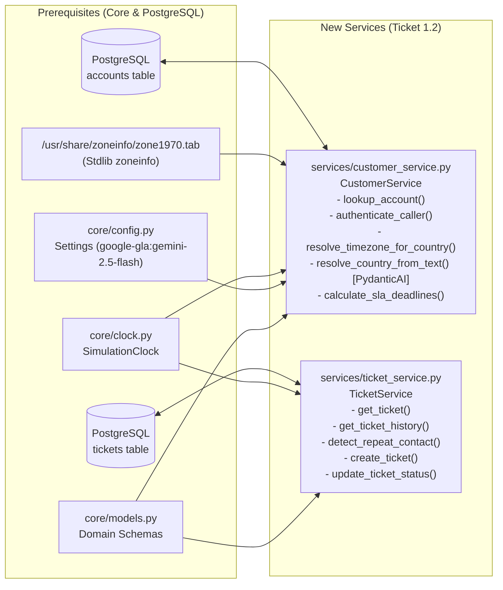

# [Phase 1] 1.2: Customer, SLA Matrix & Ticket History Services — Implementation Plan

> **For agentic workers:** REQUIRED SUB-SKILL: Use superpowers:subagent-driven-development to implement this plan task-by-task. Steps use checkbox (`- [ ]`) syntax for tracking.

**Goal:** Implement `services/customer_service.py` and `services/ticket_service.py` as minimal, strictly-typed PostgreSQL domain services anchored to `SimulationClock`, featuring stdlib IANA `zone1970.tab` timezone resolution, a PydanticAI Gemini (`google-gla:gemini-2.5-flash`) country-code fallback agent, regional business-hours SLA math, and unbounded repeat-contact detection.

**Architecture:** `CustomerService` queries the PostgreSQL `accounts` table to authenticate callers (enforcing the security invariant against spoofed tiers or unverified domains), maps ISO 3166-1 alpha-2 country codes directly to `zoneinfo.ZoneInfo` via a cached stdlib parser over `/usr/share/zoneinfo/zone1970.tab` (falling back to a lazy-initialized PydanticAI `Agent` when a country is missing/unknown), and computes [POL-SLA.md](file:///home/yaara/Documents/Assignments/cato%20networks/data/policies/POL-SLA.md) deadlines against `SimulationClock`. `TicketService` queries and mutates the PostgreSQL `tickets` table with atomic SQL ticket ID generation and an unbounded lookback window for repeat-contact detection.

**Architecture Diagram:**

**Tech Stack:** Python 3.12, `psycopg` v3, `pydantic` v2, `pydantic-ai` (`Agent` with `google-gla:gemini-2.5-flash` via `GEMINI_API_KEY`), stdlib `zoneinfo` & `functools.lru_cache`, `pytest`.

**Spec:** [01-services_design.md](file:///home/yaara/Documents/Assignments/cato%20networks/docs/plans/12-account_and_sla_matrix/01-services_design.md)

## Global Constraints

- **No Inline Imports**: All imports (`zoneinfo`, `functools`, `logging`, `re`, `psycopg`, `pydantic`, `pydantic_ai`, `core.*`) must sit at the top of each module.
- **Strict Type Annotations**: Every function, method, and helper must explicitly annotate all parameter types and return types (including `-> None`), passing Pyright `standard` mode with zero bare generics or implicit `Any`.
- **Database-Only Runtime Access**: `CustomerService` and `TicketService` query PostgreSQL (`accounts` and `tickets` tables) exclusively; never read `data/tickets/` files at runtime.
- **Ponytail + Thermo-Nuclear Quality**:
  - **Cached IANA Lookup**: Parse `/usr/share/zoneinfo/zone1970.tab` once via a module-level `@lru_cache(maxsize=1)` function `_country_to_tz_map() -> dict[str, str]` that splits each non-comment line by tab, splits column 0 by comma, and records the first IANA timezone name in column 2 for each 2-letter ISO code (`# ponytail: first zone1970.tab entry per country covers single-timezone countries and US/AU defaults; add per-site PoP override if multi-zone precision is needed`).
  - **PydanticAI Country Resolver with Deferred Model Check**: Define `CountryCodeOutput(BaseModel)` with field `country_code: str | None` and a module-level PydanticAI `Agent[None, CountryCodeOutput]` configured with `settings.country_resolver_model` (`"google-gla:gemini-2.5-flash"`), `output_type=CountryCodeOutput`, `defer_model_check=True` (so importing the module or running tests with a `TestModel` / custom `Model` override never fails before `GEMINI_API_KEY` is read), and a concise system prompt instructing the model to return the 2-letter ISO 3166-1 alpha-2 uppercase country code for the user's location text or `None` if no valid country is mentioned.
  - **Compact Business-Hours Stepper**: Compute `P2`–`P4` business hours (`Mon–Fri 08:00–18:00` local `ZoneInfo`, 10h/day) via a single day-stepping loop that snaps before-hours timestamps to `08:00`, rolls after-hours (`>= 18:00`) or weekend (`weekday() >= 5`) timestamps to the next weekday at `08:00`, and consumes `min(remaining_seconds, available_seconds_today)` until `remaining_seconds == 0`.
  - **Atomic Ticket Creation**: Generate the next `TCK-XXXXXXXX` ID inside the `INSERT ... RETURNING` SQL statement (or a single atomic query taking `MAX` of the numeric suffix + 1, defaulting to `20264200`) to avoid multi-roundtrip race conditions.

---

### Task 1: Prerequisite Check — PostgreSQL `accounts` & `tickets` Tables and Seed Fixture

**Files:**
- Modify (if not yet applied from seed plan): [20260929_1500_kb-schema.sql](file:///home/yaara/Documents/Assignments/cato%20networks/db/migrations/20260929_1500_kb-schema.sql)
- Create (if not yet applied from seed plan): `kbindex/tickets_seed.py`
- Modify (if not yet applied from seed plan): [store.py](file:///home/yaara/Documents/Assignments/cato%20networks/kbindex/store.py)

**Interfaces:**
- Consumes: [accounts.csv](file:///home/yaara/Documents/Assignments/cato%20networks/data/tickets/accounts.csv), [tickets.jsonl](file:///home/yaara/Documents/Assignments/cato%20networks/data/tickets/tickets.jsonl), [sites.json](file:///home/yaara/Documents/Assignments/cato%20networks/data/telemetry/sites.json)
- Produces:
  - PostgreSQL `accounts` table (`customer_id`, `company`, `tier`, `email_domain`, `registered_admin_contact`, `country`)
  - PostgreSQL `tickets` table (`ticket_id`, `created_at`, `channel`, `customer_id`, `customer_name`, `requester_email`, `company`, `tier`, `site_id`, `product_area`, `priority`, `subject`, `body`, `status`)
  - `load_accounts_seed(accounts_path: Path | str, sites_path: Path | str | None = None) -> list[dict[str, str | None]]`
  - `load_tickets_seed(tickets_path: Path | str) -> list[dict[str, Any]]`
  - `upsert_accounts(connection: psycopg.Connection, accounts: list[dict[str, str | None]]) -> None`
  - `upsert_tickets(connection: psycopg.Connection, tickets: list[dict[str, Any]], preserve_existing: bool = False) -> None`

- [ ] **Step 1: Verify or apply `accounts` and `tickets` schema & seed helpers**
  Check whether `accounts` and `tickets` tables are already defined in [20260929_1500_kb-schema.sql](file:///home/yaara/Documents/Assignments/cato%20networks/db/migrations/20260929_1500_kb-schema.sql) and `kbindex/tickets_seed.py` + `upsert_accounts`/`upsert_tickets` exist in [store.py](file:///home/yaara/Documents/Assignments/cato%20networks/kbindex/store.py). If not yet present on the branch, add the two table definitions (`accounts` and `tickets` with indexes `tickets_customer_created_idx` and `tickets_customer_site_idx`) to [20260929_1500_kb-schema.sql](file:///home/yaara/Documents/Assignments/cato%20networks/db/migrations/20260929_1500_kb-schema.sql), create `kbindex/tickets_seed.py` to join `accounts.csv` with the primary `-01` site's `country` code from `sites.json` and parse `tickets.jsonl`, and add `upsert_accounts` and `upsert_tickets` in [store.py](file:///home/yaara/Documents/Assignments/cato%20networks/kbindex/store.py).

- [ ] **Step 2: Commit prerequisite schema/seed helpers (if modified)**
  Stage and commit any schema or seed loader changes before starting the services task.

---

### Task 2: Customer, SLA Matrix & Ticket History Services (Functional TDD)

**Files:**
- Create: `services/__init__.py`
- Create: `services/customer_service.py`
- Create: `services/ticket_service.py`
- Create: `tests/services/test_support_intake_functional.py`

**Interfaces:**
- Consumes:
  - `SimulationClock` from [core/clock.py](file:///home/yaara/Documents/Assignments/cato%20networks/core/clock.py)
  - `settings` (`settings.country_resolver_model = "google-gla:gemini-2.5-flash"`) from [core/config.py](file:///home/yaara/Documents/Assignments/cato%20networks/core/config.py)
  - `AccountTier`, `CallerIdentity`, `CustomerAccount`, `RepeatContactResult`, `SLADeadlines`, `Ticket`, `TicketPriority`, `TicketStatus` from [core/models.py](file:///home/yaara/Documents/Assignments/cato%20networks/core/models.py)
- Produces:
  - `CountryCodeOutput(BaseModel)` with field `country_code: str | None = None` in `services/customer_service.py`
  - `CustomerService` in `services/customer_service.py`:
    - `__init__(self, connection: psycopg.Connection[Any], clock: SimulationClock, country_agent: Agent[None, CountryCodeOutput] | None = None) -> None`
    - `lookup_account(self, email_or_account_id: str) -> CustomerAccount | None`
    - `resolve_timezone_for_country(self, country_code: str | None) -> ZoneInfo | None`
    - `resolve_country_from_text(self, user_text: str, account_id: str | None = None) -> str | None`
    - `authenticate_caller(self, caller_email: str | None, claimed_account_id: str | None = None, claimed_tier: str | None = None) -> CallerIdentity`
    - `calculate_sla_deadlines(self, tier: AccountTier, priority: TicketPriority, country_code: str | None = None, product_area: str | None = None, created_at: datetime | None = None, status: TicketStatus = "open", elapsed_before_pause: timedelta | None = None) -> SLADeadlines`
  - `TicketService` in `services/ticket_service.py`:
    - `__init__(self, connection: psycopg.Connection[Any], clock: SimulationClock) -> None`
    - `get_ticket(self, ticket_id: str) -> Ticket | None`
    - `get_ticket_history(self, account_id: str, site_id: str | None = None, product_area: str | None = None, include_open: bool = True) -> list[Ticket]`
    - `detect_repeat_contact(self, account_id: str, site_id: str | None = None, product_area: str | None = None, symptom_text: str | None = None, exclude_ticket_id: str | None = None) -> RepeatContactResult`
    - `create_ticket(self, customer_id: str, customer_name: str, requester_email: str, company: str, tier: AccountTier, priority: TicketPriority, product_area: str, subject: str, body: str, site_id: str | None = None, channel: str = "chat") -> Ticket`
    - `update_ticket_status(self, ticket_id: str, status: TicketStatus) -> Ticket`

- [ ] **Step 1: Write the failing functional test suite (`tests/services/test_support_intake_functional.py`)**
  Create `tests/services/test_support_intake_functional.py` with a PostgreSQL fixture that ensures schema + seed rows (`accounts` and `tickets`) are loaded and wraps test mutations in rollback/cleanup, exercising 4 end-to-end functional workflows:
  1. **`test_repeat_contact_and_regional_sla_flow`**:
     - Authenticates `grace.novak@solsticemedia.com` (`ACC-1008`, `Standard`, `country="US"`), asserting `effective_tier == "Standard"`, `is_verified_account_member is True`, `is_registered_admin is False` (`netadmin@solsticemedia.com` is the registered admin), and `needs_country_clarification is False`.
     - Computes `P2` and `P3` SLA deadlines at `SimulationClock.frozen()` (`2026-08-28T17:00:00Z`) for `country="US"` and `country="DE"`, verifying that business hours advance across `Mon–Fri 08:00–18:00` in the resolved `ZoneInfo`, that `P1` runs 24x7 (`+15m` first response, `+4h` resolution), that `Premium` + `performance` on `P4` caps first response at 8 business hours, and that `status="pending_customer"` sets `resolution_paused=True` while `status="pending_approval"` sets `resolution_paused=False` and `elapsed_before_pause` deducts prior elapsed business time on reopen.
     - Queries `get_ticket_history("ACC-1008", site_id="S-1008-01")` and `detect_repeat_contact("ACC-1008", site_id="S-1008-01", product_area="connectivity", exclude_ticket_id="TCK-20264216")`, asserting all 3 Chicago tickets (`Aug 11`, `Aug 19`, `Aug 25`) are returned and `is_repeat_contact is True` with `TCK-20264200` and `TCK-20264201` in `prior_closed_tickets`.
     - Verifies single-incident open sites (`ACC-1001` `S-1001-02`, `ACC-1009` `S-1009-01`, `ACC-1010` `S-1010-01`) and unrelated same-site open tickets (`ACC-1003` `S-1003-01` firmware vs IPS; `ACC-1010` `S-1010-02` cloud/IPsec vs routing/BGP) return `is_repeat_contact is False`.
  2. **`test_security_invariant_and_adversarial_callers`**:
     - Authenticates `priya.patel@bluebirdretail.com` claiming `claimed_tier="Premium"` on `ACC-1002` (`Standard`, `country="DE"`), asserting `effective_tier == "Standard"` and `claimed_tier_rejected is True`.
     - Authenticates `mark.ellison.travel@gmail.com` claiming `claimed_account_id="ACC-1009"` (`Premium`), asserting `is_verified_account_member is False`, `is_registered_admin is False`, and `effective_tier == "Unknown"`.
     - Authenticates `noc@meridian-air.com` on `ACC-1011`, asserting `is_verified_account_member is True` and `is_registered_admin is True`.
  3. **`test_unknown_country_clarification_and_pydantic_ai_resolver`**:
     - Inserts or updates a temporary account row with `country=None` (and tests an invalid code `"ZZ"`), calls `authenticate_caller`, and verifies via `caplog` that `logger.error` is emitted, `needs_country_clarification is True`, and `scoping_question` asks for the customer's country.
     - Calls `resolve_country_from_text("I'm in Israel", account_id=...)` using PydanticAI `Agent` (injecting a deterministic PydanticAI `FunctionModel` or `TestModel` returning `CountryCodeOutput(country_code="IL")` when `GEMINI_API_KEY` is absent or a placeholder, and verifying the agent is wired with `settings.country_resolver_model == "google-gla:gemini-2.5-flash"`), asserting it returns `"IL"`, updates `accounts.country` in PostgreSQL to `"IL"`, and `resolve_timezone_for_country("IL")` returns `ZoneInfo("Asia/Jerusalem")`.
  4. **`test_live_ticket_creation_and_status_lifecycle`**:
     - Calls `TicketService.create_ticket(...)` for a site and verifies the new `TCK-XXXXXXXX` row is persisted in PostgreSQL with `created_at == clock.now()` and `status == "open"`.
     - Calls `TicketService.update_ticket_status(new_ticket.ticket_id, "closed")` and verifies subsequent `get_ticket_history` and `detect_repeat_contact` calls immediately reflect the closed ticket in PostgreSQL.

- [ ] **Step 2: Run the functional test suite to verify it fails**
  Run `uv run pytest tests/services/test_support_intake_functional.py -v` and confirm failure with `ModuleNotFoundError: No module named 'services'`.

- [ ] **Step 3: Implement `services/customer_service.py`, `services/ticket_service.py`, and `services/__init__.py`**
  - **In `services/customer_service.py`**:
    - Define `CountryCodeOutput(BaseModel)` with `country_code: str | None = None`.
    - Define module-level `_DEFAULT_COUNTRY_AGENT: Agent[None, CountryCodeOutput] = Agent(settings.country_resolver_model, output_type=CountryCodeOutput, defer_model_check=True, system_prompt="Extract the 2-letter ISO 3166-1 alpha-2 country code (e.g. 'IL', 'US', 'DE') from the user's message, or null if no recognizable country is stated.")`.
    - Define `@lru_cache(maxsize=1)` helper `_country_to_tz_map() -> dict[str, str]` that reads `/usr/share/zoneinfo/zone1970.tab`, skips `#` lines, splits on `\t`, and maps each 2-letter country code in column 0 (split on `,`) to the first seen IANA timezone name in column 2.
    - Implement `CustomerService.lookup_account(self, email_or_account_id: str) -> CustomerAccount | None`: strips whitespace; if `@` is in the input, extracts the domain part after `@` and queries `SELECT customer_id, company, tier, email_domain, registered_admin_contact, country FROM accounts WHERE LOWER(registered_admin_contact) = LOWER(%s) OR LOWER(email_domain) = LOWER(%s) LIMIT 1`; otherwise queries `WHERE UPPER(customer_id) = UPPER(%s) LIMIT 1`.
    - Implement `CustomerService.resolve_timezone_for_country(self, country_code: str | None) -> ZoneInfo | None`: normalizes `country_code` (`strip().upper()`), looks up the timezone name in `_country_to_tz_map()`, and returns `ZoneInfo(tz_name)`. If `country_code` is `None`, empty, or not in the map, logs an error with `logger.error(...)` and returns `None`.
    - Implement `CustomerService.resolve_country_from_text(self, user_text: str, account_id: str | None = None) -> str | None`: runs `self._country_agent.run_sync(user_text)` via PydanticAI, normalizes `result.output.country_code`, validates it via `self.resolve_timezone_for_country(code)`, and if valid and `account_id` is provided, executes `UPDATE accounts SET country = %s WHERE UPPER(customer_id) = UPPER(%s)` and commits before returning the 2-letter ISO code (or logs an error and returns `None` if invalid).
    - Implement `CustomerService.authenticate_caller(self, caller_email: str | None, claimed_account_id: str | None = None, claimed_tier: str | None = None) -> CallerIdentity`:
      - Looks up account by `caller_email` first (if provided), and also by `claimed_account_id` (if provided).
      - A caller is `is_verified_account_member=True` only when `caller_email` contains `@` and its domain matches `account.email_domain` case-insensitively (or `caller_email` matches `account.registered_admin_contact` case-insensitively). If `caller_email` is an external email (e.g., `@gmail.com`) claiming `claimed_account_id`, `account` is attached for context, `is_verified_account_member=False`, `is_registered_admin=False`, and `effective_tier="Unknown"`.
      - If verified, `effective_tier = account.tier` and `is_registered_admin = (caller_email.strip().lower() == account.registered_admin_contact.lower())`.
      - Sets `claimed_tier_rejected = bool(claimed_tier and account and claimed_tier.strip().lower() != account.tier.lower())`.
      - Checks `self.resolve_timezone_for_country(account.country)` when `account` is present: if `None`, sets `needs_country_clarification=True` and `scoping_question="Could you please share which country your primary office is located in so we can apply the right regional SLA hours?"`.
    - Implement `CustomerService.calculate_sla_deadlines(...) -> SLADeadlines`:
      - Resolves `started_at = created_at or self._clock.now()`.
      - Resolves `tz = self.resolve_timezone_for_country(country_code) or ZoneInfo("UTC")`.
      - Determines `resolution_paused = (status == "pending_customer")`.
      - For `priority == "P1"`: `is_24x7 = True`, `first_response_due = started_at + timedelta(minutes=15)`, `resolution_target = timedelta(hours=4) - (elapsed_before_pause or timedelta(0))`, `resolution_due = started_at + max(timedelta(0), resolution_target)`, `update_cadence = "every 30 minutes"`.
      - For `P2`–`P4`: maps `(priority, tier, product_area)` to `(first_response_bh, resolution_bh, update_cadence)` per [POL-SLA.md](file:///home/yaara/Documents/Assignments/cato%20networks/data/policies/POL-SLA.md) (`P2`: `1h`/`4h` response, `10h` [1 business day] resolution, `"every 4 business hours"`; `P3`: `4h`/`8h` response, `30h` [3 business days] resolution, `"on every state change"`; `P4`: `8h` for Premium or `20h` [2 business days] for Standard, overridden to `8h` when `tier == "Premium"` and `product_area == "performance"`, `50h` [5 business days] resolution, `"on every state change"`). Advances `started_at.astimezone(tz)` across `Mon–Fri 08:00–18:00` local time (subtracting `elapsed_before_pause` from the resolution target when provided) and converts both resulting datetimes back to `timezone.utc`.
  - **In `services/ticket_service.py`**:
    - Implement `TicketService.get_ticket(self, ticket_id: str) -> Ticket | None` and `TicketService.get_ticket_history(...) -> list[Ticket]` using parameterized SQL against `tickets` ordered by `created_at ASC` with no date-window cutoff.
    - Implement `TicketService.detect_repeat_contact(...) -> RepeatContactResult`:
      - Fetches all tickets for `account_id` (excluding `exclude_ticket_id` if provided).
      - Filters candidate matching tickets that share the same `site_id` (when `site_id` is provided) AND either share `product_area` or share recurring symptom stems (`{"drop", "disconnect", "flap", "slow", "stall", "outage", "failover", "ha"}`) across `subject`/`body`/`symptom_text` (or, when `site_id` is `None`, share `product_area` + recurring symptom stems on the account).
      - Sets `is_repeat_contact = True` when `len(prior_closed_tickets) >= 1` or `len(matching_tickets) >= 2`, populating a clear human-readable `reason` (e.g., citing the prior closed ticket IDs and dates).
    - Implement `TicketService.create_ticket(...) -> Ticket`: inserts a new row with the next `TCK-XXXXXXXX` ID computed atomically in SQL (`SELECT 'TCK-' || (COALESCE(MAX(SUBSTRING(ticket_id FROM 5)::int), 20264199) + 1)::text FROM tickets`), stamped with `self._clock.now()`, commits, and returns `Ticket`.
    - Implement `TicketService.update_ticket_status(self, ticket_id: str, status: TicketStatus) -> Ticket`: updates `status` in `tickets` for `ticket_id` with `RETURNING ...`, raises `ValueError` if `ticket_id` does not exist, commits, and returns `Ticket`.
  - **In `services/__init__.py`**: Export `CountryCodeOutput`, `CustomerService`, and `TicketService` in `__all__`.

- [ ] **Step 4: Run the functional test suite to verify it passes**
  Run `uv run pytest tests/services/test_support_intake_functional.py -v` and confirm all tests pass.

- [ ] **Step 5: Commit**
  Commit `core/config.py`, `services/`, and `tests/services/test_support_intake_functional.py`.

---

### Task 3: Documentation & Cleanup

**Files:**
- Modify: [decisions.md](file:///home/yaara/Documents/Assignments/cato%20networks/docs/overview/decisions.md)
- Modify: [system-architecture-design.md](file:///home/yaara/Documents/Assignments/cato%20networks/docs/architecture/system-architecture-design.md)

**Interfaces:**
- Consumes: Implemented `CustomerService` and `TicketService` contracts.
- Produces: Updated architectural documentation and ADRs.

- [ ] **Step 1: Document ADRs in `docs/overview/decisions.md` and align `docs/architecture/system-architecture-design.md`**
  - Add **ADR-001: Unbounded Repeat-Contact Detection Window (The Chicago Site Rule)** and **ADR-003: Dynamic `zoneinfo` Resolution from Account `country` Code & PydanticAI Gemini Fallback Agent** to [decisions.md](file:///home/yaara/Documents/Assignments/cato%20networks/docs/overview/decisions.md).
  - Align §4.2 `TriageDecision` in [system-architecture-design.md](file:///home/yaara/Documents/Assignments/cato%20networks/docs/architecture/system-architecture-design.md) so `customer_tier` uses `Literal["Premium", "Standard", "Unknown"]` and `is_repeat_contact` reflects the unbounded historical lookback rule.

- [ ] **Step 2: Cleanup and full verification**
  - Verify zero unused imports, dead helpers, inline imports, or missing type annotations across `core/`, `services/`, and `tests/`.
  - Run the full test suite via `uv run pytest -v`.

- [ ] **Step 3: Commit documentation and cleanup**
  Stage and commit [decisions.md](file:///home/yaara/Documents/Assignments/cato%20networks/docs/overview/decisions.md) and [system-architecture-design.md](file:///home/yaara/Documents/Assignments/cato%20networks/docs/architecture/system-architecture-design.md).
