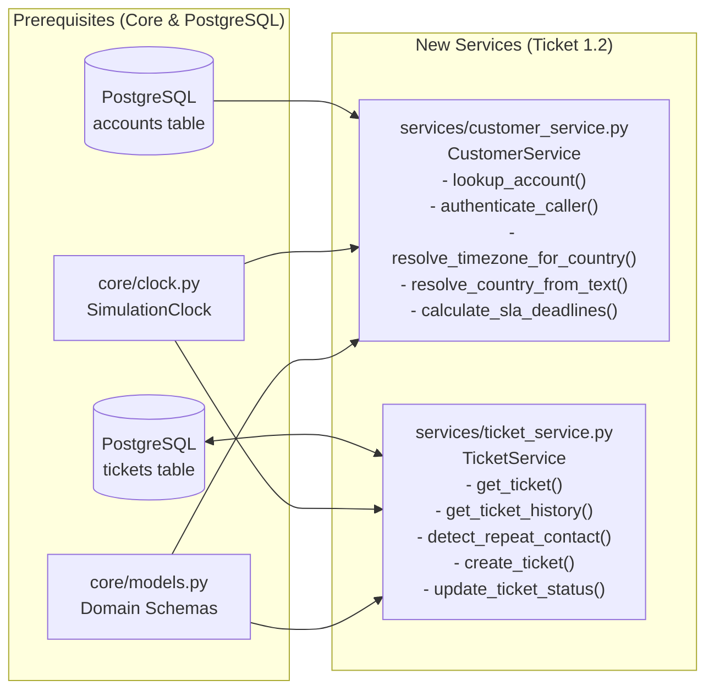

# [Phase 1] 1.2: Customer, SLA Matrix & Ticket History Services — Implementation Plan

> **Prerequisites**:
> 1. `core/` primitives (`core/clock.py`, `core/config.py`, `core/models.py`) are planned in [plan_1_1_core.md](file:///home/yaara/.gemini/antigravity/brain/e6e327b2-0ef2-4129-8e11-d33e7c979bb8/plan_1_1_core.md).
> 2. PostgreSQL `accounts` and `tickets` seed ingestion and `db/seed.dump` are planned in [plan_seed_data.md](file:///home/yaara/.gemini/antigravity/brain/e6e327b2-0ef2-4129-8e11-d33e7c979bb8/plan_seed_data.md).

## Goal Description

Implement `services/customer_service.py` and `services/ticket_service.py` as PostgreSQL-backed domain services anchored to `SimulationClock`. `CustomerService` authenticates callers against the PostgreSQL `accounts` table, enforces the hard security invariant against false tier/admin claims, resolves the customer's timezone directly from `account.country` using Python's `zoneinfo` (with error logging, a user clarification question, and a small PydanticAI country-code resolver agent when `country` is missing or unknown), and computes regional business-hours SLA deadlines per [POL-SLA.md](file:///home/yaara/Documents/Assignments/cato%20networks/data/policies/POL-SLA.md). `TicketService` queries and updates the PostgreSQL `tickets` table and detects repeat contacts across an unbounded historical window.

---

## Architecture & Data Flow

---

## Global Constraints

- **No Inline Imports**: All imports must sit at the top of each module.
- **Strict Type Annotations**: Every function and method must explicitly annotate all parameter types and return types (including `-> None`), adhering to Pyright standard mode with zero bare generics or implicit `Any`.
- **Database-Only Runtime Access**: `CustomerService` and `TicketService` must query PostgreSQL (`accounts` and `tickets` tables) exclusively and never read `data/tickets/` files at runtime.
- **Direct `zoneinfo` Resolution + Unknown-Country Fallback**: Resolve `ZoneInfo` directly from the 2-letter ISO `account.country` code via `/usr/share/zoneinfo/zone1970.tab` and `zoneinfo.ZoneInfo` without creating a custom region mapping table. When `country` is missing or unrecognized, log an error (`logger.error`), prompt the user for their country, and use a small PydanticAI agent (`resolve_country_from_text`) to convert natural language replies (e.g., `"I'm in Israel"` -> `"IL"`) into an ISO country code.
- **Security Hard Invariant**: Never trust customer-claimed tier (`"We are a Premium customer"` in `SC-07`), SLA entitlement, or admin authority (`"This is Mark, assistant to our CEO"` in `SC-04`) over the ground-truth row in the PostgreSQL `accounts` table.
- **Functional over Unit Testing**: Validate behavior through functional tests exercising end-to-end triage/intake workflows and complex SLA/repeat-contact edge cases against PostgreSQL.

---

## Proposed Changes

### 1. Customer & SLA Matrix Service

#### [NEW] `services/__init__.py`
- **One-liner**: Package marker exporting `CustomerService` and `TicketService` in `__all__`.

#### [NEW] `services/customer_service.py`
- **One-liner**: Authenticate callers against the PostgreSQL `accounts` table, resolve regional `ZoneInfo` from `account.country` (with unknown-country error logging and agent fallback), and compute [POL-SLA.md](file:///home/yaara/Documents/Assignments/cato%20networks/data/policies/POL-SLA.md) first-response and resolution deadlines against `SimulationClock`.
- **Class & Method Contracts**:
  - `CustomerService.__init__(self, connection: psycopg.Connection, clock: SimulationClock) -> None`: Stores the injected PostgreSQL connection and `SimulationClock` instance.
  - `CustomerService.lookup_account(self, email_or_account_id: str) -> CustomerAccount | None`: Queries `accounts` by `LOWER(registered_admin_contact) = LOWER(%s)` or `LOWER(email_domain) = LOWER(%s)` when input contains `@`, or by `UPPER(customer_id) = UPPER(%s)` otherwise. Returns `CustomerAccount` (including `country`) or `None`.
  - `CustomerService.resolve_timezone_for_country(self, country_code: str | None) -> ZoneInfo | None`: Reads the system's IANA `/usr/share/zoneinfo/zone1970.tab` file to resolve a 2-letter ISO `country_code` directly to its `zoneinfo.ZoneInfo` instance. If `country_code` is `None`, empty, or not found in IANA tzdata, logs an error via `logger.error` and returns `None`.
  - `CustomerService.resolve_country_from_text(self, user_text: str, account_id: str | None = None) -> str | None`: Runs a lightweight PydanticAI agent (`Agent(model, output_type=CountryCodeOutput)`) that converts a customer's free-text location answer (e.g., `"I'm in Israel"`) into a validated 2-letter ISO 3166-1 alpha-2 country code (`"IL"`), updates `accounts.country` in PostgreSQL when `account_id` is provided, and verifies it resolves via `resolve_timezone_for_country`.
  - `CustomerService.authenticate_caller(self, caller_email: str | None, claimed_account_id: str | None = None, claimed_tier: str | None = None) -> CallerIdentity`:
    - Resolves the caller's ground-truth account from PostgreSQL and enforces the **Security Hard Invariant** (never trusting `claimed_tier` or unverified external emails like `@gmail.com` in `SC-04`).
    - Checks `resolve_timezone_for_country(account.country)`: if `None` (country is missing or unrecognized), logs an error, sets `needs_country_clarification=True`, and populates `scoping_question="Could you please share which country your primary office is located in so we can apply the right regional SLA hours?"`.
  - `CustomerService.calculate_sla_deadlines(self, tier: AccountTier, priority: TicketPriority, country_code: str | None = None, product_area: str | None = None, created_at: datetime | None = None, status: TicketStatus = "open", elapsed_before_pause: timedelta | None = None) -> SLADeadlines`:
    - Uses `self._clock.now()` when `created_at` is `None`.
    - Resolves local `ZoneInfo` via `resolve_timezone_for_country(country_code)` (falling back to `ZoneInfo("UTC")` with an error log if unresolved).
    - Computes [POL-SLA.md](file:///home/yaara/Documents/Assignments/cato%20networks/data/policies/POL-SLA.md) deadlines directly inside `calculate_sla_deadlines`:
      - `P1`: 24x7 wall-clock (`+15m` first response, `+4h` resolution, `"every 30 minutes"` cadence).
      - `P2`–`P4`: Converts `started_at` into the customer's local `ZoneInfo`, advances the required business hours across `Mon–Fri 08:00–18:00` local time (10 business hours/day, skipping nights and weekends, applying the `8 business hours` cap for `Premium` + `performance` on `P4`), and converts the resulting deadlines back to UTC.
      - Applies clock pause rules (`pending_customer` sets `resolution_paused=True`; `pending_approval` sets `resolution_paused=False`; `elapsed_before_pause` deducted on reopen).

---

### 2. Ticket History & Repeat-Contact Service

#### [NEW] `services/ticket_service.py`
- **One-liner**: Query and update the PostgreSQL `tickets` table to fetch customer/site ticket history, detect repeat contacts across an unbounded historical window, and persist new or updated tickets during live conversations.
- **Class & Method Contracts**:
  - `TicketService.__init__(self, connection: psycopg.Connection, clock: SimulationClock) -> None`: Stores the injected PostgreSQL connection and `SimulationClock` instance.
  - `TicketService.get_ticket(self, ticket_id: str) -> Ticket | None`: Queries `tickets` by `ticket_id` and returns a `Ticket` model or `None`.
  - `TicketService.get_ticket_history(self, account_id: str, site_id: str | None = None, product_area: str | None = None, include_open: bool = True) -> list[Ticket]`:
    - Executes a parameterized `SELECT` against `tickets` filtered by `customer_id = account_id` (and optional `site_id`, `product_area`, and `status != 'open'` when `include_open=False`), ordered by `created_at ASC` with no date-window cutoff so all prior tickets (`Aug 11`, `Aug 19`, `Aug 25` in `SC-06`) are returned.
  - `TicketService.detect_repeat_contact(self, account_id: str, site_id: str | None = None, product_area: str | None = None, symptom_text: str | None = None, exclude_ticket_id: str | None = None) -> RepeatContactResult`:
    - Queries all tickets for `account_id` from PostgreSQL (excluding `exclude_ticket_id` if provided) with no date-window cutoff.
    - Flags `is_repeat_contact = True` if and only if:
      1. There is at least **1 prior `closed` ticket** on the same `site_id` (or same `account_id` + `product_area`/symptom), OR
      2. There are **2 or more tickets** sharing the same `site_id` AND the same `product_area` (or overlapping recurring symptom terms such as `"drop"`, `"disconnect"`, `"flap"`, `"slow"`, `"stall"`).
    - Prevents false positives on single `open` tickets (`SC-01`, `SC-11`, `SC-12`) or unrelated same-site open tickets (`S-1003-01` firmware vs IPS; `S-1010-02` IPsec vs BGP).
  - `TicketService.create_ticket(self, customer_id: str, customer_name: str, requester_email: str, company: str, tier: AccountTier, priority: TicketPriority, product_area: str, subject: str, body: str, site_id: str | None = None, channel: str = "chat") -> Ticket`: Inserts a new `open` ticket row into the PostgreSQL `tickets` table stamped with `self._clock.now()` and the next sequential `TCK-XXXXXXXX` identifier, commits, and returns the `Ticket`.
  - `TicketService.update_ticket_status(self, ticket_id: str, status: TicketStatus) -> Ticket`: Updates `status` in the PostgreSQL `tickets` table for `ticket_id`, commits, and returns the updated `Ticket`.

---

### 3. Documentation Updates

#### [MODIFY] [decisions.md](file:///home/yaara/Documents/Assignments/cato%20networks/docs/overview/decisions.md) & [system-architecture-design.md](file:///home/yaara/Documents/Assignments/cato%20networks/docs/architecture/system-architecture-design.md)
- **One-liner**: Record the repeat-contact and regional SLA decisions in `docs/overview/decisions.md` and align §4.2 `TriageDecision` in `docs/architecture/system-architecture-design.md`.
- **Details**:
  - **ADR-001: Unbounded Repeat-Contact Detection Window (The Chicago Site Rule)** — Documents the [tickets.jsonl](file:///home/yaara/Documents/Assignments/cato%20networks/data/tickets/tickets.jsonl) analysis for Solstice Media (`ACC-1008`, Chicago site `S-1008-01`): `TCK-20264200` (`2026-08-11`, `closed`), `TCK-20264201` (`2026-08-19`, `closed`), and `TCK-20264216` (`2026-08-25`, `open`), explaining why repeat-contact detection uses an unbounded lookback window.
  - **ADR-003: Dynamic `zoneinfo` Resolution from Account `country` Code & Unknown-Country Agent Fallback** — Documents resolving regional business hours (`Mon–Fri 08:00–18:00`) directly from `account.country` via system IANA `zoneinfo` data, and logging an error + asking the user for their country (resolved via a small agent from e.g. `"I'm in Israel"` -> `"IL"`) when `country` is missing or unrecognized.

---

## Execution Plan

### Task 1: Customer, SLA Matrix & Ticket History Services (Functional TDD)
- **Files**:
  - Create: `tests/services/test_support_intake_functional.py`
  - Create: `services/__init__.py`
  - Create: `services/customer_service.py`
  - Create: `services/ticket_service.py`
- **Steps**:
  - [ ] **Step 1 (Write Failing Functional Tests)**: Create `tests/services/test_support_intake_functional.py` testing end-to-end triage intake flows against PostgreSQL plus the complex SLA/repeat-contact edge cases:
    1. **End-to-End Repeat-Contact & Regional SLA Flow (`SC-06` Chicago)**: Authenticate `grace.novak@solsticemedia.com` (`ACC-1008`, `Standard`, `country="US"`), compute regional SLA deadlines across `Mon–Fri 08:00–18:00` local time via `zoneinfo`, fetch ticket history for `S-1008-01` (`Aug 11`, `Aug 19`, `Aug 25`), and verify `detect_repeat_contact` flags `is_repeat_contact=True` with both prior closed tickets attached while single-incident sites (`SC-01`, `SC-11`, `SC-12`) and unrelated same-site tickets (`S-1003-01`, `S-1010-02`) return `is_repeat_contact=False`.
    2. **Security Invariant & Adversarial Caller Flow (`SC-04` & `SC-07`)**: Verify `priya.patel@bluebirdretail.com` claiming `"Premium"` on `ACC-1002` (`country="DE"`) gets `effective_tier="Standard"` (`claimed_tier_rejected=True`) and after-hours Friday `19:00 CEST` SLA rolling to Monday `08:00 CEST`; verify `mark.ellison.travel@gmail.com` claiming `ACC-1009` gets `is_verified_account_member=False` and `is_registered_admin=False`.
    3. **Unknown Country Edge Case & Agent Country Resolver**: When an account has `country=None` or an invalid country code, verify `authenticate_caller` logs an error and returns `needs_country_clarification=True` with the country scoping question, and verify `resolve_country_from_text("I'm in Israel")` resolves `"IL"` and maps to `ZoneInfo("Asia/Jerusalem")`.
    4. **Live Ticket Persistence**: Verify creating and updating a ticket via `TicketService` persists to PostgreSQL and is reflected in subsequent `get_ticket_history` and `detect_repeat_contact` queries.
  - [ ] **Step 2 (Run Tests to Verify Failure)**: Run `uv run pytest tests/services/test_support_intake_functional.py -v` and confirm failure.
  - [ ] **Step 3 (Write Minimal Implementation)**: Implement `CustomerService` in `services/customer_service.py` and `TicketService` in `services/ticket_service.py`, and export both in `services/__init__.py`.
  - [ ] **Step 4 (Run Tests to Verify Pass)**: Run `uv run pytest tests/services/test_support_intake_functional.py -v` and confirm all functional tests pass.
  - [ ] **Step 5 (Commit)**: Commit `services/` and `tests/services/test_support_intake_functional.py`.

---

### Task 2: Documentation & Cleanup
- **Files**:
  - Modify: [decisions.md](file:///home/yaara/Documents/Assignments/cato%20networks/docs/overview/decisions.md)
  - Modify: [system-architecture-design.md](file:///home/yaara/Documents/Assignments/cato%20networks/docs/architecture/system-architecture-design.md)
- **Steps**:
  - [ ] **Step 1**: Write ADR-001 (Chicago site unbounded repeat-contact rule) and ADR-003 (Dynamic `zoneinfo` resolution from `country` + unknown-country user question & agent resolver) in [decisions.md](file:///home/yaara/Documents/Assignments/cato%20networks/docs/overview/decisions.md), and align §4.2 in [system-architecture-design.md](file:///home/yaara/Documents/Assignments/cato%20networks/docs/architecture/system-architecture-design.md).
  - [ ] **Step 2 (Cleanup)**: Remove any unused imports or dead helpers across `services/` and `tests/services/`, verify all functions have full type annotations (`-> None` included) and top-level imports only, and run `uv run pytest -v`.
  - [ ] **Step 3 (Commit)**: Commit documentation and cleanup changes.

---

## Verification Plan

### Automated Tests
- `uv run pytest tests/services/test_support_intake_functional.py -v`

### Manual Verification
- Review [decisions.md](file:///home/yaara/Documents/Assignments/cato%20networks/docs/overview/decisions.md) and [system-architecture-design.md](file:///home/yaara/Documents/Assignments/cato%20networks/docs/architecture/system-architecture-design.md).
