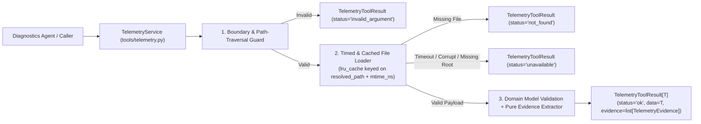

# Phase 1.3: CMA Telemetry Tool Suite — Design Specification

**Issue**: `#3` ([Phase 1] 1.3: Telemetry Tool Suite)  
**Date**: 2026-09-30  
**Status**: Ready for Review  
**Target Files**: `core/models.py`, `tools/__init__.py`, `tools/telemetry.py`, `tests/tools/test_telemetry.py`

---

## 1. Objective & Architectural Scope

Design and implement the read-only Cato Management Application (CMA) telemetry inspection tool suite over `data/telemetry/` in a single, cohesive module (`tools/telemetry.py`).

In production, CMA telemetry resides in Cato's external GraphQL API and time-series backend rather than the agent's PostgreSQL database. Accordingly, `TelemetryService` reads directly from `data/telemetry/` using Python standard library primitives (`pathlib`, `json`, `csv`, `functools.lru_cache`, `concurrent.futures`) and returns a unified, generic Pydantic envelope (`TelemetryToolResult[T]`) that pairs structured domain data with deterministically extracted `TelemetryEvidence` items.

---

## 2. Module Boundaries & File Responsibilities

| File Path | Responsibility |
|---|---|
| `core/models.py` | Houses `TelemetryEvidence` (existing) and adds a one-line helper method `format_citation(self) -> str` returning the verbatim metric key, raw value, and `[telemetry:<tool_name>]` tag, plus the generic `TelemetryToolResult[T]` envelope and the 6 typed telemetry payload models. |
| `tools/__init__.py` | Exports `TelemetryService` and the 7 tool functions/methods cleanly with zero logic. |
| `tools/telemetry.py` | Implements input validation, path-traversal protection, timed cached file loading, CSV window slicing and statistical aggregation, JSON/JSONL parsing, deterministic anomaly/evidence extraction, and the `TelemetryService` class exposing all 7 tools. |
| `tests/tools/test_telemetry.py` | Functional test suite verifying all 5 primary scenario anomalies, the 5 additional scenario telemetry datasets, window aggregation math, boundary validation, missing/corrupt file degradation, and timeout enforcement. |

> [!NOTE]
> The previously speculative `tools/formatters.py` module is intentionally eliminated. Formatting and evidence extraction live directly on `TelemetryEvidence` and inside pure extractor helpers in `tools/telemetry.py`.

---

## 3. Data Models & Contracts (`core/models.py`)

### 3.1 Evidence & Generic Result Envelope
- **`TelemetryEvidence` (`core/models.py`)**:
  - Fields (existing): `tool_name: str`, `metric_key: str`, `raw_value: str`, `timestamp: AwareDatetime`, `is_anomaly: bool`.
  - Method to add: `format_citation(self) -> str` — returns a single formatted string combining `metric_key`, `raw_value`, and `[telemetry]` / `[telemetry:<tool_name>]` for direct agent quoting.
- **`TelemetryStatus` (`core/models.py`)**:
  - `Literal["ok", "not_found", "unavailable", "invalid_argument"]`.
- **`TelemetryToolResult[T]` (`core/models.py`)**:
  - Generic Pydantic `BaseModel` parameterized over `T`.
  - Fields: `tool_name: str`, `status: TelemetryStatus`, `data: T | None = None`, `evidence: list[TelemetryEvidence]`, `error: str | None = None`.

### 3.2 Domain Payload Models (`core/models.py`)
1. **`SiteRecord` & `SiteListPayload`**:
   - `SiteRecord`: `site_id: str`, `customer_id: str`, `name: str`, `country: str`, `connection_type: Literal["socket", "ipsec"]`, `socket_model: str | None`, `socket_version: str | None`, `ha: bool`, `wan_links: list[str]`, `connected_pop: str`, `status: str`, `last_seen: AwareDatetime`, `native_range: str`.
   - `SiteListPayload`: `account_id: str`, `generated_at: AwareDatetime`, `sites: list[SiteRecord]`.
2. **`LinkMetricsSummary` & `LinkQualityPayload`**:
   - `LinkMetricsSummary`: `link: str`, `sample_count: int`, `window_start: AwareDatetime`, `window_end: AwareDatetime`, `avg_packet_loss_pct: float`, `max_packet_loss_pct: float`, `latest_packet_loss_pct: float`, `avg_latency_ms: float`, `max_latency_ms: float`, `avg_jitter_ms: float`, `max_jitter_ms: float`, `avg_upstream_mbps: float`, `avg_downstream_mbps: float`, `down_intervals: int` (count of intervals where `packet_loss_pct >= 100.0`).
   - `LinkQualityPayload`: `site_id: str`, `window: str`, `links: list[LinkMetricsSummary]`.
3. **`CmaEvent` & `EventsPayload`**:
   - `CmaEvent`: `ts: AwareDatetime`, `site_id: str`, `event_type: str`, `sub_type: str`, `action: str`, `message: str`, `link: str | None = None`, `src: str | None = None`, `dst: str | None = None`, `verdict: str | None = None`.
   - `EventsPayload`: `site_id: str`, `event_type_filter: str | None`, `window: str`, `events: list[CmaEvent]`.
4. **`BgpNeighbor` & `BgpStatusPayload`**:
   - `BgpNeighbor`: `peer_ip: str`, `peer_asn: int`, `cato_asn: int`, `state: str`, `uptime_seconds: int`, `hold_time_configured: int`, `keepalive_configured: int`, `hold_time_negotiated: int`, `peer_hold_time: int`, `peer_keepalive: int`, `routes_count: int`, `routes_limit: int`, `last_error: str | None = None`, `flaps_24h: int = 0`, `bfd: str | None = None`.
   - `BgpStatusPayload`: `site_id: str`, `queried_at: AwareDatetime`, `neighbors: list[BgpNeighbor]`.
5. **`IpsecTunnelEndpoint`, `IkeParameters`, `PeerPcapParameters` & `IpsecStatusPayload`**:
   - `IpsecTunnelEndpoint`: `status: str`, `last_error: str | None = None`, `cato_egress_ip: str | None = None`, `site_ip: str | None = None`.
   - `IkeParameters`: `encryption: str`, `dh_group: str`, `prf: str | None = None`, `integrity: str`.
   - `PeerPcapParameters`: `child_sa_encryption: str`, `child_sa_integrity: str`, `child_sa_dh_group: str`.
   - `IpsecStatusPayload`: `site_id: str`, `peer: str`, `ike_version: str`, `initiator: str`, `primary: IpsecTunnelEndpoint`, `secondary: IpsecTunnelEndpoint | None = None`, `init_message_parameters: IkeParameters | None = None`, `auth_message_parameters: IkeParameters | None = None`, `peer_reported_parameters_from_pcap: PeerPcapParameters | None = None`, `psk_last_changed: AwareDatetime | None = None`, `note: str | None = None`, `queried_at: AwareDatetime`.
6. **`ClientNetworkInfo`, `ClientSession` & `ClientDiagnosticsPayload`**:
   - `ClientNetworkInfo`: `ssid: str | None = None`, `captive_portal_detected: bool = False`, `udp_443_reachable: bool = True`, `tcp_443_reachable: bool = True`.
   - `ClientSession`: `ts: AwareDatetime`, `pop: str`, `duration_min: int`, `network: str`.
   - `ClientDiagnosticsPayload`: `user_email: str`, `customer_id: str`, `os: str`, `client_version: str`, `last_connect_attempt: AwareDatetime`, `last_error: str | None = None`, `network: ClientNetworkInfo`, `recent_sessions: list[ClientSession] = []`, `scim_state: str | None = None`, `queried_at: AwareDatetime`.

---

## 4. Service Interface, Functions & Input-Outputs (`tools/telemetry.py`)

### 4.1 `TelemetryService` Initialization
- **`TelemetryService.__init__`**:
  - **Inputs**: `telemetry_dir: Path = settings.repo_root / "data" / "telemetry"`, `clock: SimulationClock | None = None` (defaults to `SimulationClock.frozen()`), `timeout_seconds: float = 2.0`.
  - **Behavior**: Stores resolved base directory, simulation clock, and per-call execution timeout.

### 4.2 Tool Methods & Deterministic Evidence Rules

| Method Name | Input Parameters | Output Type | One-Line Behavior & Deterministic `TelemetryEvidence` Extraction |
|---|---|---|---|
| `list_sites` | `account_id: str` | `TelemetryToolResult[SiteListPayload]` | Validates `account_id` (`^ACC-\d{4}$`), filters `sites.json` by `customer_id`, returns `not_found` if no sites match, and emits `TelemetryEvidence` for each site's `status` (`is_anomaly=True` when `status != "connected"`). |
| `get_site_status` | `site_id: str` | `TelemetryToolResult[SiteRecord]` | Validates `site_id` (`^S-\d{4}-\d{2}$`), finds the site in `sites.json`, and emits `TelemetryEvidence` for `status`, `last_seen`, `socket_version`, and `wan_links` (`is_anomaly=True` when `status != "connected"`). |
| `get_link_quality` | `site_id: str, window: str = "24h"` | `TelemetryToolResult[LinkQualityPayload]` | Validates `site_id` and `window` (`1h`, `6h`, `12h`, `24h`, `7d`, `all`), slices rows in `link_quality/<site_id>.csv` within `window` before `clock.now()`, aggregates per-link stats, and emits `TelemetryEvidence` (`is_anomaly=True` when `max_packet_loss_pct >= 2.0`, `latest_packet_loss_pct == 100.0`, or `max_jitter_ms >= 30.0`). |
| `get_events` | `site_id: str, event_type: str | None = None, window: str = "24h"` | `TelemetryToolResult[EventsPayload]` | Validates `site_id` and `window`, reads all rows in `events/<site_id>.jsonl` without dropping older alerts (preserving 4-day-old alerts like `S-1008-03`), filters case-insensitively by `event_type` against `event_type` or `sub_type` (`None` or `"all"` returns all), and emits `TelemetryEvidence` (`is_anomaly=True` when `action in {"Alert", "Disconnected", "Failed", "Block"}`). |
| `get_bgp_status` | `site_id: str` | `TelemetryToolResult[BgpStatusPayload]` | Validates `site_id`, loads `bgp_status/<site_id>.json`, and emits `TelemetryEvidence` for `routes_count` (`"<routes_count>/<routes_limit>"`), `last_error`, `flaps_24h`, and timer negotiation (`hold_time_negotiated` vs `hold_time_configured`), marking `is_anomaly=True` when `routes_count >= routes_limit`, `flaps_24h > 0`, or `last_error` is non-empty. |
| `get_ipsec_status` | `site_id: str` | `TelemetryToolResult[IpsecStatusPayload]` | Validates `site_id`, loads `ipsec_status/<site_id>.json`, and emits `TelemetryEvidence` for tunnel `status`/`last_error`, cipher proposals (`init_message_parameters.encryption` vs `peer_reported_parameters_from_pcap.child_sa_encryption`), and `psk_last_changed`/`note`, marking `is_anomaly=True` when any tunnel `status != "up"` or `last_error` is present. |
| `get_client_diagnostics` | `user_email: str` | `TelemetryToolResult[ClientDiagnosticsPayload]` | Validates `user_email` format and path safety, loads `clients/<user_email>.json`, and emits `TelemetryEvidence` for `last_error`, `captive_portal_detected`, `udp_443_reachable`, and `tcp_443_reachable`, marking `is_anomaly=True` when `last_error` is set, `captive_portal_detected` is true, or 443 is unreachable. |

### 4.3 Internal Helper Functions (`tools/telemetry.py`)
- **`_validate_identifier(value: str, pattern: Pattern[str], label: str) -> str | None`**:
  - Returns `None` if `value` matches `pattern` and contains no path separators or `".."`, else returns an explicit validation error message.
- **`_resolve_safe_path(base_dir: Path, relative_name: str) -> Path | None`**:
  - Resolves `base_dir / relative_name` and verifies `resolved.is_relative_to(base_dir.resolve())` to prevent path traversal.
- **`_parse_window_hours(window: str) -> float | None`**:
  - Maps `"1h" -> 1.0`, `"6h" -> 6.0`, `"12h" -> 12.0`, `"24h" -> 24.0`, `"7d" -> 168.0`, `"all" -> inf` (plus general `<N>h` / `<N>d` patterns), returning `None` on invalid format.
- **`_read_text_cached(resolved_path: str, mtime_ns: int) -> str`**:
  - `@lru_cache(maxsize=256)` pure file reader keyed on resolved path string and file modification nanosecond timestamp so repeated reads avoid disk I/O while test modifications automatically invalidate cache entries.
- **`_load_with_timeout(fn: Callable[[], R], timeout_seconds: float) -> R`**:
  - Runs the file read/parse callable with a deadline check (`time.monotonic()` elapsed check + thread timeout when needed) and raises `TimeoutError` if exceeded.

---

## 5. Scenario Anomaly Coverage Matrix

Every scenario anomaly in `data/telemetry/` and `data/eval/scenarios.jsonl` maps deterministically to `TelemetryEvidence(is_anomaly=True)`:

| Scenario / Site / User | Tool(s) Invoked | Verbatim `TelemetryEvidence` Produced |
|---|---|---|
| **Munich Bureau (`S-1008-02`, `ACC-1008`)** | `get_site_status`, `get_link_quality`, `get_events` | `status: disconnected`, `WAN1/WAN2 latest_packet_loss_pct: 100.0%`, `Passive Disconnected: Last Resort link WAN2 (LTE) has no carrier signal`, `Last-Mile Quality: Packet loss 38% on WAN1 exceeded rule threshold`. |
| **Austin Office (`S-1007-01`, `ACC-1007`, `SC-01`)** | `get_bgp_status`, `get_events` | `routes_count: 1024/1024`, `last_error: Hold Timer Expired`, `flaps_24h: 11`, `hold_time_negotiated: 30 (configured 60, keepalive 20)`. |
| **AWS eu-central-1 (`S-1002-03`, `ACC-1002`, `SC-11`)** | `get_ipsec_status`, `get_events` | `primary.last_error: NO_PROPOSAL_CHOSEN`, `secondary.last_error: NO_PROPOSAL_CHOSEN`, `encryption_mismatch: Cato configured AES GCM 256 vs peer PCAP AES CBC 256 (DH group 14)`, `note: AWS-side tunnel options were regenerated during AWS maintenance on 2026-08-27`. |
| **Denver Clinic (`S-1009-01`, `ACC-1009`, `SC-12`)** | `get_site_status`, `get_events` | `status: disconnected`, `Socket/Upgrade Failed: No open tunnel after grace time`, `Socket/Upgrade Started: Scheduled upgrade to 27.0.19812 started (maintenance window)`. |
| **Perth Mine Site (`S-1010-01`, `ACC-1010`)** | `get_site_status`, `get_events` | `Connectivity/HA Not Ready: Compatible Version check failed: primary 27.0.19812, secondary 26.0.18990`. |
| **Sydney Bureau (`S-1008-03`, `ACC-1008`, `SC-02`)** | `list_sites`, `get_link_quality`, `get_events` | `WAN1 packet_loss_pct` elevated (`4-9%` range) and high `jitter_ms`, plus `Connectivity/Last-Mile Quality: Packet loss 6.8% and jitter 44 ms on WAN1 exceeded thresholds`. |
| **Hotel Client (`sam.dubois@atlas-eng.com`, `SC-05`)** | `get_client_diagnostics` | `last_error: TUNNEL_TIMEOUT (408)`, `captive_portal_detected: true`, `udp_443_reachable: false`, `tcp_443_reachable: false` on `ssid: HotelWifi`. |
| **Chicago Studio (`S-1008-01`, `ACC-1008`, `SC-06`)** | `get_events`, `get_link_quality` | `8 Disconnected/Reconnected pairs` in `events/S-1008-01.jsonl` plus `Connectivity/Last-Mile Quality: Upstream packet loss 22% on WAN1 (ISP: Comcast Business)`. |
| **Fortigate DC (`S-1010-02`, `ACC-1010`, `SC-08`)** | `get_ipsec_status` | `primary.last_error: AUTHENTICATION_FAILED`, `secondary.last_error: AUTHENTICATION_FAILED`, `note: PSK re-entered on Cato side 26 hours ago` (`psk_last_changed: 2026-08-27T15:00:00Z`). |
| **Pittsburgh Plant (`S-1004-01`, `ACC-1004`, `SC-10`)** | `get_events` | `6 Security/Anti Malware Block` events: `C2 communication blocked: badexfil-cdn.net (threat reputation: malicious)` (`src: 10.4.1.20`, `verdict: C2`). |

---

## 6. Testing & Verification Strategy (`tests/tools/test_telemetry.py`)

Following the **Functional over Unit Testing** standard, `tests/tools/test_telemetry.py` executes end-to-end against the real `data/telemetry/` files with `SimulationClock.frozen()`:
1. **5 Core Issue #3 Anomaly Workflows**:
   - Munich Bureau (`S-1008-02`): verifies site disconnected, WAN1/WAN2 100% loss, and LTE no-carrier event evidence.
   - Austin Office (`S-1007-01`): verifies BGP `routes_count 1024/1024`, `Hold Timer Expired`, 11 flaps, and timer negotiation evidence.
   - AWS `eu-central-1` (`S-1002-03`): verifies `NO_PROPOSAL_CHOSEN` and `AES GCM 256` vs `AES CBC 256` PCAP mismatch evidence.
   - Denver Clinic (`S-1009-01`): verifies `disconnected` status and `"No open tunnel after grace time"` upgrade failure evidence.
   - Perth Mine Site (`S-1010-01`): verifies `"HA Not Ready"` version mismatch (`27.0.19812` vs `26.0.18990`) evidence.
2. **Additional Scenario Telemetry Workflows**:
   - Verifies `SC-02` (`S-1008-03` link quality + 4-day-old alert preserved even when `window="24h"` is passed to `get_events`), `SC-05` (`sam.dubois@atlas-eng.com` 408 + captive portal), `SC-06` (`S-1008-01` 8 disconnect pairs + 22% loss), `SC-08` (`S-1010-02` `AUTHENTICATION_FAILED` + PSK note), and `SC-10` (`S-1004-01` 6 C2 block events).
3. **Boundary, Partial-Failure & Security Guards**:
   - Path traversal attempts (`site_id="../../.env"`, `user_email="../secrets@test.com"`) return `status="invalid_argument"`.
   - Non-existent site/BGP/IPsec/client files return `status="not_found"` without raising uncaught exceptions.
   - Missing root `sites.json`, malformed JSON/CSV in a `tmp_path` telemetry directory, or exceeded `timeout_seconds` return `status="unavailable"`.

---

## 7. Cleanup & Hygiene Step

- Verify that `tools/formatters.py` is never created and all references to it in `docs/architecture/system-architecture-design.md` are removed.
- Ensure all imports in `core/models.py`, `tools/telemetry.py`, and `tests/tools/test_telemetry.py` are placed strictly at the top of each module (no inline imports) and pass Pyright standard type checking and Ruff linting with zero unused symbols.
