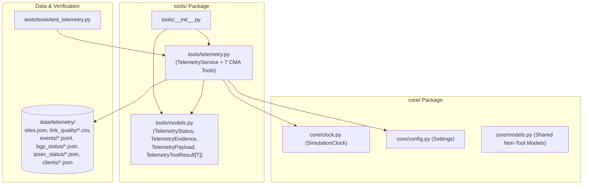

# Phase 1.3: CMA Telemetry Tool Suite Implementation Plan

> **For agentic workers:** REQUIRED SUB-SKILL: Use superpowers:subagent-driven-development to implement this plan task-by-task. Steps use checkbox (`- [ ]`) syntax for tracking.

**Goal:** Build the file-backed CMA Telemetry Tool Suite (`tools/models.py` and `tools/telemetry.py`) with 7 typed inspection tools, deterministic `TelemetryEvidence` extraction, boundary/timeout guards, and a comprehensive functional test suite over `data/telemetry/`.

**Architecture:** All telemetry data contracts live in `tools/models.py`, featuring a `TelemetryStatus(StrEnum)` (`"OK"`, `"NOT_FOUND"`, `"UNAVAILABLE"`, `"INVALID_ARGUMENT"`), `TelemetryEvidence` (moved out of `core/models.py`), a 7-model `TelemetryPayload` union alias, and a bounded generic `TelemetryToolResult[T: TelemetryPayload]` envelope. `TelemetryService` in `tools/telemetry.py` reads `data/telemetry/` via stdlib (`pathlib`, `json`, `csv`) and `@lru_cache` keyed on `(resolved_path, mtime_ns)`, slices and aggregates 580-row `link_quality` CSVs per link while preserving all `<20` rows in `events` JSONL files, and deterministically extracts verbatim `TelemetryEvidence` items.

**Architecture Diagram:**

**Tech Stack:** Python 3.12+, Pydantic v2 (`BaseModel`, `AwareDatetime`, PEP 695 generics), Python stdlib (`enum.StrEnum`, `pathlib.Path`, `json`, `csv`, `functools.lru_cache`, `re`, `concurrent.futures`), Pytest, Ruff, Pyright (`typeCheckingMode: "standard"`).

**Spec:** [`docs/plans/2026-09-30-telemetry-tool-suite-design.md`](file:///home/yaara/Documents/Assignments/cato%20networks/docs/plans/2026-09-30-telemetry-tool-suite-design.md)

## Global Constraints

- **No Inline Imports:** All imports must be placed at the top of each module (`no-inline-imports.md`).
- **Strict Type Safety:** Every function, method, and helper must declare full parameter and return type annotations compliant with Pyright standard mode (`types.md`).
- **No Unnecessary Files or Wrappers:** Do not create `tools/formatters.py`; evidence formatting lives on `TelemetryEvidence.format_citation` in `tools/models.py` and in pure extractor functions in `tools/telemetry.py` (`ponytail`).
- **Simulation Clock Invariant:** All time window calculations in `get_link_quality` must read current time exclusively from the injected `SimulationClock` anchored at `2026-08-28T17:00:00Z`, never wall-clock `datetime.now()`.
- **Branching Strategy:** Open a plan branch and per-task branches merged into the plan branch; do not merge to `master` and do not create a git worktree folder (`no-worktree.md`).

---

### Task 1: Telemetry Data Models & Bounded Generic Envelope (`tools/models.py` & `core/models.py`)

**Files:**
- Modify: [`core/models.py`](file:///home/yaara/Documents/Assignments/cato%20networks/core/models.py#L67-L73)
- Create: `tools/__init__.py`
- Create: `tools/models.py`

**Interfaces:**
- Consumes: `pydantic.AwareDatetime`, `pydantic.BaseModel`, `enum.StrEnum`, `typing.Literal`.
- Produces (in `tools/models.py`):
  - `TelemetryStatus(StrEnum)` with values `OK = "OK"`, `NOT_FOUND = "NOT_FOUND"`, `UNAVAILABLE = "UNAVAILABLE"`, `INVALID_ARGUMENT = "INVALID_ARGUMENT"`.
  - `TelemetryEvidence(BaseModel)` with fields `tool_name: str`, `metric_key: str`, `raw_value: str`, `timestamp: AwareDatetime`, `is_anomaly: bool`, and method `format_citation(self) -> str` returning the metric key, raw value, and `[telemetry:<tool_name>]` citation tag.
  - `SiteRecord(BaseModel)` and `SiteListPayload(BaseModel)` (`account_id: str`, `generated_at: AwareDatetime`, `sites: list[SiteRecord]`).
  - `LinkMetricsSummary(BaseModel)` and `LinkQualityPayload(BaseModel)` (`site_id: str`, `window: str`, `links: list[LinkMetricsSummary]`).
  - `CmaEvent(BaseModel)` and `EventsPayload(BaseModel)` (`site_id: str`, `event_type_filter: str | None`, `window: str`, `events: list[CmaEvent]`).
  - `BgpNeighbor(BaseModel)` and `BgpStatusPayload(BaseModel)` (`site_id: str`, `queried_at: AwareDatetime`, `neighbors: list[BgpNeighbor]`).
  - `IpsecTunnelEndpoint(BaseModel)`, `IkeParameters(BaseModel)`, `PeerPcapParameters(BaseModel)`, and `IpsecStatusPayload(BaseModel)`.
  - `ClientNetworkInfo(BaseModel)`, `ClientSession(BaseModel)`, and `ClientDiagnosticsPayload(BaseModel)`.
  - `type TelemetryPayload = SiteListPayload | SiteRecord | LinkQualityPayload | EventsPayload | BgpStatusPayload | IpsecStatusPayload | ClientDiagnosticsPayload`.
  - `class TelemetryToolResult[T: TelemetryPayload](BaseModel)` with fields `tool_name: str`, `status: TelemetryStatus`, `data: T | None = None`, `evidence: list[TelemetryEvidence] = []`, `error: str | None = None`.

- [ ] **Step 1: Remove `TelemetryEvidence` from [`core/models.py`](file:///home/yaara/Documents/Assignments/cato%20networks/core/models.py#L67-L73)**
  Delete the `TelemetryEvidence` class definition from `core/models.py` so telemetry schemas are owned exclusively by `tools/models.py`.

- [ ] **Step 2: Create `tools/models.py` with all telemetry contracts**
  Define `TelemetryStatus(StrEnum)`, `TelemetryEvidence` (with `format_citation(self) -> str`), the 7 tool payload models and their nested component models, the `TelemetryPayload` union type alias, and the bounded generic `TelemetryToolResult[T: TelemetryPayload]` model.

- [ ] **Step 3: Create `tools/__init__.py` exporting model contracts**
  Export `TelemetryStatus`, `TelemetryEvidence`, `TelemetryPayload`, `TelemetryToolResult`, and all payload models in `__all__`.

- [ ] **Step 4: Verify type checking and linting on `core/models.py` and `tools/models.py`**
  Run Pyright and Ruff on `core/models.py`, `tools/models.py`, and `tools/__init__.py` to confirm zero type errors or broken imports across existing tests.

- [ ] **Step 5: Commit Task 1**
  Stage `core/models.py`, `tools/__init__.py`, and `tools/models.py` and commit with message `feat(tools): add package-scoped telemetry models and bounded generic TelemetryToolResult`.

---

### Task 2: `TelemetryService` & All 7 CMA Telemetry Tools (`tools/telemetry.py`)

**Files:**
- Create: `tools/telemetry.py`
- Modify: `tools/__init__.py`

**Interfaces:**
- Consumes: `SimulationClock` from [`core/clock.py`](file:///home/yaara/Documents/Assignments/cato%20networks/core/clock.py), `settings` from [`core/config.py`](file:///home/yaara/Documents/Assignments/cato%20networks/core/config.py), and all models from `tools/models.py`.
- Produces (in `tools/telemetry.py` and re-exported in `tools/__init__.py`):
  - `_validate_identifier(value: str, pattern: Pattern[str], label: str) -> str | None`: validates format regex (`^ACC-\d{4}$`, `^S-\d{4}-\d{2}$`, and safe email pattern) and rejects `/` or `\`, or `".."`.
  - `_resolve_safe_path(base_dir: Path, relative_path: str) -> Path | None`: resolves target path under `base_dir` and verifies `resolved.is_relative_to(base_dir.resolve())`.
  - `_parse_window_hours(window: str) -> float | None`: parses `"1h"`, `"6h"`, `"12h"`, `"24h"`, `"7d"`, `"all"`, or `<N>h`/`<N>d` into hours (`float("inf")` for `"all"`), returning `None` on invalid strings.
  - `_read_text_cached(resolved_path: str, mtime_ns: int) -> str`: `@lru_cache(maxsize=256)` helper returning UTF-8 file contents.
  - `_load_with_timeout(fn: Callable[[], R], timeout_seconds: float) -> R`: executes `fn` within `timeout_seconds` using a thread pool / monotonic deadline check and raises `TimeoutError` if exceeded.
  - `TelemetryService`:
    - `__init__(self, telemetry_dir: Path = settings.repo_root / "data" / "telemetry", clock: SimulationClock | None = None, timeout_seconds: float = 2.0) -> None`
    - `list_sites(self, account_id: str) -> TelemetryToolResult[SiteListPayload]`
    - `get_site_status(self, site_id: str) -> TelemetryToolResult[SiteRecord]`
    - `get_link_quality(self, site_id: str, window: str = "24h") -> TelemetryToolResult[LinkQualityPayload]`
    - `get_events(self, site_id: str, event_type: str | None = None, window: str = "24h") -> TelemetryToolResult[EventsPayload]`
    - `get_bgp_status(self, site_id: str) -> TelemetryToolResult[BgpStatusPayload]`
    - `get_ipsec_status(self, site_id: str) -> TelemetryToolResult[IpsecStatusPayload]`
    - `get_client_diagnostics(self, user_email: str) -> TelemetryToolResult[ClientDiagnosticsPayload]`

- [ ] **Step 1: Implement boundary validation, path-traversal guard, window parser, and cached/timed file loader in `tools/telemetry.py`**
  Implement `_validate_identifier`, `_resolve_safe_path`, `_parse_window_hours`, `_read_text_cached`, and `_load_with_timeout` at the top of `tools/telemetry.py`.

- [ ] **Step 2: Implement deterministic `TelemetryEvidence` extractor helpers in `tools/telemetry.py`**
  Implement pure helper functions per domain (`_extract_site_evidence`, `_extract_link_quality_evidence`, `_extract_event_evidence`, `_extract_bgp_evidence`, `_extract_ipsec_evidence`, `_extract_client_evidence`) that populate `TelemetryEvidence` with verbatim strings and `is_anomaly: bool` flags matching Section 5 of the design spec.

- [ ] **Step 3: Implement `TelemetryService` and all 7 tool methods in `tools/telemetry.py`**
  Implement `list_sites`, `get_site_status`, `get_link_quality` (filtering CSV rows within `window` of `clock.now()` and computing per-link `LinkMetricsSummary`), `get_events` (validating `window`, preserving all `<20` JSONL rows with a `# ponytail:` comment explaining why 4-day-old alerts like `S-1008-03` are kept, and filtering case-insensitively by `event_type` against `event_type` or `sub_type`), `get_bgp_status`, `get_ipsec_status`, and `get_client_diagnostics`. Map missing site/file to `TelemetryStatus.NOT_FOUND`, invalid identifiers/windows to `TelemetryStatus.INVALID_ARGUMENT`, and missing `sites.json`, corrupt JSON/CSV, or timeouts to `TelemetryStatus.UNAVAILABLE`.

- [ ] **Step 4: Re-export `TelemetryService` in `tools/__init__.py` and verify static types**
  Add `TelemetryService` to `tools/__init__.py` and run Pyright and Ruff on `tools/`.

- [ ] **Step 5: Commit Task 2**
  Stage `tools/telemetry.py` and `tools/__init__.py` and commit with message `feat(tools): implement TelemetryService and 7 CMA telemetry tools`.

---

### Task 3: Functional Telemetry Test Suite (`tests/tools/test_telemetry.py`) & Cleanup Verification

**Files:**
- Create: `tests/tools/test_telemetry.py`

**Interfaces:**
- Consumes: `TelemetryService`, `TelemetryStatus`, `TelemetryEvidence`, and payload models from `tools`.
- Produces: End-to-end functional test coverage over `data/telemetry/` and edge-case failure simulations via `tmp_path`.

- [ ] **Step 1: Write functional tests for the 5 primary Issue #3 scenario anomalies in `tests/tools/test_telemetry.py`**
  Write functional test functions against real `data/telemetry/`:
  1. `test_munich_bureau_lte_no_carrier_anomaly` (`S-1008-02`, `ACC-1008`): verifies `get_site_status` (`disconnected`), `get_link_quality` (`WAN1` and `WAN2` `latest_packet_loss_pct == 100.0`), and `get_events` (`"Last Resort link WAN2 (LTE) has no carrier signal"` with `is_anomaly=True`).
  2. `test_austin_office_bgp_prefix_exhaustion_anomaly` (`S-1007-01`, `ACC-1007`): verifies `get_bgp_status` (`routes_count == 1024`, `routes_limit == 1024`, `last_error == "Hold Timer Expired"`, `flaps_24h == 11`, `hold_time_negotiated == 30`, and verbatim evidence `"1024/1024"`).
  3. `test_aws_eu_central_1_ipsec_no_proposal_chosen_anomaly` (`S-1002-03`, `ACC-1002`): verifies `get_ipsec_status` (`NO_PROPOSAL_CHOSEN` on primary and secondary, Cato `AES GCM 256` vs peer PCAP `AES CBC 256`, and maintenance note evidence).
  4. `test_denver_clinic_socket_upgrade_grace_time_anomaly` (`S-1009-01`, `ACC-1009`): verifies `get_site_status` (`disconnected`) and `get_events` (`"No open tunnel after grace time"` upgrade failure with `is_anomaly=True`).
  5. `test_perth_mine_site_ha_version_mismatch_anomaly` (`S-1010-01`, `ACC-1010`): verifies `get_events` (`"HA Not Ready"` and `"Compatible Version check failed: primary 27.0.19812, secondary 26.0.18990"` with `is_anomaly=True`).

- [ ] **Step 2: Write functional tests for the 5 additional scenario telemetry workflows in `tests/tools/test_telemetry.py`**
  Write functional tests covering:
  1. `test_sydney_bureau_link_quality_and_4d_event_preserved` (`S-1008-03`, `SC-02`): verifies `list_sites("ACC-1008")`, `get_link_quality("S-1008-03")` elevated loss/jitter, and confirms `get_events("S-1008-03", window="24h")` still returns the `2026-08-24T17:00:00Z` `"Last-Mile Quality"` alert.
  2. `test_client_diagnostics_hotel_wifi_captive_portal` (`sam.dubois@atlas-eng.com`, `SC-05`): verifies `TUNNEL_TIMEOUT (408)`, `captive_portal_detected is True`, and UDP/TCP 443 unreachable.
  3. `test_chicago_studio_flapping_and_upstream_loss` (`S-1008-01`, `SC-06`): verifies 8 disconnect/reconnect pairs and the 22% upstream loss alert.
  4. `test_fortigate_dc_ipsec_authentication_failed` (`S-1010-02`, `SC-08`): verifies `AUTHENTICATION_FAILED` on both tunnels and the 26-hour PSK change note.
  5. `test_pittsburgh_plant_c2_blocks` (`S-1004-01`, `SC-10`): verifies `get_events("S-1004-01", event_type="Security")` returns all 6 `badexfil-cdn.net` C2 block events.

- [ ] **Step 3: Write boundary validation, missing/corrupt file degradation, and timeout tests in `tests/tools/test_telemetry.py`**
  Write deterministic tests verifying:
  - Path traversal and malformed identifiers (`../../.env`, invalid account/site/email/window) return `TelemetryStatus.INVALID_ARGUMENT`.
  - Unknown `site_id`, unknown `account_id`, non-BGP site on `get_bgp_status`, non-IPsec site on `get_ipsec_status`, and unknown `user_email` return `TelemetryStatus.NOT_FOUND`.
  - Corrupt JSON/CSV or missing `sites.json` in a temporary `tmp_path` telemetry directory returns `TelemetryStatus.UNAVAILABLE`.
  - Exceeding `timeout_seconds` returns `TelemetryStatus.UNAVAILABLE`.

- [ ] **Step 4: Run full test suite, linter, type checker, and cleanup check**
  - Run `pytest tests/tools/test_telemetry.py -v` and the full `pytest` suite to confirm all tests pass.
  - Run `ruff check .` and `pyright` to verify zero unused imports, zero inline imports, and strict type safety.
  - Confirm `tools/formatters.py` does not exist and no unused code remains in `core/models.py` or `tools/`.

- [ ] **Step 5: Commit Task 3**
  Stage `tests/tools/test_telemetry.py` and any cleanup adjustments, and commit with message `test(tools): add functional test suite covering all CMA telemetry anomalies and failure modes`.
