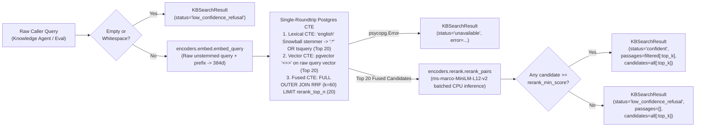

# KB Retrieval Client & Policy Lookup — Technical Design Specification

**Issue**: #4 (`[Phase 1] 1.4: KB Retrieval Client & Policy Lookup`)  
**Branch**: `p-1-4_kb-retrieval-policy`  
**Date**: 2026-09-30  
**Status**: Approved Design  

---

## 1. Objective & Scope

Design the real-time Knowledge Base (KB) hybrid retrieval client and internal policy lookup service that connects the multi-agent runtime (`Knowledge Agent` and `SupportDeps`) and the evaluation harness (`eval/run_questions.py` and `eval/retrieval_metrics.py`) to PostgreSQL (`passages`, `kb_articles`, `snapshots`, and `policies`).

The subsystem must:
1. Execute first-stage hybrid retrieval combining top-20 lexical search (`tsvector` GIN index) and top-20 vector similarity search (`pgvector` 384-d cosine distance using `BAAI/bge-small-en-v1.5`).
2. Fuse candidate rankings via Reciprocal Rank Fusion (RRF with $k = 60$) and cap the fused candidate pool (`rerank_top_n = 20`) for low-latency CPU inference.
3. Rerank fused candidates locally with the pinned cross-encoder (`cross-encoder/ms-marco-MiniLM-L12-v2`).
4. Enforce the confidence threshold (`settings.rerank_min_score`) to separate grounded passages from low-confidence refusals (such as unannounced roadmap features like IPv6-only sites) while preserving unfiltered top candidates and snapshot metadata for evaluation transcripts (`answers.md`) and execution traces.
5. Retrieve and cite the 6 internal governance policies (`POL-CRED`, `POL-CREDIT`, `POL-IDV`, `POL-SEC`, `POL-SEV1`, `POL-SLA`) by normalized identifier.
6. Support both synchronous (`psycopg.Connection`) and non-blocking asynchronous (`psycopg.AsyncConnection` / `AsyncConnectionPool` + `asyncio.to_thread`) execution, degrading gracefully without unhandled exceptions when PostgreSQL is unreachable.

---

## 2. Structural Simplification ("Code Judo" Decisions)

1. **Dedicated `encoders/` Package & Clean `retrieval/` Layout**:
   - Move `kbindex/embed.py` and `retrieval/rerank.py` into a shared **`encoders/`** package (`encoders/embed.py` and `encoders/rerank.py`). Both offline indexing (`kbindex/chunk.py`, `kbindex/store.py`), startup checks (`db/init/startup.py`), and online retrieval (`retrieval/service.py`) depend downward on `encoders/`, eliminating cross-imports between `kbindex/` and `retrieval/` while keeping `core/` free of PyTorch dependencies.
   - Place all retrieval- and policy-specific Pydantic schemas in **`retrieval/models.py`**, keeping `core/models.py` strictly for shared cross-domain models.
   - Consolidate all online KB search, RRF fusion, threshold gating, and policy lookup into **`RetrievalService`** inside **`retrieval/service.py`** rather than splitting across `retrieval/search.py`, `retrieval/threshold.py`, `retrieval/policies.py`, `services/retrieval_service.py`, and `services/policy_service.py`.
   - In `SupportDeps`, eliminate the redundant `policy_store` field; `retrieval: RetrievalService` serves both KB passages and policy documents.
2. **Query-Time PostgreSQL Snowball Stemming on the Lexical Branch Only (Zero Re-Vectorization)**:
   - **Vector Branch Untouched**: `encoders.embed.embed_query` continues to pass the raw, unstemmed query string (with `QUERY_PREFIX`) to `BAAI/bge-small-en-v1.5`. Stored embeddings in `passages.embedding` (`db/seed.dump`) require zero re-vectorization or re-indexing.
   - **Lexical Branch Only**: `passages.search_vector` is stored using PostgreSQL's `'simple'` configuration (unstemmed lowercase tokens) with a `GIN` index that natively supports prefix matching (`:*`). Inside the SQL `lexical` CTE, PostgreSQL's built-in `'english'` Snowball stemmer (`tsvector_to_array(to_tsvector('english', query))`) strips English stopwords and extracts word stems, appending `:*` joined with `|` (`OR`). This matches morphological variants (`rekey:*` matching `rekey`, `rekeying`, `rekeys`; `fail:*` matching `fail`, `fails`, `failed`) and exact technical identifiers (`no_proposal_chosen:*`, `1383:*`, `dtls:*`) against the existing `'simple'` GIN index with zero schema migrations.
   - Using the same native PostgreSQL `'english'` stemmer in `services/ticket_service.py` allows deleting the hardcoded 30-word `_STOPWORDS` set, naive 5-character `tok[:5]` slicer (`_symptom_stems` and `_shares_keywords`), and unused `import re`.
3. **Single-Roundtrip Hybrid SQL Query + Bounded Cross-Encoder Batch**:
   - Lexical top-20 search, vector top-20 search, `FULL OUTER JOIN` RRF score computation, top-20 RRF candidate slicing (`rerank_top_n = 20`), article metadata join (`kb_articles`), and snapshot timestamp lookup (`snapshots.crawled_at`) execute in a single PostgreSQL query with a `MATERIALIZED` `tsquery` CTE. Bounding Cross-Encoder inputs to the top 20 RRF-fused candidates cuts CPU reranking latency in half (~45ms vs ~90ms) without sacrificing top-5 accuracy.
4. **Unified Result Envelopes (`KBSearchResult` and `PolicyLookupResult`)**:
   - Following the `TelemetryToolResult` pattern from ADR-005, both KB search and policy lookup catch `psycopg.Error` and return explicit status envelopes (`"confident"`, `"low_confidence_refusal"`, `"unavailable"`, `"ok"`, `"not_found"`).

---

## 3. End-to-End Data Flow

> **Proportional Effort Flag (80% of Engineering & Quality Surface)**: The single-roundtrip hybrid SQL CTE (materializing the PostgreSQL `'english'` Snowball stem `:*` OR `tsquery` against the `'simple'` GIN index, combining with `pgvector` cosine distance, and bounding RRF candidates) plus non-blocking async CPU model offloading represent 80% of the retrieval accuracy and real-time latency surface.

---

## 4. Component & Type Specifications

### 4.1 Retrieval & Policy Models (`retrieval/models.py`)

1. **`RetrievedPassage` (`BaseModel`)**:
   - **Purpose**: Represents a single scored KB chunk returned by hybrid search and cross-encoder reranking.
   - **Fields**:
     - `passage_id: str` — UUID string of the row in `passages`.
     - `slug: str` — Article slug from `kb_articles.slug`.
     - `title: str` — Article title from `kb_articles.title`.
     - `heading: str` — Section heading from `passages.heading`.
     - `heading_anchor: str` — Section anchor from `passages.heading_anchor`.
     - `public_url: str` — Public documentation URL from `kb_articles.public_url`.
     - `body: str` — Full markdown chunk text from `passages.body`.
     - `site_updated_at: AwareDatetime | None = None` — Last-updated timestamp from `kb_articles.site_updated_at`.
     - `lex_rank: int | None = None` — 1-based rank in lexical top-20 (`None` if absent from lexical top-20).
     - `vec_rank: int | None = None` — 1-based rank in vector top-20 (`None` if absent from vector top-20).
     - `rrf_score: float` — Reciprocal Rank Fusion score ($\sum \frac{1}{60 + \text{rank}}$).
     - `rerank_score: float` — Raw logit score from `cross-encoder/ms-marco-MiniLM-L12-v2`.
   - **Computed Property**:
     - `citation_tag() -> str`: Returns the canonical inline citation format `[kb:{slug}#{heading_anchor}]`.

2. **`KBSearchResult` (`BaseModel`)**:
   - **Purpose**: Self-contained return envelope for `RetrievalService.search_kb` and `RetrievalService.asearch_kb`.
   - **Fields**:
     - `status: Literal["confident", "low_confidence_refusal", "unavailable"]`
     - `query: str` — The input search string.
     - `passages: list[RetrievedPassage]` — Up to `top_k` passages meeting `rerank_score >= min_score`. Always empty when `status != "confident"`.
     - `candidates: list[RetrievedPassage]` — Up to `top_k` reranked candidates prior to threshold filtering, preserved for `answers.md` reporting and `traces.retrieval_scores`.
     - `snapshot_date: AwareDatetime | None = None` — Active KB crawl timestamp (`snapshots.crawled_at`).
     - `error: str | None = None` — Error details when `status == "unavailable"`.

3. **`PolicyDocument` (`BaseModel`)**:
   - **Purpose**: Represents one authoritative internal policy document from the `policies` table.
   - **Fields**:
     - `policy_id: str` — Canonical uppercase policy identifier (`POL-CRED`, `POL-CREDIT`, `POL-IDV`, `POL-SEC`, `POL-SEV1`, `POL-SLA`).
     - `title: str` — Policy title from `policies.title`.
     - `file_path: str` — Relative repository path from `policies.file_path`.
     - `body: str` — Full markdown policy text from `policies.body`.
   - **Computed Property**:
     - `citation_tag() -> str`: Returns the canonical inline policy citation format `[policy:{policy_id}]`.

4. **`PolicyLookupResult` (`BaseModel`)**:
   - **Purpose**: Self-contained return envelope for `get_policy` / `aget_policy` and `list_policies` / `alist_policies`.
   - **Fields**:
     - `status: Literal["ok", "not_found", "unavailable"]`
     - `policy: PolicyDocument | None = None` — Populated for single-policy lookup when `status == "ok"`.
     - `policies: list[PolicyDocument] = []` — Populated for `list_policies()` (or single-element list on `get_policy` when `status == "ok"`).
     - `error: str | None = None` — Error details when `status == "unavailable"`.

---

### 4.2 Real-Time Hybrid Retrieval & Policy Service (`retrieval/service.py`)

1. **`RetrievalService.__init__`**:
   - **Inputs**:
     - `connection: psycopg.Connection[Any] | psycopg.AsyncConnection[Any]` — Active PostgreSQL sync or async connection.
     - `embed_fn: Callable[[str], list[float]] = embed_query` — Query embedding function defaulting to `encoders.embed.embed_query`.
     - `rerank_fn: Callable[[str, list[str]], list[float]] = rerank_pairs` — Cross-encoder scoring function defaulting to `encoders.rerank.rerank_pairs`.
     - `min_score: float = settings.rerank_min_score` — Minimum cross-encoder score required for `"confident"` status.
     - `rrf_k: int = 60` — RRF smoothing constant.
   - **Pure Helpers for Sync/Async Reuse**:
     - `_validate_search_args(query: str, top_k: int, candidate_k: int) -> KBSearchResult | None`: Fast-path guard returning a refusal envelope when `query.strip()` is empty or limits are $\le 0$.
     - `_normalize_policy_id(policy_id: str) -> str`: Strips whitespace, uppercases, and removes any trailing `.MD` suffix.
     - `_score_and_gate_candidates(...) -> KBSearchResult`: Pure function that takes raw DB rows, invokes `rerank_fn`, sorts by `(-rerank_score, -rrf_score, passage_id)`, slices `candidates = ranked[:top_k]`, filters `passages` by `min_score`, and returns `KBSearchResult`.

2. **Synchronous & Asynchronous KB Search (`search_kb` and `asearch_kb`)**:
   - **Signatures**:
     - `search_kb(self, query: str, top_k: int = 5, candidate_k: int = 20, rerank_top_n: int = 20) -> KBSearchResult`
     - `async asearch_kb(self, query: str, top_k: int = 5, candidate_k: int = 20, rerank_top_n: int = 20) -> KBSearchResult`
   - **Real-Time Execution Steps**:
     - **Step 1 (Fast Guard)**: Return immediately via `_validate_search_args` if invalid/empty.
     - **Step 2 (Raw Query Vectorization)**: Compute 384-d vector for the unstemmed `query` via `embed_fn(query)` (offloaded via `await asyncio.to_thread(self._embed_fn, query)` in `asearch_kb`).
     - **Step 3 (Single-Roundtrip Materialized Hybrid SQL CTE)**:
       - `q_tsquery AS MATERIALIZED`: Extracts Snowball stems once via `unnest(tsvector_to_array(to_tsvector('english', %(query)s)))`, strips non-word punctuation, appends `:*`, joins with `' | '`, and casts to `tsquery` (falling back to `plainto_tsquery('simple', %(query)s)` if `to_tsvector('english', %(query)s)` is empty).
       - `lexical`: Uses the `passages_search_vector` GIN index (`WHERE q_tsquery.tsq != ''::tsquery AND p.search_vector @@ q_tsquery.tsq`), ordering matching rows by `ts_rank_cd(p.search_vector, q_tsquery.tsq) DESC, p.id ASC` and limiting to `candidate_k` (20).
       - `vector_search`: Orders by `p.embedding <=> %(embedding)s::vector ASC, p.id ASC` and limits to `candidate_k` (20).
       - `fused`: `FULL OUTER JOIN` of `lexical` and `vector_search` on `id`, computing `rrf_score`, ordered by `rrf_score DESC, id ASC` and capped at `LIMIT %(rerank_top_n)s` (20) so Cross-Encoder CPU inference never scores more than 20 candidates.
       - Final `SELECT`: Joins `fused` with `passages p`, `kb_articles a`, and `LEFT JOIN snapshots s`, returning all metadata and `s.crawled_at` in one roundtrip (with a fallback 1-row `snapshots` lookup if `passages` is empty).
     - **Step 4 (Batched Cross-Encoder Reranking & Threshold Gate)**:
       - Calls `rerank_fn(query, bodies)` (via `await asyncio.to_thread(...)` in `asearch_kb`) and builds `KBSearchResult` via `_score_and_gate_candidates`.
     - **Step 5 (Fault Handling)**: Catches `psycopg.Error`, logs via `logger.error`, rolls back aborted transaction state if active, and returns `KBSearchResult(status="unavailable", query=query, passages=[], candidates=[], error=str(exc))`.

3. **Synchronous & Asynchronous Policy Lookup (`get_policy` / `aget_policy` and `list_policies` / `alist_policies`)**:
   - **Signatures**:
     - `get_policy(self, policy_id: str) -> PolicyLookupResult` and `async aget_policy(self, policy_id: str) -> PolicyLookupResult`
     - `list_policies(self) -> PolicyLookupResult` and `async alist_policies(self) -> PolicyLookupResult`
   - **Execution Steps**:
     - Normalizes `policy_id` via `_normalize_policy_id`. Queries `policies` by `upper(id) = %(policy_id)s` (or `ORDER BY id ASC` for `list_policies`), returning `status="ok"`, `"not_found"`, or `"unavailable"` on `psycopg.Error`.

---

### 4.3 Codebase Cleanup & Refactoring Scope

1. **Step 0 — Post-Implementation Audit (Read Everything Written & Discover Unforeseen Cleanup)**:
   - Before executing the targeted cleanup items below, read every file created or modified during this task (`encoders/`, `retrieval/`, `kbindex/`, `db/init/`, `services/`, `tests/`) end-to-end and audit against `/ponytail` and `/thermo-nuclear-code-quality-review` to identify and remove any newly introduced dead code, unused imports, redundant helpers, or unforeseen simplification opportunities not anticipated in advance.
2. **Create `encoders/` (`encoders/embed.py` and `encoders/rerank.py`)**:
   - Move `kbindex/embed.py` $\rightarrow$ `encoders/embed.py` and `retrieval/rerank.py` $\rightarrow$ `encoders/rerank.py`, updating imports in `kbindex/chunk.py`, `kbindex/store.py`, `db/init/startup.py`, `retrieval/service.py`, and tests.
   - Delete the unused test constants (`BGP_PASSAGE`, `SLA_PASSAGE`, `SMOKE_QUESTION`) from `encoders/embed.py` (moving them into the test file that references them).
   - Replace the per-string Python loop in `embed_passages` with a single batched call `model.encode(texts, prompt="", convert_to_numpy=True, show_progress_bar=False).tolist()`.
   - Guard empty `passages` list in `encoders/rerank.py` (`rerank_pairs` returns `[]` immediately without invoking PyTorch) and pass `batch_size=32, convert_to_numpy=True, show_progress_bar=False` to `CrossEncoder.predict`.
3. **Clean Up `services/ticket_service.py`**:
   - Delete `_STOPWORDS` (lines 15–48), `_symptom_stems` (lines 76–78), `_shares_keywords` (lines 81–84), and the unused `import re` (line 1).
   - Replace Python stem comparison in `TicketService.detect_repeat_contact` with PostgreSQL's native `'english'` Snowball stemmer (`tsvector_to_array(to_tsvector('english', text))`), excluding generic support words (`issu`, `ticket`, `site`, `user`, `pleas`, `still`, `today`) in SQL while preserving all ADR-003 repeat-contact test invariants.

---

## 5. Testing & Verification Strategy

All tests follow the **Functional over Unit Testing** rule against the real PostgreSQL database and local models:

1. **Hybrid Retrieval & Reranking (`tests/services/test_retrieval.py`)**:
   - **Technical KB Queries (Sync & Async)**: Run `search_kb` and `asearch_kb` on representative questions from `data/eval/questions.jsonl` (`Q01` DTLS MTU, `Q05` BGP route limit, `Q10` `NO_PROPOSAL_CHOSEN`, `Q15` Azure rekey) and assert `status == "confident"`, non-empty `passages`, valid `snapshot_date`, positive `rrf_score`, `rerank_score >= settings.rerank_min_score`, and well-formed `citation_tag` (`[kb:<slug>#<anchor>]`).
   - **Stemmed Lexical + Vector RRF Fusion**: Verify that morphological variants in natural-language questions match `'simple'` indexed passages via the Snowball `:*` `tsquery` and accumulate both `lex_rank` and `vec_rank` in `rrf_score`.
   - **Low-Confidence Refusal Gate**: Verify that out-of-coverage roadmap queries (`SC-09` IPv6-only / SRv6 or elevated `min_score`) return `status == "low_confidence_refusal"`, `passages == []`, and non-empty `candidates` for trace/eval logging, plus empty/whitespace query fast-path refusal.
   - **Policy Lookup (Sync & Async)**: Verify `get_policy` / `aget_policy` across all 6 seeded policies (`POL-CRED`, `POL-CREDIT`, `POL-IDV`, `POL-SEC`, `POL-SEV1`, `POL-SLA`), case/extension normalization (`"pol-sla.md"`), unknown policy ID (`status == "not_found"`), and `list_policies()` / `alist_policies()` returning all 6 records.
   - **Database Outage Resilience**: Pass a closed connection to `search_kb`, `asearch_kb`, `get_policy`, and `list_policies` and assert each returns `status == "unavailable"` with `error` populated and raises zero unhandled exceptions.
2. **Ticket Service & Encoders Cleanup Regressions**:
   - Verify all repeat-contact scenarios (`SC-06` Chicago site, `S-1003-01`, `S-1010-02`, free-text `symptom_text` matching) pass with `_STOPWORDS` removed and PostgreSQL `'english'` stemming active.
   - Verify `encoders.embed` and `encoders.rerank` imports pass across `kbindex`, `db.init.startup`, `retrieval`, and tests.