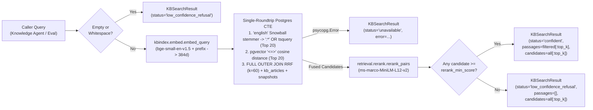

# KB Retrieval Client & Policy Lookup — Technical Design Specification

**Issue**: #4 (`[Phase 1] 1.4: KB Retrieval Client & Policy Lookup`)  
**Branch**: `p-1-4_kb-retrieval-policy`  
**Date**: 2026-09-30  
**Status**: Draft for User Review  

---

## 1. Objective & Scope

Design the online Knowledge Base (KB) hybrid retrieval client and internal policy lookup service that connects the multi-agent runtime (`Knowledge Agent` and `SupportDeps`) and the evaluation harness (`eval/run_questions.py` and `eval/retrieval_metrics.py`) to PostgreSQL (`passages`, `kb_articles`, `snapshots`, and `policies`).

The subsystem must:
1. Execute first-stage hybrid retrieval combining top-20 lexical search (`tsvector` GIN index) and top-20 vector similarity search (`pgvector` 384-d cosine distance using `BAAI/bge-small-en-v1.5`).
2. Fuse candidate rankings via Reciprocal Rank Fusion (RRF with $k = 60$).
3. Rerank fused candidates locally with the pinned cross-encoder (`cross-encoder/ms-marco-MiniLM-L12-v2`).
4. Enforce the confidence threshold (`settings.rerank_min_score`) to separate grounded passages from low-confidence refusals (such as unannounced roadmap features like IPv6-only sites) while preserving unfiltered top candidates and snapshot metadata for evaluation transcripts (`answers.md`) and execution traces.
5. Retrieve and cite the 6 internal governance policies (`POL-CRED`, `POL-CREDIT`, `POL-IDV`, `POL-SEC`, `POL-SEV1`, `POL-SLA`) by normalized identifier.
6. Degrade gracefully without unhandled exceptions when PostgreSQL is unreachable.

---

## 2. Structural Simplification ("Code Judo" Decisions)

1. **Single-Module Consolidation (`retrieval/service.py`)**:
   - Rather than splitting ~100 lines of retrieval and policy query logic across five thin modules (`retrieval/search.py`, `retrieval/threshold.py`, `retrieval/policies.py`, `services/retrieval_service.py`, and `services/policy_service.py`), all online KB search, RRF fusion, threshold gating, and policy lookup reside in a single cohesive class, `RetrievalService`, inside `retrieval/service.py` alongside the existing cross-encoder loader in `retrieval/rerank.py`.
   - `RetrievalService` directly reuses `embed_query` from `kbindex/embed.py` and `rerank_pairs` from `retrieval/rerank.py`.
   - In `SupportDeps`, the separate `policy_store` field is eliminated; `retrieval: RetrievalService` serves both KB passages and policy documents over the same PostgreSQL connection.
2. **Native PostgreSQL Snowball Stemmer (`to_tsvector('english', ...)`) Across Both Retrieval and Ticket Services**:
   - `passages.search_vector` is stored using PostgreSQL's `'simple'` configuration (unstemmed lowercase tokens) with a `GIN` index that natively supports prefix matching (`:*`).
   - Instead of maintaining custom stopword lists or adding external NLP packages, stage-1 lexical search uses PostgreSQL's built-in `'english'` Snowball stemmer (`tsvector_to_array(to_tsvector('english', query))`) to automatically strip English stopwords and extract word stems, appending the `:*` prefix operator joined with `|` (`OR`). This allows natural-language questions to match morphological variants (such as `rekey:*` matching `rekey`, `rekeying`, `rekeys`, and `fail:*` matching `fail`, `fails`, `failed`) as well as exact technical identifiers (`no_proposal_chosen:*`, `1383:*`, `dtls:*`) in the existing `'simple'` GIN index.
   - Using the same native PostgreSQL `'english'` stemmer in `services/ticket_service.py` allows us to delete the hand-rolled 30-word `_STOPWORDS` set and naive 5-character `tok[:5]` slicer (`_symptom_stems` and `_shares_keywords`).
3. **Single-Roundtrip Hybrid SQL Query**:
   - Lexical top-20 search, vector top-20 search, `FULL OUTER JOIN` RRF score computation, article metadata join (`kb_articles`), and snapshot timestamp lookup (`snapshots.crawled_at`) execute in a single PostgreSQL query with Common Table Expressions (CTEs), eliminating multiple sequential DB roundtrips and Python-side join dictionaries.
4. **Unified Result Envelopes (`KBSearchResult` and `PolicyLookupResult`)**:
   - Following the `TelemetryToolResult` pattern from ADR-005, both KB search and policy lookup catch `psycopg.Error` and return explicit status envelopes (`"confident"`, `"low_confidence_refusal"`, `"unavailable"`, `"ok"`, `"not_found"`) rather than forcing callers to coordinate exception handlers and secondary metadata queries.

---

## 3. End-to-End Data Flow

> **Proportional Effort Flag (80% of Engineering & Quality Surface)**: The single-roundtrip hybrid SQL CTE (bridging PostgreSQL `'english'` Snowball stems with `'simple'` prefix `tsquery` matching, `pgvector` cosine distance ordering, and RRF tie-breaking) together with cross-encoder threshold calibration represent 80% of the retrieval accuracy and edge-case surface.

---

## 4. Component & Type Specifications

### 4.1 Domain Models (`core/models.py`)

1. **`RetrievedPassage` (extends `Citation`)**:
   - **Purpose**: Represents a single scored KB chunk returned by hybrid search and cross-encoder reranking.
   - **Fields**:
     - `passage_id: str` — UUID string of the row in `passages`.
     - `slug: str` — Article slug from `kb_articles.slug`.
     - `title: str` — Article title from `kb_articles.title`.
     - `heading: str` — Section heading from `passages.heading`.
     - `heading_anchor: str` — Section anchor from `passages.heading_anchor`.
     - `public_url: str` — Public documentation URL from `kb_articles.public_url`.
     - `body: str` — Full markdown chunk text from `passages.body`.
     - `site_updated_at: AwareDatetime | None = None` — Last-updated timestamp from `kb_articles.site_updated_at`.
     - `lex_rank: int | None = None` — 1-based rank in lexical top-20 (`None` if absent from lexical top-20).
     - `vec_rank: int | None = None` — 1-based rank in vector top-20 (`None` if absent from vector top-20).
     - `rrf_score: float` — Reciprocal Rank Fusion score ($\sum \frac{1}{60 + \text{rank}}$).
     - `rerank_score: float` — Raw logit score from `cross-encoder/ms-marco-MiniLM-L12-v2`.
   - **Computed Property**:
     - `citation_tag() -> str`: Returns the canonical inline citation format `[kb:{slug}#{heading_anchor}]`.

2. **`KBSearchResult` (`BaseModel`)**:
   - **Purpose**: Self-contained return envelope for `RetrievalService.search_kb`.
   - **Fields**:
     - `status: Literal["confident", "low_confidence_refusal", "unavailable"]`
     - `query: str` — The input search string.
     - `passages: list[RetrievedPassage]` — Up to `top_k` passages meeting `rerank_score >= min_score`. Always empty when `status != "confident"`.
     - `candidates: list[RetrievedPassage]` — Up to `top_k` reranked candidates prior to threshold filtering, preserved for `answers.md` reporting and `traces.retrieval_scores`.
     - `snapshot_date: AwareDatetime | None = None` — Active KB crawl timestamp (`snapshots.crawled_at`).
     - `error: str | None = None` — Error details when `status == "unavailable"`.

3. **`PolicyDocument` (`BaseModel`)**:
   - **Purpose**: Represents one authoritative internal policy document from the `policies` table.
   - **Fields**:
     - `policy_id: str` — Canonical uppercase policy identifier (`POL-CRED`, `POL-CREDIT`, `POL-IDV`, `POL-SEC`, `POL-SEV1`, `POL-SLA`).
     - `title: str` — Policy title from `policies.title`.
     - `file_path: str` — Relative repository path from `policies.file_path`.
     - `body: str` — Full markdown policy text from `policies.body`.
   - **Computed Property**:
     - `citation_tag() -> str`: Returns the canonical inline policy citation format `[policy:{policy_id}]`.

4. **`PolicyLookupResult` (`BaseModel`)**:
   - **Purpose**: Self-contained return envelope for `RetrievalService.get_policy` and `RetrievalService.list_policies`.
   - **Fields**:
     - `status: Literal["ok", "not_found", "unavailable"]`
     - `policy: PolicyDocument | None = None` — Populated for single-policy lookup when `status == "ok"`.
     - `policies: list[PolicyDocument] = []` — Populated for `list_policies()` (or single-element list on `get_policy` when `status == "ok"`).
     - `error: str | None = None` — Error details when `status == "unavailable"`.

---

### 4.2 Online Retrieval & Policy Service (`retrieval/service.py`)

1. **`RetrievalService.__init__`**:
   - **Inputs**:
     - `connection: psycopg.Connection[Any]` — Active PostgreSQL connection.
     - `embed_fn: Callable[[str], list[float]] = embed_query` — Query embedding function defaulting to `kbindex.embed.embed_query`.
     - `rerank_fn: Callable[[str, list[str]], list[float]] = rerank_pairs` — Cross-encoder scoring function defaulting to `retrieval.rerank.rerank_pairs`.
     - `min_score: float = settings.rerank_min_score` — Minimum cross-encoder score required for `"confident"` status.
     - `rrf_k: int = 60` — RRF smoothing constant.
   - **Behavior**: Stores dependencies on the instance without executing I/O at construction time.

2. **`RetrievalService.search_kb`**:
   - **Signature**: `search_kb(self, query: str, top_k: int = 5, candidate_k: int = 20) -> KBSearchResult`
   - **Execution Steps**:
     - **Step 1 (Guard Clause)**: If `not query.strip()` or `top_k <= 0` or `candidate_k <= 0`, return `KBSearchResult(status="low_confidence_refusal", query=query, passages=[], candidates=[])`.
     - **Step 2 (Query Embedding)**: Call `self._embed_fn(query)` to compute the 384-float query vector prefixed with `QUERY_PREFIX`.
     - **Step 3 (Single-Roundtrip Hybrid SQL CTE)**:
       - `q_tsquery` CTE: Extracts Snowball stems via `unnest(tsvector_to_array(to_tsvector('english', %(query)s)))`, sanitizes each token to alphanumeric/underscore/hyphen characters, appends `:*`, joins with `' | '`, and casts to `tsquery` (falling back to `plainto_tsquery('simple', %(query)s)` when `to_tsvector('english', %(query)s)` is empty).
       - `lexical` CTE: Selects `id` and `row_number() OVER (ORDER BY ts_rank_cd(search_vector, q_tsquery.tsq) DESC, id ASC) AS lex_rank` from `passages, q_tsquery` where `q_tsquery.tsq != ''::tsquery` and `search_vector @@ q_tsquery.tsq`, limited to `candidate_k`.
       - `vector_search` CTE: Selects `id` and `row_number() OVER (ORDER BY embedding <=> %(embedding)s::vector ASC, id ASC) AS vec_rank` from `passages` where `embedding IS NOT NULL`, limited to `candidate_k`.
       - `fused` CTE: Performs a `FULL OUTER JOIN` of `lexical` and `vector_search` on `id`, computing `coalesce(1.0 / (%(rrf_k)s + lex_rank), 0.0) + coalesce(1.0 / (%(rrf_k)s + vec_rank), 0.0) AS rrf_score`.
       - Final `SELECT`: Joins `fused` with `passages p` on `p.id = fused.id`, `kb_articles a` on `a.slug = p.article_slug`, and `LEFT JOIN snapshots s` on `s.id = a.snapshot_id`, ordered by `fused.rrf_score DESC, p.id ASC`. If `fused` returns zero rows (e.g., empty `passages` table), queries `SELECT crawled_at FROM snapshots ORDER BY crawled_at DESC LIMIT 1` so `snapshot_date` is still populated.
     - **Step 4 (Cross-Encoder Reranking & Threshold Gate)**:
       - Calls `self._rerank_fn(query, [row_body for each fused row])` to score all fused candidates in a single batch.
       - Builds `RetrievedPassage` objects sorted by `(-rerank_score, -rrf_score, passage_id)`.
       - Slices `candidates = ranked[:top_k]` and filters `passages = [c for c in candidates if c.rerank_score >= self._min_score]`.
       - Sets `status = "confident"` if `passages` is non-empty, else `"low_confidence_refusal"`.
     - **Step 5 (Fault Handling)**: Catches `psycopg.Error`, logs the failure via `logger.error`, rolls back any aborted transaction state on the connection if needed, and returns `KBSearchResult(status="unavailable", query=query, passages=[], candidates=[], error=str(exc))`.

3. **`RetrievalService.get_policy`**:
   - **Signature**: `get_policy(self, policy_id: str) -> PolicyLookupResult`
   - **Execution Steps**:
     - Normalizes `policy_id` by stripping whitespace, converting to uppercase, and stripping any trailing `.MD` suffix (so `"pol-credit"`, `"POL-CREDIT"`, and `"POL-CREDIT.md"` all resolve to `"POL-CREDIT"`). If empty, returns `PolicyLookupResult(status="not_found")`.
     - Queries `SELECT id, title, file_path, body FROM policies WHERE upper(id) = %(policy_id)s LIMIT 1`.
     - Returns `PolicyLookupResult(status="ok", policy=doc, policies=[doc])` if found, `PolicyLookupResult(status="not_found")` if absent, or `PolicyLookupResult(status="unavailable", error=str(exc))` on `psycopg.Error`.

4. **`RetrievalService.list_policies`**:
   - **Signature**: `list_policies(self) -> PolicyLookupResult`
   - **Execution Steps**:
     - Queries `SELECT id, title, file_path, body FROM policies ORDER BY id ASC`.
     - Returns `PolicyLookupResult(status="ok", policies=docs)` (or `status="unavailable"` on `psycopg.Error`).

---

### 4.3 Repeat-Contact Stemmer Cleanup (`services/ticket_service.py`)

- **Removal**: Delete `_STOPWORDS`, `_symptom_stems`, and `_shares_keywords` from `services/ticket_service.py`.
- **Replacement**: Replace Python keyword stem matching in `TicketService.detect_repeat_contact` (and helper `_matches_area_or_symptom`) with PostgreSQL's native `'english'` Snowball stemmer (`tsvector_to_array(to_tsvector('english', text))`), filtering for stemmed lexemes of length $\ge 4$ (excluding generic support nouns `issu`, `ticket`, `site`, `user`, `pleas`, `still`, `today` via SQL array subtraction) and checking whether two texts share $\ge 2$ stems. This keeps all text normalization inside PostgreSQL's native C dictionary while preserving 100% of the ADR-003 repeat-contact invariants (`SC-06` Chicago site flagged as repeat; `S-1003-01` and `S-1010-02` unrelated dual-open tickets not falsely flagged).

---

## 5. Testing & Verification Strategy

All tests follow the **Functional over Unit Testing** rule against the real PostgreSQL database and local models:

1. **Hybrid Retrieval & Reranking (`tests/services/test_retrieval.py`)**:
   - **Technical KB Queries**: Run `search_kb` on representative questions from `data/eval/questions.jsonl` (e.g., `Q01` DTLS MTU, `Q05` BGP route limit, `Q10` `NO_PROPOSAL_CHOSEN`, `Q15` Azure rekey) and assert `status == "confident"`, non-empty `passages`, valid `snapshot_date`, positive `rrf_score`, `rerank_score >= settings.rerank_min_score`, and well-formed `citation_tag` (`[kb:<slug>#<anchor>]`).
   - **Lexical + Vector Fusion Verification**: Verify that candidates matched by both lexical and vector search accumulate both rank contributions in `rrf_score` and populate `lex_rank` and `vec_rank`.
   - **Low-Confidence Refusal Gate**: Verify that out-of-coverage queries (e.g., `SC-09` unreleased roadmap query or high threshold `min_score`) return `status == "low_confidence_refusal"`, `passages == []`, and non-empty `candidates` for trace/eval logging, plus empty/whitespace query handling.
   - **Policy Lookup**: Verify `get_policy` across all 6 seeded policies (`POL-CRED`, `POL-CREDIT`, `POL-IDV`, `POL-SEC`, `POL-SEV1`, `POL-SLA`), case/extension normalization (`"pol-sla.md"`), unknown policy ID (`status == "not_found"`), and `list_policies()` returning all 6 records.
   - **Database Outage Resilience**: Pass a closed `psycopg.Connection` to `search_kb`, `get_policy`, and `list_policies` and assert each returns `status == "unavailable"` with `error` populated and raises zero unhandled exceptions.
2. **Ticket Service Regression (`tests/services/test_ticket_service.py`)**:
   - Verify all existing repeat-contact scenarios (`SC-06` Chicago site, `S-1003-01`, `S-1010-02`, free-text `symptom_text` matching) pass with `_STOPWORDS` removed and PostgreSQL `'english'` stemming active.

---

## 6. Cleanup & Documentation Maintenance

1. Ensure no unused files (`retrieval/search.py`, `retrieval/threshold.py`, `retrieval/policies.py`, `services/retrieval_service.py`, `services/policy_service.py`) or dead imports remain.
2. Delete `_STOPWORDS`, `_symptom_stems`, and `_shares_keywords` from `services/ticket_service.py`.
3. Update `docs/architecture/system-architecture-design.md` (§4.1, §4.2, §7, §12, §13) and `docs/overview/decisions.md` (ADR-006) so documentation reflects the single-module `retrieval/service.py` layout, native PostgreSQL Snowball stemmer query construction, and `KBSearchResult` / `PolicyLookupResult` contracts.
