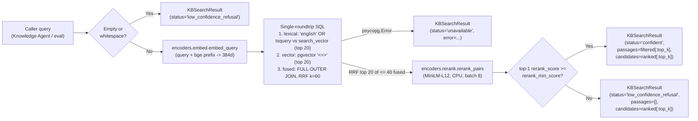

# KB Retrieval Client & Policy Lookup — Technical Design Specification

**Issue**: #4 (`[Phase 1] 1.4: KB Retrieval Client & Policy Lookup`)  
**Branch**: `p-1-4_kb-retrieval-policy`  
**Date**: 2026-09-30  
**Status**: Approved — split into plans `01`–`04` in this folder

---

## 1. Objective & Scope

Build the real-time KB hybrid retrieval client and internal policy lookup used by the Knowledge Agent and the eval harness, backed by PostgreSQL (`passages`, `kb_articles`, `snapshots`, `policies`).

The subsystem must:
1. Run first-stage hybrid retrieval: top-20 lexical (`tsvector` GIN, English Snowball stemming) + top-20 vector (`pgvector` 384-d cosine, `BAAI/bge-small-en-v1.5`).
2. Fuse both rankings with Reciprocal Rank Fusion ($k = 60$).
3. Rerank the top 20 fused candidates by RRF score with the pinned cross-encoder `cross-encoder/ms-marco-MiniLM-L12-v2` (see §2.8).
4. Gate on a **calibrated** confidence threshold (`settings.rerank_min_score`) to refuse off-domain questions, while keeping ungated top candidates and snapshot date for `answers.md` and traces. Partially covered questions (SC-09 IPv6 roadmap) pass the gate; refusing their uncovered part is the agent's grounding duty (§4.3).
5. Serve and cite the 6 internal policies (`POL-CRED`, `POL-CREDIT`, `POL-IDV`, `POL-SEC`, `POL-SEV1`, `POL-SLA`) by normalized id.
6. Degrade gracefully mid-conversation: KB search returns an `unavailable` envelope on `psycopg.Error`; policy lookup keeps working (in memory).
7. Standardize text normalization: KB lexical search and ticket repeat-contact matching both use PostgreSQL's `'english'` Snowball stemmer + stopwords instead of hand-rolled lists.

Out of scope: async API (callers wrap at the tool boundary), metadata filtering by `site_updated_at`, ANN vector index.

---

## 2. Structural Decisions

1. **`encoders/` package**: move `kbindex/embed.py` → `encoders/embed.py` and `retrieval/rerank.py` → `encoders/rerank.py`. `kbindex/`, `db/init/` and `retrieval/` all depend downward on `encoders/`; no `kbindex` ↔ `retrieval` cross-imports; `core/` stays free of PyTorch.
2. **One service, one models module**: all KB search, RRF, gating and policy lookup live in `RetrievalService` (`retrieval/service.py`); its Pydantic models live in `retrieval/models.py`. `core/models.py` keeps only cross-domain models; its unused `Citation` model is deleted — `RetrievedPassage` is the KB citation model. When `SupportDeps` is introduced, it holds one `retrieval: RetrievalService` field (no separate `policy_store`).
3. **Sync-only API**: the codebase has no async code; every service takes `psycopg.Connection[Any]`. One sync method per operation. An async agent runtime wraps calls at the tool boundary with `asyncio.to_thread`. Halves method count and test surface vs. a sync+async pair.
4. **English stemming on the stored lexical column**: a new migration changes the `passages.search_vector` generated column from `to_tsvector('simple', body)` to `to_tsvector('english', body)`; the query `tsquery` is built from the same `'english'` config.
   - **Why not keep `'simple'` + stem-prefix (`stem:*`)**: verified on the live DB that Snowball stems are not always prefixes of the surface word — `policy`→`polici`, `priority`→`prioriti`, `proxy`→`proxi` each fail to match themselves against the `'simple'` index. Stemming both sides with one config removes that failure class.
   - **Zero re-embedding**: only a generated column changes; `passages.embedding` is untouched.
   - **Identifier tokenization**: the default parser splits on `_`, so `NO_PROPOSAL_CHOSEN` becomes `propos | chosen` (`no` is a stopword). Numbers such as `1383` survive as lexemes. Vector search covers the exact-string intent.
5. **Single-roundtrip hybrid SQL**: lexical top-20, vector top-20, `FULL OUTER JOIN` RRF, and the `kb_articles` metadata join run in one query.
6. **Pinned data read once**: the 6 policies and the snapshot `crawled_at` are immutable for a given `seed.dump`, so `RetrievalService.__init__` loads them once. No per-call policy DB roundtrip, no per-row `snapshots` join, no empty-result snapshot fallback.
7. **Result envelope for KB search only**: `KBSearchResult` follows the `TelemetryToolResult` pattern (ADR-005) with explicit status. Policy lookup cannot fail at runtime, so it returns plain values.
8. **Rerank depth 20, batch size 8 (realtime budget)**: measured on this machine (CPU, under load, median of 5): cross-encoder over 40 pairs ≈ 2.0 s, over the RRF top-20 ≈ 0.9 s; `batch_size=8` beats 32 (less padding: 40 pairs 2.0 s vs 3.4 s). Vector scan over 14,109 rows ≈ 25 ms, query embedding ≈ 30 ms. The reranker is the whole latency budget, so `search_kb` reranks only the RRF top `_RERANK_K = 20`. Calibration (§4.3) reports p50/p95 to confirm.

---

## 3. End-to-End Data Flow

> **Proportional effort flag**: ~80% of the accuracy surface is (a) the hybrid SQL query and (b) threshold calibration (§4.3). Everything else is plumbing.

---

## 4. Component & Type Specifications

### 4.1 Models (`retrieval/models.py`)

1. **`RetrievedPassage` (`BaseModel`, frozen)** — one scored KB chunk.
   - `passage_id: str` — `passages.id` UUID as string.
   - `slug: str`, `title: str`, `public_url: str`, `site_updated_at: AwareDatetime | None` — from `kb_articles`.
   - `heading: str`, `heading_anchor: str`, `body: str` — from `passages`.
   - `lex_rank: int | None`, `vec_rank: int | None` — 1-based rank in each branch; `None` when absent from that branch's top-20.
   - `rrf_score: float` — $\sum \frac{1}{60 + \text{rank}}$ over present branches.
   - `rerank_score: float` — raw cross-encoder logit.
   - `citation_tag() -> str` — returns `[kb:{slug}#{heading_anchor}]`.
2. **`KBSearchResult` (`BaseModel`, frozen)** — return envelope of `search_kb`.
   - `status: KBSearchStatus` — `StrEnum` with `CONFIDENT`, `LOW_CONFIDENCE_REFUSAL`, `UNAVAILABLE`; mirrors `TelemetryStatus` on the sibling tools envelope.
   - `query: str`.
   - `passages: list[RetrievedPassage]` — up to `top_k` with `rerank_score >= min_score`; empty unless `confident`.
   - `candidates: list[RetrievedPassage]` — up to `top_k` reranked candidates before gating, for `answers.md` and `traces.retrieval_scores`.
   - `snapshot_date: AwareDatetime | None` — pinned `snapshots.crawled_at`.
   - `error: str | None` — set only when `unavailable`.
3. **`PolicyDocument` (`BaseModel`, frozen)** — one internal policy.
   - `policy_id: str` (canonical uppercase), `title: str`, `file_path: str`, `body: str` — from `policies`.
   - `citation_tag() -> str` — returns `[policy:{policy_id}]`.

### 4.2 `RetrievalService` (`retrieval/service.py`)

1. **`__init__(connection: psycopg.Connection[Any], min_score: float = settings.rerank_min_score) -> None`**
   - Loads all rows of `policies` into an immutable mapping keyed by canonical id, and the single `snapshots.crawled_at`.
   - RRF $k = 60$ and branch depth 20 are module constants `_RRF_K`, `_CANDIDATE_K` (fixed by spec, never tuned per call). `search_kb` calls `encoders.embed.embed_query` and `encoders.rerank.rerank_pairs` directly; no injected model callables (every test runs the real models).
   - A `psycopg.Error` here propagates: startup already requires the DB (`db.init.startup`), so failing fast at construction is correct.
2. **Private helpers**
   - `_normalize_policy_id(policy_id: str) -> str` — strip, uppercase, drop trailing `.MD`.
   - `_rank_and_gate(query: str, rows: list[_FusedRow], scores: list[float], top_k: int) -> KBSearchResult` — pure: attach scores, sort by `(-rerank_score, -rrf_score, passage_id)`, slice `candidates`, filter `passages` by `min_score`, choose status. `_FusedRow` is a frozen internal model for one SQL row.
3. **`search_kb(query: str, top_k: int = 5) -> KBSearchResult`**
   - **Guard**: `top_k <= 0` raises `ValueError` (caller bug). Empty/whitespace query returns `low_confidence_refusal` with no DB/model work.
   - **Embed**: `embed_query(query)` on the raw query (bge prefix added inside `embed_query`).
   - **Hybrid SQL (one roundtrip)**:
     - `q` CTE (`MATERIALIZED`): `tsquery` built by `string_agg(quote_literal(lexeme), ' | ')::tsquery` over `unnest(tsvector_to_array(to_tsvector('english', query)))`. The plain `::tsquery` cast keeps the already-stemmed lexemes as-is (`to_tsquery('english', …)` would stem them a second time). Empty lexeme set → `NULL` tsquery → lexical branch returns no rows; vector branch still runs. Verified on the live DB.
     - `lexical`: `search_vector @@ q.tsq`, order `ts_rank_cd(search_vector, q.tsq) DESC, id ASC`, limit `_CANDIDATE_K`, with `row_number()` as `lex_rank`.
     - `vector_search`: order `embedding <=> query_vector ASC, id ASC`, limit `_CANDIDATE_K`, with `row_number()` as `vec_rank`.
     - `fused`: `FULL OUTER JOIN` on `id`, `rrf_score = coalesce(1/(_RRF_K+lex_rank),0) + coalesce(1/(_RRF_K+vec_rank),0)`.
     - Final select joins `passages` and `kb_articles` for metadata, orders by `rrf_score DESC, id ASC`, limit `_RERANK_K` (20).
   - **Rerank**: `rerank_pairs(query, [row.body for row in rows])` over the (at most 20) returned rows, then `_rank_and_gate`.
   - **Fault handling**: catch `psycopg.Error`, `logger.error`, `connection.rollback()` (the connection is shared with `TicketService`, so an aborted transaction must not leak), return `unavailable` with `error=str(exc)`.
4. **`get_policy(policy_id: str) -> PolicyDocument | None`** — dict lookup after `_normalize_policy_id`.
5. **`list_policies() -> list[PolicyDocument]`** — all policies ordered by id.

### 4.3 Threshold Calibration (`eval/calibrate_threshold.py`)

Retrieval-only; no agent required. Runs as soon as `search_kb` exists.

**Scope of the gate (revised after measurement)**: the rerank gate refuses **off-domain** queries — nothing in the KB is relevant. It cannot refuse **partially covered** queries such as SC-09: a pre-implementation probe (vector top-20 + rerank on the current DB) scored SC-09's opening message at top-1 **4.24** (`cato-clients`, IPv6 content exists) and "Cato roadmap for AI features" at **5.0** (`using-the-roadmap-tracker`), while 7 of the 35 answerable questions scored below 4.24. A threshold refusing SC-09 would refuse ~8/35 answerable questions. SC-09's own expectation allows citing what the KB says about IPv6 today; declining roadmap *dates* is a grounding duty of the Knowledge Agent (no retrieved passage states a date), tested with the agent, not here. Off-domain queries separate cleanly (e.g. a sports question scored −4.1).

1. **Inputs**
   - Answerable set: the 35 questions in `data/eval/questions.jsonl` (the report lists each top-1 slug so any off-target retrieval is visible).
   - Off-domain set: new fixture `data/eval/out_of_coverage.jsonl` — 10 hand-written questions with no KB coverage (unrelated vendors' products, consumer IT, off-topic general knowledge, commercial pricing/discount questions).
   - Partial-coverage probes (reported, **not** used to pick the threshold): SC-09's opening message read from `data/eval/scenarios.jsonl`, plus the roadmap question.
2. **Process**: build `RetrievalService` with `min_score = -inf` so nothing is gated; record per query the top-1 `rerank_score`, top-1 slug, and `search_kb` wall-clock latency.
3. **Output**: `docs/eval/threshold_calibration.md` — per-query table for all three sets, score ranges, chosen threshold, count of answerable questions it refuses, p50/p95 latency.
4. **Decision rule** (answerable vs off-domain only): if the sets separate, threshold = midpoint of the gap. If they overlap, pick the lowest threshold that refuses every off-domain query and report how many answerable questions it refuses.
5. **Apply**: set the `rerank_min_score` default in `core/config.py` to the chosen value and record the rationale (including the SC-09 finding) in the retrieval ADR (ADR-007) in `docs/overview/decisions.md`.

### 4.4 Schema & Seed Change

1. **Migration runner**: `db.init.seed.apply_schema` runs every `db/migrations/*.sql` in filename order (today it hardcodes the one file). Every migration stays idempotent because startup re-applies all of them after each `pg_restore`.
2. **New migration** `db/migrations/20260930_1200-english-search-vector.sql`: a `DO` block that runs `ALTER TABLE passages ALTER COLUMN search_vector SET EXPRESSION AS (to_tsvector('english', body))` only while the stored expression (`pg_get_expr` on `pg_attrdef`) still contains `'simple'`. PG 18 (compose image `pgvector/pgvector:0.8.6-pg18`, live server 18.6) supports `SET EXPRESSION`; the table rewrite rebuilds `passages_search_vector` itself. 14,109 passages rewrite in well under a second, once. `20260929_1500_kb-schema.sql` is untouched.
3. **Regenerate `db/seed.dump`** without re-crawling or re-embedding: restore the current dump, run `apply_schema`, then `db.init.build.write_dump`.

### 4.5 `TicketService` Text Normalization (`core/stopwords.py`, `services/ticket_service.py`)

Replace the hand-rolled tokenizer with the same standard pipeline as KB search.
1. **Exclusion stems**, three layers:
   - PostgreSQL `'english'` stopwords (applied by `to_tsvector` itself).
   - `ENGLISH_STOP_WORDS`: the 318-word general English list from scikit-learn (Glasgow IR group list), **copied as data** — no scikit-learn dependency, no import cost. Source cited in a module comment.
   - `SUPPORT_NOISE_WORDS`: `ticket`, `issue`, `user`, `site`, `cato`, `today`, `week`, `minutes`, `fine`, `say` — support-process words found high in `ts_stat` over the 54 seeded tickets, documented as domain-specific. No published support-ticket stopword list exists; corpus-derived lists are the standard method, and 54 tickets are too few to derive one automatically.
   - **Location**: new `core/stopwords.py` — pure data, no DB, no imports. Holds `ENGLISH_STOP_WORDS`, `SUPPORT_NOISE_WORDS` and `EXCLUDED_WORDS: frozenset[str]` (their union). Cross-domain vocabulary, not ticket logic, so it sits beside `core/config.py`.
   - Exclusion runs inside PostgreSQL with `ts_delete`, using the same `'english'` stemmer on every call, so it always matches the stemmer's output. No constructor query, no cached stems.
2. **`_stem_texts(texts: list[str]) -> list[frozenset[str]]`** — one SQL roundtrip: `tsvector_to_array(ts_delete(to_tsvector('english', t), tsvector_to_array(to_tsvector('english', %(excluded)s))))` over `unnest(%(texts)s::text[]) with ordinality`, ordered by ordinality; `excluded` is the space-joined `EXCLUDED_WORDS`. Verified on the live DB (~2 ms; empty text → empty array).
3. **`detect_repeat_contact`**: after `get_ticket_history`, one `_stem_texts` call over every candidate's `subject + body` plus `symptom_text`; `_matches_area_or_symptom` receives precomputed stem sets. The rule is unchanged: two or more shared stems means a keyword match, via `_shares_stems(a: frozenset[str], b: frozenset[str]) -> bool`.
4. **Delete**: `import re`, `_STOPWORDS`, `_symptom_stems`, `_shares_keywords`.
5. **Behavior note**: the old code ignored tokens under 5 characters; short technical stems (`vpn`, `bgp`, `dns`) now count. The ADR-003 repeat-contact tests are the acceptance gate.

### 4.6 `encoders/` Changes

1. Move files (§2.1); update imports in `kbindex/chunk.py`, `kbindex/store.py`, `db/init/startup.py`, and tests.
2. Move test constants `BGP_PASSAGE`, `SLA_PASSAGE`, `SMOKE_QUESTION` from `encoders/embed.py` into `tests/kbindex/test_embed_and_rerank_prefer_the_relevant_passage.py`.
3. `embed_passages`: replace the per-string loop with one batched `model.encode(texts, ...)` call (no empty-input branch; no caller passes `[]`). Risk: batch padding can shift floats slightly; the exact-equality assertions in the embed test are the check.
4. `rerank_pairs`: pass `batch_size=8` (§2.8), `convert_to_numpy=True`, `show_progress_bar=False`.
5. `probe_width`: typed as `probe_width(embed: Callable[[list[str]], list[list[float]]] = embed_passages) -> int`, returning the length of the first vector. Drops the `Any` + `hasattr` duck-typing; the only runtime caller (`db/init/startup.py`) already passes that callable type. The test line passing a raw `SentenceTransformer` goes.

---

## 5. Testing & Verification

Functional tests against the real seeded PostgreSQL and local models. New retrieval tests live in `tests/retrieval/`.

1. **KB search (`tests/retrieval/test_search_kb.py`)**
   - Q01 (DTLS MTU), Q05 (BGP route limit), Q10 (`NO_PROPOSAL_CHOSEN`), Q15 (Azure rekey): `confident`, non-empty `passages`, `snapshot_date` set, `rrf_score > 0`, `rerank_score >= min_score`, `citation_tag` matches `[kb:<slug>#<anchor>]`.
   - Stemming: a question using a -y word (`policy` / `priority`) and an inflected form (`rekeying`, `failed`) gets `lex_rank` hits — locks in the §2.4 fix.
   - Refusal: every off-domain fixture question returns `low_confidence_refusal`, `passages == []`, non-empty `candidates`, using the calibrated threshold; the four answerable questions above stay `confident`. Empty/whitespace query refuses; `top_k=0` raises `ValueError`.
   - Outage: after `connection.close()`, `search_kb` returns `unavailable` with `error` set and raises nothing. A query cancelled by `statement_timeout` returns `unavailable` and leaves the shared connection usable.
2. **Policy lookup (`tests/retrieval/test_policy_lookup.py`)**: all 6 ids resolve; `"pol-sla.md"` normalizes to `POL-SLA`; unknown id returns `None`; `list_policies()` returns 6; lookups still succeed after `connection.close()`.
3. **Ticket regressions (`tests/services/`)**: all ADR-003 repeat-contact scenarios (SC-06 Chicago site, `S-1003-01`, `S-1010-02`, free-text `symptom_text`) pass. New case: two tickets sharing only noise words (`please`, `issue`, `today`, `site`) are not a repeat.
4. **Schema (`tests/db/test_init.py`)**: after restoring `seed.dump` the `search_vector` expression uses `'english'`; `apply_schema` run twice is a no-op.
5. **Encoders**: existing `tests/kbindex/` embed/rerank/startup tests pass on the new `encoders.*` imports.

---

## 6. Cleanup (final step)

1. Read every file created or modified (`encoders/`, `retrieval/`, `kbindex/`, `db/`, `core/`, `services/`, `eval/`, `tests/`) end-to-end; audit with `/ponytail` and `/thermo-nuclear-code-quality-review`.
2. Confirm deleted: `kbindex/embed.py`, `retrieval/rerank.py`, `_STOPWORDS`, `_symptom_stems`, `_shares_keywords`, `import re` in `ticket_service.py`.
3. Grep: no `'simple'` tsvector reference outside `20260929_1500_kb-schema.sql` and the guard in the new migration; no `kbindex.embed` / `retrieval.rerank` imports.
4. Pyright `standard` and ruff clean; every function fully typed; no unused imports or helpers.
5. Update `README.md` / architecture docs where they name the moved modules or the `'simple'` lexical config.

---

## 7. Unresolved Questions

None.

---

## 8. Follow-ups (outside this feature)

1. **Model warm-up**: `search_kb` loads the embedder and reranker lazily on first call (a delay of a few seconds). The future app entrypoint (agent runtime / UI startup) must call `encoders.embed.load_embedder()` and `encoders.rerank.load_reranker()` at boot.
