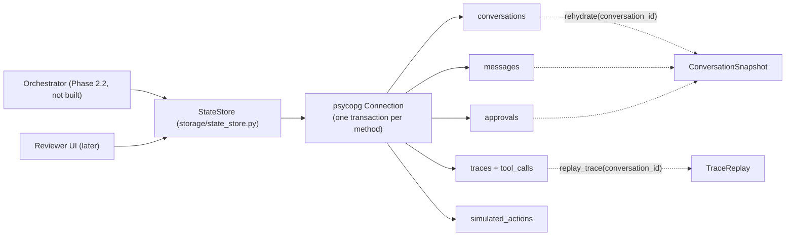

# Phase 2.1: Persistent State Machine & Trace Store (Postgres) — Design Specification

**Issue**: `#6` ([Phase 2] 2.1: Persistent State Machine & Trace Store (Postgres))
**Date**: 2026-10-01
**Status**: Draft for Review
**Target Files**: `db/migrations/20261001_0900_agent-runtime.sql`, `storage/__init__.py`, `storage/models.py`, `storage/state_store.py`, `db/init/build.py`, `agents/models.py`, `services/models.py`, `tests/storage/*`

---

## 1. Objective & Scope

Persistence layer for the Phase 2 orchestrator: Postgres tables plus one sync data-access class (`StateStore`) for conversations, messages, agent execution traces, tool logs and pending approvals. Two hard requirements from the issue:
1. **Survives restart**: every piece of state the orchestrator needs to continue a conversation or resume after an approval lives in Postgres. A new process with a new connection rehydrates from `conversation_id` alone; nothing is cached in memory as source of truth.
2. **Trace replay**: every agent invocation, tool call, retrieval score, latency and token cost is recorded keyed by `conversation_id`; the full conversation graph (turns, agent steps, tool calls, approvals, outgoing replies) is reconstructable from trace rows alone.

`StateStore` is a **pure persistence boundary**: no guards, no LLM, no clock reads (callers pass timestamps from `SimulationClock`), no business rules (approval *policy* stays in `guardrails.validator.check_action`). Same shape as `TicketService`: sync, takes `psycopg.Connection[Any]`, named placeholders, `LiteralString` SQL (design 1.4 §2.3).

**Out of scope**: orchestrator / PydanticAI graph wiring (2.2), `ApprovalService` lifecycle rules and reviewer actions (separate issue; `StateStore` only exposes primitive approval reads/writes), Braintrust export, UI, async API (wrap with `asyncio.to_thread` at the orchestrator boundary, per 1.4 §2.3), connection pooling (`db/connection.py` stays a later item; the store takes one connection).

---

## 2. Structural Decisions

1. **New `storage/` package** (issue deliverables). `storage/models.py` holds all row/contract models; `storage/state_store.py` holds `StateStore`. Depends downward on `core/` (types, `SimulationClock` values) and `guardrails/models.py` (`SessionGuardHistory`); nothing depends on it except the future orchestrator and UI. `services/` and `retrieval/` stay untouched.
2. **Sync-only, one transaction per public method.** Each write method is a single `with connection.transaction()` block, so a crash mid-method leaves either the whole write or none. Reads never open transactions beyond autocommit defaults. Matches the sync decision in 1.4 §2.3.
3. **State is rows, not blobs.** Conversation state machine position is a `status` + `stage` column on `conversations`; per-turn artifacts (`TriageDecision`, `DiagnosticEvidence`, `KnowledgeBundle`, `ResolutionPlan`) are stored as `jsonb` on the `traces` row of the agent that produced them (`output`). Rehydration rebuilds the in-flight turn by reading the latest trace row per agent role for the open turn. No pickled graph state, no second state table.
4. **Append-only traces and messages.** `messages`, `traces`, `tool_calls`, `simulated_actions` have no UPDATE/DELETE methods. `conversations` and `approvals` are the only mutable tables (status transitions).
5. **Idempotent writes via caller-supplied keys.** Orchestrator-generated `uuid` PKs (`uuid4` generated in the store when not passed) plus `ON CONFLICT (id) DO NOTHING` on `messages`/`traces`/`tool_calls`, so a retried turn after a crash does not duplicate rows. Approval creation is idempotent on `(conversation_id, idempotency_key)` (§3.1) so a replayed `propose_action` cannot queue two credits.
6. **Redaction is the caller's job, enforced by a guard column test, not by the store.** Per guardrails design §4.1 the orchestrator calls `redact()` at the single ingestion chokepoint; `StateStore` stays pure persistence. A functional test (§6) asserts the SC-08 PSK never appears in any column after the orchestrator-shaped write sequence. Rationale: a second redaction layer inside the store would hide logic (SRP) and double-process agent output.
7. **Timestamps passed in, never `now()`.** Every write method takes `at: AwareDatetime` (from `SimulationClock.now()`) so the simulated `2026-08-28T17:00:00Z` anchor holds in rows and replays (ADR-001). DB column defaults are not used for business timestamps.
8. **Runtime tables excluded from `db/seed.dump`.** `pg_dump` in `db/init/build.py` dumps the whole database; a dev DB with live conversations would leak them into the shipped seed and `pg_restore` would clobber runtime state on every container start. `build.py` passes `--exclude-table-data` for the five runtime tables (schema stays, data never ships). `startup.py` restore behaviour is checked in tests (§6).

---

## 3. Schema (`db/migrations/20261001_0900_agent-runtime.sql`)

Architecture §6 names the file `20260930_1000_agent-runtime.sql`, but `20260930_1200-english-search-vector.sql` already shipped after that slot; use the new timestamp above and fix the architecture doc reference (§8 cleanup). Migration is idempotent (`CREATE TABLE IF NOT EXISTS`, `CREATE INDEX IF NOT EXISTS`) because `db.init.seed.apply_schema` re-applies every migration after each `pg_restore`.

### 3.1 Tables

Extends the ER sketch in architecture §6; deltas called out.

- **`conversations`**: `id uuid PK`, `account_id text NULL`, `contact_email text NULL`, `customer_tier text`, `active_site_id text NULL`, `status text` (`active`, `closed`), `stage text` (current state-machine node, §4), `guard_history jsonb` (serialized `SessionGuardHistory`, default empty), `created_at`, `updated_at timestamptz`. **Delta**: `stage` + `guard_history` added — guardrails design §1 explicitly defers persisting `SessionGuardHistory` to "Phase 2 conversation state"; without it a restart forgets prior injection attempts / false claims / secret hashes (and `SECRET_ECHO` would stop working after reboot).
- **`messages`**: `id uuid PK`, `conversation_id uuid FK`, `turn int`, `sender text` (`customer`, `agent`, `system`, `reviewer`), `content text` (already redacted), `citations jsonb`, `telemetry_evidence jsonb`, `created_at`. **Delta**: `turn` (monotonic per conversation, assigned in the insert statement via `coalesce(max(turn),0)+1` inside the transaction for customer messages; agent/system messages reuse the open turn). Unique `(conversation_id, turn, sender, created_at, id)` not needed; PK suffices.
- **`approvals`**: `id uuid PK`, `conversation_id uuid FK`, `trace_id uuid NULL FK` (the Resolution trace that proposed it), `action_type text` (`ActionType` values from `guardrails/models.py`), `payload jsonb`, `status text` (`pending`, `approved`, `edited`, `rejected`), `idempotency_key text`, `reviewer_notes text NULL`, `edited_payload jsonb NULL`, `requested_at`, `resolved_at timestamptz NULL`. Unique `(conversation_id, idempotency_key)`. **Delta**: `idempotency_key`, `edited_payload` (approve/**edit**/reject needs the edited value kept next to the original), `trace_id`. Partial index on `(status) WHERE status = 'pending'` for the reviewer queue.
- **`traces`**: `id uuid PK`, `conversation_id uuid FK`, `message_id uuid NULL FK` (customer message that started the turn), `turn int`, `seq int` (monotonic per conversation, total order for replay), `agent_role text` (`ingestion_guard`, `triage`, `diagnostics`, `knowledge`, `resolution`, `output_guard`, `orchestrator`), `parent_trace_id uuid NULL FK`, `input jsonb`, `output jsonb`, `status text` (`ok`, `error`, `retried`), `error text NULL`, `latency_ms int`, `prompt_tokens int`, `completion_tokens int`, `cost_usd numeric NULL`, `retrieval_scores jsonb NULL`, `started_at`, `created_at`. **Deltas** vs sketch: `turn`, `seq`, `parent_trace_id`, `input`/`output`, `status`/`error`, `cost_usd`, `started_at`. `parent_trace_id` + `seq` is what makes the conversation graph reconstructable from traces alone (retries, re-prompts after a failed citation check, and the guard branch all show as parent/child). `cost_usd` is computed by the caller from token counts; the store does not know pricing.
- **`tool_calls`** (**new**; replaces the sketch's `traces.tool_calls jsonb`): `id uuid PK`, `trace_id uuid FK`, `conversation_id uuid FK` (denormalized for direct replay query), `seq int`, `tool_name text`, `arguments jsonb`, `status text` (the envelope status string: `TelemetryStatus` / `KBSearchStatus` / `GateOutcome` value), `result jsonb` (full typed envelope incl. `evidence`, `candidates`, scores), `latency_ms int`, `created_at`. Reason: the issue asks for a "tool log" separate from agent traces; a child table gives indexable per-tool queries (e.g. "all `UNAVAILABLE` telemetry calls") that a jsonb array cannot.
- **`simulated_actions`**: unchanged from sketch (`id`, `conversation_id`, `approval_id uuid NULL` **delta**, `action_name`, `payload`, `executed_at`). Written by the future dispatcher; included here so the whole runtime schema lands in one migration.

Indexes: `messages(conversation_id, turn)`, `traces(conversation_id, seq)`, `tool_calls(trace_id, seq)`, `tool_calls(conversation_id, seq)`, `approvals(conversation_id)`, partial pending index above, `conversations(account_id)`.

### 3.2 Constraints
- `status`/`sender`/`agent_role` columns use `CHECK (... IN (...))` mirroring the Python `StrEnum`s (checked by a schema test so the two cannot drift).
- All FKs `ON DELETE RESTRICT` (append-only audit; no cascades).

---

## 4. Contracts (`storage/models.py`)

All models frozen Pydantic (`ConfigDict(frozen=True)`), enums are `StrEnum` (matches `tools/models.py` / `guardrails/models.py`, ADR-005), timestamps `AwareDatetime`.

- **`ConversationStatus(StrEnum)`**: `ACTIVE`, `CLOSED`.
- **`ConversationStage(StrEnum)`**: `INGESTION_GUARD`, `TRIAGE`, `SCOPE_CHECK`, `DIAGNOSTICS`, `KNOWLEDGE_RETRIEVAL`, `RESOLUTION`, `ACTION_EVALUATION`, `APPROVAL_PENDING`, `OUTPUT_GUARD`, `IDLE` — the nodes of the architecture §5 state diagram plus `IDLE` (turn finished, waiting for next customer message). `APPROVAL_PENDING` is a per-approval flag, not a blocking stage: the conversation returns to `IDLE` and stays answerable (non-blocking HITL, arch invariant 4); pending approvals are found by querying `approvals`, not by stage.
- **`MessageSender(StrEnum)`**: `CUSTOMER`, `AGENT`, `SYSTEM`, `REVIEWER`.
- **`AgentRole(StrEnum)`**: values listed in §3.1 `traces`.
- **`TraceStatus(StrEnum)`**: `OK`, `ERROR`, `RETRIED`.
- **`ApprovalStatus(StrEnum)`**: `PENDING`, `APPROVED`, `EDITED`, `REJECTED`. Replaces the `Literal` in `services/models.py::ApprovalRecord` (see §7; user rule prefers enums over `Literal`).
- **`Conversation`**: `id`, `account_id`, `contact_email`, `customer_tier: AccountTier`, `active_site_id`, `status`, `stage`, `guard_history: SessionGuardHistory`, `created_at`, `updated_at`.
- **`StoredMessage`**: `id`, `conversation_id`, `turn`, `sender`, `content`, `citations: tuple[dict[str, str], ...]`, `telemetry_evidence: tuple[TelemetryEvidence, ...]`, `created_at`.
- **`Approval`**: `id`, `conversation_id`, `trace_id`, `action_type: ActionType`, `payload: dict[str, str]`, `status`, `idempotency_key`, `reviewer_notes`, `edited_payload`, `requested_at`, `resolved_at`. Reuses `guardrails.models.ActionType`; **no** parallel action enum.
- **`ToolCallRecord`**: `id`, `trace_id`, `conversation_id`, `seq`, `tool_name`, `arguments: dict[str, Any]`, `status: str`, `result: dict[str, Any]`, `latency_ms`, `created_at`. Classmethod `from_envelope(trace_id, conversation_id, seq, tool_name, arguments, envelope: BaseModel, latency_ms, at) -> ToolCallRecord` (user rule: conversion as `@classmethod` on target class): stores `envelope.model_dump(mode="json")` and reads `status` off the envelope, so `TelemetryToolResult` / `KBSearchResult` plug in unchanged.
- **`TraceRecord`**: `id`, `conversation_id`, `message_id`, `turn`, `seq`, `agent_role`, `parent_trace_id`, `input`, `output`, `status`, `error`, `latency_ms`, `prompt_tokens`, `completion_tokens`, `cost_usd`, `retrieval_scores: tuple[dict[str, float | str], ...] | None`, `started_at`, `created_at`. Classmethod `from_agent_trace(agent_trace: AgentTrace, ...) -> TraceRecord` so the existing `agents.models.AgentTrace` (role, tool_calls, latency, tokens) is the in-memory shape the agent layer fills and this is its persisted form; `AgentTrace` gains the fields `TraceRecord` needs that agents know (`input`, `output`, `status`, `error`, `retrieval_scores`) and its `tool_calls: list[dict[str, Any]]` becomes `list[ToolCallRecord]`-compatible dumps (§7).
- **`SimulatedAction`**: `id`, `conversation_id`, `approval_id`, `action_name`, `payload`, `executed_at`.
- **`ConversationSnapshot`**: everything the orchestrator needs to resume: `conversation`, `messages: tuple[StoredMessage, ...]` (ordered), `pending_approvals: tuple[Approval, ...]`, `open_turn_traces: tuple[TraceRecord, ...]` (traces of the highest turn whose last trace is not `output_guard`/`ok`, i.e. a turn interrupted by a crash; empty when `IDLE`).
- **`TraceReplay`**: `conversation_id`, `turns: tuple[ReplayTurn, ...]`; `ReplayTurn`: `turn`, `customer_message: StoredMessage`, `steps: tuple[ReplayStep, ...]`, `reply: StoredMessage | None`, `approvals: tuple[Approval, ...]`; `ReplayStep`: `trace: TraceRecord`, `tool_calls: tuple[ToolCallRecord, ...]`, `children: tuple[ReplayStep, ...]` (via `parent_trace_id`). Pure data; built by `StateStore.replay_trace`.

---

## 5. `StateStore` (`storage/state_store.py`)

`__init__(connection: psycopg.Connection[Any]) -> None`. No other state. Private helpers: `_row_to_conversation`, `_row_to_message`, `_row_to_approval`, `_row_to_trace`, `_row_to_tool_call` (one per row type, each fully typed, like `_row_to_ticket` in `ticket_service.py`).

### 5.1 Conversations (Commands vs Queries kept separate, CQS)
| Method | Input → Output | Behavior |
|---|---|---|
| `create_conversation` | `account_id: str \| None, contact_email: str \| None, customer_tier: AccountTier, at: AwareDatetime` → `Conversation` | Inserts row, `stage=IDLE`, empty `guard_history`. Returns the stored row. |
| `get_conversation` | `conversation_id: UUID` → `Conversation \| None` | Pure read. |
| `set_stage` | `conversation_id, stage: ConversationStage, at` → `None` | Updates `stage`, `updated_at`. Called at every state-machine node transition so a crash resumes at the last committed node. |
| `update_identity` | `conversation_id, account_id, contact_email, customer_tier, active_site_id, at` → `None` | Persists Triage outcome (`CallerIdentity` fields) so tier/site are not re-derived after restart. |
| `save_guard_history` | `conversation_id, history: SessionGuardHistory, at` → `None` | Overwrites the `guard_history` jsonb with `history.model_dump(mode="json")` (frozensets serialized as sorted lists; round-trips via `SessionGuardHistory.model_validate`). Whole-object overwrite is safe: `SessionGuardHistory` is immutable and the orchestrator holds the single latest value per session. |
| `close_conversation` | `conversation_id, at` → `None` | `status=CLOSED`. |
| `list_conversations` | `account_id: str \| None = None, status: ConversationStatus \| None = None` → `list[Conversation]` | Reviewer queue / daily-ops-report input. |

### 5.2 Messages & Turns
- `append_message(conversation_id, sender, content, citations, telemetry_evidence, at, message_id: UUID | None = None) -> StoredMessage` — assigns `turn` (new turn for `CUSTOMER`, current open turn otherwise) in the same transaction; `ON CONFLICT (id) DO NOTHING` then reads back, making a retried write idempotent.
- `list_messages(conversation_id) -> list[StoredMessage]` — ordered by `(turn, created_at, id)`.

### 5.3 Traces & Tool Calls
- `record_trace(trace: TraceRecord) -> None` — insert; `seq` assigned by the store (`coalesce(max(seq),0)+1` per conversation inside the transaction) when `trace.seq` is unset, so concurrent customer + reviewer events cannot collide (unique `(conversation_id, seq)`).
- `record_tool_call(call: ToolCallRecord) -> None` — insert child of a trace.
- `list_traces(conversation_id, turn: int | None = None) -> list[TraceRecord]`, `list_tool_calls(conversation_id, trace_id: UUID | None = None) -> list[ToolCallRecord]` — ordered by `seq`.
- A trace and its tool calls are written in one transaction by `record_trace(trace, tool_calls: Sequence[ToolCallRecord])` (single method, atomic; avoids an orphan trace without its tool log after a crash). `record_tool_call` is dropped in favor of this. **(Decision recorded; no separate single-call method.)**

### 5.4 Approvals (primitives only; policy lives in `check_action`)
- `create_approval(conversation_id, trace_id, action_type: ActionType, payload: dict[str, str], idempotency_key: str, at) -> Approval` — insert `PENDING`; on conflict `(conversation_id, idempotency_key)` returns the existing row (idempotent).
- `get_approval(approval_id: UUID) -> Approval | None`.
- `list_pending_approvals(conversation_id: UUID | None = None) -> list[Approval]` — `conversation_id=None` serves the reviewer queue across conversations.
- `resolve_approval(approval_id, status: ApprovalStatus, reviewer_notes: str | None, edited_payload: dict[str, str] | None, at) -> Approval` — transitions only from `PENDING` (`UPDATE ... WHERE status='pending' RETURNING`); a second resolve or an unknown id raises `ApprovalStateError` (new, defined in `storage/models.py`; caller bug, not a runtime fault). `status` must be non-`PENDING`; `edited_payload` required iff `EDITED`.
- **Approval after restart resumes the right conversation**: `Approval.conversation_id` is the resume key; reviewer UI/orchestrator calls `get_approval` → `rehydrate(approval.conversation_id)` in a fresh process (§6 test).

### 5.5 Rehydration & Replay (Queries)
- `rehydrate(conversation_id: UUID) -> ConversationSnapshot | None` — three reads (`conversations`, `messages`, `approvals WHERE status='pending'`) plus the interrupted-turn traces (one query on `traces` for the highest turn); single `REPEATABLE READ` read-only transaction so the snapshot is consistent while a reviewer resolves an approval concurrently.
- `replay_trace(conversation_id: UUID) -> TraceReplay | None` — loads `messages`, `traces`, `tool_calls`, `approvals` for the conversation (4 queries, no jsonb unpacking in SQL) and assembles `TraceReplay` in a pure module function `_assemble_replay(...)`; no LLM, no network, no files. Property tested in §6: replay contains every persisted message and tool call exactly once.
- `record_simulated_action(action: SimulatedAction) -> None`, `list_simulated_actions(conversation_id) -> list[SimulatedAction]` — thin, for the dispatcher/replay.

> **Proportional effort flag**: ~80% of the engineering effort is (a) the schema/migration with the right constraints and the exclusion from `seed.dump` (§2.8, §3), and (b) the crash-recovery and replay-completeness tests (§6). The `StateStore` methods themselves are straightforward SQL plumbing.

---

## 6. Testing & Verification (`tests/storage/`)

Functional against the real seeded Postgres (like `tests/retrieval/`); each test creates its own conversation(s) with fresh UUIDs and cleans up in a fixture (no truncation of shared tables, no effect on seed data). Zero LLM, zero model loads.

1. **`test_state_store_survives_restart.py`** — the issue's headline test. "Simulated restart" = drop every Python reference (store, connection, snapshot) and open a **new** `psycopg.connect` + new `StateStore`:
   - Mid-conversation: create conversation, append customer + agent messages, persist guard history with a blocked injection verdict + a secret hash, set stage `RESOLUTION`, record traces; restart; `rehydrate` returns identical messages (order, content, citations), stage `RESOLUTION`, same `guard_history` (`agent_context_note()` identical, secret hash still triggers `SECRET_ECHO`).
   - Approval across restart (SC-03 credit shape): create `PENDING` credit approval; restart; `list_pending_approvals` returns it; a *third* connection resolves it `APPROVED`; `rehydrate` of that conversation shows no pending approval and the same conversation id; resolving again raises `ApprovalStateError`.
   - Non-blocking: with a pending approval, `append_message` for a new customer turn still works and `stage` returns to `IDLE`.
   - Crash mid-turn: write customer message + Triage trace, stop; restart; `rehydrate.open_turn_traces` contains the Triage trace and `stage` equals the last committed node. A transaction forced to fail halfway (trace insert with an invalid FK inside `record_trace`) leaves zero rows (atomicity).
2. **`test_trace_replay.py`** — build a scripted telemetry-diagnosis turn (customer message → triage → diagnostics with one `TelemetryToolResult` envelope from the real `TelemetryService` against `S-1007-01` → knowledge with one real `KBSearchResult` → resolution with a retry child trace → agent reply): `replay_trace` returns the steps tree in `seq` order with parent/child retries, every tool call exactly once with full envelope + `evidence`, token/latency/cost sums equal the inputs, retrieval scores preserved. Delete all `messages`/`conversations` Python objects and reconstruct the conversation (who said what, which tools ran, which approval) using **only** `replay_trace` output (asserted by comparing with the inputs).
3. **`test_approvals.py`** — idempotent `create_approval` on same key returns one row; `EDITED` requires `edited_payload` and keeps the original payload; reviewer queue spans conversations; `ActionType` values round-trip.
4. **`test_schema.py`** — migration idempotent (`apply_schema` twice no-op); CHECK constraints equal the `StrEnum` values (drift guard); runtime tables are empty after restoring `db/seed.dump`, and `build.write_dump` excludes their data (insert a conversation, dump, restore to a scratch DB, assert zero rows). Reuses fixtures from `tests/db/test_init.py`.
5. **Redaction invariant** — run the guardrails SC-08 PSK message through `redact()`, persist it, then query every text/jsonb column of all runtime tables for the PSK: absent. Documents that the chokepoint, not the store, owns redaction.

---

## 7. Cross-Package Changes

- `agents/models.py::AgentTrace`: add `input`, `output`, `status: TraceStatus`, `error`, `retrieval_scores`, `cost_usd`, `parent_trace_id`; keep existing role/latency/token fields. It becomes the agent-layer producer of `TraceRecord.from_agent_trace`.
- `services/models.py::ApprovalRecord`: unused by any code today (only exported); **delete it** and its export in `services/__init__.py` in favor of `storage.models.Approval` (also resolves the guardrails design §6 note that `ApprovalRecord.action_type` should align with `ActionType`; `security_override` literal vs `VERDICT_OVERRIDE` enum disagree and `VERDICT_OVERRIDE` is `DENY`, never approved, so it needs no approval row).
- `docs/architecture/system-architecture-design.md` §6 / §12: update ER (new columns, `tool_calls`, `approvals.edited_payload`, `conversations.stage` / `guard_history`), migration filename, add `storage/` to the layout, replace `ApprovalRecord` in the `services/models.py` description.
- `db/init/build.py`: exclude runtime table data from the dump (§2.8).
- ADR-008 in `docs/overview/decisions.md`: "State as rows + append-only traces; `tool_calls` child table; runtime tables excluded from the seed dump".

---

## 8. Cleanup (final step)
1. Read every file created or modified end-to-end; audit with `/ponytail` and `/thermo-nuclear-code-quality-review`.
2. Confirm deleted: `ApprovalRecord` and its `services/__init__.py` export; no leftover `traces.tool_calls` jsonb column; no unused models in `storage/models.py` (every model used by `StateStore` or a test), no unused helpers.
3. Grep: no `datetime.now` in `storage/`; no inline imports; no `Literal` for enum-like fields.
4. Pyright `standard` and ruff clean; every function fully typed, `-> None` included; f-strings only.
5. Docs updated per §7; `README.md` mentions `storage/` and the seed-dump exclusion.

---

## 9. Unresolved Questions
1. Store raw `input` prompts in `traces.input`? PII/size vs replay fidelity (default: store redacted input, truncate > 20 KB).
2. Pricing table for `cost_usd` — where (`core/config.py`)? or tokens only?
3. Approval `trace_id` FK ok, or key approvals by `message_id`?
4. Keep `ApprovalService` (arch §12) separate, or fold into `StateStore`?
5. One-turn-at-a-time lock per conversation (`SELECT ... FOR UPDATE` on `conversations`) now or in 2.2?
6. Replay `seq` global per conversation vs per turn?
7. Add `db/connection.py` pool now (arch lists it) or later?
