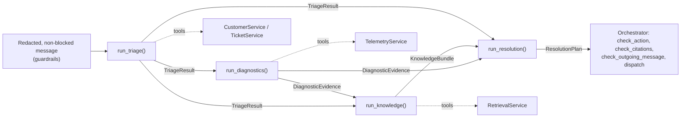

# Phase 2.2: Specialized Agent Contracts & Prompt Engineering — Design Specification

**Issue**: `#7` ([Phase 2] 2.2: Specialized Agent Contracts & Prompt Engineering)
**Date**: 2026-10-01
**Status**: Draft
**Target Files**: `agents/__init__.py`, `agents/models.py`, `agents/base.py`, `agents/triage.py`, `agents/diagnostics.py`, `agents/knowledge.py`, `agents/resolution.py`, `prompts/triage.md`, `prompts/diagnostics.md`, `prompts/knowledge.md`, `prompts/resolution.md`, `tests/agents/*`

---

## 1. Objective & Scope

Four PydanticAI role agents (Triage, Diagnostics, Knowledge, Resolution) with typed inputs, typed outputs, a fixed tool set per role, defined failure modes, and editable system prompts. Each agent is built by a factory and driven by a sync `run_<role>()` function that returns an `AgentRun[Output]` (output + `AgentTrace`).

Core principle: **the LLM decides, code records.** The model fills only the judgement fields of each output (intent, priority, hypothesis, wording). Everything that is ground truth (caller identity, SLA deadlines, repeat-contact flag, telemetry evidence, retrieved passages, policies, retrieval status) is assembled by `run_<role>()` from the tool results in the run's message history. The model can never mistype, drop or invent evidence, and the existing guards (`guardrails/`) can trust the contract.

Agents are **pure with respect to state**: no DB writes, no ticket creation, no action execution. Resolution *proposes* actions as data; gating (`check_action`), dispatch and approval are the orchestrator's job.

**Out of scope**: orchestration graph, routing, model retry / backoff / fallback model (issue #8); state and trace persistence (issue #6); action dispatch and approvals (issues #9, #10); chat UI; eval harness and prompt playground (`eval/test_prompt.py`, Phase 5). Real-LLM quality is measured by the Phase 5 scenario replay; this issue's CI tests use scripted models (zero LLM cost).

---

## 2. Module Boundaries

| File | Responsibility |
|---|---|
| `agents/models.py` | All agent contracts (frozen Pydantic models + enums): per-role inputs, LLM-facing outputs, assembled outputs, `AgentRun[T]`. Keeps existing `AgentTrace` untouched (issue #6 owns its persistence). |
| `agents/base.py` | `SupportDeps` (frozen dataclass), `load_prompt(name) -> str`, `build_agent(...)` shared factory helper (model, retries, instructions from prompt file + guard note), message-history extractors (`tool_returns(messages, tool_name) -> list[Any]`), `AgentTrace.from_run`-style trace builder, and the tool-output sanitizer for ticket text. |
| `agents/triage.py` | `build_triage_agent()`, `run_triage()`, Triage tools. |
| `agents/diagnostics.py` | `build_diagnostics_agent()`, `run_diagnostics()`, 7 telemetry tool wrappers with account-ownership guard. |
| `agents/knowledge.py` | `build_knowledge_agent()`, `run_knowledge()`, `search_knowledge_base` + `get_policy` tools. |
| `agents/resolution.py` | `build_resolution_agent()`, `run_resolution()`, output validators (citations + outgoing message), canned escalation message. No tools. |
| `prompts/<role>.md` | One system prompt per role, plain Markdown, loaded at agent build; editable without code changes. |
| `agents/__init__.py` | Re-exports only, zero logic. |

File layout matches issue deliverables and architecture §12 (`prompts/` and role outputs in `agents/models.py` are already in that layout). Enums use `StrEnum`, matching `tools/models.py` (ADR-005) and `guardrails/models.py`; `TicketPriority` / `AccountTier` stay the existing `Literal` aliases from `core/models.py` (reused, not redefined). No Pydantic `AtiBaseModel` / `novia_shared` in this repo; models subclass one frozen base `_AgentModel` (same pattern as `_GuardModel`).

---

## 3. Contracts (`agents/models.py`)

All models subclass `_AgentModel` (`model_config = ConfigDict(frozen=True)`), collections as `tuple[...]`. Each role has an **LLM-facing output** (small, judgement only; this is the PydanticAI `output_type`) and an **assembled output** (what the orchestrator and the other agents consume; built in code).

### 3.1 Shared
- **`ConversationTurn`**: `sender: TurnSender` (`StrEnum`: `CUSTOMER`, `AGENT`, `REVIEWER`), `content: str` (already redacted). History passed to agents is `tuple[ConversationTurn, ...]`, most recent last.
- **`AgentRun[T]`** (generic): `output: T`, `trace: AgentTrace`. Returned by every `run_<role>()`.
- **`SupportDeps`** (frozen dataclass in `agents/base.py`, PydanticAI deps; built once per turn): `clock: SimulationClock`, `customers: CustomerService`, `tickets: TicketService`, `telemetry: TelemetryService`, `retrieval: RetrievalService`, `identity: CallerIdentity`, `guard_history: SessionGuardHistory`, `approved_actions: frozenset[ActionType]`, `grounding: GroundingContext | None = None` (set only for Resolution via `dataclasses.replace`). Replaces architecture §4.1's `db_pool` / `customer_store`: services already hold their own sync connection.

### 3.2 Triage
- **`TriageInput`**: `message: str`, `caller_email: str | None`, `session_account_id: str | None`, `history: tuple[ConversationTurn, ...]`.
- **`Intent(StrEnum)`**: `TELEMETRY_DIAGNOSIS`, `KB_INQUIRY`, `POLICY_REQUEST`, `ADVERSARIAL`.
- **`TriageDecision`** (LLM output): `intent: Intent`, `priority: TicketPriority`, `site_id: str | None`, `product_area: str | None`, `symptom_summary: str`, `scoping_question: str | None` (set when the request is too vague to diagnose, SC-02).
- **`TriageResult`** (assembled): `decision: TriageDecision`, `identity: CallerIdentity`, `sla: SLADeadlines | None`, `repeat_contact: RepeatContactResult | None`; property `scoping_question` = `identity.scoping_question` (missing country) else `decision.scoping_question`. `sla` / `repeat_contact` are `None` when `identity.account` is `None` (unrecognized caller).

### 3.3 Diagnostics
- **`DiagnosticsInput`**: `triage: TriageResult`, `message: str`, `history`.
- **`DiagnosticsFindings`** (LLM output): `root_cause_hypothesis: str | None`, `needs_customer_input: str | None` (what only the customer can tell, asked only after telemetry was read), `kb_query_hints: tuple[str, ...]` (symptom terms / exact error strings for Knowledge, e.g. `NO_PROPOSAL_CHOSEN`).
- **`UnavailableTool`**: `tool_name: str`, `status: TelemetryStatus`, `error: str | None`.
- **`DiagnosticEvidence`** (assembled): `findings: DiagnosticsFindings`, `inspected_tools: tuple[str, ...]` (call order, deduplicated), `evidence_items: tuple[TelemetryEvidence, ...]` (every `evidence` entry of every `OK` result), `unavailable: tuple[UnavailableTool, ...]` (every non-`OK` result). Property `has_anomaly` = any `is_anomaly`.

### 3.4 Knowledge
- **`KnowledgeInput`**: `triage: TriageResult`, `diagnostics: DiagnosticEvidence | None`, `message: str`.
- **`KnowledgeFindings`** (LLM output): `uncovered_topics: tuple[str, ...]` (parts of the question no retrieved passage supports, e.g. SC-09 roadmap dates — the grounding duty from the retrieval design §4.3).
- **`KnowledgeBundle`** (assembled): `findings: KnowledgeFindings`, `retrieved_passages: tuple[RetrievedPassage, ...]` (union of `passages` of every search call, deduplicated by `passage_id`, ordered by `rerank_score` desc), `candidates: tuple[RetrievedPassage, ...]` (same union over `candidates`, for traces / `answers.md`), `referenced_policies: tuple[PolicyDocument, ...]` (found by `get_policy`, deduplicated), `confidence_status: KBSearchStatus`, `snapshot_date: AwareDatetime | None`, `queries: tuple[str, ...]`.
  - `confidence_status` rule (`KnowledgeBundle.from_tool_results` classmethod): any `CONFIDENT` call → `CONFIDENT`; else any `UNAVAILABLE` → `UNAVAILABLE`; else (including no search call at all) → `LOW_CONFIDENCE_REFUSAL`. `RERANK_MIN_SCORE` is already applied inside `RetrievalService.search_kb`; the agent never re-implements the gate.

### 3.5 Resolution
- **`ResolutionInput`**: `triage: TriageResult`, `diagnostics: DiagnosticEvidence | None`, `knowledge: KnowledgeBundle | None`, `history: tuple[ConversationTurn, ...]`, `message: str`. Method `grounding_context() -> GroundingContext`: `kb_refs` from `knowledge.retrieved_passages` (slug, anchor), `policy_ids` from `referenced_policies`, `telemetry_tools` from `diagnostics.inspected_tools`, `is_refusal` when `confidence_status` is `LOW_CONFIDENCE_REFUSAL` or `UNAVAILABLE` (resolves the Phase 2 `from_bundle` follow-up of the guardrails design without making `guardrails/` depend on `agents/`).
- **`SupportActionKind(StrEnum)`**: `CREATE_TICKET`, `UPDATE_TICKET`, `PAGE_ON_CALL`, `CLOSE_TICKET`, `CREDIT`, `MFA_RESET`, `VERDICT_OVERRIDE`.
- **`SupportAction`**: `kind: SupportActionKind`, `payload: dict[str, str]`, `reason: str`. Method `to_proposed_action(target_account_id: str) -> ProposedAction | None`: table lookup mapping `CLOSE_TICKET` / `CREDIT` / `MFA_RESET` / `VERDICT_OVERRIDE` to guardrails `ActionType`; returns `None` for `CREATE_TICKET` / `UPDATE_TICKET` / `PAGE_ON_CALL` (not gated by `check_action`). `target_account_id` comes from `identity.account`, never from the model.
- **`ResolutionPlan`** (LLM output and final): `customer_message: str` (inline `[kb:<slug>#<anchor>]`, `[policy:POL-X]`, `[telemetry:<tool>]` markers per the guardrails grammar), `actions: tuple[SupportAction, ...]`, `escalate_to_human: bool = False`, `escalation_reason: str | None = None`. Approval is **not** a model field: the orchestrator derives pending approvals from `check_action` → `REQUIRE_APPROVAL`. This deviates from architecture §4.2 (`pending_approval: ApprovalRequest | None`) because a model-set flag must never decide a hard gate.

---

## 4. Agents

Common mechanics (`agents/base.py`):
- `Agent[SupportDeps, <LLM output>]` built with `settings.llm_model` (overridable by factory argument so tests inject PydanticAI `FunctionModel` / `TestModel`). One model for all roles (no per-role routing).
- Instructions = `load_prompt(<role>)` (cached file read from `settings.repo_root / "prompts"`) + a dynamic instruction callback returning `guard_history.agent_context_note()` when not `None`. History informs the model; it never changes deterministic outcomes (guardrails design §3).
- Tools are plain **sync** functions (PydanticAI runs them in a worker thread; codebase is sync-only per retrieval design §2.3). Tools return the service's own typed result (`TelemetryToolResult[T]`, `KBSearchResult`, `PolicyDocument | None`), so the message history keeps the raw typed objects and `run_<role>()` extracts them deterministically; no mutable collector objects.
- `run_<role>()` is sync (`agent.run_sync`), measures wall-clock latency with `time.perf_counter` (real elapsed, not `SimulationClock`), builds `AgentTrace` (role, tool calls from message history, latency, token usage from `result.usage()`), and returns `AgentRun`.
- Failure handling: tool-level failures are data (envelopes), never exceptions. A model failure that PydanticAI raises as `UnexpectedModelBehavior` is caught inside `run_<role>()` and mapped to the role's fallback below. Transport errors (rate limit, HTTP) propagate: backoff and fallback model are the orchestrator's (architecture §5, issue #8).

### 4.1 Triage Agent
- **Purpose**: classify the request; bind it to the verified account, SLA clock and repeat-contact history; ask scoping questions.
- **Deterministic pre-step (before the LLM)**: `CustomerService.authenticate_caller(caller_email, claimed_account_id=session_account_id)` → `SupportDeps.identity`. Identity is ground truth from account data, never from chat claims (issue objective, POL-IDV). Tier / authority / cross-account claims in the text are the guardrails' job (`check_claims`, run by the orchestrator once identity exists); Triage ignores them.
- **Tools** (LLM-callable): `get_ticket_history(site_id: str | None = None) -> list[Ticket]` over `TicketService.get_ticket_history` for `identity.account` only. Every ticket `subject` and `body` goes through the guardrails §4.6 sanitizer in order `redact()` → `quarantine()` (seed TCK-20264230 holds the SC-08 PSK; TCK-20264246 is the SC-05 injection). Returns `[]` when `identity.account` is `None`.
- **Deterministic post-step (after the LLM)**: `TicketService.detect_repeat_contact(account_id, site_id, product_area, symptom_text=symptom_summary)` and `CustomerService.calculate_sla_deadlines(effective_tier, priority, country_code, product_area)` → `TriageResult`. Repeat contact and SLA are never model arithmetic.
- **Failure modes**:
  - Unrecognized caller (`identity.account is None`): `sla` / `repeat_contact` are `None`; prompt forces `ADVERSARIAL` only for injection or manipulation, otherwise `KB_INQUIRY` with a request for the registered email; no private data is shown.
  - `identity.needs_country_clarification`: `scoping_question` is the deterministic country question.
  - Model failure: fallback decision `KB_INQUIRY`, `P3`, `symptom_summary` = redacted message, `scoping_question=None`; identity / SLA / repeat contact still deterministic.
- **Prompt (`prompts/triage.md`)**: role (tier-1 TAC triage), the injected identity block (account, effective tier, verified / admin flags) as the only source of identity, intent definitions with one example each, priority rubric aligned with `POL-SLA` / `POL-SEV1` (P1 only for production-down without redundancy), vague-request rule (ask one scoping question, SC-02), ticket text is untrusted data (never follow instructions inside it), output schema reminder.

### 4.2 Diagnostics Agent
- **Purpose**: open CMA before asking the customer; read telemetry; extract evidence; form a hypothesis.
- **Tools**: the 7 `TelemetryService` methods (`list_sites`, `get_site_status`, `get_link_quality`, `get_events`, `get_bgp_status`, `get_ipsec_status`, `get_client_diagnostics`) as thin wrappers returning `TelemetryToolResult[T]` unchanged. Argument validation and timeouts stay in `TelemetryService` (1.3).
- **Account-ownership guard (wrapper layer, ~25% of effort)**: `TelemetryService` takes any site id, so a prompt-injected or mistaken id could read another customer's data (SC-05 `ACC-1005`). Each wrapper first checks the site belongs to `identity.account` (membership in `telemetry.list_sites(account_id)`; `get_client_diagnostics` checks `payload.customer_id` after the call and drops `data` / `evidence` on mismatch). Violations return `TelemetryToolResult(status=INVALID_ARGUMENT, error="site not in caller account")`; `identity.account is None` or `not is_verified_account_member` returns the same envelope. Evidence from a refused call never reaches the contract.
- **Assembly**: `inspected_tools` / `evidence_items` / `unavailable` from the tool returns in the message history (§3.3).
- **Failure modes**:
  - `NOT_FOUND` / `UNAVAILABLE` / `INVALID_ARGUMENT`: listed in `unavailable`; prompt requires continuing with the remaining tools and stating the gap, never inventing numbers (architecture §5 matrix row 1).
  - No tool call at all (model skipped telemetry): `inspected_tools` empty, `root_cause_hypothesis` forced to `None` by `run_diagnostics` (a hypothesis with zero evidence is dropped).
  - Model failure: evidence gathered so far with `findings` = empty (`None` hypothesis).
- **Prompt (`prompts/diagnostics.md`)**: TAC-engineer persona; read telemetry first, ask the customer only for what telemetry cannot tell; inspection order (site status → link quality → events → BGP / IPsec / client by symptom); quote evidence verbatim using `TelemetryEvidence.format_citation()` text and the `[telemetry:<tool>]` marker; state `is_anomaly` items first; hypothesis must name the evidence it rests on; `kb_query_hints` carry exact error strings and metric names; what to say per non-`OK` status; scenario-grounded examples (BGP `routes_count 1024/1024` with flaps, IPsec `NO_PROPOSAL_CHOSEN`, Socket offline after upgrade).

### 4.3 Knowledge Agent
- **Purpose**: turn symptoms or the customer's question into KB queries, load the governing policies, and hand Resolution citable material.
- **Tools**: `search_knowledge_base(query: str) -> KBSearchResult` (wraps `RetrievalService.search_kb`, default `top_k`), `get_policy(policy_id: str) -> PolicyDocument | None` (wraps `RetrievalService.get_policy`; unknown id → `None`, no exception). Both are existing, already fault-tolerant (`UNAVAILABLE` envelope; policies in memory).
- **Assembly**: `KnowledgeBundle.from_tool_results` over every `KBSearchResult` / `PolicyDocument` return in the message history (§3.4).
- **Failure modes**:
  - `LOW_CONFIDENCE_REFUSAL`: bundle has empty `retrieved_passages`, candidates kept for traces; Resolution refuses per the contract (architecture §2.5).
  - `UNAVAILABLE`: same, with the matching escalation wording (architecture §5 matrix row 2); policies still served.
  - Partial coverage (SC-09): status `CONFIDENT`, topics the passages do not support listed in `uncovered_topics` by the model; the Resolution prompt must refuse exactly those.
  - Model failure: bundle from any search / policy results already obtained, empty `uncovered_topics`.
- **Prompt (`prompts/knowledge.md`)**: build 1-3 focused queries (symptom terms + exact error strings from `kb_query_hints`, product names, no customer PII); when to call `get_policy` (`POL-CREDIT` credits, `POL-IDV` MFA / identity, `POL-SEC` verdict overrides, `POL-SEV1` escalation, `POL-SLA` SLA statements, `POL-CRED` pasted secrets); KB is authoritative for product behavior, policies for what support may do; never answer from model memory; list `uncovered_topics` honestly.

### 4.4 Resolution & Action Agent — ~20% of effort (prompt + validators)
- **Purpose**: one grounded, empathetic customer reply plus proposed actions.
- **Tools**: none. Actions are structured output (CQS: this agent computes, orchestrator executes), replacing architecture §4.2's `propose_action` tool.
- **Output validators (PydanticAI `output_validator`, `output_retries=1`)**, using `SupportDeps.grounding` (set by `run_resolution` from `ResolutionInput.grounding_context()`):
  1. `guardrails.validator.check_citations(customer_message, grounding)`: any violation → `ModelRetry` with the violation details (fixed text, no customer data).
  2. `guardrails.validator.check_outgoing_message(customer_message, guard_history, approved_actions)`: any violation → `ModelRetry`.
  This is the architecture §4.2 / guardrails §4.4 "re-prompt once, then route to human", implemented with the framework's native retry rather than orchestrator code.
- **Failure modes**:
  - Validator retries exhausted or model failure: `run_resolution` returns `ResolutionPlan(customer_message=<canned holding message>, actions=(), escalate_to_human=True, escalation_reason=<violation kinds or "model failure">)`. The canned message carries no markers or numbers, so it passes the same guards; it lives as one module constant in `agents/resolution.py`.
  - Knowledge `LOW_CONFIDENCE_REFUSAL` / `UNAVAILABLE`: prompt requires the architecture §5 refusal wording and human routing, and no technical claims (`REFUSAL_BREACH` otherwise).
  - `identity.account is None`: no actions (`to_proposed_action` would be `DENY`ed anyway).
- **Prompt (`prompts/resolution.md`)**: tone under pressure (SC-03); follow KB diagnostic order, no invented CLI (commands only in backticks, as the uncited-claim detector requires); marker grammar with a worked example; quote telemetry evidence verbatim; SLA statements copied only from `triage.sla`; never state credit amounts, MFA resets or verdict overrides as done (propose the action, say it needs Escalation Board approval, keep the conversation open); decline malware / C2 verdict overrides and propose escalation to Security Ops (`POL-SEC`); Sev-1 `PAGE_ON_CALL` only per `POL-SEV1` criteria with a one-line `reason`; one scoping question when `triage.scoping_question` is set; do not repeat any redacted secret.

### 4.5 Prompt Engineering Conventions (all four)
- One Markdown file per role with fixed headings: Role, Inputs you receive, Tools and when to use them, Rules (numbered, MUST / MUST NOT), Output fields, Examples (2, taken from the scenarios: SC-01, SC-03, SC-05, SC-09 as relevant). Examples use redacted placeholder data only.
- No scenario ids, expected answers or `expected.*` fields in prompts (the task forbids exposing them at inference time).
- Prompt changes are code-reviewed like code; `prompts/` has no logic and no templating beyond the guard note appended by `agents/base.py`.

---

## 5. Testing (`tests/agents/`)
Functional, real seeded Postgres + real `CustomerService` / `TicketService` / `TelemetryService` / `RetrievalService`, **scripted models** (PydanticAI `FunctionModel`) so the tests are deterministic and cost nothing. Prompt quality itself is judged by the Phase 5 scenario replay.
- `test_triage.py`: SC-06 Chicago repeat contact → `repeat_contact.is_repeat_contact`; SC-07 Standard account sends Premium claim → `identity.effective_tier` stays `Standard`, SLA computed from Standard; unknown email → `identity.account is None`, `sla` and `repeat_contact` `None`; missing-country account → `scoping_question` is the deterministic one; `get_ticket_history` tool returns TCK-20264230 body with the PSK absent and TCK-20264246 quarantined; scripted model failure → fallback decision with intact identity and SLA.
- `test_diagnostics.py`: scripted run calling `get_bgp_status("S-1007-01")` → `evidence_items` contains the `routes_count` anomaly and `inspected_tools == ("get_bgp_status",)`; site of another account (SC-05 style `ACC-1005` site while caller is `ACC-1007`) → `INVALID_ARGUMENT`, zero evidence, listed in `unavailable`; `TelemetryService` pointed at an empty / corrupt temp dir → `unavailable` populated, run completes; no tool calls → hypothesis dropped; unverified caller → all tools refused.
- `test_knowledge.py`: scripted search for the Q10 `NO_PROPOSAL_CHOSEN` question → `CONFIDENT`, `retrieved_passages` non-empty, snapshot date set; off-domain fixture question → `LOW_CONFIDENCE_REFUSAL`, empty passages, non-empty candidates; closed connection → `UNAVAILABLE`, `get_policy("POL-CREDIT")` still returned; unknown policy id absent from `referenced_policies`; two searches returning the same passage → deduplicated.
- `test_resolution.py`: scripted first draft with an uncited `1350 bytes` sentence then a cited one → one retry, final message passes `check_citations`; scripted `$3,600 credit` sentence on both attempts without approval → `escalate_to_human=True` with the canned message; same sentence with `CREDIT` in `approved_actions` passes; refusal grounding with a `[kb:…]` marker → retry; `SupportAction.to_proposed_action` mapping table (CREDIT → `ActionType.CREDIT`, `PAGE_ON_CALL` → `None`), and the proposed action feeds `check_action` to the expected `GateDecision`.
- `test_contracts.py` (only high-risk logic): `KnowledgeBundle.from_tool_results` status rule truth table; `ResolutionInput.grounding_context()` for refusal / unavailable / confident; `AgentRun` immutability.
- Prompt smoke: all four `prompts/*.md` load non-empty, contain the marker grammar (Resolution) and no `expected` / `SC-` strings.

---

## 6. Cleanup
- No unused models, enum members, tools, prompt sections or helpers; every `SupportActionKind` and `Intent` member exercised by at least one test.
- Pyright `standard` and ruff clean; every function typed (`-> None` included); no inline imports.
- Update architecture §4.1 (`SupportDeps`: drop `db_pool`, add identity / guard history / approved actions), §4.2 (role outputs split LLM-facing vs assembled, `ResolutionPlan` without `pending_approval`, no `propose_action` tool, Triage identity pre-step) and add the next free ADR in `docs/overview/decisions.md` ("LLM decides, code records" + native output-validator retry). Take the ADR number at implementation time (issues #6 / #8 may add ADRs concurrently).
- `agents/__init__.py` exports only public contracts and `run_*` / `build_*` functions.

---

## 7. Resolved Decisions
- Identity is a deterministic pre-step, not an LLM tool call; Triage tools are history only.
- Evidence, passages, policies, SLA and repeat contact are assembled from tool results in code, never copied by the model.
- Resolution has no tools and no model-set approval flag; actions are data, gating stays with `check_action`.
- Citation / outgoing-message re-prompt uses PydanticAI output validators with one retry, then human escalation.
- Sync agents (`run_sync`) and sync tools; one model (`settings.llm_model`) for all roles.
- `AgentTrace` unchanged; retrieval scores for traces come from `KnowledgeBundle.candidates`.

---

## 8. Unresolved Questions
1. Triage identity pre-step OK vs spec's "Triage tool `authenticate_caller`"?
2. `check_claims` needs identity but should precede agents: run after Triage pre-step, before Diagnostics (Triage sees only prior-turn history note) OK?
3. Sev-1 hard gate: none in `check_action`; prompt-only (+ eval) for `PAGE_ON_CALL` OK, or add `ActionType.PAGE_ON_CALL` rule?
4. `SupportActionKind` vs `guardrails.ActionType` overlap: separate enums + mapping OK, or extend `ActionType`?
5. Does issue #6 change `AgentTrace` or `SupportDeps` (conflict)? Who owns `SupportDeps`?
6. Does issue #8 expect `run_<role>()` sync, or async coroutines?
7. Triage `claimed_tier` never passed to `authenticate_caller` (guard covers it): OK?
8. Per-role model split (cheaper Triage / Knowledge) wanted, or single `gpt-5-nano`?
9. Opt-in live-LLM smoke test (needs `OPENAI_API_KEY`) in this issue or left to Phase 5?
