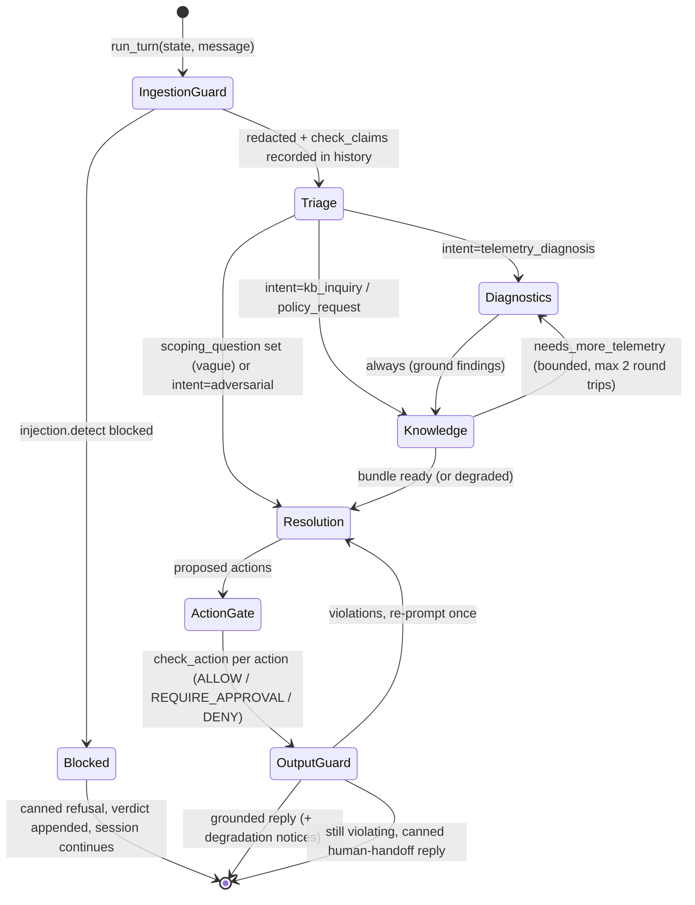

# Phase 2.3: Orchestration Graph & Partial Failure Handling — Design Specification

**Issue**: `#8` ([Phase 2] 2.3: Orchestration Graph & Partial Failure Handling)
**Date**: 2026-10-01
**Status**: Ready for Review
**Target Files**: `orchestration/__init__.py`, `orchestration/models.py`, `orchestration/workflow.py`, `tests/orchestration/*`

---

## 1. Objective & Scope

A deterministic, LLM-free routing layer (`Workflow`) that runs one customer turn through the four specialized agents and the guardrails, and degrades explicitly when the telemetry source or the KB retrieval source is down. All routing decisions are plain Python over typed agent outputs; no LLM decides the next state.

Flow (issue): Triage -> (Diagnostics <-> Knowledge) -> Resolution. Refines architecture §5 state diagram.

Design choices:
- **Agents are injected ports**, not imported. Triage / Diagnostics / Knowledge / Resolution are async callables with typed in/out (contracts from architecture §4.2, built in the agent issues). Keeps this issue independent of agent prompts and testable with scripted stubs.
- **Guards reused, not re-implemented**: `guardrails.redactor.redact`, `injection.detect`, `validator.check_claims`, `check_citations`, `check_action`, `check_outgoing_message`, `SessionGuardHistory` (all pure, 1.5).
- **Degradation is derived from typed statuses already on the contracts**: `TelemetryStatus.UNAVAILABLE` (1.3) and `KBSearchStatus.UNAVAILABLE` (1.4). No new exception channel, no try/except around agents for these two cases.
- **Customer-visible notice is deterministic text** prepended by the workflow, so disclosure never depends on the Resolution LLM remembering to say it.
- **State is per-turn in/out**: `run_turn(state, message) -> (state, TurnResult)`. Persistence (`conversations`/`messages` tables, migration `20260930_1000_agent-runtime.sql`) is the caller's job (Phase 2.4).

**Out of scope**: agent prompts and tool wiring (agent issues), `ApprovalService` persistence and reviewer UI, conversation/trace persistence, model-API retry/fallback (architecture §5 row 4, lives in the agent runner), UI.

---

## 2. Module Boundaries

| File | Responsibility |
|---|---|
| `orchestration/models.py` | Contracts: `WorkflowState`, `DegradedSource`, `DegradationNotice`, `ConversationState`, `TurnResult`, and the four agent port Protocols. Frozen Pydantic. |
| `orchestration/workflow.py` | `Workflow` class: `run_turn()` plus small private step methods and pure routing helpers. Only place routing lives. |
| `orchestration/__init__.py` | Re-exports only, zero logic. |
| `tests/orchestration/` | Functional multi-turn + partial-failure tests (§7). |

Enums use `StrEnum`, matching `tools/models.py` / `guardrails/models.py` (ADR-005). Models subclass the frozen base pattern (`ConfigDict(frozen=True)`), tuples over lists.

---

## 3. Contracts (`orchestration/models.py`)

- **`WorkflowState(StrEnum)`**: `INGESTION_GUARD`, `BLOCKED`, `TRIAGE`, `DIAGNOSTICS`, `KNOWLEDGE`, `RESOLUTION`, `ACTION_GATE`, `OUTPUT_GUARD`, `DONE`. Visited states are recorded for traces and tests.
- **`DegradedSource(StrEnum)`**: `TELEMETRY`, `RETRIEVAL`.
- **`DegradationNotice`**: `source: DegradedSource`, `detail: str` (tool names / status, no secrets), `customer_text: str`.
  - `from_telemetry(unavailable_tools: tuple[str, ...]) -> DegradationNotice` classmethod: text states CMA telemetry is unavailable, no telemetry values will be quoted, scoping continues from documentation.
  - `from_retrieval() -> DegradationNotice` classmethod: text states documentation service is unavailable, technical guidance is withheld, escalation to a human engineer is offered.
  - Fixed templates per source (matches architecture §5 recovery matrix wording), so tests assert exact text.
- **`ConversationState`**: carried between turns.
  - `triage: TriageDecision | None` (prior scope; fed back to Triage so it adapts to the customer's answer).
  - `identity: CallerIdentity | None` (resolved once, reused; no re-auth per turn).
  - `guard_history: SessionGuardHistory`.
  - `evidence: tuple[TelemetryEvidence, ...]` (accumulated, newest turn appended).
  - `awaiting_scoping_answer: bool`.
  - `messages: tuple[tuple[str, str], ...]` (sender, redacted text); the agents' conversation history.
  - Methods return new instances (`with_triage`, `with_message`, `with_history`, `with_evidence`), no mutation.
- **`TurnResult`**: `reply: str`, `path: tuple[WorkflowState, ...]`, `degradations: tuple[DegradationNotice, ...]`, `pending_actions: tuple[ProposedAction, ...]` (REQUIRE_APPROVAL; handed to Phase 2.4 approval persistence), `escalation_offered: bool`.
- **Agent ports** (`Protocol`, one `__call__` each, all async): `TriageStep`, `DiagnosticsStep`, `KnowledgeStep`, `ResolutionStep`. Inputs/outputs are the architecture §4.2 types (`TriageDecision`, `DiagnosticEvidence`, `KnowledgeBundle`, `ResolutionPlan`). `ResolutionStep` additionally takes `tuple[DegradationNotice, ...]` and prior `OutputViolation`/`CitationViolation` list for the single re-prompt.

Contract additions needed from the agent issues (flagged, not built here): `DiagnosticEvidence.unavailable_tools: tuple[str, ...]` (tools whose `TelemetryToolResult.status == UNAVAILABLE`) and `KnowledgeBundle.needs_more_telemetry: bool`. Without them degradation cannot be derived from agent output (see Questions).

---

## 4. Routing (`orchestration/workflow.py`) — ~45% of effort

`Workflow.__init__(triage, diagnostics, knowledge, resolution, clock)` takes the four ports and `SimulationClock`; no DB/telemetry handles (agents own those via `SupportDeps`).

`Workflow.run_turn(state: ConversationState, message: str) -> tuple[ConversationState, TurnResult]` — async; orchestrates only, each step is its own method (single concern).

### 4.1 Ingestion guard
1. `redact(message)` -> redacted text; `with_redaction` on history. Only redacted text enters state, agents, traces.
2. `injection.detect(redacted)` -> if blocked: `with_injection`, return canned refusal (`path = INGESTION_GUARD, BLOCKED`), state keeps the conversation open so the genuine follow-up in the next turn proceeds (SC-05).
3. Else `check_claims(redacted, identity)` -> `with_entitlement`. Non-blocking (guardrails §4.3). Skipped until identity is resolved by Triage; the first turn runs it after Triage.

### 4.2 Routing table (pure helper `_next_after_triage(decision) -> WorkflowState`)
| Triage output | Next |
|---|---|
| `scoping_question` set | `RESOLUTION` (ask it; `awaiting_scoping_answer=True`) |
| `intent == adversarial` | `RESOLUTION` (refusal path, no Diagnostics/Knowledge) |
| `intent == telemetry_diagnosis` | `DIAGNOSTICS` |
| `intent in (kb_inquiry, policy_request)` | `KNOWLEDGE` |

Fixed edges: `DIAGNOSTICS -> KNOWLEDGE` always; `KNOWLEDGE -> RESOLUTION`; `RESOLUTION -> ACTION_GATE -> OUTPUT_GUARD -> DONE`.

### 4.3 Diagnostics <-> Knowledge loop
`Knowledge` may set `needs_more_telemetry` (e.g. KB points at a BGP timer check the first pass skipped). Workflow then re-enters `DIAGNOSTICS` with the KB hint, then `KNOWLEDGE` again. Bounded by constant `MAX_DIAG_KB_ROUNDS = 2`; on the bound it proceeds to `RESOLUTION` with what it has. Loop guard lives in one place (`_run_evidence_loop`), no recursion.

### 4.4 Conversational diagnosis (vague input)
- Triage returns `scoping_question` -> Resolution renders it as the reply; state stores `awaiting_scoping_answer=True`, the question, and `triage`.
- Next turn: Triage receives the prior `TriageDecision` + the answer + history, so it merges scope instead of restarting; once `scoping_question` is `None` the normal routing table applies (SC-02 vague -> scoping -> Diagnostics).
- No hard cap on scoping turns in the workflow; Triage prompt owns the "ask at most N" policy (see Questions).

### 4.5 Resolution, action gate, output guard
- `ResolutionStep` -> `ResolutionPlan`.
- `ACTION_GATE`: for each proposed action `validator.check_action(action, identity)`: `DENY` -> dropped, reason appended to reply via deterministic text from `GateDecision.reason`; `REQUIRE_APPROVAL` -> into `TurnResult.pending_actions` (non-blocking; conversation stays active); `ALLOW` -> passes through.
- `OUTPUT_GUARD`: `check_citations(message, GroundingContext)` + `check_outgoing_message(message, history, approved)` (+ its built-in `redact()`). `GroundingContext` is built by a `GroundingContext.from_turn(bundle, evidence, ...)` classmethod (the `from_bundle` hook promised in guardrails §3): `kb_refs` from passages retrieved this turn, `policy_ids`, `telemetry_tools` = tools with `status == OK` only, `is_refusal` = bundle status `LOW_CONFIDENCE_REFUSAL` or `UNAVAILABLE`.
- Any violation: re-run `ResolutionStep` once with the violation list; still violating -> canned human-handoff reply (`escalation_offered=True`). Same policy as guardrails §4.4.

---

## 5. Partial Failure Handling — ~35% of effort

Health is evaluated **every turn from that turn's statuses** (no sticky "down" flag), so a source that recovers mid-conversation is used again on the next turn automatically.

Pure helper `_degradations(evidence: DiagnosticEvidence | None, bundle: KnowledgeBundle | None) -> tuple[DegradationNotice, ...]`:
- telemetry notice when `evidence.unavailable_tools` is non-empty.
- retrieval notice when `bundle.confidence_status == KBSearchStatus.UNAVAILABLE`.
- `NOT_FOUND` (no such file) and `INVALID_ARGUMENT` are **not** outages: no notice; the agent reports "no data for site X" itself.
- `LOW_CONFIDENCE_REFUSAL` is not an outage either (no KB coverage, SC-09); it reuses the same refusal enforcement below but no outage notice.

### 5.1 Telemetry source down
- Diagnostics runs (tools return `UNAVAILABLE` envelopes, never raise, 1.3). Evidence from healthy tools is kept (true partial result).
- Workflow prepends `DegradationNotice.from_telemetry(...)` to the reply (visible disclosure).
- Flow continues `DIAGNOSTICS -> KNOWLEDGE -> RESOLUTION`: Knowledge runs on the customer's symptom text, so documentation-based scoping questions and steps still work.
- **Refuses to guess telemetry facts**, enforced deterministically, not by prompt alone: `GroundingContext.telemetry_tools` excludes unavailable tools, so any `[telemetry:<tool>]` marker for them is `UNKNOWN_TELEMETRY`; any numeric/port/error-code sentence without a valid marker is `UNCITED_CLAIM` (guardrails §4.4). Violation -> re-prompt once -> canned handoff.
- Diagnostics<->Knowledge loop is not re-entered for a telemetry-driven hint when telemetry is already unavailable (avoids a pointless second failing round).

### 5.2 Retrieval source down
- Knowledge returns bundle with `confidence_status = UNAVAILABLE` (1.4 catches `psycopg.Error`; policy lookup still works from memory, so `referenced_policies` may be non-empty and POL citations stay valid).
- Workflow prepends `DegradationNotice.from_retrieval()` and sets `escalation_offered=True` (offer, not an auto-escalation; the customer's yes is the next turn, see Questions).
- **Refuses ungrounded technical answers**: `GroundingContext.is_refusal=True` -> any `kb` marker or technical-claim sentence in the reply is `REFUSAL_BREACH` -> re-prompt once -> canned handoff. Resolution receives the notices so the happy path is a short, non-technical, empathetic reply.
- Telemetry evidence, if available, can still be quoted verbatim (verbatim evidence is grounded); no KB-derived interpretation is added.

### 5.3 Both down
Both notices (telemetry first), refusal enforcement as 5.2, plus ticket-level handoff offer. `Diagnostics` and `Knowledge` are still called (they return degraded envelopes cheaply); skipping them would create a second code path to test.

### 5.4 Failure of an agent itself (exception, not status)
Agent call raising any exception (model API exhausted retries etc.) is caught once at `run_turn` boundary: state returned unchanged except the redacted message, reply = fixed courteous pause message. One catch site, logged, no per-step try/except.

---

## 6. Reuse Map

| Need | Existing code |
|---|---|
| Redact / injection / claims / citations / gates / output check / history | `guardrails/redactor.py`, `injection.py`, `validator.py`, `models.py` (1.5) |
| Telemetry status + evidence | `tools/models.py` `TelemetryStatus`, `TelemetryEvidence`, `TelemetryToolResult` (1.3) |
| KB status + passages + policies | `retrieval/models.py` `KBSearchStatus`, `KBSearchResult`, `PolicyDocument`; `retrieval/service.py` (1.4) |
| Caller identity, tier, SLA | `core/models.py` `CallerIdentity`; `services/customer_service.py` `authenticate_caller` |
| Time | `core/clock.py` `SimulationClock` |
| Agent contracts | architecture §4.2 (`TriageDecision`, `DiagnosticEvidence`, `KnowledgeBundle`, `ResolutionPlan`) |

New code only: `orchestration/*`, `GroundingContext.from_turn` (guardrails/models.py) and the two agent contract fields in §3.

---

## 7. Testing (`tests/orchestration/`)
Functional, multi-turn, deterministic: scripted stub agents (record calls, return typed outputs), real `guardrails`, real `TelemetryService` pointed at a `tmp_path` telemetry dir for outage cases (missing root `sites.json` -> `UNAVAILABLE`), a stub retrieval returning `KBSearchResult(status=UNAVAILABLE)` (the real service needs Postgres; DB-down behaviour is already covered in 1.4 tests). Zero LLM, zero DB.
- `test_routing.py`: SC-02 vague turn 1 -> scoping question, path `TRIAGE -> RESOLUTION`; turn 2 answer -> Triage receives prior decision -> `DIAGNOSTICS -> KNOWLEDGE -> RESOLUTION`; SC-01 telemetry flow; `kb_inquiry` skips Diagnostics; `adversarial` skips both; loop bound (`needs_more_telemetry` forever stops at 2 rounds).
- `test_guard_flow.py`: SC-05 opener blocked -> canned refusal, agents never called, `guard_history` has verdict; follow-up turn answered normally; SC-08 PSK redacted before reaching any agent stub; SC-03 credit promise in Resolution output -> re-prompt -> still bad -> handoff; `REQUIRE_APPROVAL` action lands in `pending_actions`, reply unblocked.
- `test_partial_failure.py`:
  - Telemetry down (SC-01 site): notice present, no telemetry evidence, Resolution stub that fabricates `1024/1024` is rejected (`UNCITED_CLAIM`/`UNKNOWN_TELEMETRY`) and replaced by handoff; honest stub reply passes and Knowledge still ran.
  - Retrieval down: notice present, `escalation_offered`, stub that answers with KB marker rejected (`REFUSAL_BREACH`), policy-citing reply still passes.
  - Both down: both notices in order.
  - SC-09 `LOW_CONFIDENCE_REFUSAL`: refusal enforced, **no** outage notice.
  - `NOT_FOUND` site: no outage notice.
  - Mid-conversation recovery: turn 1 retrieval down, turn 2 healthy -> turn 2 has no notice and cites KB.
  - Agent raises -> pause message, state intact.

---

## 8. Cleanup
- No unused states, models, ports, or helper functions; every `WorkflowState` appears in at least one asserted `path`.
- `DiagnosticsStep`/`KnowledgeStep` ports match the agent-issue signatures exactly; delete any duplicate status handling if agents already surface it.
- All imports at top of module, full type hints (Pyright standard), Ruff clean, no inline imports; `orchestration/__init__.py` re-exports only.
- Update architecture §5 diagram/matrix to the table in §4.2 and §5 if they diverge; mark the plan implemented.

---

## 9. Unresolved Questions
1. Hand-rolled `Workflow` (chosen) vs `pydantic_graph` (installed with pydantic-ai)? Latter if graph persistence/visualization wanted.
2. Agent issues add `DiagnosticEvidence.unavailable_tools` + `KnowledgeBundle.needs_more_telemetry`? Else orchestrator wraps tools to record status.
3. Retrieval down: offer escalation only (chosen) or auto-create ticket?
4. Scoping-turn cap in workflow or Triage prompt?
5. Cap `MAX_DIAG_KB_ROUNDS=2` ok?
6. Notice repeated every degraded turn, or once per outage?
7. Integration tests: stubs only, or also LLM-backed (marked, opt-in)?
8. `ConversationState` persistence: caller (2.4) or here?
