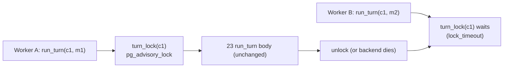

# Phase 2.4: Cross-Worker Turn Locking & State Snapshot Upgrade — Design Specification

**Issue**: `#34` ([Phase 2] 2.4: Cross-Worker Turn Locking & ConversationState Rebuild from Snapshot)
**Date**: 2026-10-02
**Status**: Ready for Review (aligned to final 21 and 23; ponytail: Postgres advisory lock + a version hook on 21's existing snapshot, no new column, table, infra or dependency)
**Target Files**: `core/config.py`, `storage/turn_lock.py`, `storage/state_store.py`, `storage/__init__.py`, `orchestration/state.py`, `orchestration/workflow.py`, `tests/storage/test_turn_lock.py`, `tests/orchestration/*`

---

## 1. Objective & Scope

Two guarantees on top of 21 (`StateStore`, rows, `conversations.state` jsonb) and 23 (`Workflow.run_turn`, sync, `message_id` idempotency, `OrchestratorState`):
1. **One turn at a time per conversation across workers.** Two workers never run `run_turn` for the same `conversation_id` concurrently; the second waits, then runs against what the first committed.
2. **The snapshot survives code evolution.** 21 already persists `StateSnapshot(version, data)` in `conversations.state`; 23 stores `OrchestratorState` (clarification counter, outage-notice flags, `oncall_paged`) in `data`. 2.4 adds only the upgrade path: older versions migrate, newer versions are refused, corrupt data rebuilds to safe defaults.

**Reused as-is from 21/23 (not re-built here)**: column `conversations.state` (no migration file in 2.4), `StateSnapshot`, `StateStore.save_state`, `rehydrate().conversation.state` (the load accessor; no `load_state`), `OrchestratorState` with `to_snapshot`/`from_snapshot` and the single end-of-turn save (23 plan 01 Task 4), `TurnRecorder.save_state`, `message_id` dedupe via `append_customer_message` inside 23 `_ingest`, 21's per-conversation row lock on writes, 21 resume rule for crashed turns.

**Out of scope**: connection pool (`db/connection.py` later), non-Postgres locks, queueing/fairness, locking approval resolution (21 CAS), approval-resume turn (issue #10; calls the same `turn_lock`), async wrapper (API layer, `asyncio.to_thread`).

Not built, by decision (ponytail): lock-owner table, heartbeat/lease, fencing tokens, second state model, trace-based state rebuild.

---

## 2. Structural Decisions

1. **Session-level Postgres advisory lock, not transaction-level.** A turn runs LLM calls for seconds to minutes; a transaction lock would hold one transaction open the whole turn and fight 21's per-method transactions. A session lock holds only the connection. Cost: one connection per in-flight turn (`ponytail:` comment, pool later).
2. **Lock key.** `pg_advisory_lock(bigint)` with key `hashtextextended('turn:' || conversation_id, 0)` computed in SQL (stable across hosts). A collision only causes false serialization. The `'turn:'` prefix reserves key space for other lock kinds.
3. **Lock and writes share the `StateStore` connection.** If the connection dies, the lock is released AND that worker can no longer write (free fencing). Rule: one connection per concurrent turn; sharing a connection across threads defeats the lock (session locks are reentrant per session). Tests use two connections; one test pins the reentrancy.
4. **Lock scope = the whole of `run_turn` (23), unchanged inside.** 23 `_ingest` already dedupes by `message_id` through `append_customer_message` and returns the stored result for an answered turn. Inside the lock that check is race-free: the loser of two concurrent identical retries waits, then finds the reply and runs zero agents. No new dedupe code in 2.4. 21's per-write `FOR UPDATE` stays as the row-level backstop.
5. **Timeout.** Acquire uses a session `lock_timeout` (`settings.turn_lock_timeout_s`, default 30 s) set only around the acquire, then reset. Timeout raises `TurnLockTimeout` (new, `storage/turn_lock.py`), a "conversation busy" signal with no state touched; the API layer answers "retry with the same `message_id`", safe by 23 idempotency. No silent skip, no unbounded wait; waiters are not FIFO (acceptable).
6. **Release on crash.** Postgres drops session advisory locks when the backend ends (`kill -9`, `pg_terminate_backend`). Half-open network connections need TCP keepalives in the production DSN (`keepalives_idle`/`keepalives_interval`/`keepalives_count`); config only, documented. Normal path unlocks in `finally`; an unlock failing with `psycopg.OperationalError` is swallowed (lock already gone), anything else propagates.
7. **Crash mid-turn = unchanged from 21/23.** The lock vanishes with the worker; the client retry (same `message_id`) takes the lock and resumes from the last committed stage (21 resume rule).
8. **Snapshot version hook (the only state change).** `orchestration/state.py` gains `STATE_VERSION` (current 1, used by `to_snapshot`) and `MIGRATIONS: dict[int, Callable[[dict[str, Any]], dict[str, Any]]]` (pure step n -> n+1; empty today). `OrchestratorState.from_snapshot` (23: empty `data` or unknown version -> `empty()`, never raises) is refined: empty `data` -> `empty()` (fresh or pre-23 conversation); `1 <= version < STATE_VERSION` -> migration chain then validate; `version > STATE_VERSION` -> raise `StateVersionError` (an old worker in a rolling deploy must not read-modify-write a newer shape; fails before any agent runs, retry lands on a new worker); `data` failing validation -> `empty()` plus a log line (never the blob content), overwritten at turn end.
9. **`StateVersionError` placement.** The state load stays where 23 puts it (once, after `_ingest`) but outside the single agent-exception boundary (23 plan 02 Task 3), so it propagates instead of becoming a pause message. The customer message is already stored by `_ingest`, so the retry resumes it; no new write ordering.
10. **Rebuild is lossy only in the safe direction.** Empty/invalid state -> `clarification_turns` 0 (one extra scoping question possible), `notice_shown` empty (a notice may repeat once), `oncall_paged` False. Not parsed from traces or messages (YAGNI). `oncall_paged=False` after a corrupt-blob rebuild could allow one extra `PAGE_ON_CALL`; accepted, noted in the ADR.
11. **Write ordering unchanged from 23.** Reply `complete_turn` then `save_state` at turn end; a crash between them leaves a replied turn with a stale snapshot; the retry returns the stored reply and counters self-correct in the safe direction.

---

## 3. Contracts

- `storage/turn_lock.py`: `TurnLockTimeout(Exception)`; `turn_lock(connection: psycopg.Connection[Any], conversation_id: UUID, timeout_s: float) -> Iterator[None]` (`@contextmanager`).
- `storage/state_store.py` addition: `turn_lock(conversation_id: UUID) -> AbstractContextManager[None]` (one line, passes `settings.turn_lock_timeout_s`). Nothing else added to `StateStore`.
- `core/config.py`: `turn_lock_timeout_s: float = 30.0`.
- `orchestration/state.py` (23 file, modified): `STATE_VERSION`, `MIGRATIONS`, `StateVersionError`, refined `from_snapshot`.
- `orchestration/workflow.py` (23 file, modified): `run_turn` becomes `with store.turn_lock(conversation_id):` around the existing body (private `_run_locked`), signature unchanged.

---

## 4. Testing & Verification

Functional, real Postgres, scripted stub agents (23 `conftest.py`), zero LLM. Concurrency tests use real threads, each with its own connection + `StateStore`.

1. `tests/storage/test_turn_lock.py`: B blocks until A releases; different conversations independent; timeout raises `TurnLockTimeout` and leaves no residue; crash release via `pg_terminate_backend` on A's backend; exception in the `with` block still unlocks; same-connection reentrancy pinned.
2. `tests/orchestration/test_state.py` (pure, one parametrized check): empty -> empty, current round-trips, older with monkeypatched `STATE_VERSION=2` + one `MIGRATIONS` step -> migrated, newer -> `StateVersionError`, invalid data -> empty.
3. `tests/orchestration/test_turn_serialization.py`: concurrent turns serialize (no interval overlap, turns 1 and 2, second turn sees first turn's history); concurrent duplicate `message_id` (stubs run once, same reply, one customer row); crash inside a turn (watcher terminates A's backend, B retries, one reply, stage `IDLE`); lock timeout surfaces with no rows written by B.
4. `tests/orchestration/test_state_recovery.py`: kill/restart continuity (counter, notice flags and `oncall_paged` equal after restart, no repeated notice); newer-version snapshot -> `StateVersionError`, blob untouched; crash between `complete_turn` and `save_state` -> retry returns stored reply.

---

## 5. Review Focus
1. Two workers, same `message_id`: one agent run. 2. Worker killed holding the lock: no deadlock, retry resumes. 3. Newer-version snapshot: refused, not overwritten. 4. Unlock on a broken connection does not mask the real exception. 5. Timeout leaves no partial write.

---

## 6. Cleanup (final step)
1. Read every new/modified file end to end; no unused imports, constants, `MIGRATIONS` entries or helpers; `ponytail:` comment only on the one-connection-per-turn ceiling.
2. Grep: no `datetime.now`, no inline imports, no `Literal` for enum-like fields; confirm nothing duplicates 21/23 (no `load_state`, `StoredState`, `ConversationState`, state migration SQL, extra dedupe check).
3. Pyright `standard` and ruff clean; every function fully typed, `-> None` included; f-strings only.
4. Docs: architecture doc concurrency section (turn lock, keepalive DSN requirement); ADR (next free number) in `docs/overview/decisions.md`: session advisory lock, snapshot version hook, safe-direction rebuild.

---

## 7. Unresolved Questions
None.
