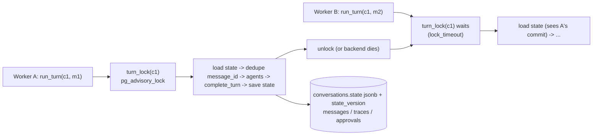

# Phase 2.4: Cross-Worker Turn Locking & ConversationState Rebuild — Design Specification

**Issue**: `#34` ([Phase 2] 2.4: Cross-Worker Turn Locking & ConversationState Rebuild from Snapshot)
**Date**: 2026-10-02
**Status**: Ready for Review (all questions decided; ponytail: Postgres advisory lock + one jsonb column, no new infra or dependency)
**Target Files**: `db/migrations/20261002_0900_conversation-state.sql`, `core/config.py`, `storage/turn_lock.py`, `storage/models.py`, `storage/state_store.py`, `orchestration/state.py`, `orchestration/workflow.py`, `orchestration/recorder.py`, `tests/storage/*`, `tests/orchestration/*`

---

## 1. Objective & Scope

Two guarantees on top of 21 (`StateStore`, rows) and 23 (`Workflow.run_turn`, sync, `message_id` idempotency):
1. **One turn at a time per conversation across workers.** Two workers (processes/hosts) receiving messages for the same `conversation_id` never run `run_turn` concurrently; the second waits, then runs against the state the first committed.
2. **`ConversationState` is rebuildable after restart.** The small per-conversation runtime state 23 needs between turns (clarification counter, per-source "notice shown" flags) is one versioned jsonb snapshot on `conversations`; if it is missing it is rebuilt (safe defaults) on top of the durable rows; if it is older it is migrated; if it is newer than the code it is refused.

**Out of scope**: connection pool (`db/connection.py` still a later item; one connection per in-flight turn), distributed locks outside Postgres (Redis etc.), turn queueing/fairness, locking approval resolution (CAS in 21 already serializes it), approval-resume turn (issue #10; it calls the same `turn_lock`), async wrapper (`asyncio.to_thread` at the API layer, as decided in 23).

Not built, by decision (ponytail): a lock-owner table, heartbeat/lease renewal, fencing tokens, a separate state table, an event-sourced rebuild of every field.

---

## 2. Structural Decisions

1. **Session-level Postgres advisory lock, not transaction-level.** A turn runs LLM calls for seconds to minutes. A transaction-level lock (`pg_advisory_xact_lock`) would need one open transaction for the whole turn, which fights 21's per-method autocommit transactions and idles in transaction. A session-level lock holds no transaction, no row lock, no snapshot: only the connection stays open. Cost: one connection per in-flight turn (acceptable; there is no pool yet, ceiling noted with a `ponytail:` comment).
2. **Lock key.** `pg_advisory_lock(bigint)` with the key computed in SQL as `hashtextextended('turn:' || conversation_id, 0)` (builtin, stable across hosts/versions, no Python hash randomization). A 64-bit collision between two conversations only causes false serialization, never a correctness bug. The `'turn:'` prefix reserves the key space for future lock kinds.
3. **Lock and writes share one connection.** The lock is acquired through `StateStore.turn_lock(conversation_id)` which uses the store's own connection. Consequence (free fencing): if the connection dies, the lock is released AND that worker can no longer write; a zombie worker cannot corrupt state after losing its lock. Rule documented in `StateStore`: one connection per concurrent turn; sharing one connection across threads would defeat the lock (session locks are reentrant per session) and psycopg connections are not for concurrent use anyway. A test uses two connections.
4. **Lock scope = the whole of `run_turn`, including the idempotency check.** Order inside the lock: load state -> check `message_id` already answered -> run -> `complete_turn` -> save state -> unlock. The dedupe check MUST be inside the lock: two workers both receiving a client retry of the same `message_id` would otherwise both see "not seen" and both run the agents. With the lock, the loser waits, then finds the stored reply and returns it with zero agent calls. 21's per-write `FOR UPDATE` stays as the row-level backstop; the turn lock is the coarse turn-level guard on top.
5. **Timeout and failure behavior.** Acquire uses session `lock_timeout` (`settings.turn_lock_timeout_s`, default 30 s) set only around the acquire statement, then reset (so 21's row locks keep default behavior). On timeout the store raises `TurnLockTimeout` (new, `storage/turn_lock.py`): a caller-visible "conversation busy" condition, no state touched. The API layer answers "busy, retry with the same `message_id`"; idempotency (decision 4) makes that retry safe. No silent skip, no unbounded wait. Waiters are not fairly ordered (Postgres advisory locks are not FIFO); acceptable, turn order within a conversation is customer-driven.
6. **Release on crash.** Postgres releases session advisory locks when the backend ends. `kill -9` of the worker closes the socket and the server drops the lock; `pg_terminate_backend` does the same instantly (used by the test to simulate a crash). Half-open network connections (host vanished without FIN) are only detected via TCP keepalives: documented requirement that the production DSN sets `keepalives_idle`/`keepalives_interval`/`keepalives_count`; nothing to code now (DSN is config, `settings.database_url`). Normal path releases in a `finally` via `pg_advisory_unlock`; an unlock failing on a dead connection is swallowed (the lock is already gone), anything else propagates.
7. **A crash mid-turn leaves a recoverable conversation, unchanged from 21.** The lock vanishes with the worker; the customer's client retry (same `message_id`) takes the lock, finds no reply, and re-runs from the last committed stage (21 resume rule: reuse `OK` traces). Locking adds no new recovery state.
8. **Long LLM turns.** The lock is held for the full turn (necessary: the next turn must see this turn's reply and state). Mitigation is only the timeout in decision 5 plus the sync model-call timeouts the agent runner already owns. No lease renewal: the lock lives exactly as long as the connection, which is the worker's liveness signal.
9. **State = one versioned jsonb snapshot on `conversations`** (decided in 21): columns `state jsonb null` and `state_version int not null default 0`. Migration is `add column if not exists` so it is a no-op if 21 shipped them already and is re-applied safely on every boot by `apply_schema`. Version `0` / null means "no snapshot".
10. **What the snapshot holds (and does not).** `ConversationState` (frozen pydantic, `orchestration/state.py`) holds only what rows cannot answer cheaply: `clarification_turns: int` and `notices_shown: tuple[DegradedSource, ...]` (23 plan 02). History, identity, guard history, stage, pending approvals and traces already live in rows (21) and are loaded by `StateStore.rehydrate`; they are NOT duplicated into the blob (single source of truth). "Full state" = `rehydrate()` snapshot + `ConversationState`.
11. **Load rule (one pure classmethod `ConversationState.from_stored`).** `state_version == 0`/null -> rebuild (safe defaults, `empty()`). `1 <= version < STATE_VERSION` -> apply the migration chain (`MIGRATIONS: dict[int, Callable[[dict[str, Any]], dict[str, Any]]]`, each step pure, version n -> n+1; empty today because current is 1) then validate. `version > STATE_VERSION` -> raise `StateVersionError`: an old worker during a rolling deploy must not read-modify-write a newer shape; the turn fails safe and the retry lands on a new worker. A blob failing validation is treated like a missing blob and logged; the rebuilt blob overwrites it at turn end.
12. **Rebuild is deliberately lossy in the safe direction.** `clarification_turns` rebuilt as 0 (customer may get one extra scoping question), `notices_shown` rebuilt empty (a degradation notice may repeat once). Neither can leak data or skip a disclosure. Rebuild does not parse traces or messages (YAGNI: the two fields are not reliably derivable from them); everything else of the conversation comes back from rows via `rehydrate`.
13. **Write ordering and crash window.** Turn end order: `complete_turn` (reply + `IDLE`, atomic, 21) first, `save_state` last. A crash between them leaves a replied turn with a stale snapshot; the retry returns the stored reply and the stale counters self-correct through the safe direction in decision 12. The reverse order could lose a disclosure and was rejected. `save_state` is a plain `UPDATE` (the lock makes the holder the only writer; no version compare-and-set needed).
14. **Idempotent duplicate lookup.** "Already answered" = a customer message with this `message_id` exists AND an agent/system message exists for the same turn (derivable from `rehydrate().messages`). The stored result returned is that reply text; 23's `TurnResult` rebuilt from it with an empty `path`. (If 23 already added a helper for this, reuse it; this design only requires it to run inside the lock.)

---

## 3. Schema (`db/migrations/20261002_0900_conversation-state.sql`)

Lowercase SQL, idempotent, no `%` and no unbalanced braces (`apply_schema` feeds files through `psycopg.sql.SQL`): `alter table conversations add column if not exists state jsonb null` and `add column if not exists state_version int not null default 0`. No index. `conversations` is a runtime table already excluded from `seed.dump` (21), so nothing to change in `db/init/build.py`.

---

## 4. Contracts

- `storage/models.py`: `StoredState` (frozen): `version: int`, `data: dict[str, Any]`. Storage knows nothing about `ConversationState` (storage stays below orchestration).
- `storage/turn_lock.py`: `TurnLockTimeout(Exception)`; `turn_lock(connection: psycopg.Connection[Any], conversation_id: UUID, timeout_s: float) -> Iterator[None]` (`@contextmanager`).
- `storage/state_store.py` additions: `turn_lock(conversation_id: UUID) -> AbstractContextManager[None]` (one line, passes `settings.turn_lock_timeout_s`); `load_state(conversation_id: UUID) -> StoredState | None` (None for unknown conversation or version 0/null); `save_state(conversation_id: UUID, state: StoredState, at: AwareDatetime) -> None` (raises `LookupError` if the conversation is unknown).
- `orchestration/state.py`: `STATE_VERSION: int = 1`; `MIGRATIONS` as in §2.11; `StateVersionError`; `ConversationState` with `empty() -> ConversationState`, `from_stored(stored: StoredState | None) -> ConversationState`, `to_stored() -> StoredState`, and the two pure transitions `with_clarification(turns)` / `with_notices_shown(sources)` returning new instances (immutability rule). `DegradedSource` is 23 plan 02.
- `core/config.py`: `turn_lock_timeout_s: float = 30.0` on `Settings`.

---

## 5. Workflow integration (`orchestration/workflow.py`, `recorder.py`)

`Workflow.run_turn(conversation_id, message, message_id)` keeps its signature. New shape: `with self._store.turn_lock(conversation_id):` wraps a private `_run_locked(...)` holding today's body. Inside, first `ConversationState.from_stored(store.load_state(...))`, then the already-answered check (§2.14), then steps 1-6 of 23 plan 01 (with the clarification counter and notice flags now read from and written to `ConversationState` instead of the unspecified "21 snapshot"), then `TurnRecorder.save_state(new_state)` as the final write. `TurnRecorder` gains one pass-through method. Lock acquisition failure and `StateVersionError` propagate unchanged: both are raised before 23's single agent-exception boundary is entered, and `StateVersionError` is raised before any customer-message write.

---

## 6. Testing & Verification

Functional, real Postgres (compose up), scripted stub agents, zero LLM. Concurrency tests use real threads each owning its own `psycopg` connection + `StateStore` (the realistic stand-in for two workers).

1. `tests/storage/test_turn_lock.py`:
   - Two connections, same conversation: B blocked until A releases; different conversations do not block each other.
   - Timeout: A holds, B with a short timeout raises `TurnLockTimeout` in roughly the timeout and leaves no residue (B can acquire after A releases).
   - Crash release: A holds; a third connection runs `pg_terminate_backend` on A's backend; B acquires within the timeout (kill mid-turn simulation).
   - Same-connection reentrancy pinned by assertion (second acquire on one connection does not block), documenting the one-connection-per-turn rule.
2. `tests/storage/test_conversation_state.py`: `save_state`/`load_state` round trip from a new connection; unknown id; migration idempotent (apply twice).
3. `tests/orchestration/test_state.py` (pure, one small parametrized check): `from_stored` for missing -> empty, current version -> same, older version with a fake migration chain (monkeypatched `STATE_VERSION=2` and one `MIGRATIONS` step) -> migrated, newer -> `StateVersionError`, invalid blob -> empty.
4. `tests/orchestration/test_turn_serialization.py` and `test_state_recovery.py` (headline functional tests):
   - **Concurrent turns serialize:** two threads call `run_turn` on one conversation with different `message_id`s; the Triage stub sleeps and records enter/exit timestamps; intervals never overlap, turns are numbered 1 and 2, the second turn's stub sees the first turn's messages in its history.
   - **Concurrent duplicate:** two threads, same `message_id`: stubs run exactly once, both callers get the same reply, one customer message row.
   - **Kill/restart mid-conversation:** turn 1 completes with a scoping question (counter 1, a notice flag set via a telemetry-down stub). Terminate the old backend, drop every reference, open a new connection/store/workflow. Turn 2 resumes: loaded `ConversationState` equals the pre-kill one, history identical, clarification continues to 2, no repeated notice.
   - **Crash inside a turn:** a watcher thread terminates worker A's backend while its Diagnostics stub sleeps; worker B retries the same `message_id`, acquires the lock after the backend dies, resumes from the committed stage, finishes with one reply.
   - **Lock timeout surfaces:** A stuck in a long stub, B with a tiny timeout gets `TurnLockTimeout`, no message row written by B.
   - **Missing snapshot / newer version / crash between `complete_turn` and `save_state`:** see plan 02 Task 3.

---

## 7. Review Focus
1. Two workers, same `message_id`: one agent run. 2. Worker killed holding the lock: no deadlock, retry resumes. 3. Newer-version snapshot read by an old worker: refused, not overwritten. 4. Lock held on a broken connection at unlock: no secondary exception hiding the real one. 5. Timeout leaves no partial write.

---

## 8. Cleanup (final step)
1. Read every new/modified file end to end; no unused imports, constants, `MIGRATIONS` entries or helpers; `ponytail:` comments only where a ceiling is real (one connection per turn).
2. Grep: no `datetime.now`, no inline imports, no `Literal` for enum-like fields, no leftover mention of "21 StateStore snapshot flag" in 23 docs (point to `ConversationState`).
3. Pyright `standard` and ruff clean; every function fully typed, `-> None` included; f-strings only.
4. Docs: architecture doc concurrency section (turn lock, keepalive DSN requirement), ADR (next free number) in `docs/overview/decisions.md`: session advisory lock, state snapshot split, safe-direction rebuild.

---

## 9. Unresolved Questions
None.
