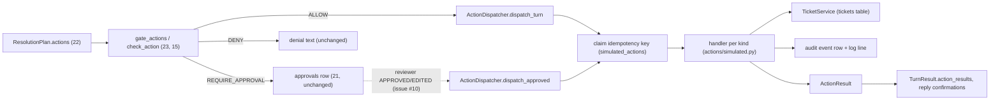

# Phase 3.1: Action Dispatcher & Simulated Side Effects — Design Specification

**Issue**: `#9` ([Phase 3] 3.1: Action Dispatcher & Simulated Side Effects)
**Date**: 2026-10-02
**Status**: Draft for Review
**Builds on**: 21 (`StateStore`, approvals), 22 (`SupportAction`, `ResolutionPlan`), 23 (`Workflow`, `gate_actions`), 24 (turn lock, `OrchestratorState`), 15 (`check_action`)
**Target Files**: `db/migrations/20261002_0900_simulated-actions.sql`, `actions/__init__.py`, `actions/models.py`, `actions/dispatcher.py`, `actions/simulated.py`, `storage/models.py`, `storage/action_queries.py` (new), `storage/state_store.py`, `storage/__init__.py`, `services/ticket_service.py`, `orchestration/workflow.py`, `orchestration/models.py`, `orchestration/routing.py`, `orchestration/recorder.py`, `db/init/build.py`, `agents/models.py` (`ResolutionInput.known_ticket_id`, public action-type map), `orchestration/state.py`, `prompts/resolution.md`, `tests/actions/*`, `tests/orchestration/*`

---

## 1. Objective & Scope

Today a turn ends with `GatedActions.executable` (ALLOW) and `TurnResult.executable_actions`, and nothing runs them. 3.1 adds the executor: an `ActionDispatcher` that takes gate-cleared actions, performs the simulated side effect, writes an audit record, and returns typed results the workflow shows to the customer. No real system is touched.

**Reused as-is**: `SupportActionKind`/`SupportAction` (22), `check_action` and `gate_actions` (decisions stay in guardrails/orchestration; the dispatcher never invents policy), `approvals` + `ApprovalResolution` (21), `TicketService`, `SimulationClock`, `TurnRecorder`, turn lock (24; dispatch runs inside it).

**Out of scope**: approval resolution, reviewer UI, post-approval customer message (issue #10 / 3.2; it only calls `dispatch_approved`), real integrations, webhook channel, retries or queues, async.

### 1.1 Where the ticket diverges from the code (reconciled)

| Ticket says | Code today | Decision |
|---|---|---|
| Actions `create_ticket`, `update_ticket`, `page_on_call`, `request_service_credit`, `request_mfa_reset` | `SupportActionKind`: `CREATE_TICKET`, `UPDATE_TICKET`, `PAGE_ON_CALL`, `CREDIT`, `MFA_RESET`, plus `CLOSE_TICKET`, `VERDICT_OVERRIDE` | Use code names (`CREDIT` = request_service_credit, `MFA_RESET` = request_mfa_reset). Add handler for `CLOSE_TICKET` (status closed; gate already ALLOWs it). `VERDICT_OVERRIDE` has no handler: gate always DENYs it; dispatcher refuses it defensively. |
| Sev-1 "strictly validated against POL-SEV1 (production site down, no redundancy)" | `check_action` already allows `PAGE_ON_CALL` only for priority P1 + `sev1_corroborated` + not already paged. `sev1_corroborated` = two+ sites disconnected in one country, or a whole listed account disconnected. POL-SEV1 text never mentions redundancy; architecture §3 does | Validation stays in `check_action` (single source of truth, tested in 15/22/23). Dispatcher adds a defensive re-check, not a second implementation (§3.3). **Decided: follow POL-SEV1 only**; "no redundancy" (architecture §3) is not modelled, no HA-pair health. Update architecture §3 wording in cleanup to match POL-SEV1 |
| `request_*` "queues for human approval" | Approval queueing already exists: workflow writes an `approvals` row for `REQUIRE_APPROVAL` (21/23) | No new queueing at request time (decided: post-approval effect is enough; the approval row is the queue record). `CREDIT`/`MFA_RESET` handlers run only after approval via `dispatch_approved` and emit the simulated downstream effect (billing credit queue / CMA MFA reset) |
| Audit/events in `data/simulated_actions/` or webhook | No `simulated_actions` table: dropped by 21 plan 01 delta 4. `data/` is repo-tracked and read-only in the container | Postgres table `simulated_actions` is the audit log and idempotency store; one structured log line per action. No JSON files, no webhook (§2.3). **Decided:** the `simulated_actions` table is the export location (reviewers/UI read it via `list_simulated_actions`) |
| Tickets "in Postgres", `update_ticket` changes status, site, priority | `TicketService` has `create_ticket` and `update_ticket_status` only; `tickets` table has no conversation link | Add `TicketService.update_ticket(ticket_id, status, site_id, priority)` (each optional). Conversation link lives in the audit row |
| Enums | Codebase uses `StrEnum` (ADR-005); user rule now allows any enum | Follow codebase `StrEnum` for consistency with 21-24 (string values are persisted) |

---

## 2. Approaches & Structural Decisions

### 2.1 Where execution lives
- **A. Execute inside agents (tool `propose_action` runs it)**: rejected; violates 22 (agents pure, no side effects) and puts LLM ahead of the gate.
- **B. Dispatcher called by workflow after gating (chosen)**: one new component, clean seam for #10, gate stays the only policy.
- **C. Event bus / outbox with a worker**: rejected (YAGNI); effects are local and simulated, a worker adds a process and a failure mode.

### 2.2 Decisions
1. **`ActionDispatcher` (`actions/dispatcher.py`) is the only caller of handlers.** Two entry points: `dispatch_turn(conversation_id, message_id, actions, context) -> tuple[ActionResult, ...]` for ALLOWed actions, and `dispatch_approved(approval: Approval, context) -> ActionResult` for #10. Both converge on a private `_run(request)`: claim, handler, finalize.
2. **Handlers are a dict `SupportActionKind -> handler`** (`actions/simulated.py`), each `(DispatchRequest) -> ActionOutcome`. Adding a kind adds one entry (OCP). A test asserts every `SupportActionKind` is either in the dict or in the explicit refused set (`VERDICT_OVERRIDE`), so a new kind cannot be silently undispatchable.
3. **Typed payloads.** `SupportAction.payload` is `dict[str, str]`. `actions/models.py` has one frozen payload model per kind with `from_payload(raw: dict[str, str]) -> Self` classmethod (user rule). Invalid payload yields `ActionResult(status=INVALID)`; never raises, nothing written but the audit row.
4. **Idempotency by DB unique key** (§3). Replays (client retry, crash resume) return the stored result and run no handler.
5. **Dispatch before `save_state`, before `complete_turn`.** Order in `Workflow._finish`: dispatch, `save_state`, `complete_turn`. 23's current comment says state is saved first so an on-call page is never lost; with a real executor that order is wrong (state says paged, page never sent, retry gate denies). New order plus conversation-scoped page key makes a crash retry send the page exactly once.
6. **Failure never claims success.** A handler error or infra error becomes `ActionResult(status=FAILED)`; the workflow appends a fixed courteous line and sets `escalation_offered`. The agent's own text may have promised the action; the deterministic line corrects it (same pattern as degradation notices).
7. **Sync; constructor `ActionDispatcher(store, tickets, clock)`**, no `Workflow` dependency, so `ApprovalService` (32) builds its own instance from the same three objects. Injected on `Workflow` as a new `dispatcher: ActionDispatcher` field. `replay_trace` is not extended (21's planned simulated-action replay is YAGNI): 41/42 read `list_simulated_actions` directly. No clock reads inside handlers beyond `SimulationClock.now()` passed to writes (ADR-001).

### 2.3 Audit sink: Postgres table, not files
Files in `data/simulated_actions/` give no atomic idempotency, race under two workers, vanish with the container, and cannot be joined to `conversations` for trace replay. A table gives a unique key, FK to `conversations`, and `replay_trace` adjacency. Reviewer visibility comes from SQL/UI later. Cost: one migration. Decided: the table itself is the exported record, no file export.

---

## 3. Persistence: `simulated_actions`

Migration `db/migrations/20261002_0900_simulated-actions.sql`, idempotent (`CREATE TABLE IF NOT EXISTS`), re-applied after every `pg_restore` like the 21 migration.

- Columns: `id uuid PK`, `conversation_id uuid FK RESTRICT`, `message_id uuid NULL` (turn that claimed it; NULL for approval-path rows; no FK, same as traces), `idempotency_key text UNIQUE`, `kind text`, `approval_id uuid NULL FK RESTRICT`, `payload jsonb` (validated payload as dumped), `status text` (CLAIMED, DONE, FAILED, INVALID, REFUSED; enum-validated in Pydantic, no SQL CHECK, as 21 plan delta 3), `result jsonb NULL` (e.g. ticket id, event reference), `claimed_at`, `completed_at NULL`.
- Index `(conversation_id, claimed_at)`.
- Added to `RUNTIME_TABLES` in `db/init/build.py` (excluded from `seed.dump`, 21 §2.8).
- Append-mostly: a row is inserted once (`CLAIMED`) and finalized once (`CLAIMED -> terminal`); no deletes.

Keys:
- Turn actions: `{message_id}:{kind}:{index}`. Same shape as the approval key (21 plan decision), so replay of one turn maps 1:1.
- `PAGE_ON_CALL`: `{conversation_id}:PAGE_ON_CALL`. A DB-level "at most one page per conversation", the hard backstop behind `OrchestratorState.oncall_paged`. A corrupt-blob rebuild that resets the flag (24 §2.10) can no longer cause a second page.
- Approved actions: `approval:{approval_id}`.

`StateStore` gains two thin methods (SQL in `storage/action_queries.py`, same split as `approval_queries.py`): `claim_action(...) -> ClaimedAction` (insert `ON CONFLICT (idempotency_key) DO NOTHING`, then read; returns the row plus `is_new: bool`) and `finish_action(action_id, status, result, at) -> SimulatedAction`. Plus `list_simulated_actions(conversation_id)` for tests and replay. New model `SimulatedAction` in `storage/models.py` (frozen, `SimulatedActionStatus` StrEnum).

Crash semantics (stated, not hidden):
- Page/credit/MFA effects are one audit insert: claim and effect are the same row, atomic. Exactly-once.
- Ticket actions write the `tickets` table through `TicketService`, which commits on its own. Claim, then write, then finalize: a crash between write and finalize leaves `CLAIMED`; the retry sees `CLAIMED` and reports FAILED/"outcome unknown, human follow-up" instead of creating a duplicate ticket (at-most-once). Accepted (`ponytail:` comment); upgrade path is a ticket natural key.

---

## 4. Contracts (`actions/models.py`)

All frozen Pydantic, `StrEnum`s, full typing.

- **`ActionStatus(StrEnum)`**: `DONE`, `FAILED`, `INVALID`, `REFUSED`. Persisted statuses are these plus `CLAIMED`. Replay is `ActionResult.replayed: bool`, not a status.
- **`DispatchContext`**: `identity: CallerIdentity`, `priority: TicketPriority`, `sev1_corroborated: bool`, `already_paged: bool`, `conversation_id: UUID`, `message_id: UUID`. Everything the defensive gate re-check and handlers need, built by the workflow from values it already holds.
- **`ActionResult`**: `kind: SupportActionKind`, `status: ActionStatus`, `replayed: bool`, `reference: str | None` (ticket id, page/credit/MFA event id), `detail: str` (fixed text, no secrets, no raw payload), `customer_line: str | None` (deterministic confirmation or failure sentence). Classmethods `done(...)`, `failed(...)`, `invalid(...)`, `refused(...)`, and `from_stored(SimulatedAction) -> ActionResult` (used by the answered-turn replay path; `customer_line=None` because the stored reply text already holds the confirmations).
- **Payload models** (all `from_payload` classmethods validate required keys, reject unknown keys):
  - `CreateTicketPayload`: `subject`, `body`, `product_area`, `priority` (default from triage priority), `site_id` optional.
  - `UpdateTicketPayload`: `ticket_id` plus at least one of `status`, `site_id`, `priority`; values checked against `TicketStatus`/`TicketPriority` literals from `core.models`.
  - `CloseTicketPayload`: `ticket_id`.
  - `PageOnCallPayload`: `summary`, `site_ids` (comma-separated, optional). Incident reference is generated by the handler.
  - `CreditPayload`: `ticket_id` (required, §5.4a), `amount`, `currency` (default USD), `incident_id`, `period`. Amount parsed to `Decimal`; used only in the audit event, never echoed to the customer (POL-CREDIT, `check_outgoing_message` already blocks amount promises).
  - `MfaResetPayload`: `ticket_id` (required, §5.4a), `user_email`. Handler records the identity basis (`is_registered_admin` + requester email) in the event, per POL-IDV "submit with verification evidence".
- **`DispatchRequest`** (internal): `action: SupportAction` (payload possibly replaced by `edited_payload`), `idempotency_key`, `context`, `approval_id: UUID | None`.

`actions/__init__.py` re-exports only.

---

## 5. Dispatcher & Handlers

### 5.1 `_run(request)` (the 80% of correctness)
1. Defensive gate re-check (§5.2). `REFUSED` result on failure; row written `REFUSED`, no handler.
2. Validate payload with the kind's `from_payload`; `INVALID` on error (row `INVALID`).
3. `store.claim_action(...)`. If not new: same `message_id` (crash retry) -> stored result with `replayed=True`; a different `message_id` (only possible for the conversation-scoped page key, e.g. after a corrupt-state rebuild) -> `REFUSED` "already paged" with no customer line, so a later turn never re-announces an old page. `CLAIMED` without result -> failed/"outcome unknown".
4. Run handler inside `try`; one `except Exception` around the handler only (logs class name, never message; same rule as 23 §5.4) -> `FAILED`.
5. `store.finish_action(...)`, emit one `logging` line (`action kind status reference conversation_id`), return `ActionResult`.

### 5.2 Defensive re-check
For kinds mapped by `SupportAction.to_proposed_action`, call `check_action` again with the same context. Pure and cheap. Turn path requires `ALLOW`; approved path requires `REQUIRE_APPROVAL` (the gate outcome that created the approval) plus `Approval.status in (APPROVED, EDITED)`. Anything else -> `REFUSED`. Purpose: a future caller (e.g. #10, a script) cannot bypass the gate by calling the dispatcher directly. No policy logic lives here; Sev-1 criteria remain solely in `check_action`.

### 5.3 `dispatch_approved(approval, context)`
Rejects `PENDING`/`REJECTED` (returns `REFUSED`; reject path is #10's customer message only). For `EDITED`, builds the `SupportAction` from `edited_payload`, never the original. Maps `Approval.action_type` back to `SupportActionKind` through a small inverse of `_GATED_ACTION_TYPES` (added as a public mapping in `agents/models.py`; today it is private). `context` for #10 is rebuilt from the conversation row (identity via `CustomerService.authenticate_caller`, priority/corroboration not needed for credit/MFA, which are not Sev-1 gated).

### 5.4 Handlers (`actions/simulated.py`)
| Kind | Effect | Result reference |
|---|---|---|
| `CREATE_TICKET` | `TicketService.create_ticket`: customer id, company, tier from `identity.account`; `customer_name` and `requester_email` both `identity.caller_email` (identity has no name field); caller_email `None` -> `INVALID`; priority from payload or triage | new `TCK-...` |
| `UPDATE_TICKET` | `TicketService.update_ticket` (status/site/priority); unknown id -> `FAILED` (service raises `ValueError`) | ticket id |
| `CLOSE_TICKET` | `TicketService.update_ticket(status="closed")` | ticket id |
| `PAGE_ON_CALL` | audit event `oncall_paged`: incident reference `INC-` + short id, summary, sites, priority, acknowledgement SLA (15 min, POL-SEV1) in `result` | incident ref |
| `CREDIT` | audit event `credit_request_submitted` (approved/edited amount, incident, period) as the simulated billing queue entry | request id |
| `MFA_RESET` | audit event `mfa_reset_triggered` with identity basis | request id |

Handlers are plain functions over `TicketService` and the claimed row; the page/credit/MFA "side effect" is the finalized `result` JSON, so there is no second sink to keep consistent. Ownership check on `ticket_id` (ticket's `customer_id` equals the caller's account) is in the ticket handlers: a customer cannot update another account's ticket (`REFUSED`).

### 5.4a Ticket binding and pending marker (decided)
**Binding.** Every `CREDIT`/`MFA_RESET` payload carries `ticket_id`, the ticket the request is tracked on. It comes from state, not model memory:
- `OrchestratorState` gains `active_ticket_id: str | None` (`STATE_VERSION` 1 -> 2 with an identity `MIGRATIONS[1]` step: not needed for loading, since the new field defaults, but it makes an old worker in a rolling deploy refuse the newer snapshot instead of silently dropping the field, which is exactly 24's mechanism). Set only when a `CREATE_TICKET` result is `DONE` in this conversation. Triage's repeat-contact tickets are deliberately NOT used: binding a credit to an unrelated historical ticket would be wrong, and the prompt tells Resolution to open a ticket first.
- `ResolutionInput` gains `known_ticket_id: str | None` (22 contract change), filled from state by the workflow, so the prompt can reference it.
- The workflow stamps `ticket_id` into each credit/MFA payload in code, overwriting whatever the model wrote. The model value is never trusted.
- `_answer` order changes: gate, dispatch ticket-kind and page actions, update `active_ticket_id`, then stamp payloads and create approval rows. A plan proposing `CREATE_TICKET` and `CREDIT` together works.
- No ticket known after dispatch: no approval row is created; the reply gets a fixed line (a ticket is needed first).

**Pending marker.** After `create_approval`, the workflow calls `ActionDispatcher.mark_pending(approval, context) -> ActionResult`: `TicketService.update_ticket(status="pending_approval")` with ownership check, audited as an `UPDATE_TICKET` row keyed `approval:{approval_id}:pending`.

**Contract with #10 (stated, not open).** 3.1 only sets `pending_approval`. #10's settle step (APPROVED, EDITED, REJECTED) clears it via `TicketService.update_ticket`; `dispatch_approved` never changes ticket status. Both read `ticket_id` from `Approval.payload` (`edited_payload` on EDITED must keep `ticket_id`; the dispatcher rejects an edit that drops or changes it: `INVALID`). #10's design must reference this.

### 5.5 Customer-visible lines (`ActionResult.customer_line`)
Fixed templates, asserted verbatim in tests: ticket created (with id), ticket updated/closed, on-call paged (with incident ref and 15 min ack), failure/unknown outcome ("could not complete X; a support engineer will follow up"). Credit/MFA lines are issued by #10 after approval, not here. The page line never states an amount or SLA beyond POL-SEV1.

---

## 6. Workflow Integration

- `Workflow` gains `dispatcher: ActionDispatcher`; `base_deps` unchanged.
- `_answer`: after approvals are created and degradations derived, build `DispatchContext`, call `dispatch_turn(gated.executable)`, pass results into `_finish`.
- `compose_reply` (routing.py) gains a `confirmations: tuple[str, ...]` part appended after the model message and before denial reasons.
- State update: `oncall_paged` becomes true when the PAGE result is `DONE` (not merely gated ALLOW); a failed page leaves it false so the next turn may retry, and the conversation-scoped key keeps that safe.
- `_finish` order: dispatch results in hand -> `save_state` -> `complete_turn`. Failed results set `escalation_offered=True`.
- `TurnResult.executable_actions` is replaced by `action_results: tuple[ActionResult, ...]`. `_replay` (answered-turn retry) returns stored results via `list_simulated_actions` filtered by the turn's key prefix; no dispatch.
- `gate_actions` is unchanged except `GatedActions.oncall_paged` semantics note: it reports "page allowed this turn"; the workflow confirms with the result.
- **Prompt change (`prompts/resolution.md`)**: (a) payload keys per kind (§4 contract); (b) with no `known_ticket_id`, propose `CREATE_TICKET` (`subject`, `body`, `product_area`) first; never state ticket ids or amounts in text (ids come from the deterministic confirmation); (c) for `CREDIT`/`MFA_RESET`, set `ticket_id` to `known_ticket_id`, or leave it blank when `CREATE_TICKET` is in the same plan (code fills and overwrites it, §5.4a); (d) describe `known_ticket_id` in the input section. A scripted test asserts the prompt names these keys (drift guard).
- `_answer` also calls `mark_pending` after each `create_approval` (§5.4a).

---

## 7. Testing & Verification

Functional, real Postgres (existing orchestration fixtures), scripted stub agents (23 `conftest.py`), zero LLM. Real `TicketService` against the seeded tickets table, each test cleans its own rows. Unit-style tests only for payload parsing (one parametrized check).

1. `tests/actions/test_dispatch_tickets.py`: create -> row in `tickets` with caller's account, audit row `DONE` with ticket id; update status/site/priority (each alone and combined); unknown ticket -> `FAILED`, audit `FAILED`; other account's ticket -> `REFUSED`; invalid payload -> `INVALID`, no ticket written; close ticket.
2. `tests/actions/test_sev1_paging.py` (Sev-1 criteria, the ticket's named test), through the full workflow with real `TelemetryService` evidence: two sites disconnected in one country + P1 -> paged, audit event with incident ref; single site down (HA pair healthy) or P2 -> DENY, nothing written, denial text in reply; second page in same conversation -> denied by gate; with state snapshot wiped (corrupt rebuild) the DB key still blocks the second page (`REFUSED`/replayed, one audit row); direct `dispatch_turn` of a `PAGE_ON_CALL` with `sev1_corroborated=False` -> `REFUSED` (defense in depth).
3. `tests/actions/test_dispatch_approved.py`: credit approved -> event with payload amount; edited -> event uses `edited_payload`, original untouched; rejected/pending -> `REFUSED`, no row finalized; MFA reset by non-admin identity never reaches approval (gate DENY) and direct dispatch is `REFUSED`; `VERDICT_OVERRIDE` always refused.
4. `tests/orchestration/test_action_flow.py`: credit with a model-written wrong `ticket_id` -> approval payload carries the state ticket id; `CREATE_TICKET` + `CREDIT` in one plan -> approval bound to the new ticket and ticket `pending_approval`; credit with no ticket known -> no approval, fixed line; `active_ticket_id` survives restart; edited approval dropping `ticket_id` -> `INVALID`; reply includes deterministic ticket confirmation, agent text unchanged; handler raises (monkeypatched service) -> `FAILED`, failure line, `escalation_offered`, turn still completes, state saved; duplicate `message_id` -> zero extra rows/tickets, same results; crash after dispatch before reply (kill backend) -> retry finishes with one ticket and one page; two workers same turn -> one effect (turn lock + key); `REQUIRE_APPROVAL` credit proposal -> approval row only, no `simulated_actions` row.
5. Test hygiene: `tests/storage/conftest.py` and `tests/orchestration/conftest.py` cleanup SQL delete `simulated_actions` before `conversations` (FK RESTRICT), and delete tickets created in a test; `tests/storage/test_schema.py` table list gains the new table.
6. `tests/actions/test_schema.py`: migration idempotent; table excluded from dump (extends 21 drift/dump tests); every `SupportActionKind` has a handler or is in the refused set.

---

## 8. Review Focus
1. No path executes without `check_action` ALLOW (turn) or approved row (approval). 2. One page per conversation, even after state rebuild. 3. Retry never duplicates a ticket or page. 4. Failed action never reads as success to the customer. 5. No payload secrets or amounts in logs or replies.

---

## 9. Cleanup (final step)
1. Read every new/modified file end to end; no unused imports, models, handlers or helpers; `ponytail:` comment only on the ticket at-most-once ceiling; no file over ~250 lines (`actions/simulated.py` handlers one small function each, `actions/models.py` payloads only; split payloads to `actions/payloads.py` if models.py passes that).
2. Remove `TurnResult.executable_actions` and every reader; confirm no duplicate of 15 gate logic in `actions/`.
3. Grep: no `datetime.now`, no inline imports, no `Literal` for enum-like fields (the `core.models` literals are reused, not added).
4. Pyright `standard` and ruff clean; every function fully typed, `-> None` included; f-strings only.
5. Prompt/contract: `prompts/resolution.md` updated per §6, `ResolutionInput.known_ticket_id` added, `STATE_VERSION` bumped with `active_ticket_id`, prompt drift test passes; the `pending_approval` clear contract recorded in the ADR and handed to #10.
6. Docs: architecture doc (action dispatcher box, `actions/` in layout, `simulated_actions` in ER, Sev-1 criteria wording vs `POL-SEV1`); `data/README.md` ticket note (runtime tickets are created in Postgres); ADR (next free number) in `docs/overview/decisions.md`: dispatcher after gate, Postgres audit with unique keys, conversation-scoped page key, dispatch-before-state-save order.

---

## 10. Decisions taken after review
- Sev-1: POL-SEV1 criteria only; no redundancy modelling.
- `request_*`: post-approval effect only.
- Audit export: `simulated_actions` table, no files.
- Ticket write at-most-once on crash: accepted (KISS).
- Credit/MFA customer line: #10.
- `pending_approval` ticket status set on approval creation; #10 clears it on settle (contract, §5.4a).
- `ticket_id` required in credit/MFA payloads, sourced from `OrchestratorState.active_ticket_id` and stamped in code; `prompts/resolution.md` and `ResolutionInput.known_ticket_id` updated (§5.4a, §6).
- `_GATED_ACTION_TYPES` made public in `agents/models.py`.
- Enums: `StrEnum` (global rule updated to allow any enum).

## 11. Open questions
None.
