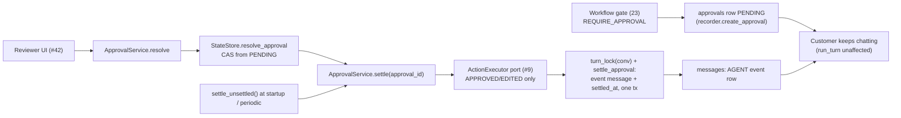

# Phase 3.2: Non-Blocking Approval Lifecycle & Resume Mechanism — Design Specification

**Issue**: `#10` ([Phase 3] 3.2: Non-Blocking Approval Lifecycle & Resume Mechanism)
**Date**: 2026-10-02
**Status**: Draft for Review
**Target Files**: `services/approval_service.py`, `services/models.py`, `storage/models.py`, `storage/state_store.py`, `storage/approval_queries.py`, `storage/__init__.py`, `db/migrations/20261002_1000_approval-settled.sql`, `orchestration/workflow.py`, `orchestration/approvals.py`, `tests/services/test_approval_service.py`, `tests/orchestration/test_approval_resume.py`

---

## 1. Objective & Scope

Close the loop on high-impact actions. Today (21, 23): the Workflow gate turns `CREDIT` / `MFA_RESET` into `PENDING` approval rows and the customer is answered; nothing ever resolves a row, executes it, or tells the customer. This issue adds the reviewer-side lifecycle `PENDING -> APPROVED | EDITED | REJECTED` and the resume path:

1. **Resolve**: `ApprovalService.resolve` records a reviewer decision (CAS, 21).
2. **Execute**: approved/edited actions run through the action dispatcher (issue #9, port only here).
3. **Notify**: a deterministic event message lands in the conversation (customer sees it, later turns see it in history).
4. **Survive crashes**: any step interrupted by a restart is finished idempotently by `settle` / `settle_unsettled`, from Postgres state alone.

Non-blocking is already true in code (arch invariant 4, 21 `IDLE` after every turn, 23 gate returns the reply with `pending_actions`); this issue pins it with a test and must not regress it: no step here holds a lock across human wait time.

**Reused as-is**: `approvals` table, `Approval`, `ApprovalResolution` (validates EDITED iff `edited_payload`), `ApprovalStateError`, `StateStore.create_approval` / `resolve_approval` / `list_pending_approvals` (21), `StateStore.turn_lock` (24), `ActionType`, `check_action` gate (15/22/23), `message_id`-derived idempotency keys (23 recorder).

**Out of scope**: action execution itself and its audit trail (#9), reviewer UI (#42), customer chat polling/push (#41), SSE/websocket delivery (stored message is the event), reviewer authentication/RBAC, approval expiry/timeouts, LLM-written outcome replies, auto-ticket on rejection.

Not built, by decision (ponytail): outbox table, job queue/worker, message broker, `APPROVAL_PENDING` stage (21 removed it), per-reviewer assignment.

---

## 2. Ticket vs Code Reconciliation

| Ticket / sibling text | Code reality | Decision |
|---|---|---|
| `services/approval_service.py` owns "approval lifecycle" | 21 already ships row CRUD + CAS in `StateStore` (`approval_queries.py`); `ApprovalRecord` was deleted (21) | Service is a thin orchestration layer over `StateStore`; no second approval model or SQL. |
| "Credits/refunds of any amount (`POL-CREDIT`)" | `check_action(CREDIT)` -> `REQUIRE_APPROVAL` regardless of amount, only for verified account members; else `DENY` | Matches. Nothing to add. |
| "MFA resets (`POL-IDV`)" | `REQUIRE_APPROVAL` only for registered admin; else `DENY` | Matches. |
| "Malware/C2 verdict overrides ... support must reject/escalate" | `VERDICT_OVERRIDE` is always `DENY` (`POL-SEC`); the denial reason is appended to the reply; no approval row is ever created (21 §7 note) | No approval path. Ticket line is satisfied by the gate; `ApprovalService` refuses to create rows for it (guard in `settle` dispatch map, §4.4) and a test pins "override never produces a row". Divergence flagged. |
| "Reviewer action updates approval record" | `StateStore.resolve_approval(approval_id, ApprovalResolution, at)` exists | Reused. |
| "triggers conversation event to notify user" | `MessageSender` is `CUSTOMER/AGENT/SYSTEM` (no `REVIEWER`; 21 §4 draft had it, code dropped it); `complete_turn` only attaches a reply to an existing customer turn | New store primitive `append_event_message` (§3.2): a message in its own turn, no customer row. |
| "Conversation persists while waiting" | True: stage returns to `IDLE`; no `APPROVAL_PENDING` stage exists | Pinned by test only. |
| "Crash resilience: granted after restart resumes the right conversation" | `Approval.conversation_id` is the resume key; 21 tests rehydrate across connections | Extended: the *after-resolution* steps (execute, notify) are also crash-safe (§5). |
| 21 note: "resume re-invokes Resolution with approval outcome" | Resolution is a PydanticAI agent with output-validator retries; invoking it from a reviewer click means an LLM call in the reviewer's request path, a re-ground/re-guard step, a fresh `SupportDeps`, and a pre-turn identity re-resolution | **Superseded**: deterministic template (§4.3). Approval outcome reaches later LLM turns through history and `approved_actions` (§6). Flagged. |
| Ticket 9 says `request_service_credit` / `request_mfa_reset` "queue for human approval" | 23 `Workflow._answer` creates approval rows itself via `TurnRecorder.create_approval` after `gate_actions` | Single creator = Workflow (unchanged). #9 must treat these two as "execute after approval", not "create approval". Coupling flagged (Open questions). |
| Ticket deliverable "persistence and restart tests" | `tests/storage/` already has approval-across-restart (21) | New tests cover post-resolution settle across restart and the interleaving cases. |

---

## 3. Structural Decisions

1. **Approach chosen: deterministic settle step, idempotent and sweepable.** Considered: (A) reviewer click synchronously runs a full resume turn through `Workflow` (LLM, guards, 80% of 23 re-entered; slow reviewer request; failure leaves approved-but-silent); (B) outbox table + background worker (new table, new process, polling loop; overbuilt for a take-home); (C) chosen: `resolve` = CAS, then `settle` = execute + notify, both idempotent, plus a startup/periodic `settle_unsettled` sweep driven by one nullable column. Crash-safe like B at a fraction of the cost, no LLM like C-variant of A.
2. **One new column, `approvals.settled_at timestamptz null`.** Set in the same transaction that writes the notification message. `status <> 'PENDING' and settled_at is null` is the entire "unfinished work" queue. Migration `db/migrations/20261002_1000_approval-settled.sql`, idempotent (`add column if not exists`, `create index if not exists ... where status <> 'PENDING' and settled_at is null`), re-applied by `db.init.seed.apply_schema`. `Approval` model gains `settled_at: AwareDatetime | None`. `approvals` stays out of `seed.dump` data (21 §2.8).
3. **Notification is a stored message, not a push.** The "conversation event" is an `AGENT` message in its own turn. Customer UI (#41) already lists `messages`; later turns read it via `_history` (AGENT rows of earlier turns are included, 23). No new channel.
4. **Event message gets its own turn number.** Attaching it to the last answered turn would be wrong: if a customer turn is open (customer row stored, reply not yet), `Workflow._stored_reply` would see the event row as the turn's reply and skip the real answer. A fresh `turn = last_turn + 1` with no CUSTOMER row cannot be mistaken for a reply and `_open_turn` ignores it.
5. **Settle takes `turn_lock(conversation_id)` around the event write.** Without it the event bumps `last_turn` while turn N runs; `complete_turn` then sees `turn != last_turn` and skips the `IDLE` stage flip (24 stale-retry guard) leaving the stage stuck. The lock is held only for the single short transaction (never across human wait, never across execute), so it adds at most one turn's latency to a notification and zero latency to customer turns. `TurnLockTimeout` -> not settled, retried by sweep.
6. **Execute before notify, never the reverse.** The customer must not be told "done" for an action that failed. Executor failure (exception) leaves the row resolved + unsettled; the sweep retries. Executor must be idempotent per `approval.id` (port contract, §4.2); a crash after execute and before settle re-executes safely.
7. **Rejection executes nothing**, notifies with a fixed template. `reviewer_notes` is never sent to the customer (internal text; possible PII/policy detail). Edited: the template states the edited values, from `edited_payload`, never the original.
8. **`ApprovalService` is sync, per-connection, no clock reads**: constructed with `StateStore`, `ActionExecutor`, `SimulationClock`; same shape as `TicketService` / `StateStore` (sync, `asyncio.to_thread` at the API layer). One connection per concurrent caller (turn-lock rule, 24).
9. **Policy stays in `check_action`; service re-checks nothing.** The row exists only because the gate said `REQUIRE_APPROVAL`. The service does not re-run the gate on resolve (identity at approval time can differ from request time; 23 trusts the gate once). Flagged as an open question for MFA (identity staleness).

---

## 4. Contracts

### 4.1 Models (`services/models.py`, frozen Pydantic, enums `AtiIntEnum` per user rule where new)
- **`ReviewerDecision`**: `approval_id: UUID`, `resolution: ApprovalResolution` (reused from `storage`; carries status, notes, `edited_payload`). The reviewer UI builds one; validation of EDITED-needs-payload is already in `ApprovalResolution`.
- **`SettleOutcome(AtiIntEnum)`**: `SETTLED`, `ALREADY_SETTLED`, `EXECUTION_FAILED`, `BUSY` (`TurnLockTimeout`). Returned, not raised: callers (UI, sweep) branch on it; unknown ids and `PENDING` rows raise `ApprovalStateError` (caller bug).
- **`ApprovalNotice`** (frozen model, deterministic text): `from_approval(approval: Approval) -> ApprovalNotice` classmethod (user rule: classmethod on the target, no `format_x`). Fixed templates per (`ActionType`, status): credit approved / credit edited (shows edited fields) / credit rejected; MFA reset approved / edited / rejected. Fields shown come from an explicit per-`ActionType` allowlist of payload keys, so free-form payload content never leaks; text carries no citation markers or numbers other than payload amounts, so it passes `check_outgoing_message` by construction (asserted by a test, the same property 22 asserts for the canned message). Placed in `orchestration/approvals.py`? No: in `services/models.py` next to the contracts it serves; `orchestration` imports it only for the history/`approved_actions` helper (§6).
- **`ActionExecutor`** (`Protocol`, in `services/approval_service.py`): `execute(approval: Approval) -> None`; sync; raises on failure; idempotent per `approval.id`; reads `approval.edited_payload or approval.payload` (helper property `Approval.effective_payload`, added to `storage/models.py`). This is the **only** coupling to #9: the dispatcher adapts to this Protocol (or exposes an equivalent callable). Only `CREDIT` and `MFA_RESET` ever reach it.

### 4.2 `ApprovalService` (`services/approval_service.py`)
`__init__(store: StateStore, executor: ActionExecutor, clock: SimulationClock) -> None`.

| Method | Input -> Output | Behavior |
|---|---|---|
| `list_pending` | `conversation_id: UUID \| None = None` -> `list[Approval]` | Query; reviewer queue. Delegates to `StateStore.list_pending_approvals`. |
| `resolve` | `decision: ReviewerDecision` -> `Approval` | Command. `StateStore.resolve_approval` CAS (second reviewer gets `ApprovalStateError`). Returns the resolved row. Does **not** settle: reviewer UI calls `settle` next (CQS; also lets the sweep reuse `settle`). |
| `settle` | `approval_id: UUID` -> `SettleOutcome` | Command, idempotent: (1) load row; `PENDING` -> `ApprovalStateError`; `settled_at` set -> `ALREADY_SETTLED`. (2) `APPROVED`/`EDITED` -> `executor.execute(row)`, exception -> log class name only, `EXECUTION_FAILED`. (3) `with store.turn_lock(conversation_id)`: `StateStore.settle_approval(...)` writes the notice + `settled_at` atomically; `TurnLockTimeout` -> `BUSY`. (4) `SETTLED`. |
| `settle_unsettled` | `limit: int = 50` -> `tuple[SettleOutcome, ...]` | Command. `StateStore.list_unsettled_approvals(limit)` then `settle` each; one failing row never stops the rest. Called at app start and by a periodic caller (reviewer app / API lifespan), never in a hot path. |

`resolve` then `settle` stay separate so a reviewer action returns fast with the decision durable, and a crash between them is the exact case the sweep exists for.

### 4.3 Notification text rules
Template per outcome; credit approved example in prose: "Your service credit request has been approved by our Escalation Board." plus allowlisted fields (amount, currency, site) from the effective payload. Rejected: "Your service credit request was reviewed and could not be approved. Reply here if you want to discuss alternatives or request an engineer." No reviewer names, no notes, no policy IDs unless the template hardcodes them. All templates are module constants (one table keyed by `(ActionType, ApprovalStatus)`), same convention as `orchestration/canned.py`.

### 4.4 `StateStore` / `approval_queries.py` additions (21 files)
- `append_event_message` is internal to `settle_approval` (not public): inserts `AGENT` message with `turn = last_turn + 1` (row-locked `_lock_conversation`, bumps `last_turn`; stage untouched), id `uuid5(approval_id, "outcome")` so a replay returns the existing row.
- `settle_approval(approval_id: UUID, content: str, at: datetime) -> StoredMessage`: one transaction: lock conversation, no-op if `settled_at` already set (returns stored message), else insert event message + `update approvals set settled_at`. Requires non-`PENDING`.
- `list_unsettled_approvals(limit: int) -> list[Approval]`: `status <> 'PENDING' and settled_at is null order by resolved_at`.
- Guard: `create_approval` rejects `ActionType.VERDICT_OVERRIDE` and `PAGE_ON_CALL` / `CLOSE_TICKET` (types that never require approval) with `ValueError`, making "override never has a row" structural (the ticket's POL-SEC line), not only a gate outcome.

### 4.5 Workflow changes (`orchestration/workflow.py`, 23/24 file, small)
- `approved_actions` stops being a static `base_deps` value: `Workflow._run_locked` builds `SupportDeps.approved_actions` from the conversation's own `APPROVED`/`EDITED` rows (`StateStore.list_approvals(conversation_id)` already exists; filter in a pure helper `approved_action_types(approvals) -> frozenset[ActionType]` in `orchestration/approvals.py`). Effect: after a credit is approved, Resolution can discuss the approved amount without tripping `CREDIT_AMOUNT_PROMISE`; before approval the guard still blocks any promise (SC-03 unchanged).
- Nothing else changes: no lock change, no new stage, `run_turn` signature unchanged.

---

## 5. Crash Resilience Matrix

| Crash point | Durable state after restart | Recovery |
|---|---|---|
| Before CAS | row `PENDING` | Reviewer retries; no side effects happened. |
| After CAS, before `settle` | resolved, `settled_at` null | `settle_unsettled` sweep. |
| After execute, before settle commit | resolved, unsettled, action executed | Sweep re-calls executor; idempotent per `approval.id` (port contract, tested with a counting stub that dedupes). |
| Inside `settle_approval` tx | rolled back | Same sweep. Message + `settled_at` are atomic: never a notice without the flag or the reverse. |
| Two workers settle same row | row lock in `settle_approval` | Second sees `settled_at` set, returns existing message (`ALREADY_SETTLED`). Executor may run twice: idempotency contract covers it. |
| Worker holding turn lock killed | lock released with backend (24) | Sweep takes it next pass. |
| Executor permanently failing | resolved, unsettled forever | Sweep keeps retrying every pass; surfaced as `EXECUTION_FAILED` in logs/outcomes; no customer notice. Cap/dead-letter is an open question. |

"Resumes the right conversation": `Approval.conversation_id` is the only key; `settle` takes the lock and writes into that conversation from a fresh process with nothing but `approval_id`.

---

## 6. Data Flow, End to End (SC-03 shape)

1. Turn N: customer asks for a $500 credit; Resolution proposes `CREDIT`; gate returns `REQUIRE_APPROVAL`; recorder inserts `PENDING` row keyed `"{message_id}:{index}"`; reply says it is filed. Stage `IDLE`.
2. Turn N+1 (still pending): unrelated question answered normally; `approved_actions` empty so a credit-amount promise is still blocked.
3. Reviewer (other process) `resolve(APPROVED)` then `settle`: executor runs, lock taken for one short tx, event turn N+2 inserted: "approved".
4. Process restarts at any moment between 1 and 3: nothing lost (§5).
5. Turn N+3: customer asks "so is it done?": history now contains the approval event; `approved_actions = {CREDIT}`; Resolution may discuss the credit with the amount.

---

## 7. Testing & Verification

Functional, real Postgres, scripted stub agents (23 `conftest.py`), a recording stub `ActionExecutor`, zero LLM. "Restart" = new connection + new `StateStore` + new `ApprovalService` (21 pattern).

1. `tests/services/test_approval_service.py` (lifecycle): resolve APPROVED / EDITED (notice shows edited values, executor receives edited payload) / REJECTED (executor not called, notes absent from customer text); second `resolve` raises `ApprovalStateError` and does not double-notify; `settle` on `PENDING` raises; `settle` twice -> `ALREADY_SETTLED`, one message, one execution call; `create_approval` for `VERDICT_OVERRIDE` rejected; reviewer queue spans conversations.
2. `tests/orchestration/test_approval_resume.py` (the headline tests):
   - Non-blocking: pending credit; a second customer turn is answered, stage `IDLE`, approval still `PENDING`.
   - Resume after restart: resolve in connection A, drop everything, new connections, `settle_unsettled` -> event message in the right conversation only, executor called once, a following customer turn sees the event in agent history and `approved_actions` contains `CREDIT`.
   - Crash between CAS and settle (settle not called) then restart sweep; crash after execute before commit (executor stub records call, `settle_approval` forced to fail once) then sweep: executor idempotent, one notice.
   - Interleaving: a customer turn open (stub agent blocks on an event) while `settle` runs: `settle` waits on the turn lock, then notice lands in a later turn; the open turn's reply is the real answer (not the event), stage ends `IDLE`.
   - `TurnLockTimeout` during settle -> `BUSY`, nothing written, next sweep settles.
   - Executor raises -> `EXECUTION_FAILED`, no notice, row remains in `list_unsettled_approvals`; next pass with working executor settles.
   - SC-03 guard: before approval a reply with `$500` credit promise is still rejected; after approval the same sentence passes.
3. `tests/services/test_approval_notice.py` (one parametrized pure check): every `(ActionType in {CREDIT, MFA_RESET}, status in {APPROVED, EDITED, REJECTED})` has a template; output passes `check_outgoing_message` and `redact` unchanged; non-allowlisted payload keys never appear.
4. `tests/storage/test_schema.py` (addition): migration idempotent with the new column; partial index exists; runtime tables still excluded from dump.

---

## 8. Review Focus
1. Notice and `settled_at` atomic; replay never duplicates. 2. Event turn can never be read as a customer turn's reply. 3. Executor failure never produces a customer-visible "done". 4. Turn lock never held across execute or human wait. 5. `reviewer_notes` and non-allowlisted payload keys never reach the customer. 6. `VERDICT_OVERRIDE` cannot get an approval row.

---

## 9. Cleanup (final step)
1. Read every new/modified file end to end; no unused imports, constants, models or helpers; every `SettleOutcome` member exercised by a test.
2. Grep: no `datetime.now` in `services/approval_service.py` / `storage/`; no inline imports; no `Literal` for enum-like fields; nothing duplicates 21 CRUD (`ApprovalService` has no SQL, no second approval model).
3. Confirm static `approved_actions` default in `base_deps` has no stale caller after the Workflow change.
4. Pyright `standard` and ruff clean; every function fully typed, `-> None` included; f-strings only.
5. Docs: architecture doc §9 sequence diagram (settle step, event message, notification wording), §12 layout (`services/approval_service.py`, migration file), ER (`approvals.settled_at`); ADR (next free number) in `docs/overview/decisions.md`: deterministic settle + sweep over resume-turn/outbox; notification as own-turn event message.

---

## 10. Open questions
1. #9 interface: does dispatcher expose `execute(approval)` idempotent per approval id? Adapt vs reshape `ActionExecutor`.
2. #9 says `request_*` "queue for approval": confirm Workflow stays sole row creator.
3. #9 audit table: `simulated_actions` dropped in 21; where does idempotency record live?
4. Executor retry cap / dead-letter after N sweeps?
5. Sweep trigger: app lifespan only, or periodic timer in reviewer app (#42)?
6. MFA: re-verify identity at approval time, or trust request-time gate?
7. `approved_actions` coarse (type-level): approved $500 permits any credit amount in later replies. Per-payload binding needed?
8. Rejection: include reviewer-chosen customer-safe reason field? (now: none)
9. Customer asks "status of my credit?" while PENDING: feed pending approvals to Resolution? (now: not fed)
10. Event message as `AGENT` vs new `MessageSender.REVIEWER`/`SYSTEM`: SYSTEM excluded from agent history; AGENT chosen. OK?
11. Multiple pending approvals one turn: one notice each (chosen) or batched?
