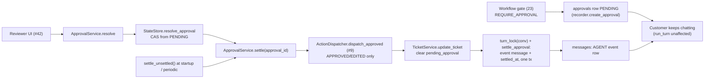

# Phase 3.2: Non-Blocking Approval Lifecycle & Resume Mechanism — Design Specification

**Issue**: `#10` ([Phase 3] 3.2: Non-Blocking Approval Lifecycle & Resume Mechanism)
**Date**: 2026-10-02
**Status**: Draft for Review
**Builds on**: 21-24, 31 (`ActionDispatcher`, `simulated_actions`; see `docs/plans/31-action_dispatcher/design.md`)
**Target Files**: `services/approval_service.py`, `services/models.py`, `services/ticket_service.py` (read-only use), `storage/models.py`, `storage/state_store.py`, `storage/approval_queries.py`, `storage/__init__.py`, `db/migrations/20261002_1200_approval-settled.sql`, `guardrails/models.py`, `guardrails/validator.py`, `agents/base.py`, `agents/models.py`, `orchestration/workflow.py` (also `_require_clean_message`), `orchestration/approvals.py`, `prompts/resolution.md`, `tests/services/test_approval_service.py`, `tests/orchestration/test_approval_resume.py`

---

## 1. Objective & Scope

Close the loop on high-impact actions. Today (21, 23): the Workflow gate turns `CREDIT` / `MFA_RESET` into `PENDING` approval rows and the customer is answered; nothing ever resolves a row, executes it, or tells the customer. This issue adds the reviewer-side lifecycle `PENDING -> APPROVED | EDITED | REJECTED` and the resume path:

1. **Resolve**: `ApprovalService.resolve` records a reviewer decision (CAS, 21).
2. **Execute**: approved/edited actions run through `ActionDispatcher.dispatch_approved` (issue #9); the dispatcher's `simulated_actions` row (key `approval:{approval_id}`) is the only idempotency record.
   2b. **Clear ticket**: the linked ticket leaves `pending_approval` (set by #9 `mark_pending`).
3. **Notify**: a deterministic event message lands in the conversation (customer sees it, later turns see it in history).
4. **Survive crashes**: any step interrupted by a restart is finished idempotently by `settle` / `settle_unsettled`, from Postgres state alone.

Non-blocking is already true in code (arch invariant 4, 21 `IDLE` after every turn, 23 gate returns the reply with `pending_actions`); this issue pins it with a test and must not regress it: no step here holds a lock across human wait time.

**Post-CR code facts (04e4767) this design builds on**: state and reply are one transaction (`StateStore.complete_turn(..., state, result)`, `recorder.save_state` is gone); `messages.result` stores the `TurnResult` envelope and `Workflow._replay` returns it for an answered `message_id`; `Workflow._require_clean_message` re-runs `check_outgoing_message` + `check_citations` on every Resolution output at the workflow boundary; `approvals` has a composite FK `(message_id, conversation_id) -> messages`; `AgentRole` lives in `agents.models` and `AgentTrace.agent_role` is that enum; `TurnSender`/`MessageSender` have no reviewer member; the store redacts JSON string leaves (`_redacted_json`) for traces and tool calls.

**Reused as-is**: `approvals` table, `Approval`, `ApprovalResolution` (validates EDITED iff `edited_payload`), `ApprovalStateError`, `StateStore.create_approval` / `resolve_approval` / `list_pending_approvals` (21), `StateStore.turn_lock` (24), `ActionType`, `check_action` gate (15/22/23), `message_id`-derived idempotency keys (23 recorder), #9 `ActionDispatcher`, `simulated_actions`, `TicketService`.

**Out of scope**: action execution itself and its audit trail (#9), reviewer UI (#42), customer chat polling/push (#41), SSE/websocket delivery (stored message is the event), reviewer authentication/RBAC, approval expiry/timeouts, LLM-written outcome replies, auto-ticket on rejection, re-verifying identity at approval time (decided: identity is already known, MFA included).

Not built, by decision (ponytail): outbox table, job queue/worker, message broker, `APPROVAL_PENDING` stage (21 removed it), per-reviewer assignment.

---

## 2. Ticket vs Code Reconciliation

| Ticket / sibling text | Code reality | Decision |
|---|---|---|
| `services/approval_service.py` owns "approval lifecycle" | 21 already ships row CRUD + CAS in `StateStore` (`approval_queries.py`); `ApprovalRecord` was deleted (21) | Service is a thin orchestration layer over `StateStore`; no second approval model or SQL. |
| "Credits/refunds of any amount (`POL-CREDIT`)" | `check_action(CREDIT)` -> `REQUIRE_APPROVAL` regardless of amount, only for verified account members; else `DENY` | Matches. Nothing to add. |
| "MFA resets (`POL-IDV`)" | `REQUIRE_APPROVAL` only for registered admin; else `DENY` | Matches. |
| "Malware/C2 verdict overrides ... support must reject/escalate" | `VERDICT_OVERRIDE` is always `DENY` (`POL-SEC`); the denial reason is appended to the reply; no approval row is ever created (21 §7 note) | No approval path. The ticket line is satisfied by the gate alone (single policy source, `check_action`); `StateStore` stays a pure persistence boundary and gets no duplicate type guard. A functional test pins "override proposal -> DENY text, zero approval rows". Divergence flagged. |
| "Reviewer action updates approval record" | `StateStore.resolve_approval(approval_id, ApprovalResolution, at)` exists | Reused. |
| "triggers conversation event to notify user" | `MessageSender` is `CUSTOMER/AGENT/SYSTEM` (no `REVIEWER`; 21 §4 draft had it, code dropped it); `complete_turn` only attaches a reply to an existing customer turn | New store primitive `append_event_message` (§3.2): a message in its own turn, no customer row. |
| "Conversation persists while waiting" | True: stage returns to `IDLE`; no `APPROVAL_PENDING` stage exists | Pinned by test only. |
| "Crash resilience: granted after restart resumes the right conversation" | `Approval.conversation_id` is the resume key; 21 tests rehydrate across connections | Extended: the *after-resolution* steps (execute, notify) are also crash-safe (§5). |
| 21 note: "resume re-invokes Resolution with approval outcome" | Resolution is a PydanticAI agent with output-validator retries; invoking it from a reviewer click means an LLM call in the reviewer's request path, a re-ground/re-guard step, a fresh `SupportDeps`, and a pre-turn identity re-resolution | **Superseded**: deterministic template (§4.3). Approval outcome reaches later LLM turns through history and `approved_actions` (§6). Flagged. |
| Ticket 9 says `request_service_credit` / `request_mfa_reset` "queue for human approval" | 23 `Workflow._answer` creates approval rows itself via `TurnRecorder.create_approval` after `gate_actions` | Single creator = Workflow (unchanged). #9 must treat these two as "execute after approval", not "create approval". Coupling flagged (Open questions). |
| #9 `request_*` "queue for approval" | #9 design (decided): no queueing at request time; `CREDIT`/`MFA_RESET` handlers run only after approval via `dispatch_approved`; Workflow is the sole approval-row creator | Aligned. `settle` calls `dispatch_approved` only. |
| #9 `mark_pending` sets ticket `pending_approval` on approval creation; `ticket_id` required in CREDIT/MFA payloads, stamped by Workflow from `OrchestratorState.active_ticket_id` | Nothing clears it | `settle` clears it (§3.10); edits must keep `ticket_id` (§3.11). |
| Ticket deliverable "persistence and restart tests" | `tests/storage/` already has approval-across-restart (21) | New tests cover post-resolution settle across restart and the interleaving cases. |

---

## 3. Structural Decisions

1. **Approach chosen: deterministic settle step, idempotent and sweepable.** Considered: (A) reviewer click synchronously runs a full resume turn through `Workflow` (LLM, guards, 80% of 23 re-entered; slow reviewer request; failure leaves approved-but-silent); (B) outbox table + background worker (new table, new process, polling loop; overbuilt for a take-home); (C) chosen: `resolve` = CAS, then `settle` = execute + notify, both idempotent, plus a startup/periodic `settle_unsettled` sweep driven by one nullable column. Crash-safe like B at a fraction of the cost, no LLM like C-variant of A.
2. **One new column, `approvals.settled_at timestamptz null`.** Set in the same transaction that writes the notification message. `status <> 'PENDING' and settled_at is null` is the entire "unfinished work" queue. Migration `db/migrations/20261002_1200_approval-settled.sql`, idempotent (`add column if not exists`, `create index if not exists ... where status <> 'PENDING' and settled_at is null`), re-applied by `db.init.seed.apply_schema`. `Approval` model gains `settled_at: AwareDatetime | None`. `approvals` stays out of `seed.dump` data (21 §2.8).
3. **Notification is a stored message, not a push.** The "conversation event" is an `AGENT` message in its own turn. Customer UI (#41) already lists `messages`; later turns read it via `_history` (AGENT rows of earlier turns are included, 23). No new channel.
4. **Event message gets its own turn number.** Attaching it to the last answered turn would be wrong: if a customer turn is open (customer row stored, reply not yet), `Workflow._stored_reply` would see the event row as the turn's reply and skip the real answer. A fresh `turn = last_turn + 1` with no CUSTOMER row cannot be mistaken for a reply and `_open_turn` ignores it.
5. **Settle takes `turn_lock(conversation_id)` around the event write.** Without it the event bumps `last_turn` while turn N runs; `complete_turn` then sees `turn != last_turn` and skips the `IDLE` stage flip (24 stale-retry guard) leaving the stage stuck. The lock is held only for the single short transaction (never across human wait, never across execute), so it adds at most one turn's latency to a notification and zero latency to customer turns. `TurnLockTimeout` -> not settled, retried by sweep.
6. **Execute before notify, never the reverse.** The customer must not be told "done" for an action that failed. `dispatch_approved` returns a typed `ActionResult` (#9 never raises); `FAILED` leaves the row resolved + unsettled and the sweep retries. Idempotency is #9's: `claim_action` on key `approval:{approval_id}` in `simulated_actions` returns the stored result on replay (`replayed=True`), so a crash after execute and before settle never re-runs the effect. This design keeps no idempotency record of its own. A stored `CLAIMED`-without-result row surfaces as `FAILED` (#9 "outcome unknown"); sweep keeps retrying (§5).
7. **Rejection executes nothing**, notifies with a fixed template. `reviewer_notes` is never sent to the customer (internal text; possible PII/policy detail). Edited: the template states the edited values, from `edited_payload`, never the original.
8. **`ApprovalService` is sync, per-connection, no clock reads**: constructed with `StateStore`, `ActionDispatcher`, `TicketService`, `CustomerService`, `SimulationClock`; same shape as `TicketService` / `StateStore` (sync, `asyncio.to_thread` at the API layer). One connection per concurrent caller (turn-lock rule, 24).
9. **Policy stays in `check_action`; service re-checks nothing.** The row exists only because the gate said `REQUIRE_APPROVAL`. The service does not re-run the gate or re-verify identity on resolve (decided, MFA included). #9's own defensive re-check in `dispatch_approved` still runs inside the dispatcher.
10. **`settle` clears the ticket's `pending_approval`** (contract from #9 §5.4a). `ticket_id` is required in every CREDIT/MFA `Approval.payload` (stamped by the Workflow from `OrchestratorState.active_ticket_id`, never model-written); `settle` reads it from `effective_payload`. If `TicketService.get_ticket` shows status `pending_approval`, call `TicketService.update_ticket(ticket_id, status="open")` for every outcome (approved, edited, rejected). Chosen status `open`: prior status is not recorded, `closed` would hide a still-open customer issue (a credit does not resolve the incident), `pending_customer` would wrongly wait on the customer; a human engineer owns what follows. Ticket no longer `pending_approval` (customer or reviewer moved it) -> untouched. `dispatch_approved` never changes ticket status (#9), so `settle` is the only clearer. Order: dispatch, clear ticket, notify. Clearing is idempotent (conditional on current status). A ticket-update failure (service raises, ticket missing) is logged by class name, recorded as an `ORCHESTRATOR` / `ERROR` trace (`StateStore.record_trace`, `turn` and `message_id` from the approval's proposing message, trace id `uuid5(approval_id, "ticket-clear")` so replays do not duplicate), then swallowed: the notice still goes out (decided).
11. **Edits must keep `ticket_id`.** #9 `dispatch_approved` returns `INVALID` for an edit that drops or changes it. `ApprovalService.resolve` fails fast on the same rule (`ApprovalStateError` before the CAS), so a bad edit never reaches `EDITED` with an undispatchable payload.

---

## 4. Contracts

### 4.1 Models (`services/approval_models.py` for decision/outcome contracts, `services/approval_notice.py` for notice text; frozen Pydantic, `StrEnum` per repo ADR-005, user-confirmed)
- **`ReviewerDecision`**: `approval_id: UUID`, `resolution: ApprovalResolution` (reused from `storage`; carries status, notes, `edited_payload`; EDITED-needs-payload validation already there) plus `customer_reason: str | None` (optional, customer-safe, reviewer-supplied; see §4.3). `customer_reason` is persisted in new column `approvals.customer_reason text null` (same migration as `settled_at`), written by the same CAS: `StateStore.resolve_approval` gains an optional `customer_reason` argument (default `None`); `ApprovalResolution` is NOT changed, so the field has one home (`ReviewerDecision`) and matches what #12 builds. `Approval` gains `customer_reason` and `settled_at`. Internal `reviewer_notes` stays internal.
- **`SettleOutcome(StrEnum)`**: `SETTLED`, `ALREADY_SETTLED`, `EXECUTION_FAILED` (dispatcher returned `FAILED`/`REFUSED`/`INVALID`), `BUSY` (`TurnLockTimeout`). Returned, not raised: callers (UI, sweep) branch on it; unknown ids and `PENDING` rows raise `ApprovalStateError` (caller bug).
- **`ApprovalNotice`** (frozen model, deterministic text): `from_approval(approval: Approval) -> ApprovalNotice` classmethod (user rule: classmethod on the target, no `format_x`). Fixed templates per (`ActionType`, status): credit approved / credit edited (shows edited fields) / credit rejected; MFA reset approved / edited / rejected. Fields shown come from an explicit per-`ActionType` allowlist of payload keys, so free-form payload content never leaks; text carries no citation markers or numbers other than payload amounts, so it passes `check_outgoing_message` **when the approval's own grant is supplied** (a credit amount in a credit sentence is a violation without a grant); asserted by a test that builds the grant with the Task-3 helper. Lives in `services/approval_notice.py`.
- **Dispatcher dependency (#9, no local port)**: `ActionDispatcher.dispatch_approved(approval: Approval, context: DispatchContext) -> ActionResult` (#9 §5.3): rejects `PENDING`/`REJECTED`, uses `edited_payload` for `EDITED` (must keep `ticket_id`), idempotent via `simulated_actions` key `approval:{approval_id}`; #9 `mark_pending` already audited key `approval:{approval_id}:pending` at creation. `DispatchContext` (#9 §4: `identity`, `priority`, `sev1_corroborated`, `already_paged`, `conversation_id`, `message_id`) is built by `ApprovalService` from the conversation row: `identity = CustomerService.authenticate_caller(conversation.contact_email, conversation.account_id)`, `conversation_id`, `message_id = approval.message_id`; `priority="P4"`, `sev1_corroborated=False`, `already_paged=False` are neutral defaults, irrelevant for CREDIT/MFA (not Sev-1 gated; #9 §5.3; accepted). Only `CREDIT` and `MFA_RESET` ever reach it. `Approval.effective_payload` property (edited else original) added to `storage/models.py` for notices and grants.

### 4.2 `ApprovalService` (`services/approval_service.py`)
`__init__(store: StateStore, dispatcher: ActionDispatcher, tickets: TicketService, customers: CustomerService, clock: SimulationClock) -> None`.

| Method | Input -> Output | Behavior |
|---|---|---|
| `list_pending` | `conversation_id: UUID \| None = None` -> `list[Approval]` | Query; reviewer queue. Delegates to `StateStore.list_pending_approvals`. |
| `resolve` | `decision: ReviewerDecision` -> `Approval` | Command. Pre-CAS checks (pure, fail fast with `ApprovalStateError`): for `EDITED`, same payload keys as the original (so `ticket_id` is kept, §3.11) and `check_action` re-run on the edited payload with the conversation's identity must still be `REQUIRE_APPROVAL` (an edit cannot turn a request into one the gate would DENY; #12 expects this); `customer_reason` guard check (§4.3, uses the conversation's `guard_history`). `StateStore.resolve_approval` CAS (second reviewer gets `ApprovalStateError`). Returns the resolved row. Does **not** settle: reviewer UI calls `settle` next (CQS; also lets the sweep reuse `settle`). |
| `settle` | `approval_id: UUID` -> `SettleOutcome` | Command, idempotent: (1) load row; `PENDING` -> `ApprovalStateError`; `settled_at` set -> `ALREADY_SETTLED`. (2) `APPROVED`/`EDITED` -> `dispatcher.dispatch_approved(row, context)`; result status other than `DONE` -> log, `EXECUTION_FAILED`. (2b) clear ticket per §3.10 (all outcomes, including REJECTED, which skips step 2). (3) `with store.turn_lock(conversation_id)`: `StateStore.settle_approval(...)` writes the notice + `settled_at` atomically; `TurnLockTimeout` -> `BUSY`. (4) `SETTLED`. |
| `decide` | `decision: ReviewerDecision` -> `DecisionResult` | Command. `resolve` then `settle`; see §5b. |
| `settle_unsettled` | `limit: int = 50` -> `tuple[SettleOutcome, ...]` | Command. Called from the app lifespan only (decided; no timer, no hot-path call); retries failing rows on every call, forever (demo scope). `StateStore.list_unsettled_approvals(limit)` then `settle` each; one failing row never stops the rest. |

`resolve` then `settle` stay separate so a reviewer action returns fast with the decision durable, and a crash between them is the exact case the sweep exists for.

### 4.3 Notification text rules
Template per outcome; credit approved example in prose: "Your service credit request has been approved by our Escalation Board." plus allowlisted fields (amount, currency, site) from the effective payload. Rejected: "Your service credit request was reviewed and could not be approved." followed, when `Approval.customer_reason` is set, by "Reason: <customer_reason>", then "Reply here if you want to discuss alternatives or request an engineer." The reason is reviewer-typed free text, so it is passed through `guardrails.redactor.redact` and `check_outgoing_message` at `resolve` time; a violation (secret echo, amount promise, uncited claim) raises `ApprovalStateError` before the CAS, so the reviewer must rewrite it. It is shown for APPROVED/EDITED too if present. No reviewer names, no `reviewer_notes`, no policy IDs unless the template hardcodes them. Templates are one module-constant table keyed by `(ActionType, ApprovalStatus)`, like `orchestration/canned.py`. One notice per approval (decided; several resolved in one turn produce several event messages).

### 4.4 `StateStore` / `approval_queries.py` additions (21 files)
- `append_event_message` is internal to `settle_approval` (not public): inserts `AGENT` message with `turn = last_turn + 1` (row-locked `_lock_conversation`, bumps `last_turn`; stage untouched), id `uuid5(approval_id, "outcome")` so a replay returns the existing row.
- `settle_approval(approval_id: UUID, content: str, at: datetime) -> StoredMessage`: one transaction: lock conversation, no-op if `settled_at` already set (returns stored message), else insert event message + `update approvals set settled_at`. Requires non-`PENDING`.
- `list_unsettled_approvals(limit: int) -> list[Approval]`: `status <> 'PENDING' and settled_at is null order by resolved_at`.
- No type guard in the store (see §2 VERDICT_OVERRIDE row).
- `get_message`-style lookups reuse `list_messages` filtered by id (small per-conversation read); no new public method.

### 4.5 Per-payload grants (replaces type-level `approved_actions`)
Problem: `check_outgoing_message(message, history, approved: frozenset[ActionType])` and `SupportDeps.approved_actions` authorize by action type, so an approved $500 credit would also license a promised $5,000. Decided: authorize by the approved payload.
- `guardrails/models.py`: new frozen `ApprovedGrant(action_type: ActionType, approval_id: UUID, payload: dict[str, str])`. `payload` is the approval's effective payload (edited when EDITED), so an edit binds the edited amount, not the original.
- `guardrails/validator.py::check_outgoing_message` takes `grants: tuple[ApprovedGrant, ...]` instead of `approved`. The rule table (`_OUTPUT_RULES`) replaces `approved_by: ActionType | None` with a matcher per rule: `CREDIT_AMOUNT_PROMISE` passes only when every currency amount in the sentence equals (as `Decimal`, same currency) the `amount` of some `CREDIT` grant; `MFA_RESET_CLAIM` passes when any `MFA_RESET` grant exists (the claim sentence names no payload field; MFA binds to the approval, one grant per approved reset). No grant -> violation as today (SC-03 unchanged).
- `agents/base.py::SupportDeps.approved_actions` becomes `approved_grants: tuple[ApprovedGrant, ...]`; `agents/resolution.py` passes it to the validator; every test constructing `SupportDeps` is updated (one shared fixture default `()`).
- `orchestration/approvals.py`: one frozen `ApprovalContext(grants, unsettled)` with classmethod `from_approvals(approvals: Sequence[Approval]) -> ApprovalContext` (one read, two derived views, no duplicated filtering). `grants` = APPROVED/EDITED rows **with `settled_at` set** (effective payload): a grant exists only once the customer was notified and the action executed, so a reply can never quote an amount whose dispatch failed or is still retrying. `unsettled` = §4.6 views. `Workflow._run_locked` builds it from `StateStore.list_approvals(conversation_id)` and sets `SupportDeps.approved_grants`; `base_deps` default is `()`.
- Currency match: payload `currency` (default `USD`) is compared with the symbol/code adjacent to the quoted amount (`$`/USD, `€`/EUR, `£`/GBP), amount compared as `Decimal` after stripping thousands separators.
- Consequence: after approval of $500, a reply quoting $500 passes; quoting $5,000 or an unrelated credit is `CREDIT_AMOUNT_PROMISE`.

### 4.6 Unsettled approvals fed to Resolution (customer status questions)
- `agents/models.py`: new frozen `UnsettledApprovalView(action_type: ActionType, status: ApprovalStatus, requested_at: AwareDatetime)` (renamed from `UnsettledApprovalView`: it also covers APPROVED/EDITED/REJECTED rows whose notice has not gone out yet, otherwise a customer asking during the "finalizing" window would see nothing); deliberately no payload (an amount in a reply would be an unapproved promise and the guard would reject it). `ResolutionInput` gains `unsettled_approvals: tuple[UnsettledApprovalView, ...] = ()`.
- `Workflow._resolve` fills it from `ApprovalContext.unsettled` (rows of this conversation read before the turn; approvals created this turn are `pending_actions`, not included).
- `prompts/resolution.md`: when asked about a request listed in `unsettled_approvals`: `PENDING` -> awaiting Escalation Board review; other statuses -> "reviewed, you will get a confirmation here shortly" (never state the decision, the notice does); give no amount, outcome or ETA beyond POL-CREDIT / POL-IDV text, do not propose a duplicate action. Settled outcomes reach the model as the AGENT event message in history.
- Test: "status of my credit?" while PENDING and again while APPROVED-unsettled -> stub Resolution receives the view; real guard still rejects an amount promise.

### 4.7 Workflow changes summary
Only: grants built per conversation (§4.5), `unsettled_approvals` passed to Resolution (§4.6). No lock change, no new stage, `run_turn` signature unchanged.

---

## 5. Crash Resilience Matrix

| Crash point | Durable state after restart | Recovery |
|---|---|---|
| Before CAS | row `PENDING` | Reviewer retries; no side effects happened. |
| After CAS, before `settle` | resolved, `settled_at` null | `settle_unsettled` sweep. |
| After execute, before settle commit | resolved, unsettled, action executed | Sweep re-calls `dispatch_approved`; replay returns the stored `simulated_actions` result (#9 key `approval:{approval_id}`), effect not repeated. |
| Inside `settle_approval` tx | rolled back | Same sweep. Message + `settled_at` are atomic: never a notice without the flag or the reverse. |
| Two workers settle same row | row lock in `settle_approval` | Second sees `settled_at` set, returns existing message (`ALREADY_SETTLED`). Dispatcher replay-safe (#9 unique key). |
| Worker holding turn lock killed | lock released with backend (24) | Sweep takes it next pass. |
| Executor permanently failing | resolved, unsettled forever | Sweep keeps retrying every pass, forever (decided, demo scope); surfaced as `EXECUTION_FAILED` in logs/outcomes; no customer notice. |

"Resumes the right conversation": `Approval.conversation_id` is the only key; `settle` takes the lock and writes into that conversation from a fresh process with nothing but `approval_id`.

## 5b. Interface for UIs (#12 reviewer UI adopts this)

Single module: `services/approval_service.py`, class `ApprovalService` (sync; call via `asyncio.to_thread` from async UIs; one connection per concurrent caller). Reviewer UI needs exactly these:

| Call | Signature | Use |
|---|---|---|
| `list_pending` | `(conversation_id: UUID \| None = None) -> list[Approval]` | Reviewer queue; `None` = all conversations. |
| `get_approval` | `(approval_id: UUID) -> Approval \| None` | Detail pane. |
| **`decide`** | `(decision: ReviewerDecision) -> DecisionResult` | **The one entry point for Approve / Edit / Reject.** Runs `resolve` then `settle`. |
| `resolve`, `settle` | as §4.2 | Lower-level pair; UIs should not need them. |

- `ReviewerDecision(approval_id: UUID, resolution: ApprovalResolution, customer_reason: str | None = None)`; build `ApprovalResolution(status=APPROVED)`, `(status=EDITED, edited_payload=...)` or `(status=REJECTED, reviewer_notes=...)`. Models live in `services/approval_models.py` / `storage/models.py`. **`ApprovalService` is not re-exported from `services/__init__.py`**: `actions.dispatcher` imports `services.ticket_service`, and `services/approval_service.py` imports `actions`, so an eager re-export would create an import cycle. Import by module path.
- `DecisionResult(approval: Approval, settle: SettleOutcome)`, frozen. `settle != SETTLED` still means the decision is durable (e.g. `BUSY`, `EXECUTION_FAILED`); the UI shows "decision saved, customer notice pending" and the lifespan sweep finishes it.
- Errors: `ApprovalStateError` (unknown id, already resolved, edit without/with changed `ticket_id`, unsafe `customer_reason`): show to the reviewer, do not retry. Reviewer UI must not write `approvals`/`messages` directly.
- `decide` is `resolve` + `settle` in sequence with no logic of its own (SRP); crash between them is covered by the sweep (§5).

---

## 6. Data Flow, End to End (SC-03 shape)

1. Turn N: customer asks for a $500 credit; Resolution proposes `CREDIT`; gate returns `REQUIRE_APPROVAL`; recorder inserts `PENDING` row keyed `"{message_id}:{index}"`; reply says it is filed. Stage `IDLE`.
2. Turn N+1 (still pending): unrelated question answered normally; `approved_grants` empty so a credit-amount promise is still blocked; if the customer asks for status, Resolution sees the `UnsettledApprovalView`.
3. Reviewer (other process) `resolve(APPROVED)` then `settle`: dispatcher runs, ticket cleared to `open`, lock taken for one short tx, event turn N+2 inserted: "approved".
4. Process restarts at any moment between 1 and 3: nothing lost (§5).
5. Turn N+3: customer asks "so is it done?": history contains the approval event; `approved_grants` holds the $500 grant; Resolution may quote $500, but not any other amount.

---

## 7. Testing & Verification

Functional, real Postgres, scripted stub agents (23 `conftest.py`), the real `ActionDispatcher` over a recording stub handler map (and a real `TicketService`), zero LLM. "Restart" = new connection + new `StateStore` + new `ApprovalService` (21 pattern).

1. `tests/services/test_approval_service.py` (lifecycle): resolve APPROVED / EDITED (notice shows edited values, dispatcher request carries the edited payload) / REJECTED (no dispatch, `reviewer_notes` absent, `customer_reason` present after redact check from customer text); second `resolve` raises `ApprovalStateError` and does not double-notify; `settle` on `PENDING` raises; `settle` twice -> `ALREADY_SETTLED`, one message, one `simulated_actions` row; `create_approval` for `VERDICT_OVERRIDE` rejected; ticket `pending_approval` -> `open` for approved/edited/rejected, untouched when already moved; edit dropping/changing `ticket_id` rejected before CAS; ticket-update failure -> trace row, notice still sent; unsafe `customer_reason` rejected before CAS; reviewer queue spans conversations.
2. `tests/orchestration/test_approval_resume.py` (the headline tests):
   - Non-blocking: pending credit; a second customer turn is answered, stage `IDLE`, approval still `PENDING`.
   - Resume after restart: resolve in connection A, drop everything, new connections, `settle_unsettled` -> event message in the right conversation only, one `simulated_actions` row, a following customer turn sees the event in agent history and `approved_grants` holds the credit grant.
   - Crash between CAS and settle (settle not called) then restart sweep; crash after execute before commit (`settle_approval` forced to fail once) then sweep: one `simulated_actions` row, one notice.
   - Interleaving: a customer turn open (stub agent blocks on an event) while `settle` runs: `settle` waits on the turn lock, then notice lands in a later turn; the open turn's reply is the real answer (not the event), stage ends `IDLE`.
   - `TurnLockTimeout` during settle -> `BUSY`, nothing written, next sweep settles.
   - Dispatcher returns `FAILED` -> `EXECUTION_FAILED`, no notice, row remains in `list_unsettled_approvals`; every later pass retries until it succeeds.
   - SC-03 grant binding: before approval a `$500` credit promise is rejected; after approval it passes; `$5,000` still rejected; after EDITED to `$300`, `$300` passes and `$500` is rejected.
3. `tests/guardrails/test_validator.py` (addition): `ApprovedGrant` matching for credit amount (equal, different, currency mismatch) and MFA claim.
4. `tests/services/test_approval_notice.py` (one parametrized pure check): every `(ActionType in {CREDIT, MFA_RESET}, status in {APPROVED, EDITED, REJECTED})` has a template; output passes `check_outgoing_message` and `redact` unchanged; non-allowlisted payload keys never appear.
5. `tests/storage/test_schema.py` (addition): migration idempotent with the new columns (`settled_at`, `customer_reason`); partial index exists; runtime tables still excluded from dump.

---

## 8. Review Focus
1. Notice and `settled_at` atomic; replay never duplicates. 2. Event turn can never be read as a customer turn's reply. 3. Dispatcher failure never produces a customer-visible "done". 4. Turn lock never held across execute or human wait. 5. `reviewer_notes` and non-allowlisted payload keys never reach the customer; `customer_reason` is guard-checked. 7. An approval authorizes only its own payload. 6. `VERDICT_OVERRIDE` cannot get an approval row.

---

## 9. Cleanup (final step)
1. Read every new/modified file end to end; no unused imports, constants, models or helpers; every `SettleOutcome` member exercised by a test.
2. Grep: no `datetime.now` in `services/approval_service.py` / `storage/`; no inline imports; no `Literal` for enum-like fields; nothing duplicates 21 CRUD (`ApprovalService` has no SQL, no second approval model).
3. Confirm no reader of `approved_actions` / `frozenset[ActionType]` approval param remains after the grants change; no local idempotency record or `ActionExecutor` leftover.
4. Pyright `standard` and ruff clean; every function fully typed, `-> None` included; f-strings only.
5. Docs: architecture doc §9 sequence diagram (settle step, event message, notification wording, per-payload grants), §12 layout (`services/approval_service.py`, migration file), ER (`approvals.settled_at`, `customer_reason`); ADR (next free number) in `docs/overview/decisions.md`: deterministic settle + sweep over resume-turn/outbox; notification as own-turn event message; per-payload approval grants.

---

## 10. Decisions

User decisions (applied above):
1. Executor port replaced by #9 `ActionDispatcher.dispatch_approved(approval, context)`; idempotency record is #9's `simulated_actions` (key `approval:{approval_id}`); none of our own.
2. `settle` clears ticket `pending_approval` via `TicketService.update_ticket` -> `open` for all outcomes (§3.10).
3. Workflow is the only creator of approval rows.
4. Sweep retries failing dispatch forever (demo).
5. Sweep triggered by app lifespan only.
6. MFA: no identity re-verification at approval time.
7. Grants bound per payload (§4.5); edited payload binds the edited value.
8. Rejection notice carries an optional reviewer-supplied, guard-checked `customer_reason` (§4.3).
9. Unsettled approvals fed to Resolution as `UnsettledApprovalView` (§4.6).
10. Post-approval event sender: `AGENT`.
11. Multiple approvals: one notice each.
12. Neutral `DispatchContext` defaults accepted; MFA grant not payload-bound; ticket-update failure in `settle` logged + traced + swallowed; changing 15/22 guardrails signatures and tests inside this issue.
13. Enums: `StrEnum` fine.

## 11. Post-CR reconciliation (04e4767)
1. **Settle write vs one-transaction turn completion.** `settle_approval` writes only the event message (`result` column null: the envelope exists for turn replies only) and `settled_at`; it never touches `conversations.state`, so it cannot conflict with `complete_turn`'s state+reply transaction. The turn lock still serializes them.
2. **Replayed envelope staleness.** A retried (duplicate `message_id`) turn returns its stored `TurnResult`, whose `pending_actions` are the ones proposed at that time and stay so after the approval is resolved. Decided: the envelope is a historical record of that turn; nobody may infer live status from it. Live status comes from `approvals` (customer banners in 41, reviewer board in 42, `UnsettledApprovalView` for the model). No overlay on replay (it would make a replay differ from the original answer and add a store read to the idempotent path).
3. **`_require_clean_message` takes grants.** It currently calls `check_outgoing_message(..., deps.approved_actions)`; the grants change (§4.5) must update this call too, so a settled approval's own amount passes the boundary check while any other amount raises `OutgoingMessageRejected` (turn becomes the pause reply). The Resolution agent's own validator runs first and retries to the canned handoff, so the boundary check normally fires only for injected ports (tests) or a validator bug.
4. **FK and notice linkage.** `create_approval` is unchanged (proposing message must belong to the conversation, now DB-enforced). The event message has no FK link to the approval (`approvals.message_id` stays the proposing customer message); link is the deterministic message id plus `settled_at`. Migration name `20261002_1200_approval-settled.sql` sorts after `20261002_1100_*` and cannot tie with `20261002_1000_message-result.sql`.
5. **Enums.** The ticket-clear failure trace uses `AgentRole.ORCHESTRATOR` from `agents.models`, `TraceStatus.ERROR`, built as `AgentTrace` then `TraceRecord.from_agent_trace` (same path as `TurnRecorder.record_failure`). The notice sender is `MessageSender.AGENT`; no reviewer sender exists anywhere.
6. **Redaction of reviewer/approval text.** Reviewer-controlled text enters the DB via approvals and the event message, which the CR redaction does not cover. `StateStore` (the chokepoint, like traces) redacts: `payload` and `edited_payload` via the existing `_redacted_json`, `reviewer_notes` and `customer_reason` via `guardrails.redactor.redact`, and the event message content via `redact` in `settle_approval`. No new redaction code. Realistic payload values (amount, currency, `ticket_id`, `incident_id`, `period`, `user_email`) must survive unchanged (test, entropy false-positive guard). `tests/storage/test_no_secret_in_rows.py` is extended with an approval resolved with a PSK in `reviewer_notes`, `customer_reason`, `edited_payload` plus a settle; the PSK must be absent from `approvals` and `messages`.

## 12. Open questions
None.

## 13. Design fixes found while planning
1. Removed the store-level `VERDICT_OVERRIDE`/type guard (duplicated `check_action`, broke `StateStore` purity).
2. Notice text is only guard-clean with its own grant; claim corrected.
3. Grants require `settled_at`: no quoting an amount whose dispatch failed or is retrying.
4. Status view covers APPROVED-unsettled rows (finalizing window).
5. `customer_reason` lives only on `ReviewerDecision` (not duplicated in `ApprovalResolution`).
6. `resolve` re-runs `check_action` and key-set check on edits (expected by #12).
7. No eager `services/__init__` re-export of `ApprovalService` (import cycle with `actions`).
8. `SettleOutcome` is `StrEnum`.
9. Tracing: no Braintrust anywhere; ticket-clear failure uses the existing `traces` table via `StateStore.record_trace`; PydanticAI agents untouched except `ResolutionInput` field and prompt text.
