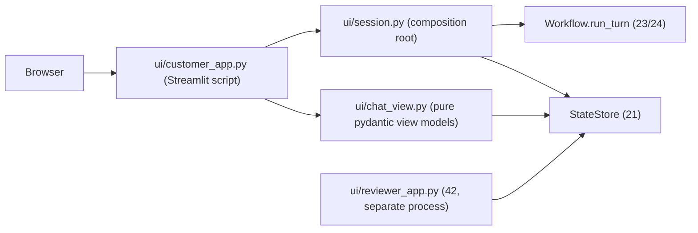

# Phase 4.1: Customer Support Chat View — Design Specification

**Issue**: `#11` ([Phase 4] 4.1: Customer Support Chat View)
**Date**: 2026-10-02
**Status**: Draft for Review
**Target Files**: `ui/__init__.py`, `ui/customer_app.py`, `ui/chat_view.py`, `ui/session.py`, `ui/scenarios.py`, `guardrails/citations.py` (+ export), `orchestration/recorder.py`, `orchestration/workflow.py`, `storage/state_store.py` (one read), `pyproject.toml`, `Dockerfile`, `docker-compose.yml`, `tests/ui/*`, `tests/orchestration/*`
**Depends on**: 21 (`StateStore`), 23/24 (`Workflow.run_turn`, `TurnLockTimeout`), 31 (dispatcher, issue #9), 32 (approval lifecycle/resume, issue #10). **Sibling**: 42 (reviewer board, issue #12).

---

## 1. Objective & Scope

Deliverable B, customer half: a chat page where a customer talks to the agent, sees where each claim comes from, sees the telemetry the agent actually used, and sees whether anything is waiting on a human. The page is a thin view over what 21/23 already persist; it holds no business logic and no source of truth (state lives in Postgres, rehydrated by `conversation_id`).

Ticket features and how each is met:
1. Multi-turn live chat: `Workflow.run_turn(conversation_id, message, message_id)` per submit; history rendered from `StateStore.rehydrate(...).messages`.
2. Citation badges to public KB / policy docs: persisted citations on the reply message (section 4.2).
3. Telemetry evidence chips: `StoredMessage.telemetry_evidence` (already persisted by `complete_turn`).
4. Pending escalation/approval banners: `StateStore.list_approvals(conversation_id)` (section 4.4).
5. Account / scenario switcher: sidebar over `data/eval/scenarios.jsonl` plus free-form email (section 4.5).

Out of scope: reviewer UI (42), executing approved actions (31/32), trace panel (reviewer side per issue; task text also wants "UI surfaces trace for current conversation", covered by 42, flagged in section 8), auth beyond email (identity is server-side `authenticate_caller`, chat claims never trusted), token-level streaming (section 3.2), multi-user session hardening, i18n.

## 2. Ticket vs Code (reconciliation)

| Ticket / architecture doc says | Code reality | Decision |
|---|---|---|
| Deliverable `ui/customer_app.py` | No `ui/` package, no API layer, no entrypoint that builds `Workflow`; no UI dependency in `pyproject.toml`; Dockerfile pip-lists deps by hand | Add `ui/` package, `streamlit` dep (pyproject + Dockerfile), composition root `ui/session.py` |
| "Live responses" | `run_turn` is sync and returns the finished reply once; no token stream, no progress hook | Spinner during the turn + polled stage label (3.2); no streaming |
| "Citation badges linking to KB / policy docs" | `TurnRecorder.complete_turn` passes `()` as citations to `StateStore.complete_turn`; the `messages.citations` column exists but is always empty. Reply text carries inline markers `[kb:slug#anchor]`, `[policy:ID]`, `[telemetry:tool]` (validated by `guardrails.check_citations`). `RetrievedPassage` has `public_url`, `title`, `heading` | Persist citations at turn end from the grounding bundle (4.2). Small change to 23 files |
| Policy docs "linking" | Policies are local `data/policies/*.md` / `policies` table, no public URL | Policy badge opens an in-app dialog with the body (4.2) |
| "Pending escalation status banners" | `TurnResult.escalation_offered` is not persisted; only `approvals` rows are | Banners derive from approvals only; the escalation-offered flag shows for the live turn only (4.4, Q2) |
| Telemetry chips | `StoredMessage.telemetry_evidence` persisted. Architecture doc quotes `[telemetry]`, code uses `[telemetry:<tool>]` | Chips from stored evidence; inline `[telemetry:tool]` markers stripped from display text |
| Scenario switcher | `scenarios.jsonl` has 12 scenarios with `customer_id`, `requester_email`, `opening_message`, followups | Switcher reads that file; no new data |
| Approval resolution reaches the customer | Issue #10 / plan 32 not in code yet; `MessageSender` is `CUSTOMER/AGENT/SYSTEM` (no REVIEWER; `TurnSender.REVIEWER` exists only in agent history) | Render any non-customer sender as "Support"; flagged as coupling (Q4) |
| Enums via `AtiIntEnum` (user rule) | Repo uses `StrEnum` (`novia_shared` is not a dependency) | Follow repo (`StrEnum`) for view enums, same as 21-24; Q7 |

## 3. Structural Decisions

### 3.1 Framework: Streamlit (chosen)
| Option | For | Against |
|---|---|---|
| A. Streamlit | Matches `ui/customer_app.py` as one Python file; `st.chat_message`, `st.chat_input`, sidebar, `st.dialog`, `st.fragment(run_every=)`; `streamlit.testing.v1.AppTest` gives functional tests with no browser; reviewer app (42) can be a second script | Script rerun model; no real streaming of the sync pipeline |
| B. Chainlit | Chat-native, steps UI | Own session/auth model, awkward to share one script shape with the reviewer dashboard, harder to test without browser |
| C. FastAPI + JS front end | Full control, true streaming | Two languages, an API layer nobody asked for, 80% of the effort for zero ticket value (YAGNI) |

Chosen A. Streamlit is a new dependency (only one added).

### 3.2 "Live" responses
`run_turn` blocks for seconds and runs in the script thread. The page shows `st.spinner` ("Working on it") only; a live stage label would need a worker thread plus a second DB connection polling `conversations.stage`, cosmetic gain for v1 (Q3). Approval banners refresh via a fragment polled every 5 s while the script is idle.

### 3.3 Where logic lives (SRP)
- `ui/customer_app.py`: rendering and event wiring only (chat input, sidebar, dialogs). No SQL, no parsing.
- `ui/chat_view.py`: pure, frozen pydantic view models plus `@classmethod` converters (per user rule, no `format_x` functions): `ChatView.from_snapshot(snapshot, approvals)` builds the ordered list of `MessageView` (sender role, display text, `CitationBadge` tuple, `EvidenceChip` tuple) and `ApprovalBanner` tuple. Zero Streamlit imports, so it is unit-testable and reused unchanged by 42 if wanted.
- `ui/session.py`: composition root. `build_runtime() -> UiRuntime` (cached with `st.cache_resource`) constructs `SimulationClock`, `CustomerService`, `RetrievalService` (embedder/reranker pre-load at boot per project memory, so the first turn is not cold), `AgentPorts`, `SupportDeps`, and a `Workflow` factory. Per submit: open a fresh connection and `StateStore`, build `Workflow`, call `run_turn`, close. Rule from 24: one connection per concurrent turn; never share one across Streamlit sessions/threads.
- `ui/scenarios.py`: `Scenario` frozen model plus `load_scenarios(path) -> tuple[Scenario, ...]` from `data/eval/scenarios.jsonl` (only `scenario_id`, `customer_id`, `requester_email`, `persona`, `opening_message`).

### 3.4 Identity and conversation lifecycle
- Sidebar: scenario selectbox (12 + "Custom") and an email text field (prefilled from the scenario's `requester_email`). Selecting a scenario starts a new conversation: `StateStore.create_conversation(account_id, email, tier, at)` with identity from `CustomerService.authenticate_caller(email)`; the new `conversation_id` goes in `st.session_state`. No claimed account/tier input in the UI: the orchestrator already re-derives identity per turn from account data, and the UI never offers a field that could be trusted by mistake.
- "Load opening message" button puts the scenario's `opening_message` in the input (not auto-sent; customer clicks send). Followups are not driven by the UI (the eval harness owns the simulated customer).
- Reload/restart continuity: `conversation_id` is mirrored into `st.query_params`; on load, `rehydrate` restores the full transcript. Unknown/garbage id -> start fresh.
- Message id: client generates `uuid4` per submit and keeps it in `st.session_state` until the turn returns, so a Streamlit rerun mid-turn or a retry after `TurnLockTimeout` reuses the same id (24 idempotency makes this safe).

### 3.5 Error surface
- `TurnLockTimeout`: inline notice "Still working on your previous message, retry" with a retry button reusing the same `message_id`.
- `StateVersionError` (24): generic "service updating, retry" notice (retry lands on a new worker).
- Any other exception from `run_turn`: caught by 23's boundary already (pause message stored); UI shows whatever reply came back. The UI adds no broad `except`.
- Injection refusal, outage notices, clarifying questions arrive as ordinary reply text; no special UI.

## 4. Contracts

### 4.1 View models (`ui/chat_view.py`, all `BaseModel(frozen=True)`)
- `BadgeKind(StrEnum)`: `KB`, `POLICY`.
- `CitationBadge`: `kind`, `label`, `url: str | None` (KB only), `ref: str` (slug#anchor or policy id).
- `EvidenceChip`: `tool_name`, `text` (`metric_key raw_value`), `timestamp`, `is_anomaly`.
- `MessageView`: `role` (customer / support), `text` (inline markers stripped), `citations`, `evidence`, `created_at`.
- `ApprovalBannerState(StrEnum)`: `PENDING`, `APPROVED`, `REJECTED` (EDITED shown as APPROVED to the customer).
- `ApprovalBanner`: `state`, `title` (from `ActionType`, fixed mapping dict, exhaustive via `match` with `assert_never`), `detail` (fixed copy, no payload echo beyond credit amount if present, no reviewer notes, no `edited_payload`).
- `ChatView`: `messages`, `banners`; `from_snapshot(snapshot: ConversationSnapshot, approvals: Sequence[Approval]) -> ChatView`.

### 4.2 Citation persistence (touches 23 files; the main cross-cutting change)
- New `guardrails/citations.py`: `extract_markers(message: str) -> tuple[CitationMarker, ...]` reusing the regexes already in `guardrails/validator.py` (move/share, no duplicate patterns; `check_citations` calls it). Exported via `guardrails/__init__.py`. `strip_markers(message) -> str` for display text.
- `orchestration/workflow.py` `_finish` gets the final reply plus `KnowledgeBundle | None`; a new pure `Citation.from_marker(marker, bundle)` classmethod (in `orchestration/models.py`) maps KB markers to `{kind: "KB", slug, anchor, title: heading, url: public_url}` and policy markers to `{kind: "POLICY", policy_id, title}` using `retrieved_passages` and `referenced_policies`. Markers not in the bundle cannot occur (output guard already rejects them); they are dropped, never guessed.
- `TurnRecorder.complete_turn(text, evidence, citations)` forwards a tuple of `dict[str, str]` to the existing `StateStore.complete_turn(... citations ...)` argument (already in the signature; column exists). Replay path (`_replay`) is unchanged: citations come from the stored message.
- Telemetry markers need no citation rows: chips come from `telemetry_evidence`.
- Policy dialog body: `StateStore` gains one read, `get_policy_body(policy_id: str) -> str | None`, over the existing `policies` table (avoids importing `RetrievalService`, which pulls the embedding stack). Alternative of `RetrievalService.get_policy` rejected for that reason, except in `ui/session.py` where `RetrievalService` is already built; either is fine, pick the store read for testability without models (Q5).

### 4.3 Telemetry chips
One chip per `StoredMessage.telemetry_evidence` item, deduped by `(tool_name, metric_key, raw_value)`; text is the verbatim `metric_key raw_value`, `is_anomaly` styles it as warning, tooltip shows tool name and simulation timestamp. Chip click does nothing (no deep link target exists).

### 4.4 Banners
Derived each render from `StateStore.list_approvals(conversation_id)` (not `pending_only`, so resolution flips the banner instead of making it vanish). Mapping: `PENDING` -> "Awaiting review by our support team" with action title; `APPROVED`/`EDITED` -> "Approved"; `REJECTED` -> "Declined". Customer-facing strings only, no reviewer notes. A live-turn-only extra banner when `TurnResult.escalation_offered` is true. Non-blocking: input stays enabled while banners are pending (architecture doc, non-blocking HITL).

### 4.5 Fragment refresh
Banner block is a `st.fragment(run_every=5)`; on a state change from PENDING it triggers a full rerun so any new support message (from 32's resume turn) appears in the transcript.

## 5. Dependency / Coupling Notes
- 31 (dispatcher, #9) / 32 (lifecycle, #10): UI only reads `approvals` rows and messages. Needs from 32: after resolution a customer-visible message is written to `messages` (any non-customer sender), and approval status transitions stay `PENDING -> APPROVED|EDITED|REJECTED`. If 32 adds statuses (e.g. `EXECUTED`, `FAILED`), the banner mapping's exhaustive `match` fails type-check and must be extended.
- 42 (reviewer, #12): separate Streamlit script, separate process, shared Postgres; may reuse `ui/chat_view.py` models and `ui/session.py` runtime; no import of `customer_app.py`.

## 6. Testing & Verification

Functional, `streamlit.testing.v1.AppTest`, real Postgres via existing `tests/conftest.py`, scripted stub agents from `tests/orchestration/conftest.py`, zero LLM, no browser.
1. `tests/ui/test_customer_chat_flow.py`: pick a scenario, send message, reply appears; second turn sees history; reload with `conversation_id` query param restores transcript.
2. Citations: stub resolution plan with `[kb:slug#anchor]` and `[policy:POL-SLA]` -> reply message shows a link badge to `public_url` and a policy badge; stored message row has the citations (`tests/orchestration/test_citation_persistence.py`, covers the 23 change and the replay path returning the same citations).
3. Evidence chips: stub diagnostics evidence -> chip text equals verbatim metric and anomaly styling flag set.
4. Banners: stub plan with a `CREDIT` action -> PENDING banner and input still enabled; resolve via `StateStore.resolve_approval` -> banner flips after fragment rerun; no reviewer notes in rendered output (assert on text).
5. Switcher: changing scenario creates a new conversation with that account's tier; no tier/account claim fields exist.
6. Errors: simulated `TurnLockTimeout` shows retry notice and the retry reuses the same `message_id` (one customer row).
7. `tests/ui/test_chat_view.py`: single pure parametrized check of `ChatView.from_snapshot` (marker stripping, dedupe, state mapping); the only unit test, justified by the customer-facing redaction rule.

## 7. Cleanup (final step)
1. Read every new/modified file end to end; no unused imports, constants, view fields (e.g. `ApprovalBanner.detail` branches nothing renders), or helpers.
2. Grep: no `datetime.now` (use `SimulationClock`), no inline imports, no `Literal` for enum-like fields, no duplicated marker regexes (only `guardrails/citations.py`), no `format_*` standalone functions.
3. Pyright `standard` and ruff clean; all functions typed incl. `-> None`; f-strings only.
4. Confirm Dockerfile/compose/README run instruction (`streamlit run ui/customer_app.py`) and `streamlit` appear exactly once per file; architecture doc UI section updated; ADR (next free number) in `docs/overview/decisions.md`: Streamlit, citations persisted at write time, banners derived from approvals.

## 8. Open Questions
1. Streamlit OK vs Chainlit (task text welcomes both)?
2. Persist `escalation_offered` (new column/state flag) so banner survives reload? v1: live turn only.
3. Show live stage label (needs thread + 2nd conn)? v1: spinner only.
4. 32: sender value and text of post-approval customer message? Need `MessageSender` extension (REVIEWER)?
5. Policy dialog body: store read vs `RetrievalService.get_policy` vs local md?
6. Trace panel for customer view per task text ("UI surfaces trace"): 42 only, or expandable debug on customer page?
7. `AtiIntEnum` rule vs repo `StrEnum`; `novia_shared` absent. Keep `StrEnum`?
8. Does orchestration team accept `_finish`/recorder change for citations (touches 23 files under CR)?
9. Telemetry marker format: doc `[telemetry]` vs code `[telemetry:tool]`; fix doc?
10. Credit amount shown in PENDING banner OK, or action title only?
