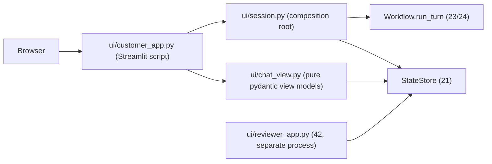

# Phase 4.1: Customer Support Chat View — Design Specification

**Issue**: `#11` ([Phase 4] 4.1: Customer Support Chat View)
**Date**: 2026-10-02
**Status**: Draft for Review
**Target Files**: `ui/__init__.py`, `ui/customer_app.py`, `ui/chat_view.py`, `ui/trace_panel.py` (shared with 42), `ui/session.py`, `orchestration/runtime.py`, `ui/scenarios.py`, `guardrails/citations.py` (+ export), `orchestration/recorder.py`, `orchestration/workflow.py`, `storage/state_store.py` (one read), `pyproject.toml`, `Dockerfile`, `docker-compose.yml`, `tests/ui/*`, `tests/orchestration/*`
**Depends on**: 21 (`StateStore`, `replay_trace`), 23/24 (`Workflow.run_turn`, `TurnLockTimeout`), 31 (issue #9: ticket `pending_approval`), 32 (issue #10: `ApprovalService.settle`, AGENT notice, `settled_at`, `customer_reason`). 31 and 32 read in final form. **Sibling**: 42 (reviewer board, issue #12) imports the shared trace component.

---

## 1. Objective & Scope

Deliverable B, customer half: a chat page where a customer talks to the agent, sees where each claim comes from, sees the telemetry the agent actually used, and sees whether anything is waiting on a human. The page is a thin view over what 21/23 already persist; it holds no business logic and no source of truth (state lives in Postgres, rehydrated by `conversation_id`).

Ticket features and how each is met:
1. Multi-turn live chat: `Workflow.run_turn(conversation_id, message, message_id)` per submit; history rendered from `StateStore.rehydrate(...).messages`.
2. Citation badges to public KB / policy docs: persisted citations on the reply message (section 4.2).
3. Telemetry evidence chips: `StoredMessage.telemetry_evidence` (already persisted by `complete_turn`).
4. Pending escalation/approval banners: `StateStore.list_approvals(conversation_id)` plus the latest reply's stored `TurnResult` envelope (`messages.result`, section 4.4).
5. Account / scenario switcher: sidebar over `data/eval/scenarios.jsonl` plus free-form email (section 4.5).

6. Trace panel for the current conversation (brief section 4: UI must surface the trace): shared component `ui/trace_panel.py` (4.6).

Out of scope: reviewer UI (42), executing/settling approvals (31/32), auth beyond email (identity is server-side `authenticate_caller`, chat claims never trusted), token-level streaming, live stage label, multi-user session hardening, i18n.

## 2. Ticket vs Code (reconciliation)

| Ticket / architecture doc says | Code reality | Decision |
|---|---|---|
| Deliverable `ui/customer_app.py` | No `ui/` package, no API layer, no entrypoint that builds `Workflow`; no UI dependency in `pyproject.toml`; Dockerfile pip-lists deps by hand | Add `ui/` package, `streamlit` dep (pyproject + Dockerfile), composition root `ui/session.py` |
| "Live responses" | `run_turn` is sync and returns the finished reply once; no token stream, no progress hook | Spinner only (3.2); no streaming, no stage label |
| "Citation badges linking to KB / policy docs" | `TurnRecorder.complete_turn(result, evidence, sender, state)` passes `()` as the citations argument of `StateStore.complete_turn`; `messages.citations` exists but is always empty. Reply text carries inline markers `[kb:slug#anchor]`, `[policy:ID]`, `[telemetry:tool]` (validated by `guardrails.check_citations`, also run at the workflow boundary by `Workflow._require_clean_message`). `RetrievedPassage` has `public_url`, `title`, `heading` | Citations become a field of `TurnResult` (the persisted envelope, `messages.result`); the recorder maps `result.citations` to the existing column argument (4.2). Small change to 23 files |
| Policy docs "linking" | Policies have no public URL | Policy badge opens an in-app dialog; body via `RetrievalService.get_policy` (4.2) |
| "Pending escalation status banners" | After the CR-fix, `messages.result` persists the full `TurnResult` (incl. `escalation_offered`, `pending_actions`, `degradations`) on each reply, and `_replay` returns it | `escalation_offered` is readable on reload from the latest reply's envelope: banner shown (4.4). Supersedes the earlier "not persisted" decision |
| Telemetry chips | `StoredMessage.telemetry_evidence` persisted. Architecture doc quotes `[telemetry]`, code uses `[telemetry:<tool>]` | Chips from stored evidence; inline `[telemetry:tool]` markers stripped from display text; architecture doc section 3 point 5 corrected to `[telemetry:<tool>]` in the cleanup step |
| Scenario switcher | `scenarios.jsonl` has 12 scenarios with `customer_id`, `requester_email`, `opening_message`, followups | Switcher reads that file; no new data |
| Approval resolution reaches the customer | 32 (final): `ApprovalService.settle` writes a deterministic `AGENT` message in its own turn (no customer row), sets `approvals.settled_at`; rejection notice may carry guard-checked `approvals.customer_reason`. 31: ticket gets `pending_approval` on approval creation, 32 clears it. Statuses unchanged: `PENDING/APPROVED/EDITED/REJECTED` | No `REVIEWER` sender (decided). The notice is an ordinary AGENT message in the transcript; banners show state only (4.4); UI never shows ticket status |
| Enums via `AtiIntEnum` (user rule) | Repo uses `StrEnum`; `novia_shared` is not a dependency | `StrEnum`, same as 21-24 (decided) |

## 3. Structural Decisions

### 3.1 Framework: Streamlit (chosen)
| Option | For | Against |
|---|---|---|
| A. Streamlit | Matches `ui/customer_app.py` as one Python file; `st.chat_message`, `st.chat_input`, sidebar, `st.dialog`, `st.fragment(run_every=)`; `streamlit.testing.v1.AppTest` gives functional tests with no browser; reviewer app (42) can be a second script | Script rerun model; no real streaming of the sync pipeline |
| B. Chainlit | Chat-native, steps UI | Own session/auth model, awkward to share one script shape with the reviewer dashboard, harder to test without browser |
| C. FastAPI + JS front end | Full control, true streaming | Two languages, an API layer nobody asked for, 80% of the effort for zero ticket value (YAGNI) |

Chosen A (confirmed: the brief allows any stack, no FastAPI requirement, Streamlit shared with 42). Streamlit is the only new dependency.

### 3.2 "Live" responses
`run_turn` blocks for seconds in the script thread. The page shows `st.spinner` only; no live stage label (decided). Approval banners refresh via a fragment polled every 5 s while the script is idle.

### 3.3 Where logic lives (SRP)
- `ui/customer_app.py`: rendering and event wiring only (chat input, sidebar, dialogs). No SQL, no parsing.
- `ui/chat_view.py`: pure, frozen pydantic view models plus `@classmethod` converters (per user rule, no `format_x` functions): `ChatView.from_snapshot(snapshot, approvals)` builds the ordered list of `MessageView` (sender role, display text, `CitationBadge` tuple, `EvidenceChip` tuple) and `ApprovalBanner` tuple. Zero Streamlit imports, so it is unit-testable and reused unchanged by 42 if wanted.
- `orchestration/runtime.py` (new, shared; NOT under `ui/`): `build_services(connection, clock) -> Services` (frozen dataclass: `store`, `customers`, `tickets`, `telemetry`; no retrieval, no embedder, no LLM; used directly by 42's reviewer app) and `build_workflow(connection, clock) -> Workflow`, which composes `build_services` and adds `RetrievalService`, `SupportDeps` (neutral identity) and `AgentPorts` with the PydanticAI model from `settings.llm_model` bound to each `run_<role>` (the `run_*` functions take `model: Model | None`), plus `warm_models() -> None` calling `encoders.embed.load_embedder()` and `encoders.rerank.load_reranker()` (project memory: preload at app boot). Reason: today only `tests/orchestration/conftest.py` builds a `Workflow`; the eval harness (answers.md, "same code path the chat uses"), 42 and 32's sweep need the same assembly, so it must not live in the UI. Interface to 31/32: when 31 adds `dispatcher` to `Workflow` and 32 changes `approved_actions` to grants, this one function is the only place to adapt.
- `ui/session.py`: Streamlit glue only. `@st.cache_resource` calls `warm_models()` once. Per submit and per render it opens a fresh autocommit `psycopg` connection (settings.database_url), builds `StateStore` and `build_workflow(...)` on it, and closes it. Nothing holding a connection is cached or shared across sessions/threads (`RetrievalService`, `CustomerService`, `StateStore` all bind one connection; 24 forbids sharing).
- `ui/scenarios.py`: `Scenario` frozen model plus `load_scenarios(path) -> tuple[Scenario, ...]` from `data/eval/scenarios.jsonl` (only `scenario_id`, `customer_id`, `requester_email`, `persona`, `opening_message`).

### 3.4 Identity and conversation lifecycle
- Sidebar: scenario selectbox (12 + "Custom") and an email text field (prefilled from the scenario's `requester_email`). Selecting a scenario starts a new conversation: `StateStore.create_conversation(account_id, email, tier, at)` with identity from `CustomerService.authenticate_caller(email)`; the new `conversation_id` goes in `st.session_state`. No claimed account/tier input in the UI: the orchestrator already re-derives identity per turn from account data, and the UI never offers a field that could be trusted by mistake.
- "Load opening message" button puts the scenario's `opening_message` in the input (not auto-sent; customer clicks send). Followups are not driven by the UI (the eval harness owns the simulated customer).
- Reload/restart continuity: `conversation_id` is mirrored into `st.query_params`; on load, `rehydrate` restores the full transcript. Unknown/garbage id -> start fresh.
- Message id: client generates `uuid4` per submit and keeps it in `st.session_state` until the turn returns, so a Streamlit rerun mid-turn or a retry after `TurnLockTimeout` reuses the same id (24 idempotency makes this safe).

### 3.5 Error surface
- `TurnLockTimeout`: inline notice "Still working on your previous message, retry" with a retry button reusing the same `message_id`.
- `StateVersionError` (24): generic "service updating, retry" notice (retry lands on a new worker).
- Any other exception from `run_turn`: caught by 23's boundary already (pause message stored); UI shows whatever reply came back. The UI adds no broad `except`.
- Injection refusal, outage notices, clarifying questions arrive as ordinary reply text; no special UI.

## 4. Contracts

### 4.1 View models (`ui/chat_view.py`, all `BaseModel(frozen=True)`)
- `BadgeKind(StrEnum)`: `KB`, `POLICY`.
- `CitationBadge`: `kind`, `label`, `url: str | None` (KB only), `ref: str` (slug#anchor or policy id).
- `EvidenceChip`: `tool_name`, `text` (`metric_key raw_value`), `timestamp`, `is_anomaly`.
- `MessageView`: `role` (customer / support), `text` (inline markers stripped), `citations`, `evidence`, `created_at`.
- `ApprovalBannerState(StrEnum)`: `PENDING`, `FINALIZING` (APPROVED/EDITED, `settled_at` null), `APPROVED` (settled), `REJECTED`.
- `ApprovalBanner`: `state`, `title` (action title from `ActionType` via exhaustive `match` with `assert_never`; no payload field is ever read).
- `ChatView`: `messages`, `banners`; `from_snapshot(snapshot: ConversationSnapshot, approvals: Sequence[Approval]) -> ChatView`.

### 4.2 Citation persistence (touches 23 files; the main cross-cutting change)
- New `guardrails/citations.py`: `extract_markers(message: str) -> tuple[CitationMarker, ...]` reusing the regexes already in `guardrails/validator.py` (move/share, no duplicate patterns; `check_citations` calls it). Exported via `guardrails/__init__.py`. `strip_markers(message) -> str` for display text.
- `orchestration/models.py`: `TurnResult` gains `citations: tuple[Citation, ...] = ()` (frozen `Citation`: kind, ref, title, url), the single source of truth; it is persisted inside the envelope with no extra work and returned unchanged by `_replay`. Pure classmethod `Citation.for_reply(reply: str, bundle: KnowledgeBundle | None) -> tuple[Citation, ...]` maps KB markers to `{kind KB, slug#anchor, heading, public_url}` and policy markers to `{kind POLICY, policy_id, title}` from `retrieved_passages` / `referenced_policies`; markers not in the bundle are dropped, never guessed; duplicate `(slug, anchor)` keeps best `rerank_score`.
- `orchestration/workflow.py` `_finish` receives the `KnowledgeBundle | None`, computes `citations` and builds the one `TurnResult` it already builds, then calls the one `recorder.complete_turn`. `TurnRecorder.complete_turn(result, evidence, sender, state)` keeps its signature and passes `tuple(c.to_row() for c in result.citations)` (dict[str, str] rows) to `StateStore.complete_turn`'s existing citations argument instead of `()`. The `messages.citations` column is the typed read path for the UI, the envelope is the replay path; both derive from the same `TurnResult.citations` at one call site.
- Marker parsing: `guardrails/citations.py` hosts the regexes now private to `validator.py`; `check_citations` (and thereby `Workflow._require_clean_message`) keeps working unchanged; `Citation.for_reply` reuses `extract_markers`. No second regex set.
- Telemetry markers need no citation rows: chips come from `telemetry_evidence`.
- Policy dialog body: `RetrievalService(connection).get_policy(policy_id)` (decided) on the per-render connection from `ui/session.py` (policies are loaded in its constructor; no embedder needed). No new store read or SQL.

### 4.3 Telemetry chips
One chip per `StoredMessage.telemetry_evidence` item, deduped by `(tool_name, metric_key, raw_value)`; text is the verbatim `metric_key raw_value`, `is_anomaly` styles it as warning, tooltip shows tool name and simulation timestamp. Chip click does nothing (no deep link target exists).

### 4.4 Banners
Derived each render from `StateStore.list_approvals(conversation_id)` (not `pending_only`, so resolution flips the banner instead of making it vanish). Mapping per status and `settled_at`:
- `PENDING` -> "Awaiting review by our support team" + action title only (from `ActionType`: CREDIT, MFA_RESET, CLOSE_TICKET, PAGE_ON_CALL). Never the amount or any payload field (decided; matches 32 `PendingApprovalView`, which also omits payload).
- `APPROVED`/`EDITED`, `settled_at` null -> "Approved, being finalized" (32 executes then notifies; execution may fail and be swept, so no "done" claim).
- `APPROVED`/`EDITED`, `settled_at` set -> compact "Approved" chip; the details are the AGENT notice already in the transcript.
- `REJECTED` -> "Not approved" chip; the reason, if any, is the `customer_reason` inside the AGENT notice (32 guard-checked it). The UI never reads `reviewer_notes`, `edited_payload` or `customer_reason` itself.
The post-approval message needs no UI special case: it is an `AGENT` message in a later turn, rendered like any reply (no citations, no chips). No ticket status or `pending_approval` shown (31/32 own it). Escalation banner: if the latest non-customer message's envelope (`TurnResult.model_validate(message.result)`; null on pre-envelope rows means no banner) has `escalation_offered`, show "A support engineer will follow up" (fixed copy); it disappears when a later reply does not carry the flag. Non-blocking: input stays enabled while banners are pending (architecture doc, non-blocking HITL).

### 4.5 Fragment refresh
Banner block is a `st.fragment(run_every=5)`; when an approval leaves `PENDING` or gains `settled_at`, it triggers a full rerun so the AGENT notice appears in the transcript.

### 4.6 Trace panel (shared with 42)
New module `ui/trace_panel.py`, the single trace component for both apps (explicit: 42 imports it, does not build its own). Contains the frozen view models `TracePanel`, `TraceTurn`, `TraceStep` (shapes as defined in 42 section on `TracePanel`: per turn customer text, reply, steps with agent role, status, latency, tokens, cost, tool calls, redacted input/output, open-turn flag, totals) with `TracePanel.from_replay(replay: TraceReplay) -> TracePanel`, and `render_trace_panel(panel: TracePanel) -> None` (Streamlit; `st.expander` per turn, `st.code`/`st.text` only, never `unsafe_allow_html`). Data: `StateStore.replay_trace(conversation_id)` (21), values shown as stored (already redacted at write). Customer page places it in a sidebar/bottom expander "Trace" refreshed after each turn; `ui/chat_view.py` has no trace logic. Dependency: 42 must drop its own `TracePanel` definition and import this module (flagged to 42).

## 5. Dependency / Coupling Notes
- 31 (#9): sets ticket `pending_approval` after `create_approval`; UI ignores tickets. Fixed `customer_line`s (ticket created, failure) arrive inside reply text. 32 (#10): UI reads `approvals` (incl. `settled_at`) and messages only. Needs: statuses stay `PENDING/APPROVED/EDITED/REJECTED`; notice is an `AGENT` message. A new status makes the banner `match` fail type-check (`assert_never`) until extended.
- 42 (#12): separate Streamlit script and process, shared Postgres; imports `ui/trace_panel.py` (owned here), may reuse `ui/session.py`; never imports `customer_app.py`.

## 6. Testing & Verification

Functional, `streamlit.testing.v1.AppTest`, real Postgres via existing `tests/conftest.py`, scripted stub agents from `tests/orchestration/conftest.py`, zero LLM, no browser.
1. `tests/ui/test_customer_chat_flow.py`: pick a scenario, send message, reply appears; second turn sees history; reload with `conversation_id` query param restores transcript.
2. Citations: stub resolution plan with `[kb:slug#anchor]` and `[policy:POL-SLA]` -> reply message shows a link badge to `public_url` and a policy badge; stored message row has the citations (`tests/orchestration/test_citation_persistence.py`, covers the 23 change and the replay path returning the same citations).
3. Evidence chips: stub diagnostics evidence -> chip text equals verbatim metric and anomaly styling flag set.
4. Banners: stub plan with a `CREDIT` action -> PENDING banner with title only (amount string absent from page) and input still enabled; `ApprovalService.resolve` -> FINALIZING; `settle` -> AGENT notice in transcript plus APPROVED chip; REJECTED with `customer_reason` -> notice shows it, page never contains `reviewer_notes`.
4b. Trace panel: after a turn the panel lists that turn's agent steps with latency/tokens; same `render_trace_panel` imported by a minimal 42 AppTest stub renders identically.
5. Switcher: changing scenario creates a new conversation with that account's tier; no tier/account claim fields exist.
6. Errors: simulated `TurnLockTimeout` shows retry notice and the retry reuses the same `message_id` (one customer row).
7. `tests/ui/test_chat_view.py`: single pure parametrized check of `ChatView.from_snapshot` (marker stripping, dedupe, state mapping); the only unit test, justified by the customer-facing redaction rule.

## 7. Cleanup (final step)
1. Read every new/modified file end to end; no unused imports, constants, view fields (e.g. `ApprovalBanner.detail` branches nothing renders), or helpers.
2. Grep: no `datetime.now` (use `SimulationClock`), no inline imports, no `Literal` for enum-like fields, no duplicated marker regexes (only `guardrails/citations.py`), no `format_*` standalone functions.
3. Pyright `standard` and ruff clean; all functions typed incl. `-> None`; f-strings only.
4. Confirm Dockerfile/compose/README run instruction (`streamlit run ui/customer_app.py`) and `streamlit` appear exactly once per file; architecture doc UI section updated; ADR (next free number) in `docs/overview/decisions.md`: Streamlit, citations persisted at write time, banners derived from approvals.

## 8. Design review fixes (found while planning)
1. Composition root moved from `ui/` to `orchestration/runtime.py` (shared by eval, 42, 32 sweep); `ui/session.py` shrinks to connection-per-call glue.
2. Previous draft cached `RetrievalService` via `st.cache_resource`; it binds one connection, so sharing it across Streamlit sessions breaks 24's one-connection-per-turn rule. Only model warm-up is cached.
3. Customer-visible leak paths in `TraceReplay`: `approvals` (`reviewer_notes`, `edited_payload`) and each step's `trace.model_messages` (full redacted pydantic-ai messages with prompts and tool data, added by the CR-fix). `TracePanel.from_replay` uses turns and steps (role, status, latency, tokens, cost, tool name/status/latency) only, never `approvals`, `model_messages`, or raw tool-call `arguments`/`result`; tests assert a seeded reviewer note and a seeded `model_messages` sentinel are absent from the page. Step `input`/`output` JSON is not shown to the customer (Q1).
4. `conversation_id` in the query string lets anyone who has an id open that conversation (and its trace). Demo scope (no auth, matches Out of scope); recorded in the ADR, not fixed.
5. Citation mapping edge: same `(slug, anchor)` can appear on several passages; first by `rerank_score` wins. Early-return paths (injection refusal, pause, canned text) carry no citations by construction.
6. LLM credentials are env-only (`settings.llm_model`); UI shows a fixed error if a turn fails at the provider (23's pause message); no key ever read or displayed.

7. Service assembly split out as `build_services` (found via 42: the reviewer needs services without embedder/reranker/LLM); `build_workflow` composes it, so assembly lives in one place.

## 9. Decisions (final)
1. Streamlit (shared with 42; brief: any stack).
2. (Revised after CR-fix) `escalation_offered` is persisted in `messages.result`; banner reads it from the latest reply.
3. Spinner only, no live stage label.
4. Post-approval sender is `AGENT` (32); no `REVIEWER`; statuses per 32.
5. Policy dialog body via `RetrievalService.get_policy`.
6. Trace panel on the customer page; shared `ui/trace_panel.py` used by 42.
7. `StrEnum`, not `AtiIntEnum`.
8. Citations ride on `TurnResult.citations` (single source), built in `_finish` and forwarded by the recorder (needed for answers.md and recorded conversations).
9. Doc fixed to `[telemetry:<tool>]`.
10. Pending banner shows action title only, never amount.

## 10. Open Questions
1. Trace panel: expose step `input`/`output` JSON to the customer? Plan default: no (metrics and tool names only).

