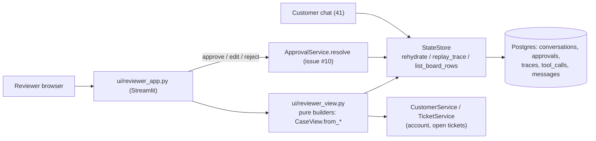

# Phase 4.2: Support Reviewer & Escalation Board View — Design Specification

**Issue**: `#12` ([Phase 4] 4.2: Support Reviewer & Escalation Board View)
**Date**: 2026-10-02
**Status**: Draft for Review
**Depends on**: 21 (`StateStore`, `replay_trace`, approvals), 22 (`TriageResult`, `DiagnosticEvidence`, `KnowledgeBundle` in trace `output`), 23/24 (turn path, locking), 31 (action dispatcher, issue #9), 32 (approval lifecycle + resume, issue #10), 41 (customer chat, issue #11). 31/32/41 are designed in parallel; interfaces below are the ticket-described ones, see §9 and Open questions.
**Target Files**: `ui/reviewer_app.py`, `ui/reviewer_view.py`, `ui/deps.py` (shared with 41), `storage/board_queries.py`, `storage/state_store.py` (one new read method), `storage/models.py` (one new row model), `pyproject.toml`, `docker-compose.yml`, `Dockerfile`, `tests/ui/*`, `tests/storage/test_board_summaries.py`

---

## 1. Objective & Scope

Deliverable B, reviewer half: one page where a support reviewer sees every conversation waiting on a human, inspects why the agent proposed an action, and approves / edits / rejects it with a logged note. Four panels from the ticket:

1. **Customer Context**: account id, tier, SLA countdowns, repeat-contact alert, open tickets.
2. **Telemetry & Evidence Inspector**: quoted tool outputs, raw metric values, link-quality charts.
3. **Pending Approvals Queue**: approve / edit / reject with `reviewer_notes`.
4. **Live Trace Viewer**: per-agent-step breakdown with latency, tokens, cost, retrieval scores, tool calls.

The view is a **pure read-model over Postgres plus one write path** (resolve approval). It holds no state of its own: closing the tab loses nothing (task: "approval lives in storage, not in memory").

**Out of scope**: customer chat (41); approval policy, resume of the paused conversation, customer notification, action execution (32 / 31); auth / reviewer identity; async API or websockets; editing traces; new tables or migrations; eval harness.

---

## 2. Divergences: Ticket vs Code

| Ticket says | Code / sibling designs say | Decision |
|---|---|---|
| `ui/reviewer_app.py` only | Arch §10 layout also lists `ui/customer_app.py`; no `ui/` exists, no UI dependency in `pyproject.toml` | Add Streamlit; split render (`reviewer_app.py`) from pure builders (`reviewer_view.py`) so logic is testable without a browser |
| SLA countdowns, repeat-contact alerts | Not persisted as columns. `TriageResult.sla: SLADeadlines` and `.repeat_contact: RepeatContactResult` live in the triage trace `output` (22) | Read from latest `TRIAGE` trace of the conversation; countdown computed in view against `SimulationClock.now()` (ADR-001), never wall clock |
| "Open tickets" | `TicketService.get_ticket_history(account_id)` returns all; `include_open=False` filters `status != 'open'` (no open-only mode) | Fetch history, filter `TicketStatus` open in the builder; no service change |
| "Retrieval scores" | 21 design had `traces.retrieval_scores`; shipped schema dropped it. Scores (`rrf_score`, `rerank_score`, ranks) sit inside KB-search `tool_calls.result` (`KBSearchResult.passages/candidates`) and in `KnowledgeBundle` in the `KNOWLEDGE` trace output | Read from tool calls; no schema change |
| "Link quality graphs" | `get_link_quality` returns `LinkMetricsSummary` aggregates per link (avg/max/latest loss, latency, jitter, throughput, `down_intervals`), not a time series | Chart = per-link bar charts of these aggregates over the returned window. True time-series needs a telemetry API change: open question |
| "Quoted tool outputs, raw metric values" | `TelemetryEvidence(tool_name, metric_key, raw_value, timestamp, is_anomaly)` on `StoredMessage.telemetry_evidence` and in `DiagnosticEvidence.evidence_items`; raw envelope in `tool_calls.result` | Evidence table from `evidence_items` (open turn included, before any reply exists); raw JSON expander from `tool_calls.result` |
| "Token consumption" | `traces.prompt_tokens/completion_tokens/cost_usd` | Direct |
| "Note logging" | `approvals.reviewer_notes`, `edited_payload` exist; `MessageSender` has no `REVIEWER` (21 design had one; shipped enum dropped it) | Notes live only on the approval row; no reviewer message rows |
| Escalation Board across conversations | `StateStore.list_pending_approvals(None)` exists; `list_conversations` was dropped in 21 plan-01 delta 4 | Add one summary read (§4) instead of N+1 `get_conversation` calls |
| Resolve via `StateStore.resolve_approval` | Raw store call only flips the row (compare-and-set, `ApprovalStateError` on race). Resume, dispatch, customer notice belong to #10 | UI calls the #10 lifecycle entry point; until it lands, falls back to the store call with a visible "resume not wired" banner (§9) |
| Enums via `AtiIntEnum` | Repo uses `StrEnum` everywhere (ADR-005); `novia_shared` not a dependency | Follow repo `StrEnum`; flagged |

---

## 3. Approaches Considered

**A. Streamlit multi-panel app, direct in-process `StateStore` (chosen).** One Python file tree, same sync psycopg stack as every other layer, `st.fragment(run_every=...)` for live trace polling, `st.dataframe` / `st.bar_chart` cover tables and charts, `streamlit.testing.v1.AppTest` gives functional tests with no browser. Fits "any stack" in the task and the compose-up-in-10-minutes goal.
**B. FastAPI + JS SPA.** Best UX control, but needs an API layer (async wrapper around sync store, serializers, auth), a JS toolchain in Docker, and a second test stack. Most of the effort (80%) would go to plumbing the task does not grade. Rejected (YAGNI).
**C. Gradio.** Strong for chat (41 may use it) but weak for master-detail layouts and per-row action buttons. Rejected for this view; stack choice is shared with 41, see Open questions.

Decision: A. Panels render from one frozen `CaseView` so swapping the front end later touches only `reviewer_app.py`.

---

## 4. Data Access (no migration)

All reads reuse existing store methods; one new read.

- **Board list (new)**: `StateStore.list_board_rows(limit: int) -> list[BoardRow]`, SQL in new `storage/board_queries.py` (same split as `approval_queries.py`). One query over `conversations` left-joined to a count of `approvals` with `status = 'PENDING'` and the oldest pending `requested_at`. Ordered pending-first, oldest pending first, then `updated_at desc`. Uses the existing partial index on pending approvals; no new index.
- **`BoardRow`** (frozen, in `storage/models.py`): `conversation_id`, `account_id`, `customer_tier`, `stage`, `pending_count`, `oldest_pending_at`, `updated_at`.
- **Case detail**: `rehydrate(conversation_id)` for identity/messages/pending approvals, `replay_trace(conversation_id)` for turns/steps/tool calls/all approvals (single consistent-read snapshot each). Resolved approvals are included in replay, so the queue can show history.
- **Account + tickets**: `CustomerService.lookup_account(account_id)` (company), `TicketService.get_ticket_history(account_id)`.
- No writes besides the approval resolution.

---

## 5. Contracts (`ui/reviewer_view.py`)

Pure functions/classmethods, all frozen Pydantic, no Streamlit import, no I/O. Conversion lives on the target class (user rule).

- **`CaseView`**: `conversation_id`, `context: ContextPanel`, `evidence: EvidencePanel`, `approvals: tuple[ApprovalCard, ...]`, `trace: TracePanel`. Classmethod `from_rows(snapshot: ConversationSnapshot, replay: TraceReplay, account: CustomerAccount | None, tickets: Sequence[Ticket], now: AwareDatetime) -> CaseView`. `now` is passed in (from `SimulationClock`), keeping it deterministic.
- **`ContextPanel`**: `account_id`, `company`, `tier`, `contact_email`, `sla: tuple[SlaCountdown, ...]`, `repeat_contact: RepeatAlert | None`, `open_tickets: tuple[TicketRow, ...]`. `SlaCountdown`: `label` (first response / resolution), `due_at`, `remaining: timedelta`, `state: SlaState` (`OK`, `AT_RISK` under 25% of window left, `BREACHED`); `resolution_paused` shown as such. `RepeatAlert`: `reason`, matching ticket ids, prior closed ids. Both come from the latest `TRIAGE` trace's `TriageResult`; absent triage -> `None` (shown as "not triaged yet", never an empty-looking OK).
- **`EvidencePanel`**: `evidence: tuple[TelemetryEvidence, ...]` (from `DiagnosticEvidence.evidence_items` of the newest `DIAGNOSTICS` trace, falling back to reply messages), `unavailable_tools` (so an outage is visible, not silent), `link_charts: tuple[LinkChart, ...]` (per-link metrics built from `get_link_quality` tool-call results via `LinkMetricsSummary.model_validate`), `raw_calls: tuple[ToolCallRecord, ...]`, `kb_passages: tuple[PassageScore, ...]` (`citation_tag`, `rrf_score`, `rerank_score`, `lex_rank`, `vec_rank`, and whether it was cited vs candidate-only), `kb_status: KBSearchStatus`.
- **`ApprovalCard`**: `approval: Approval`, `action_label`, `proposing_turn`, `evidence_refs` (the evidence items of the proposing turn), `can_resolve: bool` (status is `PENDING`).
- **`TracePanel`**: `turns: tuple[TraceTurn, ...]`; `TraceTurn`: `turn`, `customer_text`, `reply_text | None`, `steps: tuple[TraceStep, ...]`, `totals` (`latency_ms`, `prompt_tokens`, `completion_tokens`, `cost_usd`). `TraceStep`: `agent_role`, `status`, `error`, `latency_ms`, `prompt_tokens`, `completion_tokens`, `tool_calls` (name, status, latency), `input`, `output`, `is_open` (in-flight turn). All built from `ReplayStep`s (flat `seq` order, `parent_trace_id` already resolved by 21).
- **`ReviewerDecision`**: `approval_id`, `kind: DecisionKind` (`APPROVE`, `EDIT`, `REJECT`), `note: str | None`, `edited_payload: dict[str, str] | None`. Method `to_resolution() -> ApprovalResolution` maps to the existing `ApprovalStatus` and reuses its validator (edited payload iff `EDITED`).

Rendering rules: `trace.input`/`model_messages` are already redacted at store write (21 §2.6); the view displays them as stored and never re-reads customer raw text. Reply/evidence text is shown through `st.code`/`st.text` (no HTML injection from customer-influenced strings; `unsafe_allow_html` never enabled).

---

## 6. App Layout (`ui/reviewer_app.py`)

Thin Streamlit script, no business logic beyond wiring.

- **Sidebar, Escalation Board**: list from `list_board_rows`, each row: account, tier, pending badge, oldest pending age. Selecting sets `conversation_id` in `st.query_params` (shareable link, survives refresh). Auto-refresh every 5 s via `st.fragment(run_every=5)`.
- **Main, tabs for the selected conversation**: `Context` (panel 1) above `Pending approvals` (panel 3); `Evidence` (panel 2); `Live trace` (panel 4). Context and approvals stay visible at the top because they drive the decision; evidence/trace are tabs.
- **Pending approvals card**: action type, payload table, proposing-turn evidence, note box. Buttons: Approve; Reject (note required, enforced in `ReviewerDecision` construction); Edit opens a form pre-filled with `payload` (same keys only, values editable), submit = `EDIT`. After click the card shows the resolved state from the DB, not optimistic UI.
- **Live trace**: fragment polling `replay_trace` every 2 s while the selected conversation's stage is not `IDLE` (a turn is in flight; recorder writes a trace per step so rows appear incrementally), else static. The open turn's steps carry `is_open` and show "running" when a role has no `OK` trace yet.
- **Errors surfaced, not swallowed**: `ApprovalStateError` (another reviewer won the race) -> inline "already resolved by someone else", card refreshes; DB unreachable -> board banner, panels keep last good render. Missing triage/diagnostics/knowledge traces render explicit "no data" states per panel (partial failure from 23 means any role may be absent).

`ui/deps.py` (shared with 41, whichever lands first creates it): `get_connection() -> psycopg.Connection[Any]` (autocommit, required by `StateStore`; one per Streamlit session via `st.cache_resource`), `get_clock() -> SimulationClock`. One connection per session; no pool (21 defers pooling).

---

## 7. Approval Resolution Flow

1. Reviewer clicks a button; the app builds a `ReviewerDecision`, validates (note required on reject; edited keys equal original keys), converts via `to_resolution()`.
2. App calls the #10 lifecycle entry point (ticket-described: resolve approval -> persist, resume conversation, trigger customer notice, dispatch via #9 on approve/edit). The reviewer UI neither executes actions nor writes customer messages.
3. Store compare-and-set guarantees one winner under concurrent reviewers; idempotency keys (21 §2.5) mean a double click cannot resolve twice.
4. UI re-reads the approval and re-renders.

Until #10 exists the app calls `StateStore.resolve_approval` directly and shows a banner "resolved in storage only; conversation resume pending issue #10". This fallback is deleted when #10 merges (cleanup, §10).

---

## 8. Testing (functional first)

Real Postgres via existing `tests/storage/conftest.py` fixtures; no mocks of the store. LLM never called: conversations are seeded by driving `Workflow.run_turn` with the existing fake `AgentPorts` from `tests/orchestration/conftest.py`.

- `tests/ui/test_reviewer_board.py` (`AppTest`): seed an SC-03-style credit proposal -> board lists it pending-first; open it -> context shows tier, SLA countdown from the frozen clock, repeat-contact alert; evidence tab shows quoted raw value and `is_anomaly`; unavailable telemetry tool shows as unavailable.
- Approve / edit / reject paths: row status, `reviewer_notes`, `edited_payload` persisted; reject without note refused; edit with an added key refused; second resolve shows "already resolved" and leaves the first resolution intact.
- Live trace: a conversation interrupted mid-turn (traces without reply) renders steps with `is_open`; completed turn shows totals equal to summed trace rows.
- Partial failure: conversation with no triage trace and a telemetry `UNAVAILABLE` still renders all panels with explicit no-data states.
- Secret safety: SC-08 PSK conversation: rendered page text never contains the PSK.
- `tests/storage/test_board_summaries.py`: `list_board_rows` ordering and counts across conversations with mixed approval states.
- Unit tests only for `SlaCountdown` state thresholds (isolated, date math).

---

## 9. Coupling to Parallel Designs

- **#10 (32)**: needs one callable accepting `(approval_id, ApprovalResolution, at)` returning the resolved `Approval`. If its signature differs, only §7 step 2 changes. Whether #10 re-runs `guardrails.validator.check_action` on edited payloads is its decision; UI only enforces same-keys.
- **#9 (31)**: no direct dependency; reviewer sees dispatch outcome only if it is recorded on `simulated_actions` / a trace. Not shown in v1.
- **#11 (41)**: shares `ui/deps.py` and the Streamlit stack choice; both apps run as separate processes (separate compose services or `streamlit run` targets) against one DB.

---

## 10. Cleanup & Delivery

- `pyproject.toml`: add `streamlit`; `uv.lock` regenerated. `Dockerfile`/`docker-compose.yml`: service `reviewer` running `streamlit run ui/reviewer_app.py` on its own port, same env as `app`; README reviewer-quickstart gets one line.
- Add arch §10 note: `list_board_rows`, `ui/reviewer_view.py`.
- Remove the `resolve_approval` fallback and banner once #10 lands; remove any helper unused after that.
- Final step: lint/type pass on new code (every parameter/return typed, no unused imports/functions, imports at top, no `Literal` for enums).

---

## Open questions

1. Streamlit OK as shared stack with 41? (Gradio/FastAPI alt)
2. #10 resolve entry point name/signature? Does it resume + notify in one call?
3. #10 re-validate edited payload via `check_action`?
4. Reviewer identity? none now; add `resolved_by` column?
5. Link graphs: aggregates enough, or add time-series tool output?
6. `StrEnum` (repo) vs `AtiIntEnum` (rules): keep `StrEnum`?
7. Board scope: only pending approvals, or also `escalation_offered` / on-call pages?
8. SLA `AT_RISK` threshold 25% ok?
9. Show #9 dispatch result (needs record location)?
10. Polling intervals ok, or push needed?
