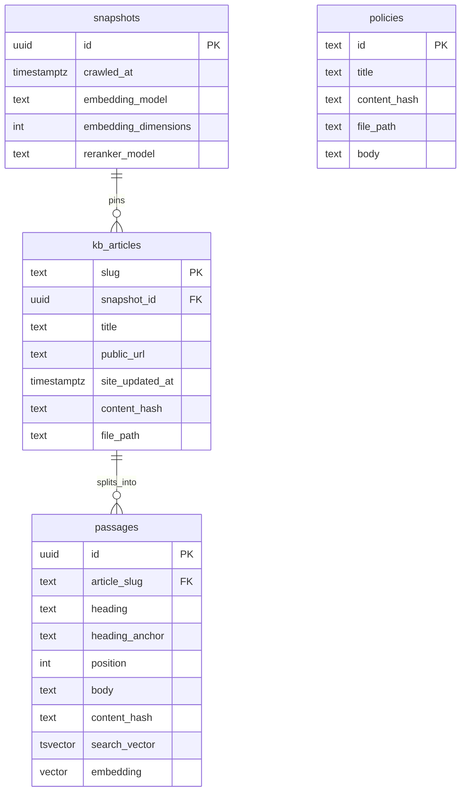

# Knowledge-base ingestion and retrieval index

Date: 2026-09-28

This design covers how the public Cato knowledge base is crawled, pinned, chunked, and indexed, and how the provided policy files are stored beside it. Agent roles, the chat UI, approvals, telemetry tools, and the eval harness are a later design. They consume the contracts below.

## Purpose

Technical answers cite a public article slug and, where possible, a section. Policy and SLA answers cite a policy id. The running system reads both from Postgres. The git repository also contains the raw article files and a database dump, so a reviewer starts the app without crawling and without re-embedding.

## Decisions

- The raw crawl is the source of truth. Postgres is built from it.
- Knowledge-base articles are searched. Policies are loaded whole by id. They live in different tables.
- Embeddings use `BAAI/bge-small-en-v1.5` (384 dimensions). Reranking uses `cross-encoder/ms-marco-MiniLM-L-12-v2`.
- Model weights are not committed. The Docker image build downloads pinned revisions and bakes them in.
- A committed Postgres dump holds articles, passages, keyword data, and vectors. Reviewer startup restores that dump.
- Change-detecting re-crawls are a bonus, not part of the required path.

## Crawl

The crawler identifies itself as `CatoHomeTaskBot/1.0 (educational assignment)`. It fetches `robots.txt` first and skips any path `robots.txt` disallows. It waits at least one second between requests.

Article URLs come from `https://knowledge.catonetworks.com/llms.txt`. Each linked English page is fetched as markdown at `https://knowledge.catonetworks.com/docs/<slug>.md`. The sitemap URL in `robots.txt` returned an error during design and is not the discovery source. Non-English pages are skipped. Image files are not downloaded. Pages outside `/docs/` are skipped.

Each saved file is the raw response body. Its content hash is SHA-256 of those bytes. Parsing does not rewrite the file. The repeated documentation-index banner is removed only when passage text is built.

The public citation URL stored for an article is `https://knowledge.catonetworks.com/docs/<slug>`, without `.md`. `site_updated_at` comes from the article's own updated field. When that field is missing, `site_updated_at` is null. The crawl date is never copied into it.

### Snapshot layout

Raw articles live in `kb/snapshot/articles/<slug>.md`. The manifest is `kb/snapshot/manifest.json`. Nothing else is written into `kb/snapshot/`.

The manifest records:

- the crawl date and time in UTC
- the user agent and the one-second rate limit
- the `robots.txt` decision
- the discovery source, `llms.txt`
- one entry per saved article: slug, file path, SHA-256, title, public URL, site updated time
- every skipped URL and the reason (language, robots, not an article)
- every failed URL, the HTTP status or error, and that the article is absent from the snapshot

The database dump is `kb/postgres/kb.dump`. It sits outside the snapshot directory and is listed as an added file in the repository README. The README also states that model weights are downloaded at image build and are not part of the snapshot.

### Policies on disk

These files are already in the repo. They are not crawled.

| Id | File |
|---|---|
| `POL-CREDIT` | `data/policies/POL-CREDIT.md` |
| `POL-SEV1` | `data/policies/POL-SEV1.md` |
| `POL-IDV` | `data/policies/POL-IDV.md` |
| `POL-SEC` | `data/policies/POL-SEC.md` |
| `POL-CRED` | `data/policies/POL-CRED.md` |
| `SLA` | `data/sla_policy.md` |

## Tables

`passages` has a unique key on `(article_slug, position)`. Keyword search uses a GIN index on `search_vector`, built with the Postgres `simple` text configuration so product tokens such as `IKEv2` and `DTLS` are kept intact. Nearest-neighbor search uses an HNSW index on `embedding` with cosine distance. The vector width is 384 and matches `snapshots.embedding_dimensions`.

`file_path` is the path of the committed file relative to the repository root. The agent does not open that file while answering. The loader uses it to check the hash and to rebuild the dump.

`policies` has no snapshot row and no embedding. `body` is the full file text. `title` is the first heading in the file.

A citation of a knowledge-base passage is `slug` plus `heading`. The public link is `public_url` plus `#` plus `heading_anchor`. A policy citation is the policy id.

## Chunking

Passages are built from the raw markdown after the documentation-index banner is stripped.

Every heading starts a new passage. Text before the first heading becomes a passage whose heading is the article title. A section that fits in the token budget is one passage, with no copied neighbor text.

`bge-small-en-v1.5` reads at most 512 tokens. The reranker has the same ceiling and spends it on the question and the passage together. A stored passage is capped at 400 tokens, counted by that embedding model's tokenizer. A long section is cut into slices of at most 350 new tokens, plus at most 50 tokens copied from the tail of the previous slice of the same section. The first slice of a section has no copied prefix and can use the full 400. Every slice keeps that section's heading and heading anchor. `position` is the order of the passage inside the article and distinguishes slices that share a heading.

`heading_anchor` is the heading in lowercase, with spaces turned into hyphens and punctuation removed. When two headings in one article produce the same anchor, later ones append `-` and their `position`.

Text is never copied across headings.

Passage `content_hash` is SHA-256 of `body`. Article `content_hash` is SHA-256 of the raw file. An unchanged article hash means that article's passages are left as they are during a rebuild.

## Embeddings and reranking

Passages are embedded as plain text. A question is embedded with the prefix the model card specifies: `Represent this sentence for searching relevant passages: `. The same prefix is used for every query, including eval runs.

Model files are downloaded in the image build at pinned Hugging Face revisions. The running container does not fetch them. On startup the process embeds the fixed probe string `width-check`, checks that the vector width is 384, and checks that this matches `snapshots.embedding_dimensions`. A mismatch stops startup. The probe's numeric values are not compared.

Query time, for one question:

1. Keyword search returns the top 20 passages.
2. Vector search returns the top 20 passages by cosine distance.
3. Reciprocal rank fusion merges the two lists. A passage's fusion score is the sum, over each list it appears in, of `1 / (60 + rank)`.
4. The unique candidates go to the local cross-encoder. The model returns a raw relevance score per passage.
5. The top 5 passages at or above `RERANK_MIN_SCORE` are returned, still carrying slug, heading, heading anchor, public URL, and the fusion score plus the rerank score.

`RERANK_MIN_SCORE` is configuration. The shipped value is the lowest score at which retrieval still returns no passages for the IPv6-only sites roadmap question in the ticket bundle, run against the pinned snapshot. The eval report records that value. Below the threshold, retrieval returns no passages and the caller refuses instead of guessing.

Scores are not stored on `passages`. The caller stores them on the conversation trace. `answers.md` prints the snapshot's `crawled_at`, the citations, and the top passages with both scores.

## How a row is kept in sync with a file

Reviewer startup restores `kb/postgres/kb.dump`, then reads the six policy files and upserts `policies`. It compares each `kb_articles.content_hash` and each `policies.content_hash` to a fresh SHA-256 of the file at `file_path`. A mismatch stops startup. The reviewer does not crawl and does not embed the corpus.

The dump is produced once, on the machine that crawled: crawl to `kb/snapshot/`, chunk, embed, load Postgres, write `kb/postgres/kb.dump`. Rebuilding from markdown is a maintenance command used after a new crawl. It is not part of reviewer setup.

## Failure behavior

- A failed article fetch is listed in the manifest and omitted from `kb_articles`. The crawl does not invent a body.
- A `robots.txt` disallow is a skip, recorded with its reason.
- A hash mismatch or an embedding-width mismatch stops the process before it answers.
- Facts that exist only inside images are absent. The snapshot is markdown text.
- Non-English articles are absent on purpose.
- When retrieval is down, the caller gets an error from the database or the model load. It does not answer a technical question from memory. The agent design decides what the customer is told. This component's job is to fail visibly.

## Tests

These run without a network and without the live site:

- SHA-256 of a fixture file matches `content_hash`, and a one-byte change does not.
- A fixture article splits on headings, names the preamble passage after the article title, and keeps one heading when a long section becomes several slices.
- Overlap text stays inside one section and does not include the next heading.
- No passage body is longer than 400 tokens under the same tokenizer the embedding model uses.
- Stored public URLs have no `.md` suffix.
- The six policy ids load from the known paths, including `SLA`.
- A non-English URL and a non-`/docs/` URL are rejected by the discovery filter.
- The startup check fails when the probe vector width differs from `snapshots.embedding_dimensions`.

A live crawl is not part of CI. The committed snapshot and dump are the inputs those tests do not need to recreate.

## Out of scope

Specialised agents, orchestration, the chat and reviewer UI, approval gates, telemetry tools, ticket storage, and the eval runner. The retrieval contract they need is already fixed: passage results carry slug, heading, URL, and scores, and policy reads are by id.
